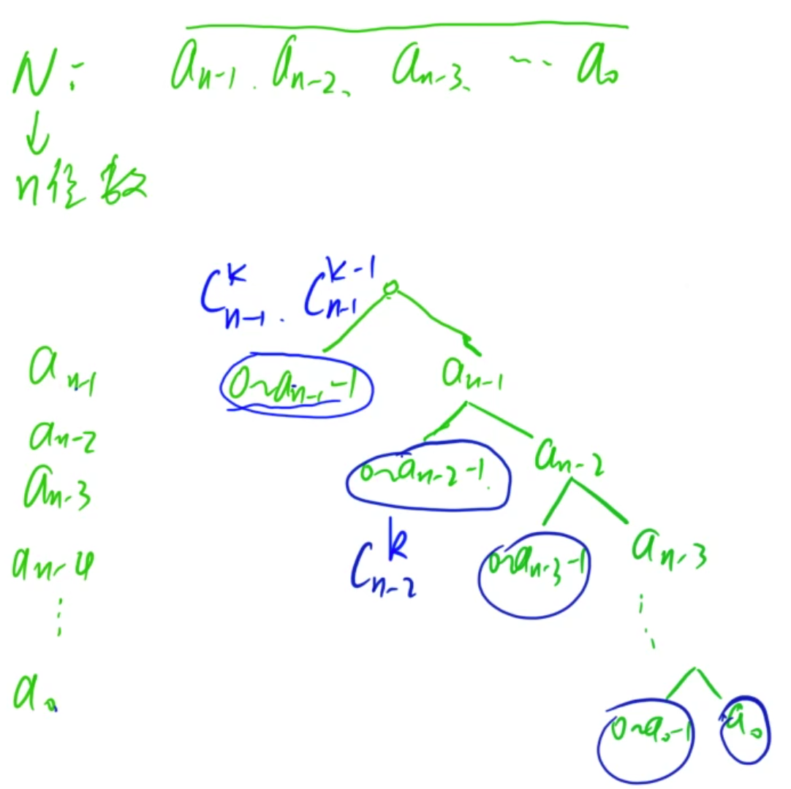

### 数位DP

技巧：

- 两个边界问题转为一个边界问题(求`[x, y]` 范围内的数，转化为求`[0, y]`和`[0, x]`范围的问题)
- 转为树的形式，从最高位开始分类。小于当前数字的可以直接算出来。等于的话沿着右侧分支向下走。

总结：

- 在预处理左侧分支的时候一般状态的定义第一维为数的个数，第二维为数，第三维按照具体问题来设。在状态转移的时候，是按照第二个数来进行分类，从而状态转移。(预处理阶段)
- 树上进行`dp`的时候一般需要维护一个`last`用来存储之前位置上的数对于当前的影响。存什么也是具体问题具体分析。
- 在预处理的时候，**一般都是预处理出来包含前导零的情况**。如果预处理的结果不能使的在树上dp的时候，第一位为零的情况，那么需要先求和所有位数比个的数小的解的个数。

### 度的数量

[原题链接](https://www.acwing.com/problem/content/1083/)

#### 解题思路



从最高位开始枚举每个位置上的数。然后分为两种情况：

- 这个位置上的数比当前数的小，左侧分支一般可以直接预处理出来直接得到答案。
- 这个位置上的数和当前数相等，那么就继续向下走。

对于这道题，last记录前面的1的个数。超过k则直接退出。

同时如果一个位置上大于1，则右侧分支直接break。

最后枚举最后一个位置，也就是`a0`，需要判断一下。

#### C++代码

```c++
#include<iostream>
#include<vector>
using namespace std;

const int N = 35;
int X, Y, K, B;
int f[N][N];

int dp(int a){
    
    if(!a) return 0;
    vector<int> nums;
    while(a){
        nums.push_back(a % B);  // 提取B进制每一位
        a /= B;
    }
    
    int ans = 0, last = 0;
    for(int i = nums.size() - 1; i >= 0; i --){  // 从高到低位枚举
        int x = nums[i];
        if (x){  // i为不为零时，才可以放零
            ans += f[i][K - last]; // 剩余位放1
            if(x > 1){  // i位大于1时，才可以放1
                if(K - last - 1 >= 0) ans += f[i][K - last - 1];  // 剩下还有1可以放
                break;  // 大于1，则右分支就不用考虑了
            }else{  
                last ++;  // 当前位等于1,则last自增
                if(last > K) break;  // 右分支1的位数超过了K，则直接break
            }
        }
        if(!i && last == K) ans ++;  // 最右的一个分支可以取的条件是，last 的个数为1
    }
    return ans;
    
}


int main(){

    for(int i = 0; i < N; i ++){  // 预处理好组合数
        for(int j = 0; j <= i; j ++){
            if(!j) f[i][j] = 1;
            else f[i][j] = f[i-1][j-1] + f[i-1][j];
        }
    }
    
    cin >> X >> Y >> K >> B;
    
    cout << dp(Y) - dp(X - 1);   // 转为单区间问题
    return 0;
    
}
```

### 数字游戏

[原题链接](https://www.acwing.com/problem/content/1084/)

#### 解题思路

数位DP。

首先预处理出左侧分支的情况。`dp[i][j]`表示`i`位数，且第一位为`j`的满足条件的所有数的个数。

那么可以先用`dp`的思想处理出来。求`dp[i][j]`的时候，枚举所有的`k >= j` 求和`dp[i-1][k]`即可。

然后进行数位DP。从树的角度来思考即可。

#### C++代码

```c++
#include<iostream>
#include<vector>
using namespace std;

const int N = 15;
int f[N][N];


int dp(int a){
    
    if(!a) return 1;
    vector<int> nums;
    
    while(a){
        nums.push_back(a % 10);
        a /= 10;
    }
    int ans = 0;
    int last = 0;
    for(int i = nums.size() - 1; i >= 0; i --){
        int x = nums[i];
        for(int j = last; j < x; j ++){  // 每一位，求出答案。
            ans += f[i + 1][j];
        }
        if( x < last) break;
        last = x;
        if(!i) ans ++;  // 最后一个右侧分支的情况。
    }
    return ans;
    
}

int main(){
    
    for(int i = 0; i < 10; i ++)f[1][i]  = 1;  // i位，最高位为j的个数
    for(int i = 2; i < N; i ++){  // 预处理左侧分支的情况
        for(int j = 0; j < 10; j ++){
            for(int k = j; k < 10; k ++){
                f[i][j] += f[i-1][k];
            }
        }
    }
    
    int x, y;
    
    while( cin >> x >> y) cout << dp(y) - dp(x - 1) << endl;
    return 0;
    
}
```

### Windy数

[原题链接](https://www.acwing.com/problem/content/1085/)

#### 解题思路

使用动态规划的方法预处理出来所有左侧分支的情况。定义`dp[i][j]`表示`i`位数，第一位是`j`的满足条件的数的个数。

注意这里的`dp`是包含前导零的情况的。因为在后面计算的时候，需要用到包含前导零的方案数。

然后在树上进行转移的时候，需要分类进行讨论：

- 在枚举第一位的时候，第一位不能从0开始枚举，需要从1开始枚举。那么第一位为零的所有数的个数需要单独统计。
- 在枚举后面的位的时候，由于前面已经有数了，所以从0开始枚举。然后按照条件将满足性质的数的个数相加即可。

#### C++代码

```c++
#include<iostream>
#include<vector>
using namespace std;

const int N  = 12;
int f[N][N];


int dp(int a){
    
    if(!a) return 0;
    vector<int> nums;
    while(a){
        nums.push_back(a % 10);
        a /= 10;
    }
    int ans = 0;
    int last = -2;
    for(int i = 1; i < nums.size(); i ++){  // 第一位为零的情况统一处理， 枚举位数和第一个数。
        for(int j = 1; j <= 9; j ++){
            ans += f[i][j];
        }
    }
    
    for(int i = nums.size() - 1; i >= 0; i --){
        int x = nums[i];
        int j = i == nums.size() - 1 ;  // 第一个数从1开始，后面从0开始
        for(; j < x; j ++){
            if(abs(j - last) >= 2) ans += f[i + 1][j];    // 
        }
        if(abs(last - x) < 2) break;  // 右侧分支不满足，提前break
        else last  = x;
        if(!i) ans ++;  // 最后一个右分支，也就是输入的数是否合法
    }
    return ans;
}

int main(){
    
    for(int i = 0; i < 10; i ++) f[1][i] = 1;  // 左侧分支预处理，包含前导零的方案数
    for(int i = 2; i < N; i ++){
        for(int j = 0; j < 10; j ++){
            for(int k = 0; k < 10; k ++){
                if(abs(j - k) >= 2) f[i][j] += f[i-1][k];
            }
        } 
    }
    
    int A, B;
    
    cin >> A >> B;
    cout << dp(B) - dp(A - 1);
    return 0;
    
    
}
```

### 数字游戏II

[原题链接](https://www.acwing.com/problem/content/1086/)

#### 解题思路

一样的思路。首先预处理出来左侧数值的情况，使用动态规划。

第一维是数的位数，第二维是数，第三维是模`n`的余数。

`dp[i][j][k]`表示`i`位数，第一位是`j`，且模`n`余`k`的数的个数。

在预处理的时候后，按照第二位来分类`dp[i][j][k] = sum(dp[i][l][(k - j ) % n])`

然后在树上进行DP，左侧分支枚举所有小于当前数的数，然后维护`last`为所有位置上的数的和。

#### C++代码

```c++
#include<iostream>
#include<vector>
#include<cstring>
using namespace std;

const int N = 12, M = 110;
int f[N][10][M];
int a, b, n;

int dp(int a){
    
    if(!a) return 1;
    vector<int> nums;
    while(a){
        nums.push_back(a % 10);
        a /= 10;
    }
    int ans = 0;
    int last = 0;
    for(int i = nums.size() - 1; i >= 0; i --){
        int x = nums[i];
        for(int j = 0;  j < x; j ++){
            ans += f[i+1][j][((-last) % n + n) % n];
        }
        last += x;
        if(!i && last % n == 0) ans ++; 
    }
    return ans;
    
}

int main(){
    
    while(cin >> a >> b >> n){
        memset(f, 0, sizeof f);
        for(int i = 0; i <= 9; i ++) f[1][i][i % n] ++;
        
        for(int i = 2; i < N; i ++){
            for(int j = 0; j <= 9; j ++){
                for(int k = 0; k < n; k ++){
                    for(int l = 0; l <= 9; l ++){
                        f[i][j][k] += f[i-1][l][((k - j) % n + n) % n];
                    }
                }
            }
        }
        
        cout << dp(b) - dp(a - 1) << endl;
    }
    
    return 0;
}
```

### 不要62

[原题链接](https://www.acwing.com/problem/content/1087/)

#### 解题思路

一样的思路。先使用动态规划预处理出来左侧满足的各种情况的个数。然后在树上进行DP。

`dp[i][j]`表示`i`位数，首位为`j`的满足条件的数的格式。(包含前导零)

#### C++代码

```c++
#include<iostream>
#include<vector>
using namespace std;

const int N = 12;
int f[N][10];

int dp(int a){
    
    if(!a) return 1;
    vector<int> nums;
    while(a){
        nums.push_back(a % 10);
        a /= 10;
    }
    int ans = 0;
    int last = 0;
    for(int i = nums.size() - 1;  i >= 0; i --){
        int x = nums[i];
        for(int j = 0;  j < x; j ++){
            if(last == 6 && j == 2) continue;
            else ans += f[i + 1][j];
        }
        if(x == 4 || x == 2 && last == 6) break;  // 右侧提前终止的情况
        last  = x;
        if(!i) ans ++;
    }
    return ans;
}

int main(){
    
    
    for(int i = 0; i <= 9; i ++){
        if(i == 4) f[1][i] = 0;
        else f[1][i] = 1;
    }
    for(int i = 2; i < N; i ++){   // 预处理
        for(int j = 0; j <= 9; j ++){
            if(j == 4) continue;
            for(int k = 0; k <= 9; k ++){
                if(j == 6 && k == 2) continue;
                else f[i][j] += f[i-1][k];
            }
        }
    }
    
    int n, m;
    while(cin >> n >> m){
        if(!n && !m) break;
        // cout << m << " " << n << endl;
        // cout <<  dp(m) << " " << dp(n -1) << endl;
        cout << dp(m) - dp(n - 1) << endl;
    }
    return 0;
}
```

### 恨7不成妻

TODO

