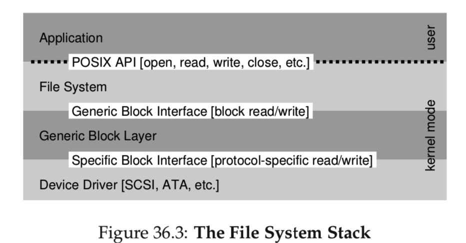

## 文件系统总结

### 1. IO设备

常见的IO设备可以抽象成如下的模型。设备对外暴露了一些接口，比如状态寄存器，指令寄存器和数据等。

外界通过对这些寄存器进行赋值，来向设备发送指令，读取写入数据，获取设备状态等。这是IO设备对外界的抽象。同时设备会有一些协议，说明各种操作需要将各个寄存器设定的状态，也可以看做是设备编程说明书。

比如以下四步：

1. 等待设备就绪
2. 将数据写到Data部分
3. 将合适的指令写到Command部分
4. 然后就等待设备完成任务(设备将数据写入到具体的设备的位置等)，向CPU发送一个中断

但是一般来说CPU是非常昂贵的，如果整个过程都让CPU参与的话，会消耗非常多的CPU时间。可以引入DMA(Direct Memory Access)引擎来帮助CPU完成数据搬移的部分。CPU只需要高速DMA数据在内存的位置，数据的量和要发送的设备，然后剩下的任务就交给DMA进行处理。完成之后DMA控制器产生一个中断，告诉操作系统任务完成。

操作系统访问设备有两种方式：

1. 特殊的IO指令，比如`x86`的`in/out`指令。通过一个特殊的port好来标识具体的设备，然后通过指令将数据发到特定的设备寄存器。
2. `Memory-mapped I/O`，硬件将设备的寄存器映射到一个地址，然后通过读写地址来访问设备寄存器，硬件将这些操作路由到设备而不是主存。

各种设备可能有各种各样的对外的接口，以及通信协议。操作系统为了屏蔽掉这些具体的细节，引入了**抽象层**。

比如一种文件系统可能对应底层很多种不同的设备，但是希望文件系统的实现不依赖具体的底层设备。

对于不同种类的设备，操作系统抽象出一个统一的接口，操作系统的代码依赖于这些接口，具体接口如何到设备的操作是由设备厂商开发设备驱动程序来完成的。比如下面是一个文件系统栈。文件系统底层依赖抽象的通用的块访问接口，然后这些接口由设备厂商来实现，是驱动程序的一部分。

### 2. 文件与目录抽象

操作系统为了能够同时执行多个任务提出了进程的抽象来虚拟化CPU，为了更好的管理物理内存提出了虚拟内存，同样，为了管理持久化数据，提出了两个关键的抽象：**文件**和**目录**。

> 一个文件就是一个线性的字节序列，可以进行读写操作。每个文件底层有一个inode(index node)和之对应。操作系统对文件的结构并不关心，它只是将这些字节序列永久地存储到硬盘上。

> 目录是一种特殊的文件，它包含一组(user-readalbe name, inode)对。每一项都对应着文件或者目录。

通过目录和文件的这种关系，就构建起了一棵目录树。树根为`root`。

文件系统为上层提供了**文件**和**目录**这两种抽象，同时提供了一些操作的接口(系统调用)。

对文件的操作：

对于每个打开的文件，内核返回给用户一个文件描述符，之后对文件的各种操作都是通过这个文件描述符来标识是对那个文件进行的操作。每个进程有一个自己私有的打开的文件描述符表，表中的每一项代表着当前进程打开的一个文件，用户拿到的文件描述符相当于是这个表的索引。每个表项会指向内核维护的一个代表一个打开文件的数据结构，里面记录了这个文件的一些信息。每个进程有三个默认的打开的文件：

1. 标准输入，文件描述符为0
2. 标准输出，文件描述符为1
3. 标准错误，文件描述符为2

- 创建
- 删除(unlink)
- 读写
  - `fsync`用于将缓冲区的内容刷到文件中。
  - `seek`可以用随机读写，内核维护的接口中记录当前读写的头的位置。
- 重命名(原子操作)
- 获取文件一些参数信息(元数据metedata)
  - inode号
  - 硬链接个数
  - 总大小
  - 创建时间、上次修改文件、上次访问时间
  - 块的个数
  - UID，GID，设备ID
  - 其它

对目录的操作：

- 创建
- 删除
- 读取内容

**硬链接与软连接**

每个文件有一个`inode`编号，对应这一个inode，但是一个`inode`可以对应多个文件。我们可以对一个文件创建硬链接，这样会在它所在的目录中增加一项，这个文件的inode号和它链接的文件相同。同时每个inode结构会有一个引用计数。当增加一个硬链接的时候，inode的引用计数就加1，删除一个硬链接的时候，inode引用计数就减1.当某个inode的引用计数清零了，就可以将这个inode回收了。

当时创建软连接的时候，不会增加inode的引用计数，它只是相当于增加了一个路径的映射。而且软连接的大小和链接的文件名的长度有关，文件名越大，软连接越大。软连接是除了文件和目录之外的文件系统知道的第三种类型。

所以删除一个文件还可以使用`unlink`来操作。比如`unlink a.txt`。

**制作与挂载文件系统**

如何将多个设备的文件系统组合起来得到统一的文件系统？

制作文件系统需要三个部分：

1. 工具，如`mkfs`
2. 一个设备分区
3. 一种文件类型

这个工具会对这个设备分区进行一些写操作，在这个设备分区上写一个空的文件系统，以一个根目录开始。

对设备写入了一个空的文件系统之后，采用`mount`命令来将一个存的的目录作为挂载点，将一个新的文件系统挂载到这个节点上，这样就把一个新的文件系统整合进了统一的文件系统树上。然后通过这个被挂载的目录就可以访问新文件系统的内容。

通过挂载操作，可以将多个底层不同的文件系统整合到一个统一的文件系统树上！

### 3. 一个简单的文件系统

首先需要清除，文件系统是存储在硬盘上的，因为断电的时候，硬盘上的信息的组织方式并不会丢，而且将一块银盘插入到另一台设备的时候，内部的结构仍然是相同的。所以需要实现的就是，如何将这些信息组织在磁盘上，同时操作系统再访问的时候该如何访问这些信息，从而构建出文件树的结构。总结：

1. 文件系统的数据结构，如何在磁盘上组织数据和元数据。
2. 文件系统的访问模式，如何将操作系统向外提供的接口，如`open, read, write`映射为对这些数据结构的操作。

给定一个磁盘，不要忘了文件系统调用的接口是统一的块操作。在文件系统眼里，底层设备就是一个被分成了很多块的大数组，如下所示。

1. S代表超级块，包含这个文件系统的相关信息：
   - 这个文件系统中有多少inodes和数据块
   - inodes表的开始位置
   - 魔数来表示当前的文件系统类型
   - 等等其它信息
2. id分别代表inodes部分和数据部分的bitmap，标记某个具体的位置是否用内容。
3. inodes，存储着所有的inode结构，每个inode结构通过inode number来定位。
4. DataRegion存储数据。

当挂载一个文件系统的时候，操作系统读取超级块的内容，初始化各种参数，然后挂载到文件系统树上。当要访问这个卷的某个文件的时候，就可以来找到磁盘上对应的结构。

#### Inode

Inode是存储一个给定的文件的元信息的结构(目录也是一种文件)，其通过inode number来进行索引。在inode存存储了一个文件的所有元信息(**metedata**)：

1. 文件类型
   - 常规文件
   - 目录
   - 等等
2. 大小
3. 块数量
4. 权限信息
5. 时间信息
6. 数据块在磁盘的位置

#### 如何在inode中记录数据块存储的位置

inode中存储了一些指针，通过多级指针的方式。某些指针是直接指针，包含的内容就是数据块的索引。还有一些是间接指针，指向的是一个块 ，块中的每个元素指向的是一个真实的数据块。这样可以一直扩展到多级。

当然Inode只是一种数据结构，使用数组来存储，或者使用其他数据结构来进行存储，比如B+树等，都是可以的。

如何组织这些信息是文件系统来利用一种更加符合使用场景的数据结构来实现的。

#### 目录组织

通过上面的方式可以方便地一个常规文件存储到磁盘中。目录也是一种文件。和常规文件不同的是目录文件存储的内容而已。所以要想读取一个目录的信息，我们还是需要找到这个目录文件的inode，从inode中找到这个目录文件的data block，然后读取data block的内容，按照目录文件组织信息的格式对去进行解析即可！

当然如何组织一个目录中的信息也是可以使用各种数据结构，而不是只限于线性表结构。

比如下面是一种组织目录文件的方式：

每个记录项中包含四个信息：

1. inode number
2. 记录长度
3. 字符串长度，也就是文件或目录名的字符串
4. 文件名或目录名

需要记录长度是因为可能删除一个文件之后还会在这个位置放置新的文件，可以会流出空隙。通过每个文件或者目录的`inode num`，就可以访问到它的inode，就可以得到它的所有信息了！

#### 读写某个文件的过程

比如要访问文件`/foo/bar`

1. 首先读取`root`的inode（一般在一个固定的位置），
2. 拿到目录文件的data block的索引，读取root的data 
3. 解析root的data，拿到foo的inode num
4. 读取foo的inode，拿到foo的daba的索引。。。

可以看到没走一级目录，就需要至少两次读取磁盘的内容：

1. 加载这一级目录的inode，拿到data block的索引
2. 至少加载一次data block。

如果目录层次非常深的话，操作的过程是非常耗时的。

同样，在写文件的时候，可能涉及到新的数据块的获取，所以会修改这个文件的`inode`，以及文件系统的data block部分的bitmap，以及数据块等，涉及的IO就更多了。

#### 缓存

为了减少IO的次数，提高系统性能，可以使用主存来对经常访问的块进行缓存。

同时在对文件内容进行更改的时候，也并不是立即就IO到文件中，而是先对缓冲区进行写，等达到一定大小了在一次IO到磁盘中。

同时积累多次写系统可以对这些写的次序进行调度，提高IO的性能。同时有些写操作可能相互抵消，比如先创建再删除一个文件。

如果不希望缓冲，可以调用一些系统调用刷新缓冲区，或者使用底层的接口。

