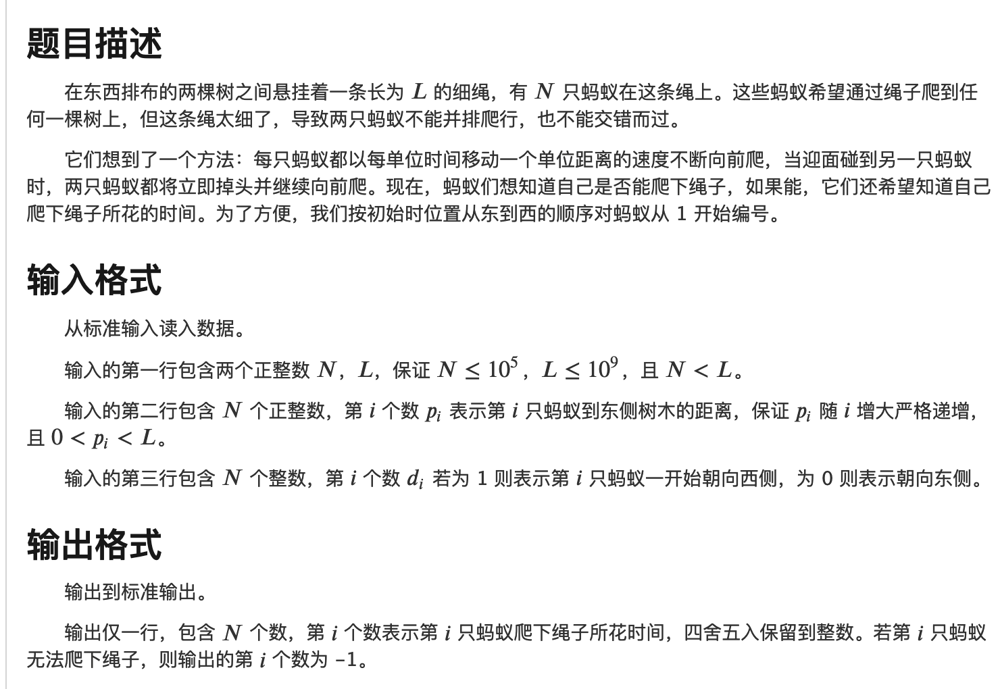

### 不存在等差数列

给定正整数`n`, 求输出一个`1-n`的排列，使得这个排列中，不存在三个数能够构成等差数列。

也就是不存在`i < j < k a[i] + a[k] == 2 * a[j]`

#### 解题思路

首先将`1-n`补成不小于`n`的最小的2的整数次幂。比如要求5，则求8。

然后将8的结果中输出小于等于5的，就是一个合法的排列。

那么怎么求整数次幂的解呢。通过观察有下面的性质：

- 我们将奇数和偶数分成两堆，首先如果`a[i]`与`a[k]`分别在奇数堆和偶数堆，那么是不可能存在等差数列的。
- 所以我们只需要找到偶数堆的一个排列，使其内部合法即可。然后将这个合法的排列每个减一，就可以得到奇数的合法排列。
- 求偶数堆的合法排列这个时候可以将所有的偶数除二，得到除二的合法排列就行了。

比如要求`1-8`,分成两堆`` 3 5 7`, `2 4 6 8`。

求`2 4 6 8 `只需要求`1 2 3 4`。

`1 2 3 4   -> 2 4 1 3` 

乘二：

`2 4 6 8 -> 4 8 2 6 `

减一得到奇数的合法排列：

`1 2 3 4 -> 3 7 1 5`

然后最终的结果就是`4 8 2 6 3 7 1 5`

求$2^N$ 规模的问题，转为求$2^{N-1}$个偶数，然后每个偶数除二，转为求规模为$2^{N-1}$的问题。递归求解即可。

递归基为`2 4 1 3`。

#### C++代码

```c++
#include<iostream>

using namespace std;
const int N = 1100 * 1100;

int q[N] = {0, 2, 4, 1, 3};

void find(int n){
    if(n == 4) return; // 递归基
    else{
        find(n >> 1);
        for(int i = 1; i <= n >> 1; i ++) {  // 乘2 并copy
            q[i] = q[i] * 2;
            q[i + (n >> 1)] = q[i] - 1;
        }
        return;
    }
}


int main(){

    int n;
    cin >> n;
    int a = 1;
    while(a < n) a <<= 1;
    find(a);
    for(int i = 1; i<= a; i++){
        if(q[i] <= n) cout << q[i] << " ";
    }
    return 0;
}
```

###  有序矩阵中的第K个最小数组和

[原题链接](https://leetcode-cn.com/problems/find-the-kth-smallest-sum-of-a-matrix-with-sorted-rows/)

#### 解题思路

使用小顶堆。看做图的问题。每次取出一个元素之后，下一个最小值只可能是某个下标向后移动一位，其他不变中的一个。

然后将其所有可能转移的状态加入到小顶堆中，循环K次即可。

#### 代码

```python

import heapq

class Solution:
    def kthSmallest(self, mat, k: int) -> int:
        tt = set()
        n = len(mat)
        m = len(mat[0])
        tmp = [0] * n
        tt.add(tuple(tmp))
        s = 0
        for x in mat:
            s += x[0]
        h = [(s, tmp)]
        for i in range(1, k):
            t_s, it = heapq.heappop(h)
            for i, x  in enumerate(it):
                if x < m - 1:
                    ttt = list(it)
                    ttt[i] = x + 1
                    ttt = tuple(ttt)
                    if ttt in tt:
                        continue
                    else:
                        heapq.heappush(h, (t_s - mat[i][x] + mat[i][x + 1], tuple(ttt)))
                        tt.add(ttt)
        return heapq.heappop(h)[0]
```

### 圆盘靶内的最大飞镖数(POJ原题)

[原题链接](https://leetcode-cn.com/problems/maximum-number-of-darts-inside-of-a-circular-dartboard/)

#### 解题思路

贪心法，首先如何证明任意选两个点，然后让这两个点落在圆上，并统计所有点中落在圆上的个数，就一定是正确的呢？

以下是个人的思考。

考虑能够包含最多数的点解的情况，我们现在能够用一个圆将他们全部包住。

如果现在有不少于两个点在圆上了，那么就已经成立了。

如果有少于两个点在圆上。那么我们考虑这些点组成的凸包。凸包可以理解为，用一个无穷大的皮筋，然后松手，这些点看做是钉子，最终肯定会崩成一个凸多边形。这个凸变形就是这些点

组成的凸包。

然后我们肯定是可以挪动这个圆，使得这个凸包上的两个顶点在圆上，且任然能够将这个凸包覆盖。(直觉上是的，如果有错误或者严格的证明，希望各位大佬补充！)

所以上面的贪心的方法就是对的。

然后暴力枚举所有的点对，求圆心坐标，再扫描所有点，判断点和圆心的位置，即可。

如何求圆心。可以求出两个点的矢量的单位向量，然后将这个单位向量逆时针旋转$\theta$度，再将单位向量乘以半径，加上旋转点的坐标，就得到了圆心坐标。$\theta$是这两个点的弦和半径构成的三角形的底角，

可用勾股定理求出其对应的正余弦值。

由于遍历的点的顺序不同，当考虑两个相同的点的时候，两次遍历就会将两个方向的圆都考虑到。同时需要考虑精度带来的误差。

时间复杂度**`O(n^3)`**

#### C++代码

```c++
class Solution {
public:

    int numPoints(vector<vector<int>>& points, int r) {
        int n = points.size();
        int ans = 1;
        for(int i = 0; i < n; i ++){
            for(int j = 0; j < n; j ++){
                if(i == j || pow(points[i][0] - points[j][0], 2) + pow(points[i][1] - points[j][1], 2) > 4 * r * r) continue;
                double dx = points[i][0] - points[j][0], dy = points[i][1] - points[j][1];
                double dis = sqrt(dx * dx + dy * dy);
                double cs = dx / dis, sn = dy / dis;
                double ca = abs(dis) / (2 * r), sa = sqrt(1 - ca * ca);
                double center_x = (cs * ca - sn * sa) * r + points[j][0];
                double center_y = (cs * sa + sn * ca) * r + points[j][1];
                int nn = 0;

                for(int k = 0; k < n; k ++){
                    if(pow(center_x - points[k][0], 2) + pow(center_y - points[k][1], 2) < r * r + 1e-6) nn ++;
                }
                // cout << i << " " << j << " " << center_x << " " << center_y << " " << nn <<endl;
                ans = max(ans, nn);
            }
        }
        return ans;
    }
};
```

### 最小面积矩形

[原题链接](https://leetcode-cn.com/problems/minimum-area-rectangle/)

#### 解题思路

数据规模，可以枚举对角线，并判断另外两个点是否在集合中。关键在于如何高效地判断另外两个点是不是在数据集中。

**可以通过将其看做二维数组，然后每个二维数组的小标可以看做一个一维数组的下标，这样也不会发生冲突！**

时间复杂度`O(n^2)`

#### C++代码

```c++
#include<unordered_set>
class Solution {
public:
    
    int minAreaRect(vector<vector<int>>& points) {
        unordered_set<int> se;
        for(auto x:points){
            se.insert( 40001 * x[0] + x[1]);
        }
        int ans = 0x3f3f3f3f;
        for(int i = 0; i < points.size(); i ++){
            for(int j = 0; j < points.size(); j ++){
                int x1 = points[i][0], y1 = points[i][1], x2 = points[j][0], y2 = points[j][1];
                if(x1 < x2 && y1 < y2 && se.count(40001 * x2 + y1) && se.count(40001 * x1 + y2)){
                    ans = min(ans, (y2 - y1) * (x2 - x1));
                }
            }
        }
        if(ans == 0x3f3f3f3f) return 0;
        else return ans;
    }
};
```

### 完全二叉树的节点个数(找到一个完全二叉树的最后一个节点)

[原题链接](https://leetcode-cn.com/problems/count-complete-tree-nodes/)

#### 解题思路

1. 直接遍历所有的节点，然后得到节点个数

2. 两层二分。首先找到树的最大的深度。这样就知道最后一层的节点的个数。然后将最后一层的节点编号，不断二分最后一个节点的位置。如果从二叉树找到这个节点呢？可以不断通过判断要找到的下标在当前维护区间的左半区间还是右半区间，然后就知道在当前位置需要向左走还是向右走，最终到达最后一层，只需要判断这个节点是否为空，即可知道其是否存在！

   时间复杂度$(\log n) ^ 2$

#### C++代码

```c++
/**
 * Definition for a binary tree node.
 * struct TreeNode {
 *     int val;
 *     TreeNode *left;
 *     TreeNode *right;
 *     TreeNode(int x) : val(x), left(NULL), right(NULL) {}
 * };
 */
#include<cmath>
class Solution {
public:
    
    int n;
    TreeNode* rt;
    bool find(int a){   // 二分判断某个下标的节点是否存在
        int l = 0, r = n;
        TreeNode* cur = rt;
        while(l < r){
            int mid = l + r >> 1;
            if(a <= mid) cur = cur -> left, r = mid;
            else cur = cur -> right, l = mid + 1;
        }
        return cur != NULL;
    }
    
    int countNodes(TreeNode* root) {
        if(!root) return 0;
        rt = root;
        int dep = 0;
        TreeNode* cur = root;
        while(cur -> left){
            cur = cur -> left;
            dep ++;
        }
        int l = 0, r = pow(2, dep) - 1;
        n = pow(2, dep) - 1;
        while(l < r){  // 二分最后一个节点的下标
            int mid = l + r + 1 >> 1;
            if(find(mid)) l = mid;
            else r = mid - 1;
        }
        return pow(2, dep) + l;
    }
};
```

### 蚂蚁

大致题意：

N个蚂蚁在一个绳子上，每个蚂蚁有自己的位置和自己的朝向。从0开始，每个蚂蚁沿着自己的方向以`1m/s`的速度前进。当两个蚂蚁相遇的时候，两个蚂蚁调转方向继续前行。给定绳子长度、每个蚂蚁的初始位置以及朝向，问最终每个蚂蚁落地的时间是多少。



```c++
#include<iostream>
#include<algorithm>
#include<vector>
using namespace std;

const int N = 100010;
int d[N];
bool dir[N];
int ans[N];
vector<int> res1, res2;

int main(){

    int n, l;
    cin >> n >> l;
    for(int i = 0; i < n; i ++) cin >> d[i];
    for(int i = 0; i < n; i ++) {
        cin >> dir[i];
        if(dir[i]){
            res1.push_back(l - d[i]);
        }else{
            res2.push_back(d[i]);
        }
    }
    sort(res1.begin(), res1.end());   // res1表示向西
    sort(res2.begin(), res2.end());  // res2表示向东

    for(auto x:res1) cout << x << " ";
    for(auto x:res2) cout << x << " ";
    return 0;
}
```

#### 解题思路

经典问题，可以看做两个蚂蚁相遇之后交换身份，然后就和没有相撞一样。这样可以得到所有蚂蚁可能掉落的时刻。

但是需要将时间和蚂蚁对应上。我们将从左侧掉落的时间放在一个数组里，然后从右侧掉落的时间放在一个数组里。

由于蚂蚁的相对位置关系不会发生变化，所以将左边的时间升序排序，右边的时间降序排序，然后将两个时间拼接起来，就是

对应下标的蚂蚁的落地时间！

这个问题还可以有**如下的变形**：

- 给定蚂蚁位置，求安排朝向实现所有蚂蚁都落地的时间最长/最短
- 给定蚂蚁位置和朝向，求最后一个蚂蚁落地的时间。
- 给定蚂蚁位置和朝向，求`T`时刻每个蚂蚁所在的位置和朝向。(相对顺序不变，每个蚂蚁按照自己的速度走(不会相撞)，然后按照位置排序，排在第`k`位的蚂蚁的状态就是第`k`个蚂蚁现在的状态。)

### 二叉树中的伪回文路径

[原题链接](https://leetcode-cn.com/problems/pseudo-palindromic-paths-in-a-binary-tree/)

#### 解题思路

一堆字符能够组成回文序列，只需要满足奇数个字符的个数不超过1即可。

#### C++代码

```c++
/**
 * Definition for a binary tree node.
 * struct TreeNode {
 *     int val;
 *     TreeNode *left;
 *     TreeNode *right;
 *     TreeNode() : val(0), left(nullptr), right(nullptr) {}
 *     TreeNode(int x) : val(x), left(nullptr), right(nullptr) {}
 *     TreeNode(int x, TreeNode *left, TreeNode *right) : val(x), left(left), right(right) {}
 * };
 */
#include<unordered_map>
class Solution {
public:
    
    unordered_map<int, int> mp;
    int odd_num = 0;
    int ans = 0;
    
    void dfs(TreeNode *t){
        if(!(t -> left) && !(t -> right)){
            if(odd_num < 2) ans ++;
            return;
        }
        if(t -> left){
            mp[t -> left -> val] ++;
            if(mp[t -> left -> val] & 1) odd_num ++;
            else odd_num --;
            dfs(t -> left);
            mp[t -> left -> val] --;
            if(mp[t -> left -> val] & 1) odd_num ++;
            else odd_num --;
        }
        if(t -> right){
            mp[t -> right -> val] ++;
            if(mp[t -> right -> val] & 1) odd_num ++;
            else odd_num --;
            dfs(t -> right);
            mp[t -> right -> val] --;
            if(mp[t -> right -> val] & 1) odd_num ++;
            else odd_num --;
        }
        
    }
    
    int pseudoPalindromicPaths (TreeNode* root) {
        mp[root -> val] ++;
        odd_num ++;
        dfs(root);
        return ans;
    }
};
```

### 两个盒子中球的颜色数相同的概率

[原题链接](https://leetcode-cn.com/problems/probability-of-a-two-boxes-having-the-same-number-of-distinct-balls/)

#### 解题思路

dfs加剪枝。 有重复元素的全排列公式如下：

$$\frac{(\sum_{i=1}^{k} s*_i)!}{ \Pi_*{i} (s_i!)}$$

然后枚举两个箱子中，每个球的个数。分别求出两个箱子中的排列数，乘积相加，就是分子。

一共有8种球，每种球的个数是0-6，最多的状态数为$7^8 = 5764801$ 在可接受的范围内

每个最终的状态，判断球的颜色的个数是不是相等，然后计算即可。

再向下走的时候，如果发现某个箱子中的球的个数超过了全部球的一半，则可以直接剪枝。

#### C++代码

```c++
class Solution {
public:
    vector<int> left, right, bas;
    int ln = 0, rn = 0;
    int alls = 0;
    double tot, ak;
    
    double fac(int a){   // 求阶乘
        double ans = 1;
        for(int i = 1; i <= a; i ++) ans *= i;
        return ans;
    }
    
    double get(vector<int>& bas){   // 求排列数
        int n = 0;
        for(auto x:bas) n += x;
        double ans = fac(n);
        for(auto x:bas) ans /= fac(x);
        return ans;
    }
    
    
    void dfs(int i){
        if(ln > alls / 2 || rn > alls / 2) return ;  // 剪枝
        if(i == left.size()){   // 叶子节点
            // for(auto x:left) cout << x << " ";
            // cout << endl;
            // for(auto x:right) cout << x <<" ";
            // cout << endl;
            int a = 0, b = 0;
            for(auto x:left){
                if(x) a ++;
            }
            for(auto x:right){
                if(x) b ++;
            }
            if(a == b)   // 两个箱子中的球的颜色种类相同
                ak += get(left) * get(right);
            return;
        }
        for(int j = 0; j <= bas[i]; j++){   // 枚举当前颜色球，左右箱子中的个数
            left[i] = j;    
            right[i] = bas[i] - j;
            ln += j;   // 记录两个箱子中球的总数，用于剪枝
            rn += bas[i] - j;
            dfs(i + 1);   // 递归调用
            ln -= j;   // 恢复现场
            rn -= bas[i] - j;
        }
    }
    
    double getProbability(vector<int>& balls) {
        
        bas = balls;
        left = vector<int>(balls.size(), 0);
        right = vector<int>(balls.size(), 0);
        tot = get(balls);   // 求分母
        for(auto x:balls) alls += x;   
        dfs(0);  // 求分子
        // cout << ak << " " << tot << endl;
        return ak / tot; 
    }
};
```

###  重新规划路线

[原题链接](https://leetcode-cn.com/problems/reorder-routes-to-make-all-paths-lead-to-the-city-zero/)

#### 解题思路

将有向图转为无向图，然后从`0`开始枚举，如果边的方向相同的话，就要取反。

#### C++代码

```c++
#include<unordered_set>
#include<queue>
typedef pair<int,int> PII;
class Solution {
public:
    
    vector<int> e[50010];
    bool vis[50010];
    unordered_set<string> se1, se2;
    int minReorder(int n, vector<vector<int>>& cs) {
        for(auto x: cs){
            e[x[0]].push_back(x[1]);
            e[x[1]].push_back(x[0]);
            se1.insert(to_string(x[0]) + "#" + to_string(x[1]));
        }
        // for(auto x:e[0]) cout << x << " ";
        // cout << endl;
        queue<int> q;
        q.push(0);
        vis[0] = true;
        while(q.size()){
            auto it = q.front();q.pop();
            for(auto x:e[it]){
                if(!vis[x]){
                    se2.insert(to_string(it) + "#" + to_string(x));
                    vis[x] = true;
                    q.push(x);
                }
            }
        }
        int ans = 0;
        // for(auto x:se1) cout << x <<endl;
        // cout << endl;
        // for(auto x:se2) cout << x << endl;
        for(auto x:se2){
            if(se1.count(x)) ans ++;
        }
        return ans;
    }
};
```

### 课程安排IV

[原题链接](https://leetcode-cn.com/problems/course-schedule-iv/)

#### 解题思路

- 根据输入的边建图，然后输入一个query，就从根节点开始搜索。找打了孩子节点返回true

- 利用Floyd算法，预处理好图中任意两个节点直接是否可达。然后对于输入的每一个query，直接查表。

#### C++代码

```c++
class Solution {
public:
    
    vector<int> e[110];
    
    vector<bool> vis;
    
    bool query(int a, int b){
        if(a == b) return true;
        vis[a] = true;
        for(auto x:e[a]){
            if(!vis[x] && query(x, b)) return true;
        }
        
        return false;
    }
    
    vector<bool> checkIfPrerequisite(int n, vector<vector<int>>& pres, vector<vector<int>>& qs) {
        for(auto x:pres){
            e[x[0]].push_back(x[1]);
        }
        vector<bool> ans;
        for(auto x:qs){
            vis = vector<bool>(110, false);
            ans.push_back(query(x[0], x[1]));
        }
        return ans;
        
    }
};
```

### 最长的连续序列

[原题链接](https://leetcode-cn.com/problems/longest-consecutive-sequence/)

#### 解题思路

1. 排序加扫描。注意数组中可能有重复元素，所以需要去重，或者在扫描的时候判断一下

2. 将所有的数据放入到hash表中，然后枚举所有连续区间的起点。枚举到一个元素判断其是否是起点的时候，只需要看比其小1的元素在不在数组中即可。

时间复杂度

1. `O(n log n)`
2. `O(n)`

#### C++代码

```c++
#include<unordered_set>
class Solution {
public:
    int longestConsecutive(vector<int>& nums) {
        unordered_set<int> se;
        for (int &num: nums) se.insert(num);
        int ans = 0;
        for(int &num: nums){
            if(se.count(num - 1)) continue;
            int t = 1;
            while(se.count(num + 1)){
                t += 1;
                num += 1;
            }
            ans = max(ans, t);
        }
        return ans;
    }
};
```

### 树节点的第K个祖先

[原题链接](https://leetcode-cn.com/problems/kth-ancestor-of-a-tree-node/)

#### 解题思路

倍增的思想。朴素的方法很容易想到。直接DFS，然后得到每个节点到根节点的路径。之后查询的时候直接通过索引即可。但是超时，因为复制路径的问题。

可以使用倍增的思想。每个节点不再记录其到根的所有的节点，而是记录其到根距离为`2`的整数次幂的节点。那么下次为`k`时首先将`k`拆分为2的幂次和，然后一次一次跳，最终存储的复杂度为`O(log n)`。检索也是`O(log n)`

#### C++代码

```c++
class TreeAncestor {
public:
    
    vector<int> ans;
    vector<vector<int>> e;
    vector<vector<int>> path;
    int root = -1;
    vector<int> tmp;
    vector<bool> vis;
    vector<int> ni;
    vector<int> depth;
    vector<vector<int>> fa;
    
    void dfs(int a){
        depth[a] = tmp.size();
        if(e[a].size() == 0){  // 遇到叶子节点了就回溯，将没有处理的节点处理了
            for(int i = (int)tmp.size() - 1; i >= 0; i --){
                int x = tmp[i];
                if(fa[x].size() == 0){
                    int j = 1;
                    while(j <= i){
                        fa[x].push_back(tmp[i - j]);
                        j = j << 1;  // 只存储2的整数次幂的情况
                    }
                }else{
                    break;
                }
            }
        }
        for(auto x:e[a]){
            tmp.push_back(x);
            dfs(x);
            tmp.pop_back();
        }
    }
    
    TreeAncestor(int n, vector<int>& parent) {
        ans = vector<int>(n);
        fa = vector<vector<int>>(n);
        e = vector<vector<int>>(n);
        vis = vector<bool>(n, false);
        depth = vector<int>(n, 0);
        for(int i = 0;  i< parent.size(); i ++){
            if(parent[i] == -1){
                root = i;
                continue;
            }
            e[parent[i]].push_back(i);
        }
        tmp.push_back(root);
        dfs(root);
    }
    
    int getKthAncestor(int node, int k) {
        if(k > depth[node] - 1) return -1;
        int a = node;
        int t = 0;
        while(k){
            if(k & 1 << t){   // 拆分为不同的2的次幂，然后跳即可
                a = fa[a][t];
                k ^= (1 << t);
            }
            t ++;
        }
        return a;
    }
};

/**
 * Your TreeAncestor object will be instantiated and called as such:
 * TreeAncestor* obj = new TreeAncestor(n, parent);
 * int param_1 = obj->getKthAncestor(node,k);
 */
```

### 不同整数的最少数目

[原题链接](https://leetcode-cn.com/problems/least-number-of-unique-integers-after-k-removals/)

#### 解题思路

贪心。当移除的个数相同，且想收益最大的话，那么移除次数最小的肯定是最好的。

先用哈希表存储每个数出现的次数，然后排序，按照次数从小到大减去即可。

#### C++代码

```c++
class Solution {
public:
    int findLeastNumOfUniqueInts(vector<int>& arr, int k) {
        unordered_map<int,int> mp;
        for(auto x:arr){
            mp[x] ++;
        }
        vector<pair<int,int>> tt;
        for(auto x:mp){
            tt.push_back({x.second, x.first});
        }
        sort(tt.begin(), tt.end());
        int t = 0;
        int num = 0;
        for(int i = 0; i < tt.size(); i ++){
            t += tt[i].first;
            if(t > k){
                break;
            }else{
                num ++;
            }
        }
        return tt.size() - num;
    }
};
```

### 保证文件名唯一

[原题链接](https://leetcode-cn.com/problems/making-file-names-unique/)

#### 解题思路

用哈希表记录每个字符串出现的次数即可。

#### C++代码

```c++
class Solution {
public:
    vector<string> getFolderNames(vector<string>& names) {
        unordered_map<string, int> cnt;
        unordered_set<string> hash;

        vector<string> res;
        for (auto name : names) {
            string suc;
            int k = 0;
            
            if (cnt.count(name)) k = cnt[name];

            while (hash.count(name + suc)) {
                k ++ ;
                suc = "(" + to_string(k) + ")";
            }
            
            cnt[name] = k;
            
            cout << k << endl;
            cout << cnt[name] << endl;
            
            hash.insert(name + suc);
            res.push_back(name + suc);
        }

        return res;
    }
};
```

### 统计全1子矩形

[原题链接](https://leetcode-cn.com/problems/count-submatrices-with-all-ones/)

#### 解题思路

思路是枚举每个位置作为矩形的右下角，然后看有多少个矩形。在确定右下角之后，再枚举矩形的宽，同时使用一个变量`t`维护现在扩展到的区域的高的最小值。
那么宽为`w`的矩形的个数就是`t`。
先利用n方时间预处理出所有位置上面有多少个连续的1，也就是高度。

#### C++代码

```c++
class Solution {
public:
    int numSubmat(vector<vector<int>>& mat) {
        int n = mat.size(), m = mat[0].size();
        vector<vector<int>> dp(n, vector<int>(m, 0));
        // 预处理好每个位置上面有多少个连续的1
        for (int i = 0; i < m; i ++) dp[0][i] = mat[0][i];
        for (int i = 1; i < n; i ++) {
            for (int j = 0; j < m; j ++) {
                if (mat[i][j]) dp[i][j] = dp[i-1][j] + 1;
            }
        }
        int ans = 0;
        for (int i = 0; i < n; i ++) {
            for (int j = 0; j < m; j ++) {
                int t = 2e9;
                for (int w = 1; j - w + 1 >= 0; w ++) {
                    t = min(dp[i][j - w + 1], t);
                    ans += t;
                    if (t == 0) break;
                }
            }
        }
        return ans;
    }
};
```

### 服务中心的最佳位置

[原题链接](https://leetcode-cn.com/problems/best-position-for-a-service-centre/)

#### 解题思路

费马点裸题。三分套三分，或者直接套公式。

核心是，凸函数的某个维度的下界也是凸函数。

详细证明过程见我[lc题解](https://leetcode-cn.com/problems/best-position-for-a-service-centre/solution/shu-xue-zheng-ming-by-acw_wangdh15/)

#### C++代码

```c++
class Solution {
public:
    
    vector<vector<int>> ps;
    
    double dis(double x, double y) {
        
        double ans = 0;
        for (auto& p : ps) {
            ans += sqrt((x - p[0]) * (x - p[0]) + (y - p[1]) * (y - p[1]));
        }
        return ans;
    }
    
    double f(double x) {
        
        double l = 0, r = 100;
        while (r - l > 1e-7) {
            double y1 = l + (r - l) / 3, y2 = l + (r - l) * 2 / 3;
            if (dis(x, y1) < dis(x, y2)) r = y2;
            else l = y1;
        }
        return dis(x, l);
    }
    
    double getMinDistSum(vector<vector<int>>& positions) {
        ps = positions;
        double l = 0, r = 100;
        while (r - l > 1e-7) {
            double x1 = l + (r - l) / 3, x2 = l + (r - l) * 2 / 3;
            if (f(x1) < f(x2)) r = x2;
            else l = x1;
        }
        return f(l);
    }
};
```

