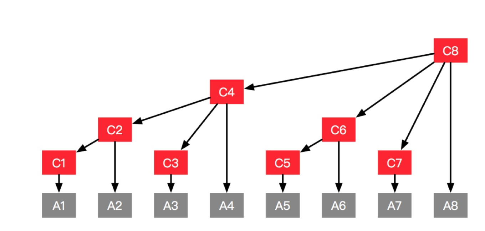

## 树状数组


### 1. 前缀

有一种数据结构能够通过一些预处理能够得到任意区间`[l, r]`的数字的和。这就是通过

构造前缀数组，数组中存放的位置是当前下标之前的所有数字之和。同样，类似的数据结构

可以拓展到更高的维度。用于求二维矩阵任意子块的所有元素的和。


但是这种数据结构面临着一个问题就是元素根性问题。如果原始数组中某个位置的元素发生了更新，

那么前缀数组这个位置之后的元素都需要更新，时间复杂度比较高。能不能有一种数据结构支持比较高效

地来支持这种更新操作，同时能够高效地支持任意区间元素和的操作呢？这就是树状数组的功能。


### 2. 树状数组


通过前面的分析，可以发现问题出在，和一个元素相关联的区间太多了。那么能不能降低元素和区间的关联呢。

树状数组主要是下面的方法：



每个元素不再维护其前面所有的元素的和，只维护其前面部分元素的和。下面是一个比较形象的说明：

> 要计算1-40位置的所有的元素和，那么先看c[40], 然后发现其维护的是a[30] -a[40]的元素和，这个时候拿到之后，再看c[29]，发现其维护的是a[10] - a[29]的元素和，然后访问c[9],发现其实a[1] - a[9]的元素和。这样就能够通过几步得到想要的结果。


关键是怎么能够高效地实现这种数据结构呢。通过每个位置其对应二进制表示就可以实现这个功能。


这里有一个小小的trick，如何通过为运算获得一个数二进制为最后一位1？

> x & (- x)  # 通过计算机的数的表示不难验证

每个索引值存储`[x-lowbit(x) + 1 : x]`对应的元素和，求完之后访问`c[x-lowbit(x)]`，这样一直下去即可。

> 一个索引找到下一个索引： x  - x & (- x) 
>
> 一个索引找到其父节点： x + x & (- x)

具体实现的代码如下：

```python
#!/usr/bin/python
# -*- coding: utf-8 -*-
"""
树状数组的实现
每个节点的父节点是：x + lowbit(x)
每个节点的直接孩子节点是 x - lowbit(x)
lowbit(x) = x & -x
"""


class FenwickTree:
    """
    树状数组的实现
    """
    def __init__(self, n):
        self.size = n
        self.tree = [0] * (n + 1)

    def __lowbit(self, index):
        """
        获取一个数字的最后一个1代表的数
        """
        return index & (-index)

    def update(self, index, delta):
        """
        更新对应index位置的值，维护整体数据结构
        """
        while index <= self.size:
            self.tree[index] += delta
            index += self.__lowbit(index)

    def query(self, index):
        """
        查询1-index的和
        """
        res = 0
        while index >= 1:
            res += self.tree[index]
            index = index - self.__lowbit(index)
        return res

    def query_inter(self, l, r):
        """
        查询一个区间的数字和
        """
        return self.query(r) - self.query(l-1)

    @classmethod
    def built_from_list(cls, _list):
        """
        输入一个数组，构建这个数组的树状数组
        方法1，逐个数字插入，遍历每一个数字，然后调用插入方法
        """
        length = len(_list)
        temp = FenwickTree(length + 1)
        for i, x in enumerate(_list):
            temp.update(i+1, x)
        return temp

    @classmethod
    def built_from_list2(cls, _list):
        """
        从数组构建树状数组
        方法2，方法一可以看做是我为人人的动态规划方法，方法二十人人为我的动态规划方法
        遍历每个数字,利用lowbit方法求自己的直接父父节点(上面的方法相当于每次有信号就向上传，这个是将能够影响的信号积累了再向前传)
        """
        temp = [0] * (len(_list) + 1)
        for i in range(0, len(_list)):
            i += 1
            temp[i] += _list[i - 1]
            f = i + (i & ( -i ))
            if f <= len(_list):
                temp[f] += temp[i]

        a = FenwickTree(len(_list))
        a.tree = temp
        return a


if __name__ == '__main__':
    t = FenwickTree.built_from_list2([1, 2, 3, -1, 5, 6, 10])
    print(t.query_inter(1, 5))
    t.update(1, 3)
    print(t.query_inter(1, 5))

```


### 3. 构造效率问题

可以想到有一种比较简单的构造方法，就是轮流插入一个节点。这样的效率是`O(nlogn)`。因为

更新每个节点都会向上回溯到其对应的根节点。

可以观察到，图中每个边都被传递过很多次。能不能降低数据的传送次数？

每个节点自己的数据确定了之后，再把自己的传给其直接父节点。这样就能够使得树中

每一条边只被经过一次。由于每个节点都只向其父节点传送一次数据，所以复杂度是`O(n)`

**注意：树状数组的下标是从1开始而不是零，否则会死循环**


### 4. 参考文献

[树状数组](https://oi-wiki.org/ds/fenwick/)

[树状数组学习笔记](https://www.acwing.com/blog/content/80/)

