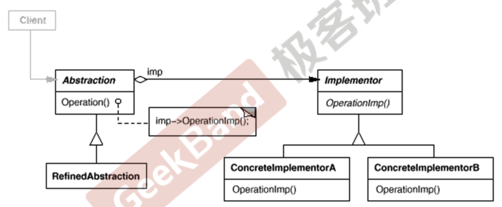

### 桥模式

由于某些类型的固有的逻辑，使得他们有两个变化的维度，或者多个变化的维度。

举个例子，比如要实现一个通信软件的类，这个类需要以下的功能：

1. 登录，发送消息，接受消息。
2. 底层的，相互连接，发送数据包。

这个软件需要运行在PC平台，手机平台，TV平台等，对于不同的平台，底层的这些实现是不同的。

这个软件在业务逻辑也用不同的类型，比如普通用户接受消息只是发出一个声音，但是VIP用户收到一个消息之后会播放一段音乐等。

这两个维度之间可以相互任意组合，假设第一种有$n$种方式，第二种有$m$种方式，那么一共就有$n*m$中方式，如果使用继承的方式的话，子类就爆炸了，而且有大量的代码冗余。

```c++
class Base {

	virtual 第一个维度的各个方法
	virtual 第二个维度的各个方法
}

class V1_PC : public Base {

	实现了平台相关的方法；

}

class V1_PC_VIP : public V1_PC {

	实现了VIP的一些业务方法

}
```

```c++
#include <iostream>
#include <string>


class Message {
public:

    // 业务逻辑相关的函数，在业务逻辑中会调用平台实现的各种方法
    virtual void Login(std::string userName, std::string passWord) = 0;
    virtual void SendMessage(std::string message) = 0;
    virtual void SentPicture() = 0;
  
  

    // 平台实现相关的函数
    virtual void PlaySount() = 0;
    virtual void DrawPicture() = 0;
    virtual void WriteText() = 0;
    virtual void Connect() = 0;
    virtual ~Message() = default;
};

// 不同平台的实现

class PCMessageBase: public Message {
public:
    virtual void PlaySount() {std::cout << "PC 平台播放声音的方法" << std::endl;}
    virtual void DrawPicture() {std::cout << "PC 平台画图的方法" << std::endl;};
    virtual void WriteText() {std::cout << "PC 平台写字的方法" << std::endl;} ;
    virtual void Connect() {std::cout << "PC 平台网络连接的方法" << std::endl;};
};

class MobileMessageBase: public Message {
public:
    virtual void PlaySount() {std::cout << "移动 平台播放声音的方法" << std::endl;}
    virtual void DrawPicture() {std::cout << "移动 平台画图的方法" << std::endl;};
    virtual void WriteText() {std::cout << "移动 平台写字的方法" << std::endl;} ;
    virtual void Connect() {std::cout << "移动 平台网络连接的方法" << std::endl;};
};

// 不同类型用户业务逻辑实现方法
class PCMessageLite: public  PCMessageBase{
public:
    virtual void Login(std::string userName, std::string passWord) {
        Connect(); // 调用链接网络的方法
    };
    virtual void SendMessage(std::string message) {
        WriteText(); // 调用链接网络的方法
    }
    virtual void SentPicture() {
        DrawPicture();
    }
};

// 不同类型用户业务逻辑实现方法
class PCMessageVIP: public  PCMessageBase{
public:
    virtual void Login(std::string userName, std::string passWord) {
        std::cout << "VIP用户！" << std::endl;
        Connect(); // 调用链接网络的方法
    };
    virtual void SendMessage(std::string message) {
        std::cout << "VIP用户！" << std::endl;
        WriteText(); // 调用链接网络的方法
    }
    virtual void SentPicture() {
        std::cout << "VIP用户！" << std::endl;
        DrawPicture();
    }
};

// 不同类型用户业务逻辑实现方法
class MobileMessageLite: public  MobileMessageBase{
public:
    virtual void Login(std::string userName, std::string passWord) {
        Connect(); // 调用链接网络的方法
    };
    virtual void SendMessage(std::string message) {
        WriteText(); // 调用链接网络的方法
    }
    virtual void SentPicture() {
        DrawPicture();
    }
};

// 不同类型用户业务逻辑实现方法
class MobileMessageVIP: public  MobileMessageBase{
public:
    virtual void Login(std::string userName, std::string passWord) {
        std::cout << "VIP用户！" << std::endl;
        Connect(); // 调用链接网络的方法
    };
    virtual void SendMessage(std::string message) {
        std::cout << "VIP用户！" << std::endl;
        WriteText(); // 调用链接网络的方法
    }
    virtual void SentPicture() {
        std::cout << "VIP用户！" << std::endl;
        DrawPicture();
    }
};
```


上面有大量的代码冗余，比如在普通用户和VIP用户的一些业务逻辑是相同的，只不过使用的底层平台的功能实现不同，而且他们用的接口也都是一样的。

能够有更好的设计方法呢。

我们发现所有的类就是两个维度的各种可能性的组合，所以我们可以将这两个维度的内容拆分开来，对于不变的部分，放到抽象类上，对于变化的部分，留给子类去实现。

两者之间通过组合的方式来达到桥的感觉，桥两头随便变化，但是他们直接的衔接是不变的。

我们可以看到上面的业务逻辑部分是调用了具体的平台实现。而且业务逻辑部分也有对应的变化。将这两部分分离开来，使用桥模式来进行处理。

```c++
#include <iostream>

// 具体平台实现相关的类的抽象基类
class MessageImp {

public:
    virtual void PlaySount() = 0;
    virtual void DrawPicture() = 0;
    virtual void WriteText() = 0;
    virtual void Connect() = 0;
    ~MessageImp() = default;

};

// 业务类，需要调用平台实现，通过基类来解耦
class Message {
public:
    Message(MessageImp* _messageImp) : messageImp(_messageImp) {}
    virtual void Login(std::string userName, std::string passWord) = 0;
    virtual void SendMessage(std::string message) = 0;
    virtual void SentPicture() = 0;
protected:
    MessageImp *messageImp;
};

class PCMessageImp: public MessageImp {
public:
    virtual void PlaySount() {std::cout << "PC 平台播放声音的方法" << std::endl;}
    virtual void DrawPicture() {std::cout << "PC 平台画图的方法" << std::endl;}
    virtual void WriteText() {std::cout << "PC 平台写字的方法" << std::endl;}
    virtual void Connect() {std::cout << "PC 平台网络连接的方法" << std::endl;}
};

class MobileMessageImp : public MessageImp {
public:
    virtual void PlaySount() {std::cout << "移动 平台播放声音的方法" << std::endl;}
    virtual void DrawPicture() {std::cout << "移动 平台画图的方法" << std::endl;}
    virtual void WriteText() {std::cout << "移动 平台写字的方法" << std::endl;}
    virtual void Connect() {std::cout << "移动 平台网络连接的方法" << std::endl;}
};

class MessageLite : public Message {
public:
    MessageLite(MessageImp* messageImp1) : Message(messageImp1){}

    virtual void Login(std::string userName, std::string passWord) {
        messageImp->Connect(); // 调用链接网络的方法
    };
    virtual void SendMessage(std::string message) {
        messageImp-> WriteText(); // 调用链接网络的方法
    }
    virtual void SentPicture() {
        messageImp->DrawPicture();
    }
};

class MessageVIP : public Message {
public:
    MessageVIP(MessageImp* messageImp1) : Message(messageImp1) {}
    virtual void Login(std::string userName, std::string passWord) {
        std::cout << "VIP用户！" << std::endl;
        messageImp->Connect(); // 调用链接网络的方法
    };
    virtual void SendMessage(std::string message) {
        std::cout << "VIP用户！" << std::endl;
        messageImp->WriteText(); // 调用链接网络的方法
    }
    virtual void SentPicture() {
        std::cout << "VIP用户！" << std::endl;
        messageImp->DrawPicture();
    }
};

int main() {

    MessageImp *messageImp = new PCMessageImp();
    Message *messageLite = new MessageLite(messageImp);  // 运行时装配
    messageLite->Login("aa", "bb");
    Message *messageVIP = new MessageVIP(messageImp); // 运行时装配，更加灵活
    messageVIP->Login("aa", "bb");
}
```

### UML 图



这个UML图还是比较容易理解的，对照上面的代码深入理解。

### 总结

1. 桥模式使用对象间的组合关系，解耦了抽象和实现之间的固有绑定关系，使得他们可以沿着各自的维度进行随意的变化，而对方却感受不到，随意变化也就是子类化他们。
2. 桥模式有时候类似多继承方案，但是多继承往往违背了单一职责原则，复用性较差，桥模式势必多继承方案更好的解决方法。
3. 桥模式一般用于两个非常强的变化维度，如果多余两个的变化为度，其实可以将顶层的，也就依赖其他的当做Abstraction，然后将其他的功能划分到不同的Implement中，在Abstraction中使用基类指针来通过多态的方式调用具体的实现方法。而各个Implement也可以通过子类化基类来实现各自的功能。最终在运行时将他们拼接在一起即可！

**桥模式和装饰器模式的区别：**

装饰器模式的各个维度是可以随意组合的，有也可以没有，顺序也可以随便变化。所以是指数级别的复杂度。不同功能是嵌套的那种感觉。

桥模式是不同的部分，每个部分有各自的变化范围，但是不同部分之间的依赖关系是比较清楚的。所以是乘法原理的感觉。

具体使用哪种设计模式，还需要根据具体问题来进行分析。

