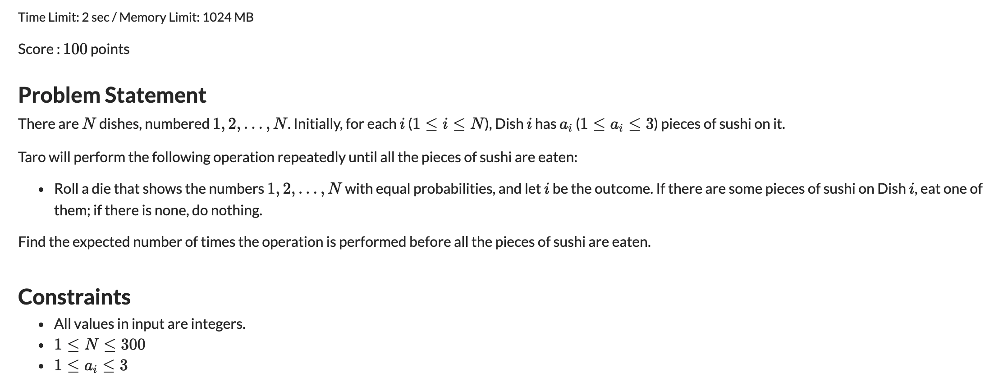
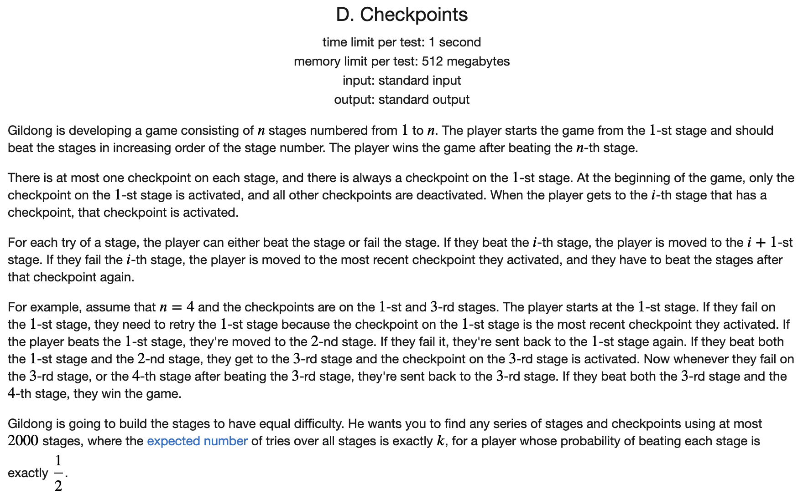
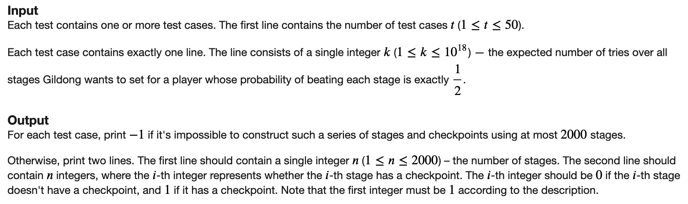
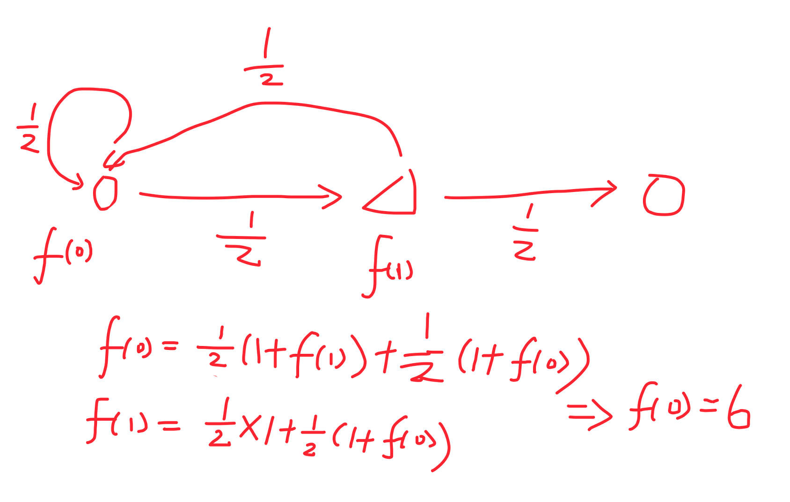
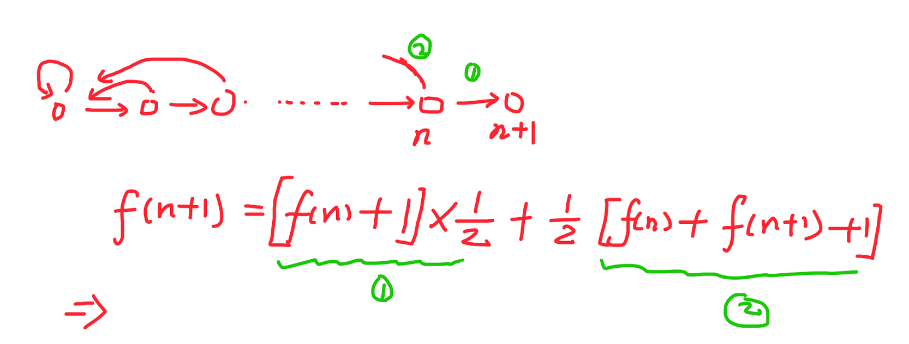
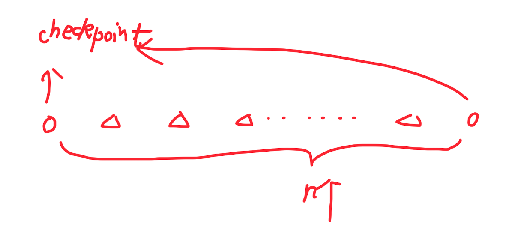

## 概率与数学期望

在算法竞赛中，通常有一类问题要求某个随机变量取得某个值的概率，或者某个随机变量的期望相关的问题。

这样的问题一般和动态规划结合较为紧密。

一般的问题可以抽象为求在有向无环图上其某个起点开始到达一个终止状态集合的步数的期望的模型。

假设处于状态$X$时，某个随机变量的期望为$E(X)$，然后这个状态有$p_i$的概率转移到状态$X_i$，转移的过程的代价为$w_i$

那么就有如下的公式:

$$E(X) = \sum_{i} p_i \times (E(X_i) + w_i)$$

然后进行DP即可。一般数学期望动态规划中，终止状态是初值，起始状态是要求的。所以可以采用记忆化搜索的方式来进行处理，会方便一些。或者在反向图上进行递推也可以。

### [绿豆蛙的归宿](https://www.acwing.com/problem/content/219/)

#### 解题思路

算是数学期望型动态规划的模板题。直接在图上进行递归即可。

#### C++代码

```c++
#include <iostream>
#include <cstring>
using namespace std;

const int N = 1e5 + 5, M = 2 * N;
int n, m;

int h[N], e[M], ne[M], w[M], idx;

double dp[N];


void add(int a, int b, int c) {
    e[idx] = b, ne[idx] = h[a], w[idx] = c, h[a] = idx ++;
}


double find(int a) {
    
    if (a == n) return 0;
    if (dp[a]) return dp[a];
    int cnt = 0;
    for (int i = h[a]; ~i; i = ne[i]) {
        int node = e[i];
        cnt ++;
        dp[a] += find(node);
        dp[a] += w[i];
    }
    dp[a] /= cnt;
    return dp[a];
}


int main() {
    
    memset(h, -1, sizeof h);
    cin >> n >> m;
    while (m --) {
        int a, b, c;
        cin >> a >> b >> c;
        add(a, b, c);
    }
    
    printf("%.2lf", find(1));
    return  0;

    
}
```

### [扑克牌](https://www.acwing.com/problem/content/220/)

#### 解题思路

首先思考如何描述当前所处的状态。

定义状态`dp[a][b][c][d][x][y]`表示手中有`a、b、c、d`张红桃、黑桃、方块、梅花。`x /y = 4`表示当前还没有拿到大小王。`x/y = i`表示拿到了大小王，且把大小王放到`i`表示的堆中的状态。

假设当前的状态为`a, b, c, d, x, y`。那么我们按照下一个拿到的牌来看当前状态可以转移到哪些状态。假设剩余的牌的数量是`sum`

$$dp[a, b, c, d, x, y] = \frac{13 - a}{54 - sum} \times dp[a + 1, b, c, d, x, y] + \frac{13 - b}{54 - sum} \times dp[a, b + 1 , c, d, x, y] + \frac{13 - c}{54 - sum} \times dp[a, b, c + 1, d, x, y] + \frac{13 - d}{54 - sum} \times dp[a, b, c, d + 1, x, y]$$

当然还需要考虑当前没拿到大小王，然后下一张牌拿到大小王的情况。这种情况的概率为$\frac{1}{54 - sum}$，然后我们从将拿到的大小王放到四堆中的四种状态的期望值中选择最小的即可。

$$\min_{0 \le i \le 3} dp[a, b, c, d, i, y]$$

在上述的转移过程中，最终合法的状态是一个集合。如果发现当前已经拿完了54张牌，但是还没有走到我们想要的状态，说明要求的状态不合法，直接返回正无穷即可。

#### C++

```c++
#include <iostream>
#include <cstring>
#include <cstdio>
using namespace std;

const int N = 14;
const double INF = 1e20;
double dp[N][N][N][N][5][5];
int A, B, C, D;

double find(int a, int b, int c, int d, int x, int y) {
    
    double &v = dp[a][b][c][d][x][y];
    if (v) return v;
    int sa = a + (x == 0) + (y == 0);
    int sb = b + (x == 1) + (y == 1);
    int sc = c + (x == 2) + (y == 2);
    int sd = d + (x == 3) + (y == 3);
    if (sa >= A && sb >= B && sc >= C && sd >= D) return v = 0;
    int sum = sa + sb + sc + sd;
    sum = 54 - sum; 
    if (sum <= 0) return v = INF;  // 上面没有返回，而且发现sum不大于零，说明要求到达的状态不合法。
    
    v = 1;
    // 枚举下一张牌抽到各种花色的情况
    if (a < 13) v += (13.0 - a) / sum * find(a + 1, b, c, d, x, y);
    if (b < 13) v += (13.0 - b) / sum * find(a, b + 1, c, d, x, y);
    if (c < 13) v += (13.0 - c) / sum * find(a, b, c + 1, d, x, y);
    if (d < 13) v += (13.0 - d) / sum * find(a, b, c, d + 1, x, y);
    
   // 还没有拿到大小王，然后下一张牌抽到大小王的情况
    if (x == 4) {
        double t = INF;
        for (int i = 0; i < 4; i ++) t = min(t, find(a, b, c, d, i, y));
        v += 1.0 / sum * t;
    }
    
    if (y == 4) {
        double t = INF;
        for (int i = 0; i < 4; i ++) t = min(t, find(a, b, c, d, x, i));
        v += 1.0 / sum * t;
    }
    return v;
}

int main() {
    
    cin >> A >> B >> C >> D;
    double ans = find(0, 0, 0, 0, 4, 4);
    if (ans > INF / 2) ans = -1;
    printf("%.3lf", ans);
    return 0;
}
```

### [increment of coins](https://atcoder.jp/contests/abc184/tasks/abc184_d)

#### 解题思路

比较经典的期望型动态规划。定义`dp[a][b][c]`为处在状态`(a, b, c)`的次数的期望。其有$\frac{a}{a + b + c}$的概率转移到状态`(a + 1, b, c)`，$\frac{b}{a + b + c}$的概率转移到状态`(a, b + 1, c)`，$\frac{c}{a + b + c}$的概率转移到`(a, b, c + 1)`。

边界情况就是a,b,c有一个不小于100.

#### C++代码

```c++
#include <iostream>
#include <cstdio>
using namespace std;

const int N = 105;

double dp[N][N][N];

double find(int a, int b, int c) {
	
	if (a == 100 || b == 100 || c == 100) return 0;
	double s = a + b + c;
	if (dp[a][b][c]) return dp[a][b][c];
	dp[a][b][c] = a / s * find(a + 1, b, c) 
				+ b / s * find(a, b + 1, c) 
				+ c / s * find(a, b, c + 1) + 1;
	return dp[a][b][c];
	
	
}

int main() {
	
	int a, b, c;
	cin >> a >> b >>c;
	printf("%.13f", find(a, b, c));
	return 0;
	
}
```

### [SUSHI](https://atcoder.jp/contests/dp/tasks/dp_j)



#### 解题思路

当前状态与盘子的位置没有关系，之和包含`0-3`个物品的盘子的个数有关。

定义状态`(a, b, c)`为当前有`a`个盘子中有1个物品，`b`个盘子有两个物品，`c`个盘子有三个物品。

`dp[a][b][c]`为状态`(a, b, c)`物品被拿完的步数的期望。那么按照下一步抽签抽到的盘子的类型来进行状态转移，有

$$dp[a][b][c] = \frac{a}{N} dp[a-1][b][c] + \frac{b}{N}dp[a + 1][b - 1][c] + \frac{c}{N}dp[a][b + 1][c - 1] + \frac{N - a - b - c}{N} dp[a][b][c] + 1.0$$

对上述表达式进行整理，有如下的形式

$$dp[a][b][c] = \frac{a}{a + b + c}dp[a-1][b][c] + \frac{b}{a + b + c}dp[a + 1][b - 1][c] + \frac{c}{a + b + c}dp[a][b + 1][c - 1] + \frac{N}{a + b + c}$$

当然上面的表达式中要求`a, b, c >= 1`

终止状态`dp[0][0][0] = 0`

然后进行记忆化搜索即可。

#### C++代码

```c++
#include <iostream>
#include <cstring>
using namespace std;

const int N = 305;

double dp[N][N][N];
int cnt[3];
int n;

// 记忆化搜索
double find(int a, int b, int c) {
	
	if (dp[a][b][c] >= 0) return dp[a][b][c];
	double res = n;
  // 实现上面的公式
	if (a > 0) res += find(a - 1, b, c) * a;
	if (b > 0) res += find(a + 1, b - 1, c) * b;
	if (c > 0) res += find(a, b + 1, c - 1) * c;
	dp[a][b][c] = res / (a + b + c);
	return dp[a][b][c];
}


int main() {
	
	
	cin >> n;
  // 初始化
	for (int i = 0; i <= n; i ++) {
		for (int j = 0; j <= n; j ++) {
			for (int k = 0; k <= n; k ++) {
				dp[i][j][k] = -1;
			}
		}
	}
	dp[0][0][0] = 0;
	for (int i = 0; i < n; i ++) {
		int a;
		cin >> a;
		cnt[a - 1] ++;
	}
	printf("%.13lf", find(cnt[0], cnt[1], cnt[2]));
	return 0;	
}
```

### [checkpoint](https://codeforces.com/contest/1453/problem/D)





#### 解题思路

这道题比较有意思。

首先我们观察，在跳跃的过程中，如果跳到了一个`checkpoint`的话，那么后面的状态不可能再回到之前的状态。所以这两部分可以看做是独立的。所以他们各自的跳跃次数的均值可以单独计算。

而且还可以观察到，如果所有的位置都是`checkpoint`的话，从前一个`stage`到后一个`stage`的步数的期望是2.

比较难处理的情况是，如果两个`checkpoint`中间夹杂着一些空白，该如何处理。

假设中间夹着`m`个空白的`checkpoint`跳跃次数的期望为`f[m]`，下面来计算。

先看`m=1`的情况。$f[1] = 6$



对于中间有`m`个节点的情况，我们可以采用递推的方法



即

$$f[n + 1] = \frac{1}{2}  \times (f[n] + 1) + \frac{1}{2} \times (f[n] + f[n + 1] + 1)$$

$$f[n + 1] = 2 \times (f[n] + 1)$$

又由于$f[1] = 1$，所以有

$$f[n] = 2 ^{n + 2} - 2$$

注意到两个相邻的`checkpoint`次数期望是2，所以对于下面的形式的摆放，需要跳跃的次数为$2^n$



由于我们可以凑出来任意一个2的幂次，所以只要个数足够，就可以凑出来任意一个数。

但是由于没有办法凑出来1，所以所有的奇数都是不可能的。

下面我们看2000够不够。

给的数据最大为`1e18`，二进制表示最多有60位。撑破天也没有到2000。所以对于任意一个偶数，都有解。

只需要找到其二进制表示，然后将所有的$2^n$构造出来一个上面的序列即可。

时间复杂度$O(\log k)$

#### C++代码

```c++
#include <iostream>
#include <vector>
using namespace std;

int main() {
	
	int t;
	cin >> t;
	while (t --) {
		long long a;
		cin >> a;
		if (a % 2) cout << -1 << '\n';
		else {
			int cnt = 0;
			vector<int> rec;
			for (int i = 1; i <= 61; i ++) {
				if ((a >> i) & 1) {
					cnt += i;
					rec.push_back(i);
				}
			}
			cout << cnt << '\n';
			for (auto x : rec) {
				cout << 1 << ' ';
				for (int i = 2; i <= x - 1; i ++) cout << 0 << ' ';
				if (x != 1) cout << 1 << ' ';
			}
			cout << '\n';
		}
	}
	return 0;
	
}
```

