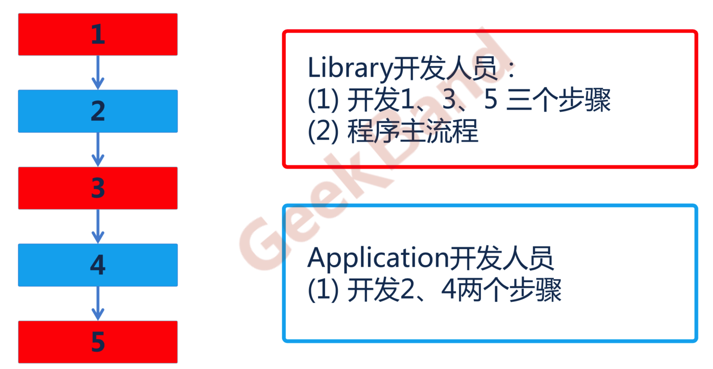
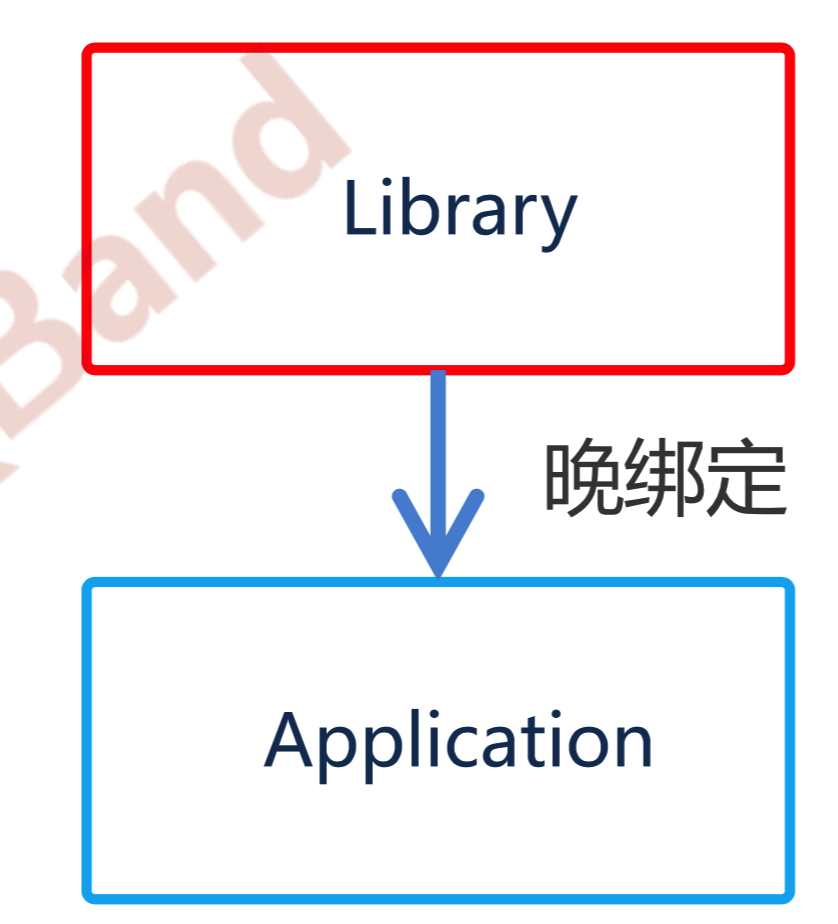
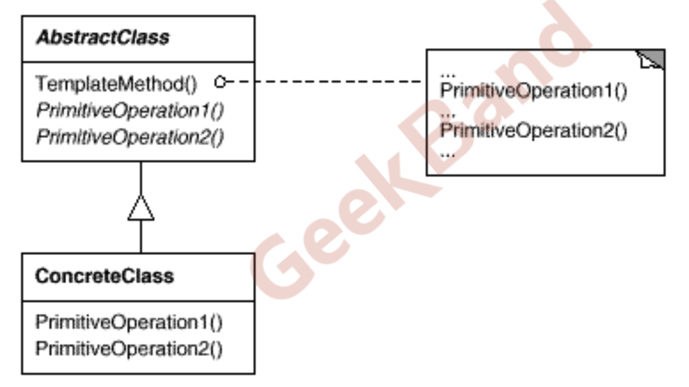

### 模板方法

在软件构建的过程中，对于一项任务，通常有稳定的整体操作结构，但各个子步骤有很多改变的需求，或者子任务无法与任务的整体结构同时实现。比如在开发框架的时候。

如何在确定操作结构的前提下，灵活应对各个子步骤的变化，或者晚期实现需求。

下面是一个例子。



在设计的时候，将主要的流程在框架中写好，然后将用户需要实现的函数留给开发人员来实现。

这里对应着C++中的虚函数机制。将晚期实现的方法申明为虚函数，然后用户实现自己的类，继承库提供的类，

并自定义具体的方法。再通过指针调用触发多态机制，从而正确调用自己实现的方法。



> 模板方法：定义一个操作中的算法的骨架(稳定)，将一些步骤延迟((变化))到子类中，使得子类可以不改变(复用)一个算法的结构即可重定义(override重写)该算法的某些特定步骤

其UML图如下所示：



### 总结

1. Template Method是非常基础的设计模式，用最简洁的机制(虚函数的多态性)，为很多应用程序框架提供了灵活的扩展点(继承、重写、指针调用)。

2. 实现了反向控制，之前是引用程序调用库提供的内容，现在是系统库调用应用程序提供的内容。
3. 具体实现，一般推荐将Template Method方法设置为`protected`方法。


### 实例代码

```c++
// 框架的代码，流出step2和step3留给子类实现
class Lib {

public:
    void run() {
        step1();
        step2();
        step3();
        step4();
    }

protected:
    virtual void step2() = 0;
    virtual void step3() = 0;

private:
    void step4() {std::cout << "finish!" << std::endl;}
    void step1() {std::cout << "start!" << std::endl;}

};

// 应用程序继承Lib，实现自定义的方法
class App : public Lib {

    void step2() {
        std::cout << "this is my step2" << std::endl;
    }
    void step3() {
        std::cout << "this is my step3" << std::endl;
    }
};

// 通过虚函数动态绑定机制，实现了正确的调用
int main() {

    Lib *lib = new App();
    lib->run();
    return 0;
}
```

