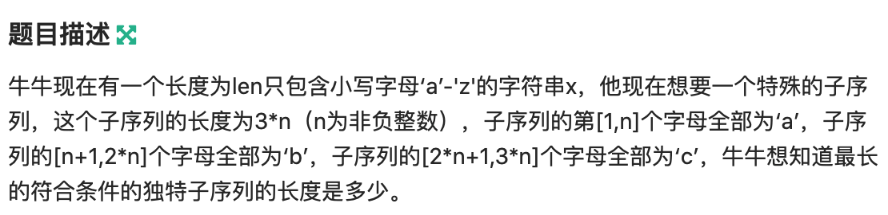
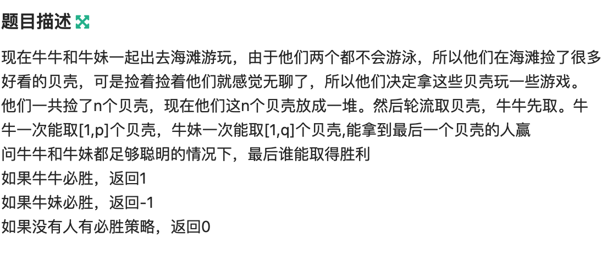

## [牛客巅峰赛题解](https://ac.nowcoder.com/acm/contest/9753)

### [A](https://ac.nowcoder.com/acm/contest/9753/A)



#### 解题思路

相当于将字符串分为三段，求第一段中`a`的个数，第二段中`b`的个数，第三段中`c`的个数的最小值。然后对所有的划分的最小值取一个最大值。

考虑枚举第一个分界点，然后第二个分界点向右移动的时候，`b`的个数是非递减的，`c`的个数是非递增的，找到两个的交点即可。

时间复杂度$O(n \log n$

#### C++代码

```c++
class Solution {
public:
    /**
     * 代码中的类名、方法名、参数名已经指定，请勿修改，直接返回方法规定的值即可
     * 
     * @param x string字符串 
     * @return int整型
     */
    
    static constexpr int N = 1e6 + 5;
    
    int q[N][3];
    
    int Maximumlength(string x) {
        // write code here
        int n = x.size();
        x = " " + x;

        for (int i = 1; i <= n; i ++) {
            q[i][0] = q[i-1][0];
            q[i][1] = q[i-1][1];
            q[i][2] = q[i-1][2];
            if (x[i] == 'a') q[i][0] ++;
            if (x[i] == 'b') q[i][1] ++;
            if (x[i] == 'c') q[i][2] ++;
        }
        int ans = 0;
        for (int i = 1; i <= n - 2; i ++) {
            int l = i + 1, r = n - 1;
            while (l < r) {
                int mid = l + r + 1 >> 1;
                if (q[n][2] - q[mid][2] >= q[mid][1] - q[i][1]) l = mid;
                else r = mid - 1;
            }
            if (q[n][2] - q[l][2] >= q[l][1] - q[i][1] && q[i][0] >= q[l][1] - q[i][1]) ans = max(ans, q[l][1] - q[i][1]);
        }
        return ans * 3;

    }
};
```

### [B](https://ac.nowcoder.com/acm/contest/9753/B)



#### 解题思路

首先如果`n`不大于`p`的话，牛牛必胜。

然后如果`p`和`q`不等的话，则大的胜。因为大的可以每次都拿走1个。如果当前大的没法全拿完的话，他拿走一个之后小的也没法拿完。

如果`p`和`q`相等的话，可以分析出来谁遇到了`p + 1`这种局面谁就输了。因为这个时候他不能赢，且不管他拿多少，对方都赢。那么我们考虑先手。那么我们可以每次都采取最优的策略，使得对手落到`p + 1`的倍数。这样它不管拿多少，我都可以让他继续是`p + 1`的倍数。所以如果先手是`p + 1`的倍数的话，必败，否则必胜。

#### C++代码

```c++
class Solution {
public:
    /**
     * 
     * @param n int整型 
     * @param p int整型 
     * @param q int整型 
     * @return int整型
     */
    int Gameresults(int n, int p, int q) {
        // write code here
        if (n <= p) return 1;
        else {
            if (p > q) return 1;
            else if (p < q) return -1;
            else if ((n % (p + 1)) == 0) return -1;
            else return 1;
        }
    }
};
```

### [C](https://ac.nowcoder.com/acm/contest/9753/C)


#### 解题思路

我们可以考虑经过每个点的最长路径的长度是不是直径，如果是的话，说明这个点对答案有贡献。

然后跑一遍树形DP枚举路径最高点得到直径的长度。同时得到每个节点的到孩子的最长和第二长路，以及经过父节点的最长路径。取三者的最大的两个求和即得到了当前经过当前节点的最长路径的长度。

#### C++代码

```c++
class Solution {
public:
    /**
     * 代码中的类名、方法名、参数名已经指定，请勿修改，直接返回方法规定的值即可
     * 
     * @param n int整型 节点个数
     * @param u int整型vector 
     * @param v int整型vector 
     * @return int整型
       */
    static constexpr int N = 1e5 + 5;
    int le[N][3];  // le[i][0]表示i到孩子的最长路，1表示第二长路，3表示走父节点的最长路。
    int node[N][2]; // 记录最长路和第二长路是走哪个节点。
    int max_len;
    bool st[N];  // 记录每个节点是否有贡献

    vector<int> g[N];

    void dfs1(int cur, int fa) {
        for (auto x : g[cur]) {
            if (x == fa) continue;
            dfs1(x, cur);
            if (le[x][0] + 1 >= le[cur][0]) {
                le[cur][1] = le[cur][0];
                le[cur][0] = le[x][0] + 1;
                node[cur][1] = node[cur][0];
                node[cur][0] = x;
            } else if (le[x][0] + 1 > le[cur][1]) {
                le[cur][1] = le[x][0] + 1;
                node[cur][1] = x;
            }
        }
        max_len = max(max_len, le[cur][0] + le[cur][1]);
    }

    void dfs2(int cur, int fa) {
        if (cur == 1) le[1][2] = 0;
        else if (node[fa][0] == cur) le[cur][2] = max(le[fa][1], le[fa][2]) + 1;
        else le[cur][2] = max(le[fa][0], le[fa][2]) + 1;
        for (auto x : g[cur]) {
            if (x == fa) continue;
            dfs2(x, cur);
        }
    }

    void dfs3(int cur, int fa) {
        int t = min(min(le[cur][0], le[cur][1]), le[cur][2]);
        if (le[cur][0] + le[cur][1] + le[cur][2] - t == max_len) st[cur] = true;
        for (auto x : g[cur]) {
            if (x == fa) continue;
            dfs3(x, cur);
        }
    }

    int PointsOnDiameter(int n, vector<int>& u, vector<int>& v) {
        // write code here
        int m = u.size();
        for (int i = 0; i < m; i ++) {
            g[u[i]].push_back(v[i]);
            g[v[i]].push_back(u[i]);
        }
        dfs1(1, 0);
        dfs2(1, 0);
        dfs3(1, 0);
        int ans = 0;
        for (int i = 1; i <= n; i ++) {
            if (st[i])  ans ++;
        }
        return ans;
    }
};
```


