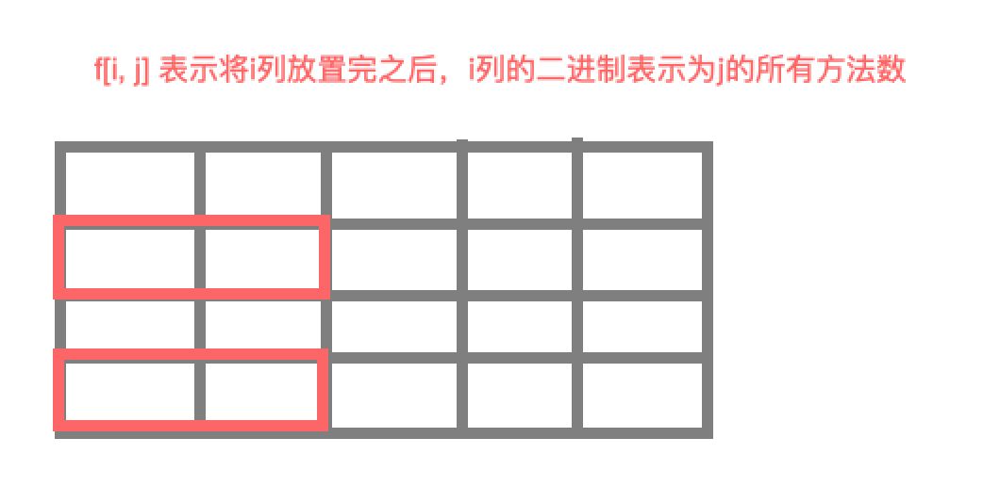

### 状态压缩DP

对于某些问题，我们需要在动态规划的状态中记录一个集合。保存某种“轮廓信息”，以便进行状态转移。若集合的大小不超过N，集合中的每个元素都是小鱼K的自然数，则可以将这种集合看做一个N位K进制数，以一个$[0, K^N-1]$之间的十进制整数的形式作为DP状态中的一维。**这种将集合转化为整数记录在DP状态中的一类算法，称为状态压缩动态规划算法**。

### 题目1 蒙德里安的梦想

[原题链接](https://www.acwing.com/problem/content/293/)

#### 解题思路

问题的主要难点是如何理清楚思路。首先只考虑水平放置的那些方块，因为如果我们把一种可行解的水平方块放置完成之后，整个放置情况也就结束了。那么如何求解所有水平方块可能的放置方法呢？

按照一列一列的顺序来进行填充。在考虑每一列的时候，我们只考虑这一列我们可以放置哪些水平的方块，而且保证结果是合法的。下面是一个例子。



假设我们现在在放置第二列，我们能够放置的水平的方块是将这个方块放进去，且方块的第二个格子在第2列上的情况。

上面第二列的状态就可以使用`0101`，也就是十进制的`5`来表示。

同时当前状态`j`能够由前一个状态`i`转移得来是否合理需要满足以下条件：

- `i & j` 必须为零。这是因为，`i & j`如果不是零，表示某一行上`i`是1且`j`是1。如果`i`是1的话，这一行就不能够塞进去方块了，所以`j`不可能是1。反之亦然。当然任意一行`i`和`j`可以都是0，也就是两者都不放。
- `i | j` 必须是合法的。我们先看`i | j` 代表的含义是什么，其每一位代表着某一行要不是前一列放上了方块，要不是当前行放上了方块。这两种情况都会使得前一列的这一行是被水平放置的方块填充了的。由于我们再放置后面的列的时候，前一列是不能够再水平的方块填充到了，所以我们必须保证前一列的所有的空下的位置，能够被竖着的方块铺满。所以`i | j` 的二进制表示中不能够有相邻的基数个零。否则就是不合法的。

这样我们在考虑每一列某种状态可能的转移数的时候，只需要遍历前一列的所有状态，然后看从前一列的某个状态转移到当前状态是否合法，如果合法，则加上前一列的那个状态所有可能的数目。

在确定了行数之后，所有合法的`i|j`我们可以提前预处理好，之后直接查表。我们列从下标0开始。初始情况是，`dp[0][0] =  1`， 其余为零。因为我们再放置第一列的时候，只能什么都不放，不能突破方框放到外面去。然后考虑第二列的时候就可以直接利用上面的转移方法进行处理。最终返回`dp[m][0]`，也就是第`m`列啥都不放也合法的种类数。


**时间复杂度**:一共m列，每列的每一个状态都要遍历前一列的所有状态。所以时间复杂度是$O(2^N * 2^N * M) = O(M * 4 ^N)$

**空间复杂度**:一共需要$O(M*2^N)$个状态存储，当然由于某一列的状态只依赖前一时刻的状态，所以空间复杂度可以优化为$O(2^N)$。预处理记录是否合法也需要$O(2^N)$，所以一共需要$O(2^N)$的空间复杂度。

#### c++代码

```c++
#include<iostream>
using namespace std;
const int N = 12;
bool ok[1 << N];   // 记录是否合法
long long dp[N][1 << N];   // 用于保存状态对应的方法数
int n, m;

int main(){    
    while(true){
        cin >> n >> m;
        if(n == 0 && m == 0) return 0;
      // 判断某个状态是否合法，由于对于不同的n来说，同一个状态可能合法可能不合法，所以每次读取都要计算一下
        for(int i = 0; i < 1 << n; i ++){
            ok[i] = true;
            bool cnt = 0;
            for(int j = 0; j < n; j ++){
                if( (i & (1 << j)) == 0){
                    cnt ^= 1;  // 由于只需要记录连续0的奇偶，所以只需要对最后一位取异或即可，不需+1
                }else{
                    if(cnt){
                        ok[i] = false;  // 奇则返回
                        break;
                    }
                }
            }
            if(cnt) ok[i] = false;
        }   
        dp[0][0] = 1;  // 初始状态
        for(int i = 1; i <= m; i ++){
            for(int j = 0; j < 1 << n; j ++){
                dp[i][j] = 0;
                for(int k = 0; k < 1 << n; k ++)
                    if((j & k) == 0 && ok[j | k]) dp[i][j] += dp[i-1][k];  // 合法则转移
            } 
        }
        cout << dp[m][0] << endl; // 输出最终结果
    }
    return 0;
}
```

### 题目2 每个元音包含偶数次的最长子字符串

[原题链接](https://leetcode-cn.com/problems/find-the-longest-substring-containing-vowels-in-even-counts/)

#### 解题思路

由于只需要考虑每个元音字符出现偶数次的状态，可以使用五位来表示到当前位置每个字符出现的次数是奇数还是偶数。

然后找这个状态第一次出现的位置，相减取最大即可得到最长。

**时间复杂度O(N)， 空间复杂度O(1)**s

#### Python代码

```c++
class Solution:
    def findTheLongestSubstring(self, s: str) -> int:
        dp = [float('-inf')] * 33
        dp[0] = -1
        aa = 0
        res = 0
        for i, char in enumerate(s):
            if char == "a":
                aa ^= (1 << 0)
            elif char == "e":
                aa ^= (1 << 1)
            elif char == "i":
                aa ^= (1 << 2)
            elif char == "o":
                aa ^= (1 << 3)
            elif char == "u":
                aa ^= ( 1 << 4)
            if dp[aa] != float('-inf'):
                res = max(res, i - dp[aa])
            else:
                dp[aa] = i
        print(dp)
        return res
```

### 题目3 参加考试的最大学生数

[题目链接](https://leetcode-cn.com/problems/maximum-students-taking-exam/)

#### 解题思路

由于每一行排放只受到前一行的排列情况的影响，所以可以使用动态规划来做。每一行每个位置做人的情况可以使用位来表示，

1表示当前位置坐了人，0表示空位。同时对于座椅的情况，也可以把每一行的情况表示成一个二进制数。1表示不可以做，0表示可以做。

`dp[i][j]`表示摆放到第i行，且第i行摆放的状态为j时，所有安置的学生的最大数。

对于每一行，其可行的状态需要满足以下条件：

- 这一行1的左右不能有1
- 上一行的状态和当前状态对应的左右不能有1
- 这一行状态有1的位置，座位的表示不能有1。

上述操作都可以使用位运算高效地处理。(当然对于每一行其状态不一定非常枚举所有的情况，也可以根据座位的二进制表示来枚举其子集，具体做法学习后补充)

状态转移方程

$$dp[i][j] = max(dp[i][j], dp[i-1][k] + count_1(j))$$ 对于所有合法的`j,k`组合。

#### python代码

```python
class Solution:
    def maxStudents(self, seats) -> int:

        def pro_seats():  # 预处理每一行座位，表示为数，1对应不可坐
            s = [0]
            for x in seats:
                t = 0
                for i, y in enumerate(x):
                    if y == "#":
                        t |= (1 << i)
                s.append(t)
            return s

        def count_1(x):  # 统计x的二进制表示中的1的个数
            res = 0
            while x:
                res += 1
                x -= (x & -x)
            return res

        def ok(x, y, z):  # 判断是否合法，x表示当前行的状态，y表示上一行的状态，z表示当前行的座位表示
            return (x & z) == 0 and (x << 1) & x == 0 and (x >> 1) & x == 0 and (x << 1) & y == 0 and (x >> 1) & y == 0

        s = pro_seats()
        n = len(seats)
        res = 0
        if n == 0:
            return 0
        m = len(seats[0])
        if m == 0:
            return 0
        dp = [[0] * (1 << m) for _ in range(n + 1)]
        for i in range(1, n + 1):  # 遍历每一行
            for j in range(1 << m):   # 遍历每一行的每一个状态
                for k in range(1 << m):  # 遍历上一行的每一个状态
                    if ok(j, k, s[i]):  # 合法，则取最大
                        dp[i][j] = max(dp[i][j], dp[i - 1][k] + count_1(j))  # count_1可以放在前面算好，避免冗余计算
                res = max(res, dp[i][j])  # 维护最大值返回
        return res
```

使用位运算优化版本

```python
class Solution:
    def maxStudents(self, seats) -> int:

        def pro_seats():
            s = [0]
            for x in seats:
                t = 0
                for i, y in enumerate(x):
                    if y == ".":
                        t |= (1 << i)
                s.append(t)
            t = []
            for x in s:  # 将每一行按照位置合法的状态枚举出来
                tmp = [x]
                tt = x
                tt = (tt - 1) & x
                while tt != x:
                    tmp.append(tt)
                    tt = (tt - 1) & x
                t.append(tmp)
            return s, t

        def count_1(x):
            res = 0
            while x:
                res += 1
                x = x & (x - 1)
            return res

        def ok(x, y):
            return (x << 1) & x == 0 and (x << 1) & y == 0 and (x >> 1) & y == 0

        s, t = pro_seats()
        n = len(seats)
        res = 0
        if n == 0:
            return 0
        m = len(seats[0])
        if m == 0:
            return 0
        dp = [[0] * (1 << m) for _ in range(n + 1)]
        for i in range(1, n + 1):
            for j in t[i]:  # 遍历每一行合法的状态
                for k in t[i-1]:  # 遍历上一行合法的状态
                    if ok(j, k):
                        dp[i][j] = max(dp[i][j], dp[i - 1][k] + count_1(j))
                res = max(res, dp[i][j])
        return res
```

### 题目4 最短Hamilton路径

[题目链接](https://www.acwing.com/problem/content/submission/code_detail/1311032/)

#### 思路

TODO

#### C++代码

```c++
#include<iostream>
#include<cstring>

using namespace std;

const int N = 20, M = 1 << N;
int dp[M][N];
int w[N][N];
int n;

int main(){
    
    cin >> n;
    for(int i = 0; i < n; i ++)
        for(int j = 0; j < n; j ++)
            cin >> w[i][j];
            
    memset(dp, 0x3f, sizeof(dp));
    dp[1][0] = 0;
    for(int i = 1; i < 1 << n; i ++){
        for(int j = 0; j < n ; j ++){
            if( (i >> j) & 1){
                for(int k = 0; k < n; k ++){
                    if(((i ^ (1 << j))  >> k) & 1){
                        dp[i][j] = min(dp[i][j], dp[i ^ (1 << j)][k] + w[k][j]);
                    }
                }
            }
        }
    }
    cout << dp[(1 << n) - 1][n-1];
    return 0;
}
```

