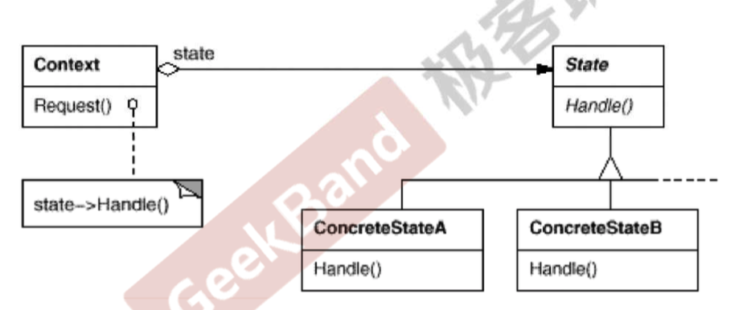

## 状态模式

一个对象的状态发生改变，其行为也会随之而发生变化，比如文档处于只读状态，其支持的行为和读写状态支持的行为就可能完全不同。

如何更具对象的状态变化透明地修改对象的行为。

>状态模式允许一个对象在其内部状态改变时改变他的行为，从而使对象看起来似乎修改了其行为。

具体的操作可以类比状态机。将每个状态执行的动作封装到各个状态中，然后各个状态维护一个`next`指针，在各个动作中通过设置自己的`next`指针，从而实现外界切换状态的效果。

### 代码实例

考虑一个网络处理类，执行完一个操作之后需要根据当前状态切换为其它状态。可以使用如下的方式

```c++
enum NetworkState {
    Network_Open,
    Network_Close,
    Network_Connect
};

class NetworkProcesser {
private:
    NetworkState state;

public:

    NetworkProcesser(NetworkState networkState) : state(networkState) {}

    void operation1() {
        if (state == Network_Open) {
            std::cout << "curent state is open" << std::endl;
            state = Network_Close;
        } else if (state == Network_Close) {
            std::cout << "curent state is close" << std::endl;
            state = Network_Connect;
        } else {
            std::cout << "curent state is connect" << std::endl;
            state = Network_Open;
        }
    }

    void operation2() {
        if (state == Network_Open) {
            std::cout << "curent state is open" << std::endl;
            state = Network_Connect;
        } else if (state == Network_Close) {
            std::cout << "curent state is close" << std::endl;
            state = Network_Open;
        } else {
            std::cout << "curent state is connect" << std::endl;
            state = Network_Close;
        }
    }
};

```

其中充斥着大量的`if/else`语句。

可以利用状态模式修改为如下的形式

```c++
class NetworkState {
public:
    NetworkState* pNext;
    virtual void opetation1() = 0;
    virtual void operation2() = 0;
    virtual ~NetworkState() = default;
};

class OpenState: public NetworkState {
private:
    OpenState() = default;
    ~OpenState() = default;
    OpenState(const OpenState& rhs) = default;
    OpenState&  operator=(const OpenState& rhs) = default;
    static NetworkState* m_instance;  // 实现饿汉单例模式
public:

    static NetworkState* getInstance() {
        return m_instance;
    }

    virtual void opetation1() {
        std::cout << "curent state is open" << std::endl;
        // do some thing
        pNext = CloseState::getInstance();  // 不同的操作将pNext修改为不同的指针
    }

    virtual void operation2() {
        std::cout << "curent state is open" << std::endl;
        pNext = ConnectState::getInstance();
    }

};
NetworkState* OpenState::m_instance = new OpenState;

class ConnectState: public NetworkState {
private:
    ConnectState() = default;
    ~ConnectState() = default;
    ConnectState(const ConnectState& rhs) = default;
    ConnectState&  operator=(const ConnectState& rhs) = default;
    static NetworkState* m_instance;  // 实现饿汉单例模式
public:


    static NetworkState* getInstance() {
        return m_instance;
    }

    virtual void opetation1() {
        std::cout << "curent state is open" << std::endl;
        // do some thing
        pNext = OpenState::getInstance();
    }

    virtual void operation2() {
        std::cout << "curent state is open" << std::endl;
        pNext = CloseState::getInstance();
    }

};

NetworkState* ConnectState::m_instance = new ConnectState;

class CloseState: public NetworkState {
private:
    CloseState() = default;
    ~CloseState() = default;
    CloseState(const CloseState& rhs) = default;
    CloseState&  operator=(const CloseState& rhs) = default;
    static NetworkState* m_instance;  // 实现饿汉单例模式
public:


    static NetworkState* getInstance() {
        return m_instance;
    }

    virtual void opetation1() {
        std::cout << "curent state is open" << std::endl;
        // do some thing
        pNext = ConnectState::getInstance();
    }

    virtual void operation2() {
        std::cout << "curent state is open" << std::endl;
        pNext = OpenState::getInstance();
    }

};

NetworkState* CloseState::m_instance = new CloseState;


// 外界操作类
class NetWorkProcessor {
private:
    NetworkState* state;

public:

    NetWorkProcessor(NetworkState* networkState): state(networkState) {}

    void operation1() {
        state->opetation1();  // 执行完操作之后，就将状态设置为下一个状态
        state = state->pNext;
    }

    void operation2() {
        state->operation2();
        state = state->pNext;
    }

};
```

上面的代码就实现了对修改封闭，对扩展开放的效果。

### UML



### 总结

1. 状态模式将所有与一个特定状态相关的行为放入了一个State的子类中，在对象状态切换时，切换相应的对象，但同时维持State的接口，实现了具体操作和状态转换之间的解耦。

2. 为不同的状态引入不同的对象使得状态转换变得更加明确，而且可以保证不会出现状态不一致的情况。

3. 如果State对象没有实例变量，那么各个上下文可以共享同一个State对象，从而节省对象开销。

   