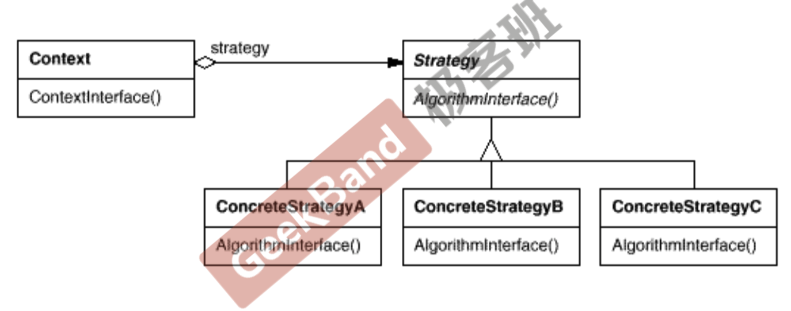

### 策略模式

某个对象可能需要根据某些属性来选择不同的算法，而且进场改变。如果将这些算法都编码到对象中，会使对象变得异常复杂。能够在运行时根据需要透明地更改对象的算法？也就是将算法的部分抽象出来。将算法和对象本身解耦。

> 策略模式是，定义一系列算法，将他们一个个封装起来，并且使他们可互相替换(可变)。该模式使得算法可独立于使用它的客户程序(稳定)而变化(扩展，子类化)。

也就是，顶层是稳定的，但是底层是易变的，加入一个抽象层，将其解耦？

整体的UML图如下所示：



在具体的操作时：

1. 顶层类符合一个依赖的策略类，这个策略类是一个抽象类，将顶层类调用的方法声明为虚函数
2. 不同的策略继承抽象的策略类，并实现对应的虚函数，自定义自己的策略。
3. 顶层类通过多态机制，能够正确调用传入的具体策略类的方法。

### 总结

1. Strategy及其子类为组件提供了乙烯类可重用的算法，从而可以使得类型在运行时方便的根据需要在各个算法之间进行切换。
2. 策略模式提供了**用条件判断**语句以外的另一种选择，消除条件判断语句，就是在解耦合。含有许多条件判断语句的代码通常都要用策略模式。相当于是将所有分治的共同的操作抽象出来，放到顶层的函数中，然后将易变的部分抽象出来，放到底层类中，然后将他们用一个抽象类进行连接起来。(想想设计原则第一个是如何实现解耦的。)
3. 如果Strategy没有实例变量，可以使用单例模式。

### 代码实例

一个机器要在不同的国家说不同的话，第一种实现方式是在机器中存储一个属性表示其在的国家，然后再大招胡的方法中判断国家，来说不同的话，代码如下：

```c++
enum Country {CHINA, USA, JAPAN, CANADA};


class Machine {

public:

    Machine(Country _country) : country(_country){}
    void say_hi() {
        if (country == Country::CHINA) std::cout << "你好" << std::endl;
        else if (country == Country::USA) std::cout << "Hello" << std::endl;
        else std::cout << "other country" << std::endl;
    }

private:
    Country country;
};
```

现在考虑我们需要增加新的国家，那么需要改动几个地方：

1. 需要修改枚举类
2. 需要修改`say_hi`函数，增加多个`if/else`

这违反了，设计原则中的开放封闭原则，对扩展开发，对修改封闭。

分析上面的不变的部分和易变的部分。

在机器的方法中，`say_hi`都会输出对应国家的对应的打招呼的话。共同的操作都会说一段话，不同的是话的内容。

我们可以将改变的部分放到不同的子类中，这样就得到了如下的代码

```c++
// 抽象类，用于解耦
class Countries{
public:
    virtual void say_hi() = 0;
};

// 定义子策略类，实现自己的方法
class China : public Countries {
public:
    void say_hi() {
        std::cout << "你好" << std::endl;  // 将易变的部分放到子类中
    }
};

// 定义子策略类，实现自己的方法
class USA : public Countries {
public:
    void say_hi() {
        std::cout << "hello" << std::endl;
    }
};

// NewMachine类完全看不到具体的子类，其实通过和抽象类打交道，然后利用多态特性来实现正确调用子类的方法的
class NewMachine {
public:
    NewMachine(Countries* _countries) : countries(_countries) {}  // 构造的时候传如一个抽象类或其子类。
    ~NewMachine() {delete countries;}
    void say_hi() {countries->say_hi();}  // 在函数中通过多态机制调用正确的方法
private:
    Countries* countries;  // 组合一个抽象类，稳定
};
```

