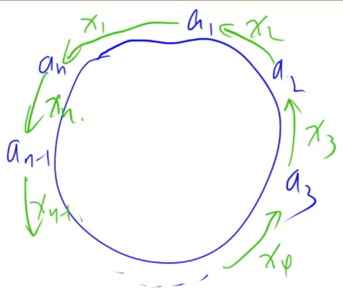
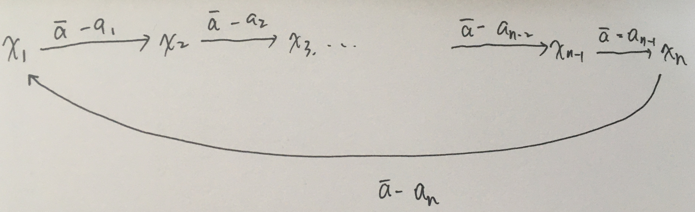

### 费解的开关

[原题链接](https://www.acwing.com/problem/content/97/)

#### 解题思路

首先对于一个位置的开关而言，按两次是没有任何作用的，所以每个位置的开关只会被按一次。

其次，当第一行的状态确定之后，后面的状态就都确定了。因为第一行的结果会决定第二行哪些开关被按，

第`i`行的状态会决定第`i + 1`行的那些开关被按。第`i`行的第`j`列为零，则第`i + 1`行第`j`列的开关一定要被按。

这样递推之后，看最后一行是不是全是1即可。

#### C++代码

```c++
#include <iostream>
#include <cstring>
using namespace std;
using namespace std;

const int N = 6;

int st[5], st_b[5];

int dx[5] = {-1, 0, 0, 0, 1}, dy[5] = {0, -1, 0, 1, 0};

void turnon(int x, int y) {
    
    for (int i = 0; i < 5; i ++) {
        int a = x + dx[i], b = y + dy[i];
        if (a < 0 || a > 5 || b < 0 | b >= 5) continue;
        if (st[a] >> b & 1) st[a] -= (1 << b);
        else st[a] += 1 << b;
    }
}

int main() {
    
    int n;
    cin >> n;
    while (n --) {
        
        int res = 10;
        for (int i = 0; i < 5; i ++) {
            int t = 0;
            for (int j = 0; j < 5; j ++) {
                char c;
                cin >> c;
                t = t * 2 + c - '0';
            }
            st_b[i] = t;
        }
        // 枚举第一行的所有可能的操作
        for (int i = 0; i < 32; i ++) {
            for (int j = 0; j < 5; j ++) st[j] = st_b[j];
            int cnt  = 0;
            // 对第一行进行操作
            for (int j = 0; j < 5; j ++) {
                if ((i >> j) & 1) {
                    turnon(0, j);
                    cnt ++;
                }
            }

            // 枚举第0-3行，推出第1~4行的操作
            for (int j = 0; j < 4; j ++) {
                for (int k = 0; k < 5; k ++) {
                    if (!((st[j] >> k) & 1)) {
                        turnon(j + 1, k);
                        cnt ++;
                    }
                }
            }
            
            if (st[4] == 31) res = min(res, cnt); 
        }
        // cout << res << endl;
        if (res > 6) res = -1;
        cout << res << endl;
    }
    return 0;
    
}
```

### 约数之和

[原题链接](https://www.acwing.com/problem/content/99/)

#### 解题思路

先对A进行素因数分解，就可以得到A的B次幂的分解，然后再利用约数之和公式即可。

这里的难点是如何计算下面的表达式

$$f(a, b) = 1 + a^1 + a^2 + ... + a^b$$

采用分治的思想，假设b为奇数，也就是一共有偶数项：

$$f(a, b) = f(a, \frac{b}{2}) * (1 + a ^ {\frac{b + 1}{2}})$$

当`b`为偶数时，使用快速幂将最后一项单独计算即可。

#### C++代码

```c++
#include <iostream>
using namespace std;

const int p = 9901;

int qmi(int a, int b) {
    
    int res = 1;
    a %= p;  // 注意先取模！！ 不然后面a * a 可能会爆int！！！
    while (b) {
        if (b & 1) res = res * a % p;
        a = a * a % p;
        b >>= 1;
    }
    return res;
    
}

// 计算a的零次幂到b次幂的和
int f(int a, int b) {
    
    if (!b) return 1;
    if (b % 2 == 0) return (f(a, b - 1) + qmi(a, b)) % p;  // 分治法
    else return (1 + qmi(a, b / 2 + 1)) * f(a, b / 2) % p;
}

int main() {
    
    int a, b;
    cin >> a >> b;
    
    int res = 1;
    for (int i = 2; i <= a / i; i ++) {
        if (a % i == 0) {
            int cnt = 0;
            while (a % i == 0) {
                cnt ++;
                a /= i;
            }
            res *= f(i, b * cnt);
            res %= p;
        }
    }
    if (a > 1) res = res * f(a, b) % p;
    if (a == 0) cout << 0;
    else cout << res;
    return 0;  
}
```

### 特殊排序

[原题链接](https://www.acwing.com/problem/content/115/)

#### 解题思路

这道题使用的是插入排序的思想。下面证明。

假设现在已经有一个序列满足相邻元素是有序的。那么选择当前序列的中点`mid`

1. 如果当前元素比中点元素小，则左侧一定可以找到一个插入的位置。
2. 如果当前元素比中间元素大，则右侧一定可以找到一个合适的插入位置。

可以使用反证法。第一种情况，假设不存在插入位置，由于已经比`mid`小了，`mid`左边的元素，如果比它大，则可以插入，否则再看左边的元素。如果比最左边的都小，则直接插入最左侧即可。第二种情况一样。

二分的时候需要想清楚二分的是什么，哪个边界没有办法遍历到。这里二分的是元素插入之后所在的下标。

- 如果要插入的元素比当前元素小，则要插入的元素的小标是**小于等于**当前下标的
- 如果比当前元素大，则插入的下标是严格大于当前下表的

所以是 `r = mid`, `l = mid + 1, mid = l +  r >>1`

上述`mid`的选择方式没有办法判断区间最右侧的一个元素，所以可以直接在枚举的时候将区间向右扩大一位，从而避免边界特判。

#### C++代码

```c++
// Forward declaration of compare API.
// bool compare(int a, int b);
// return bool means whether a is less than b.

class Solution {
public:
    vector<int> specialSort(int N) {
        vector<int> ans(1, 1);
        for (int i = 2; i <= N; i ++) {
            int l = 0, r = ans.size() - 1;
            while (l < r) {
                int mid = l + r >> 1;
                if (compare(i, ans[mid])) r = mid;
                else l = mid + 1;
            }
            if (l == ans.size() - 1 && compare(ans[l], i)) ans.push_back(i);  // 边界情况，如果i比所有的都大，则放到最后即可
            else {
                ans.push_back(i);
                for (int j = ans.size() - 2; j >= l; j --) swap(ans[j], ans[j + 1]);
            }
        }
        return ans;
    }
};

// 避免边界特判的代码
// Forward declaration of compare API.
// bool compare(int a, int b);
// return bool means whether a is less than b.

class Solution {
public:
    vector<int> specialSort(int N) {
        vector<int> ans(1, 1);
        for (int i = 2; i <= N; i ++) {
            int l = 0, r = ans.size();
            while (l < r) {
                int mid = l + r >> 1;
                if (compare(i, ans[mid])) r = mid;
                else l = mid + 1;
            }
            ans.push_back(i);
            for (int j = ans.size() - 2; j >= l; j --) swap(ans[j], ans[j + 1]);
        }
        return ans;
    }
};
```

### 糖果传递

[原题链接](https://www.acwing.com/problem/content/124/)

#### 解题思路

可以分析出来，相邻两个人之间是不会进行多次双向传递糖果的，因为那样可以转为一次传递，而且代价更低。(我给你，你给我，可以转为一次)

那么假设如下图所示的传递方向，$x_i$可以是负数。设$\bar{a}$为所有人拥有的糖果数的平均数。则有如下的方程



$$a_1 - x_1 + x_2 = \bar{a}$$

$$a_2 - x_2 + x_3 = \bar{a}$$

$$...$$

$$a_n - x_n + x_1 = \bar{a}$$

对上述方程进行变形有：

$$x_2 -x_1 = \bar{a} - a_1$$

$$x_3 - x_2 = \bar{a} - a_2$$

$$x_1 - x_n = \bar{a} - a_n$$

上述对应一个差分方程，可以转为如下的图的表示



我们的目标函数是最小化下面的等式：

$$\min_{x1, x2, ..., x_n}\sum_{i=1}^{n}|x_i|$$

上述的差分方程是无法解出一组解的，因为有`n`个未知数，`n-1`个独立方程。

可以将$x_1$看做已知量，然后其他变量都用$x_1$表示，最终要最小化的目标函数就转为了$x_1$的函数。最终求解即可。

不难可以得到如下的解：

$$x_1 = x_1$$

$$x_2 = x_1 - (a_1 - \bar{a})$$

$$x_3 = x1 - (a_1 + a_2 - 2 \bar{a})$$

$$x_i = x_1 - (a_1 + a_2 + ... + a_{i-1} - (i-1) * \bar{a})$$

$$...$$

$$x_n = x_1 - (a_1 + a_2 + ... + a_{n-1} - (n-1) * \bar{a})$$

所以现在的最小化目标函数为如下的形式：

$$|x_1| + |x_1 - t_2| + |x_1 - t_3| + ... + |x_1 - t_i| + ... + |x_1 - t_n|$$

这就转化为了绝对值不等式！！！

上述的$x_1$可以是任意值，可以看做如果一圈的人都加上一个常量，那么传递的结果是大家还是都能够最终糖果是相等的。

代码就非常简单了。

#### C++代码

```c++
#include <iostream>
#include <algorithm>
using namespace std;
typedef long long LL;
const int N = 1e6 + 10;

LL s[N], c[N];

int main() {
    
    int n;
    cin >> n;
    for (int i = 1; i <= n; i ++) {
        cin >> s[i];
        s[i] += s[i-1];
    }
    LL  avg = s[n] / n;
    c[1] = 0;
    for (int i = 2; i <= n; i++) c[i] = s[i-1] - avg * (i - 1);
    sort(c + 1, c + 1 + n);
    LL res = 0;
    for (int i = 1; i <= n; i ++) {
        res += abs(c[i] - c[1 + n >> 1]);
    }
    cout << res << endl;
    return 0;
    
}
```

### 七夕祭

[原题链接](https://www.acwing.com/problem/content/107/)

#### 解题思路

首先可以发现在行内传递不会影响到行的结果，同样列也是一样，所以可以将问题转为行列两个独立的问题进行求解。

在单个问题上，其实就是上面的糖果传递问题！解之即可。

#### C++代码

```c++
#include <iostream>
#include <algorithm>
using namespace std;

typedef long long LL;
const int N = 100010; 
int row[N], col[N], s[N], c[N];

LL work(int q[], int n) {
    
    for (int i = 1; i <= n; i ++) s[i] = s[i - 1] + q[i];
    if (s[n] % n != 0) return -1;
    int avg = s[n] / n;
    c[1] = 0;
    for (int i = 2; i <= n; i ++) c[i] = s[i - 1] - (i - 1) * avg;
    sort(c + 1, c + 1 + n);
    LL res = 0;
    for (int i = 1; i <= n; i ++) res += abs(c[i] - c[(n + 1) / 2]);
    return res;
}

int main() {
    
    int n, m, t;
    cin >> n >> m >> t;
    while (t --) {
        int x, y;
        cin >> x >> y;
        row[x] ++;
        col[y] ++;
    }
    
    LL ans_r = work(row, n);
    LL ans_c = work(col, m);
    if (ans_r == -1 && ans_c == -1) cout << "impossible";
    else if (ans_r != -1 && ans_c == -1) cout << "row " << ans_r;
    else if (ans_r == -1 && ans_c != -1) cout << "column " << ans_c;
    else cout << "both " << ans_r + ans_c;
    return 0;
    
}
```

### 动态中位数

[原题链接](https://www.acwing.com/problem/content/108/)

#### 解题思路

动态维护一个大根堆一个小根堆，分别存储较小的一半数和较大的一半数。插入的时候保证两个堆中数的大小关系。然后

用维护两个堆中的元素个数即可。

#### C++代码

```c++
#include <iostream>
#include <queue>

using namespace std;


int main() {
    
    int p;
    cin >> p;
    while (p --) {
        
        priority_queue<int> b_heap;
        priority_queue<int, vector<int>, greater<int>> s_heap;
        int id, cnt;
        cin >> id >> cnt;
        cout << id << " " << (cnt + 1) / 2 << endl;
        int cout_num = 0;
        for (int i = 1; i <= cnt; i ++) {
            
            int t;
            cin >> t;
            if (s_heap.size() && t >= s_heap.top()) s_heap.push(t);
            else b_heap.push(t);
            while (s_heap.size() > b_heap.size()) {
                b_heap.push(s_heap.top());
                s_heap.pop();
            }
            while (b_heap.size() - s_heap.size() > 1) {
                s_heap.push(b_heap.top());
                b_heap.pop();
            }
            if (i & 1) {
                cout_num ++;
                cout << b_heap.top() << " ";
                if (cout_num % 10 == 0) cout << endl;
            }
        } 
        if (cout_num % 10 != 0) cout << endl;
    }
    return 0;
    
}
```

### 天才的记忆

[原题链接](https://www.acwing.com/problem/content/1275/)

#### 解题思路

1. 直接无脑套线段树。

2. 使用基于倍增思想的RMQ。先利用`Nlog(N)`的时间预处理好数组`f[i][j]`。`f[i][j]`表示以下标`i`开始的区间长度为$2^j$中的最大值。可以利用如下的递推公式来计算

   $$f[i][j] = max(f[i][j - 1], f[i + (1 << (j - 1))][j-1])$$

   边界情况为$f[i][0] = q[i]$

   一共有$n\log n$个状态，每个状态计算时间复杂度为常数，所以预处理的时间复杂度为$n \log n$

   然后在求`l ,r` 的最大值时，只需要找不大于区间长度`r - l + 1`的最大的2的整数次幂$2^k$

   每个长度对应的`k`可以先利用$O(n)$预处理出来。

   然后求左半段和右半段的最大值，再取最大值即可。

   $$max(l, r) = max(f[l][k], f[r - (1 << k) + 1][k])$$

   可以在常数实现查询。不过RMQ不支持修改操作。

#### C++代码

```c++
// RMQ算法
#include <iostream>
using namespace std;

const int N = 2e5 + 10;
int q[N];
int f[N][20];  //f[i][j]表示从i开始长度为2的j次幂的区间内的最大值
int t[N];  // t[i]表示log2(i)下取整的取值

int main() {
    
    int n;
    cin >> n;
    for (int i = 1; i <= n; i ++) cin >> q[i];
  	// 预处理f数组
    for (int i = 1; i <= n; i ++) f[i][0] = q[i];
    for (int j = 1; j < 20; j ++) {
        for (int i = 1; i + (1 << j) - 1 <= n; i ++) {
            f[i][j] = max(f[i][j - 1], f[i + (1 << (j - 1))][j-1]);
        }
    }
  	// 预处理长度对应的k
    for (int i = 0; (1 << i) <= n; i ++) {
        t[(1 << i)] = i;
    }
    for (int i = 2; i <= n; i ++) {
        if (!t[i]) t[i] = t[i-1];
    }
    
    int m;
    cin >> m;
    while (m --) {
        
        int l, r;
        cin >> l >> r;
        int len = r - l + 1;
      	// 0(1)时间查询
        cout << max(f[l][t[len]], f[r - (1 << t[len]) + 1][t[len]]) << endl;
    }
    return 0;
    
}

// 线段树
#include <iostream>
using namespace std;
typedef long long LL;
const int N = 2e5+10;

struct Node{
    int l, r;
    LL ma;
}tr[4 * N];
LL q[N];

void pushup(int u) {
    
    tr[u].ma = max(tr[u << 1].ma, tr[u << 1 | 1].ma);
    
}

void build(int u, int l, int r) {
    
    tr[u].l = l;
    tr[u].r = r;
    if (l == r) tr[u].ma = q[l];
    else {
        int mid = l + r >> 1;
        build(u << 1, l, mid);
        build(u << 1 | 1, mid + 1, r);
        pushup(u);
    }
}

LL query(int u, int l, int r) {
    
    if (l <= tr[u].l && r >= tr[u].r) return tr[u].ma;
    int mid = tr[u].l + tr[u].r >> 1;
    LL ans = -2e18;
    if (l <= mid) ans = max(ans, query(u << 1, l, r));
    if (r > mid) ans = max(ans, query(u << 1 | 1, l, r));
    return ans;
}

int main() {
    
    int n;
    cin >> n;
    for (int i = 1; i <= n; i ++) cin >> q[i];
    build(1, 1, n);
    int m;
    cin >> m;
    while (m --) {
        int l, r;
        cin >> l >> r;
        cout << query(1, l, r) << endl;
    }
    return 0;
}
```

