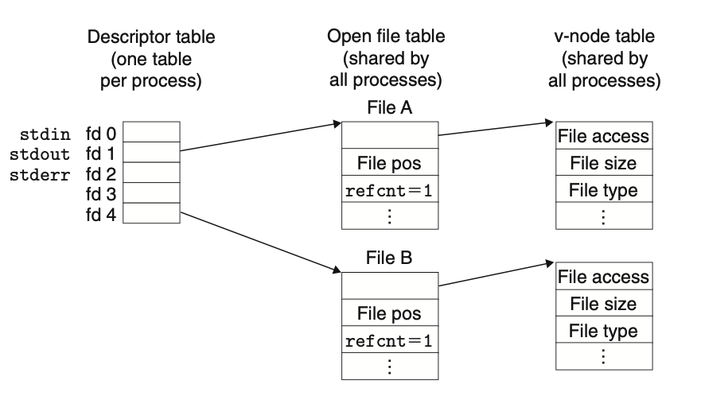
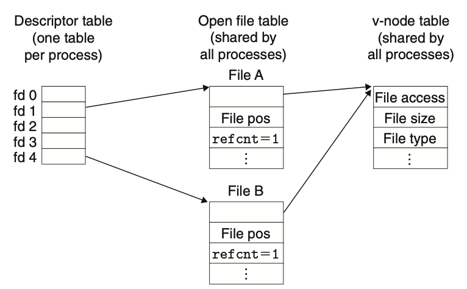
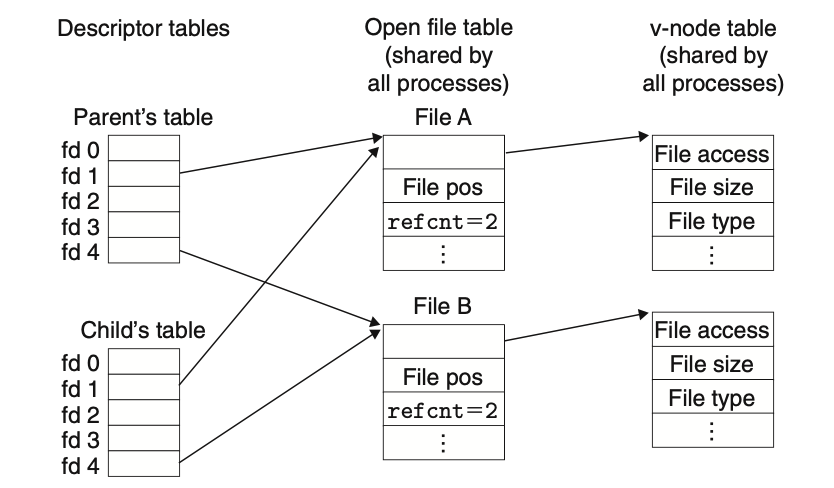
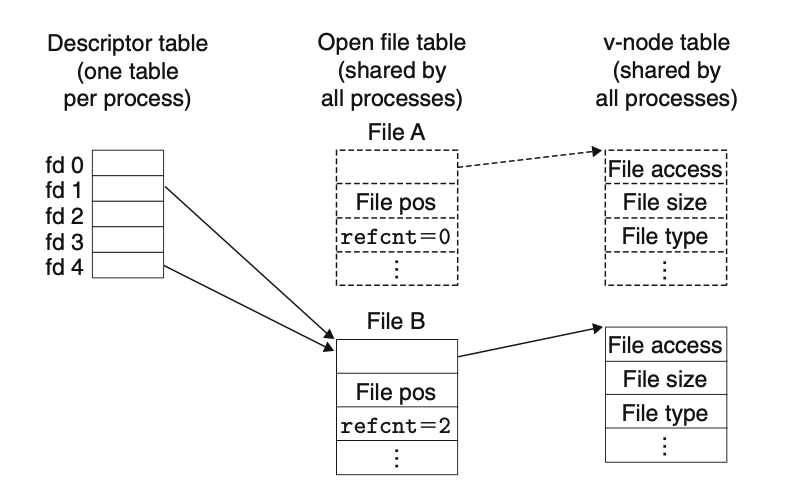
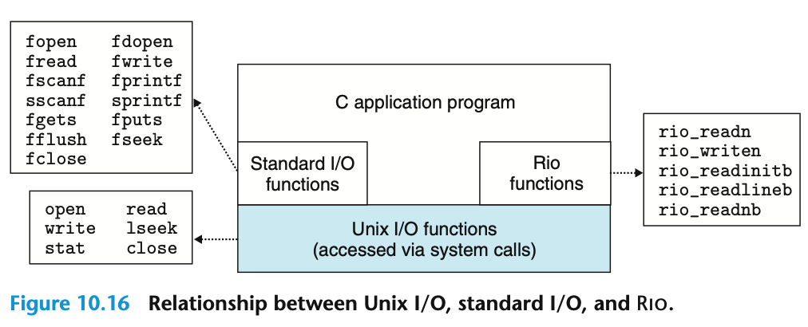

### 1. Unix IO

Linux文件就是一个字节序列。

$$B_0, B_1, ..., B_n$$

所有的IO设备(网络、终端、磁盘)都被模型化为文件，所有的输入输出都被当做对相应文件的读和写来执行。

将设备映射为文件，Linux内核引出一个简单、低级的应用接口，使得所有的输入和输出可以以一致统一的方式来执行：

1. 打开文件，调用操作系统提供的服务，内核返回一个非负整数，称为**文件描述符**。后续操作传入这个标识符即可。内核记录有关这个打开文件的所有信息，应用程序只需要记住这个描述符。

   Linux shell创建的每个进程开始时都有三个打开的文件。

   - 标准输入：0
   - 标准输出：1
   - 标准错误：2

2. 修改当前文件位置，对每个打开的文件，内核保持一个文件位置`k`，表示从文件开头起始的字节偏移量，初始为0。可以通过`seek`操作显式指定`k`。
3. 读写文件。读操作是从文件复制`n`个字节到内存(一般配合缓冲区)，然后将`k`增加到`k + n`。长度为`m`字节的文件，当`k >= m`时，指定读操作会触发`end-of-file（EOF）`条件。文件结尾并没有明确的"EOF"符号。
4. 关闭文件。通知内核关闭文件。内核释放文件打开时创建的数据结构，将描述符恢复到可以的描述符池中。无论一个进程因为哪种原因终止，内核都会关闭所有打开的文件并释放他们的内存资源。

### 2. 内核结构

内核用三个相关的数据结构来表示打开的文件。

1. 描述符表，每个进程都有自己的描述符表，表项由进程的打开的文件描述符来索引，每个表项指向一个文件表中的一个表项。

2. 文件表。打开文件的集合由一张文件表来表示，所有进程共享这个文件表。每个表项由如下组成:

   - 当前的文件位置
   - 引用计数
   - 指向`v-node`表中对应表项的指针

   关闭一个描述符会减少对应的文件表项中的引用计数。当引用计数为零时，内核删除这个文件表项。



多个描述符也可以通过不同的文件表项来引用同一个文件。比如对同一个`filename`调用两次`open`函数。



父子进程共享文件如下图所示.



子进程有一个父进程的描述符表的副本。在内核删除相应文件表之前，父子进程必须都关闭描述符。

而且一个进程对某个文件描述符的操作，也会反映到另一个进程中。

### 3. IO重定向

重定向就是将文件描述符修改为其他对应的内容。



使用`dup2`系统调用，可以将复制描述符表项。

```c
#include <unistd.h>

int dup2(int oldfd, int newfd); // 覆盖oldfd的内容到newfd中
```

上图中，为调用`dup(4, 1)`的结果。这样任何写到标准输出的内容都被重定向到了文件B中。




