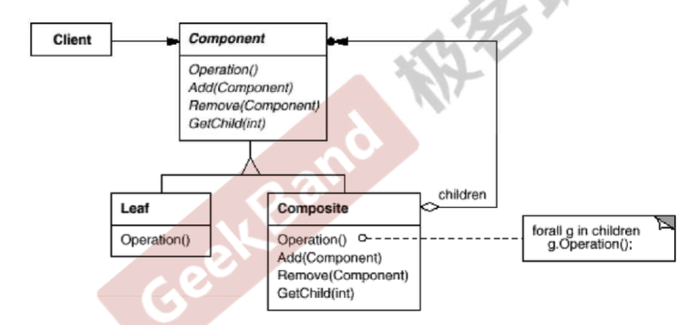

## 组合模式

### 问题

对于树形结构而言，一个容器对象下可以存放多种不同的叶子对象或者容器对象，容器对象和叶子对象之间树形差别可能非常大。比如文件夹中可以存放文件夹和文件，但是文件夹和文件的属性差别是非常大的。

由于容器对象和叶子对象在功能上的区别，在使用这些对象的代码中必须有缺别地对待容器对象和叶子对象。但是**大多数情况下我们希望一致性地处理他们**。组合模式可以很好地解决这个问题。

> 将对象组合成树形结构以表示“部分-整体”的层次结构，组合模式使得用户对单个对象和组合对象的使用具有一致性(稳定)

### 实例代码

```c++
// 所有节点的基类
class Component {
public:
    virtual void process() = 0;
    virtual ~Component() = default;
};

// 内部节点类，
class Composite : public Component {
private:
    std::string name;
    std::list<Component*> elements;

public:
    Composite(const std::string &n) : name(n) {}
    void add(Component* element) {
        elements.push_back(element);
    }
    void remove(Component* element) {
        elements.remove(element);
    }

    // 处理的时候处理自己的所有孩子
    void process() {
        std::cout << "Composite process curent node" << std::endl;
        for (auto &x : elements) {
            x->process();  // 多态调用，不管存的是叶子还是中间节点
        }
    }
};

// 叶子节点类
class Leaf: public Component {
private:
    std::string name;
public:
    Leaf(const std::string &s) : name(s) {}
    // 处理的时候只处理自己
    void process() {
        std::cout << "Leaf Process" << std::endl;
    }

};

void Invoke(Component &c) {  // 通过多态，使得暴露的接口一致
    c.process();
}

int main() {
    Composite root("root");
    Composite treeNode1("treeNode1");
    Composite treeNode2("treeNode2");
    Composite treeNode3("treeNode3");
    Composite treeNode4("treeNode4");
    Leaf leaf1("left1");
    Leaf leaf2("left2");

    root.add(&treeNode1);
    treeNode1.add(&treeNode2);
    treeNode2.add(&leaf1);

    root.add(&treeNode3);
    treeNode3.add(&treeNode4);
    treeNode4.add(&leaf2);

    Invoke(root);
    Invoke(leaf2);
    Invoke(treeNode3);
}
```

### UML



### 总结

1. 组合模式采用树形结构来实现普遍存在的对象容器，从而将一对多的关系转为一对一的关系，使得客户端代码可以**一致地处理对象和对象容器**.，无需关心处理的是单个对象还是组合的对象容器。
2. 组合模式在具体的实现过程中可以让父对象中的子对象反向追溯，如果父对象具有频繁的遍历需求，可以使用缓存的技巧改善效率。

