### 绪论

信号的估计：从观测到的信号，建立接收到的数据到要估计的量之间的数学关系，需要求出参数的值是多少。

信号的检测：从观测到的信号，判断出其属于的类别，有还是没有，有的话属于哪一类。

区分冠状病毒的种类：检测

通过信号判断目标的距离：估计

### 最小方差无偏估计

估计就是根据观测数据来确定未知参数(待估计参数)的规则。也就是**建立一个从观测数据到要估计参数的函数关系**。

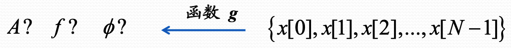

估计理论分为两类：

- 经典估计：要估计的量是一个确定的量，提前对它没有任何的分布假设
- 贝叶斯估计：要估计的量是一个随机变量，但是这个量可能有一个提前假设的分布。(比如估计一个人这次说话的频率，那么他的频率大致是知道的，只不过会有一些随机的扰动。对要估计的量有一个先验的分布)

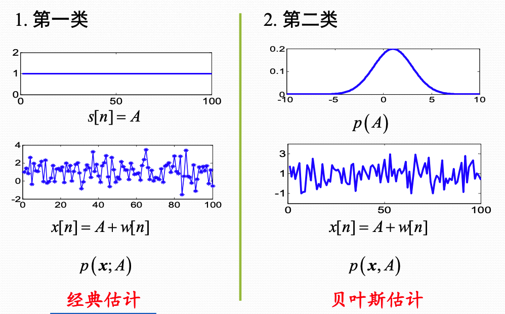

在估计的时候，根据观测数据建立函数关系最终得到的量是**估计量**。因为观测数据一般是随机变量，所以估计量是一个随机变量。

如何评价估计量的好坏？

**均方误差准则**：

$$\operatorname{mse}(\hat{\theta})=E\left\{(\hat{\theta}-\theta)^{2}\right\}$$

根据估计量和真值之间的误差的均值，来衡量估计量的好坏。通过以下推导可知

$$mse(\hat{\theta)}=\operatorname{var}(\hat{\theta})+b^{2}(\theta)$$

$$b(\theta) = E(\hat{\theta}) - \theta$$

由于最小均方误差需要知道真值，所以一般不可实现。

#### MUV(Minimum variance unbiased)

最小方差无偏估计需要有两层含义

第一层是无偏，也就是估计量的均值和真值相同。$E(\hat{\theta}) = \theta, \quad a < \theta < b$

无偏性要求对于真值$\theta$所有可能的取值范围内，都成立。不是所有的参数都存在无偏估计量。(如观测数据x服从$[0, \frac{1}{\theta}]$的均匀分布。)

第二层要求方差最小。这里的方差最小要求不管真值在什么地方，估计量的方差都是最小的，也称为一致最小方差无偏估计。一致最小方差无偏估计也不一定存在。

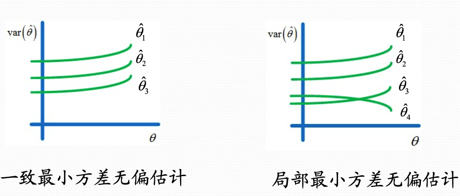

> MVU是在无偏的估计量中找方差最小的那一个。估计量可能存在也可能不存在。
>
> 但是MVU估计量并不是所有估计量中方差最小的，比如来啥我都估计成0，这样方差为零了。
>
> MVU也不是所有估计量中均方误差最小的。其只是无偏估计量中，方差最小的，自然也是无偏估计量中，均方误差最小的。

#### 克拉美罗界

克拉美罗界给处了MVU估计量性能的下界。对于一个估计量，可以给出很多界，比如可以给出一个下界是0。但是这没有任何意义。克拉美罗界是最容易确定的性能界。而且，如果存在可达到这个性能界的MVU，则可以直接求出来。如果MVU达到不这个界，那么可以通过其他手段找到**可渐近达到该性能界的估计量**。(比如数据趋于无穷大的时候，某些估计量的性能渐近达到克拉美罗界)

结论：

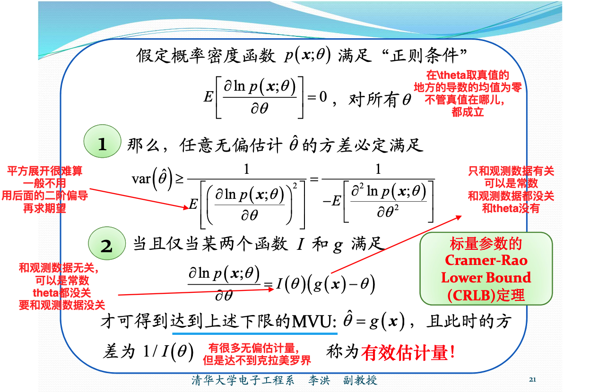

#### 高斯白噪声中的CRLB

信号模型为：

$$x[n] = s[n;\theta] + w[n]$$

- 信号是待估计参数的函数
- 观测数据的PDF取决于噪声

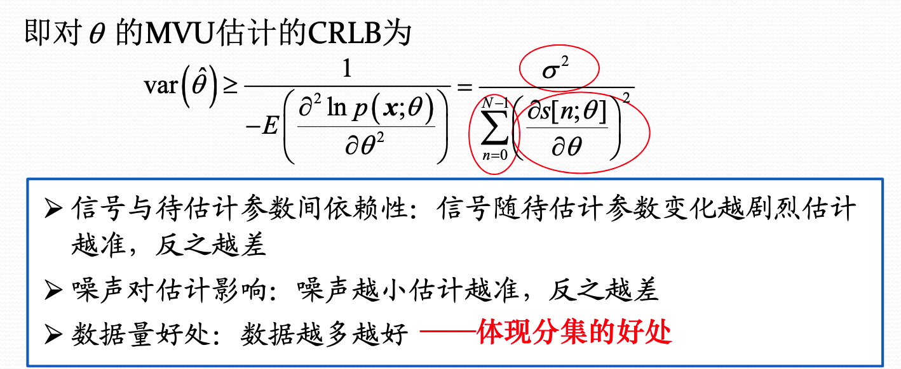

#### 参数变换下的CRLB

当估计的是某个参数的函数时，如$\alpha = g(\theta)$，那么$\alpha$的无偏估计是否存在性能界？如果存在，其与$\theta$的性能界有何联系？

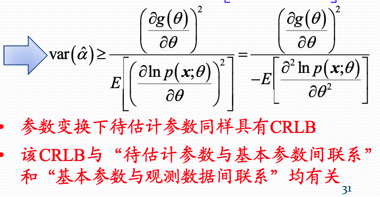

1. 线性变换下的CRLB。

   线性变换下可以保证估计量的有效性。

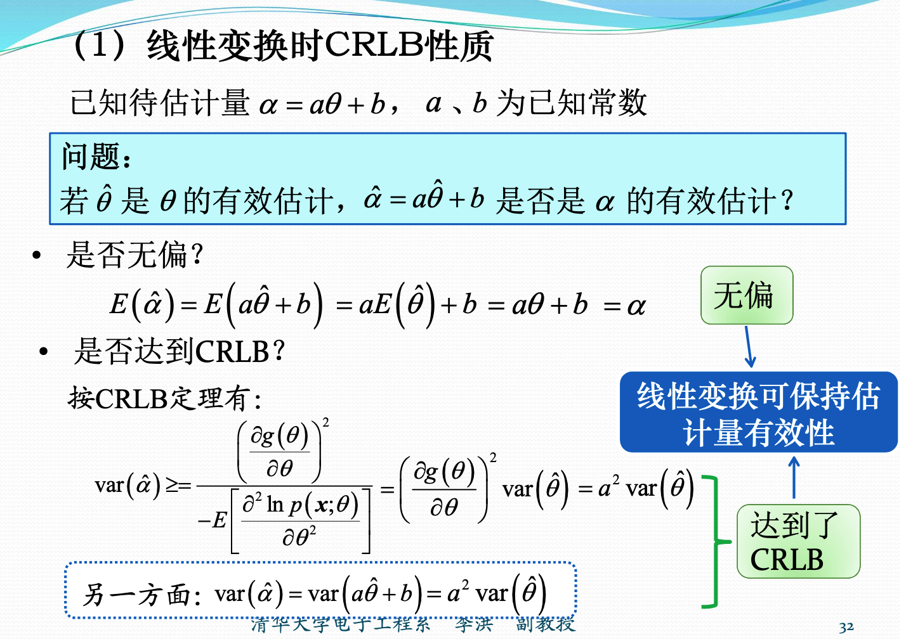

2. 非线性变换下的CRLB性质

   非线性变换不能够保持估计量的有效性。

   当数据量非常大的时候，渐近有效，渐近达到CRLB。

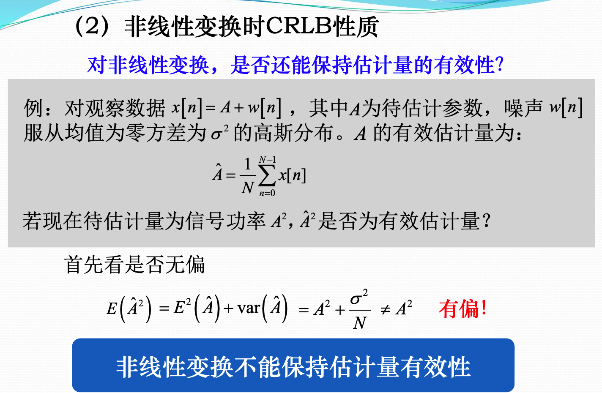

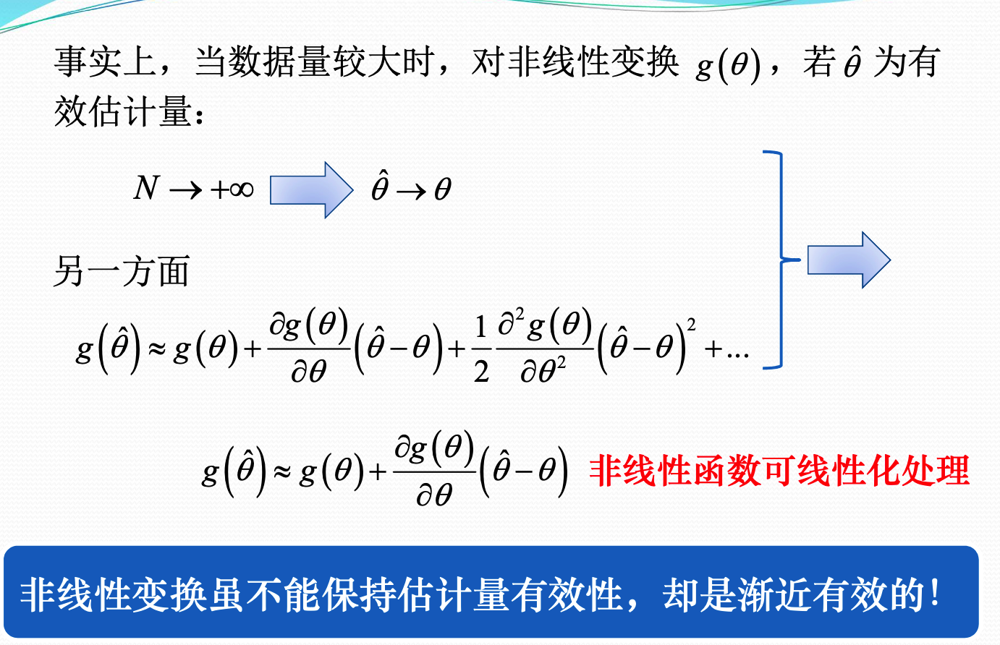

高斯分布的矩：
若$x \sim N(\mu, \sigma^2)$，则$E(x^2) = \mu^2 + \sigma^2 \quad E(x^4) = \mu^4 + 6\mu^2\sigma^2 + 3\sigma^2$

### 矢量参数下的CRLB

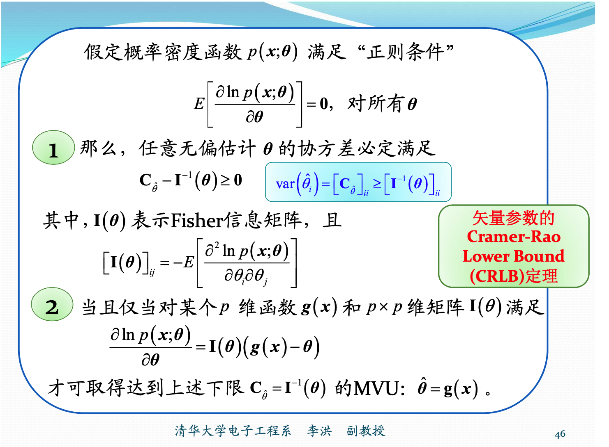

一般情况下，CRLB随带估计参数的增多而增加。

#### 矢量参数变换下的CRLB

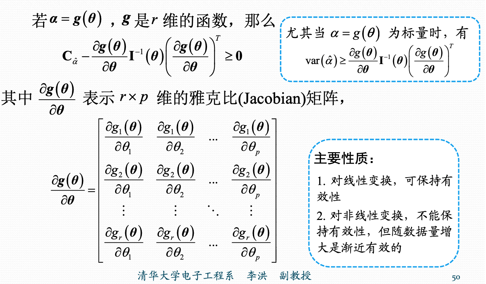

#### 一般高斯下的CRLB

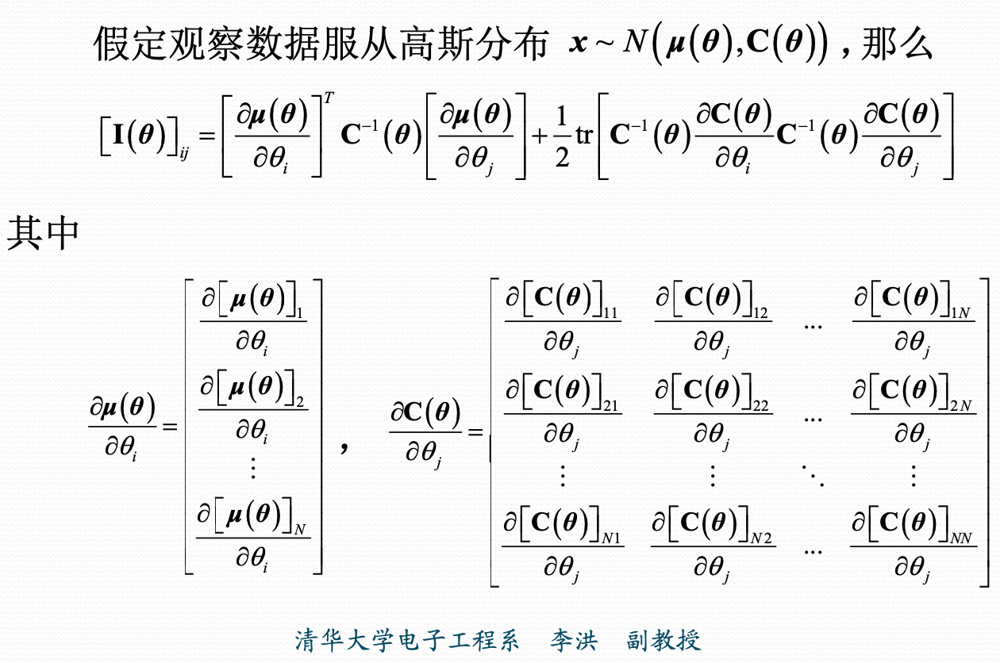

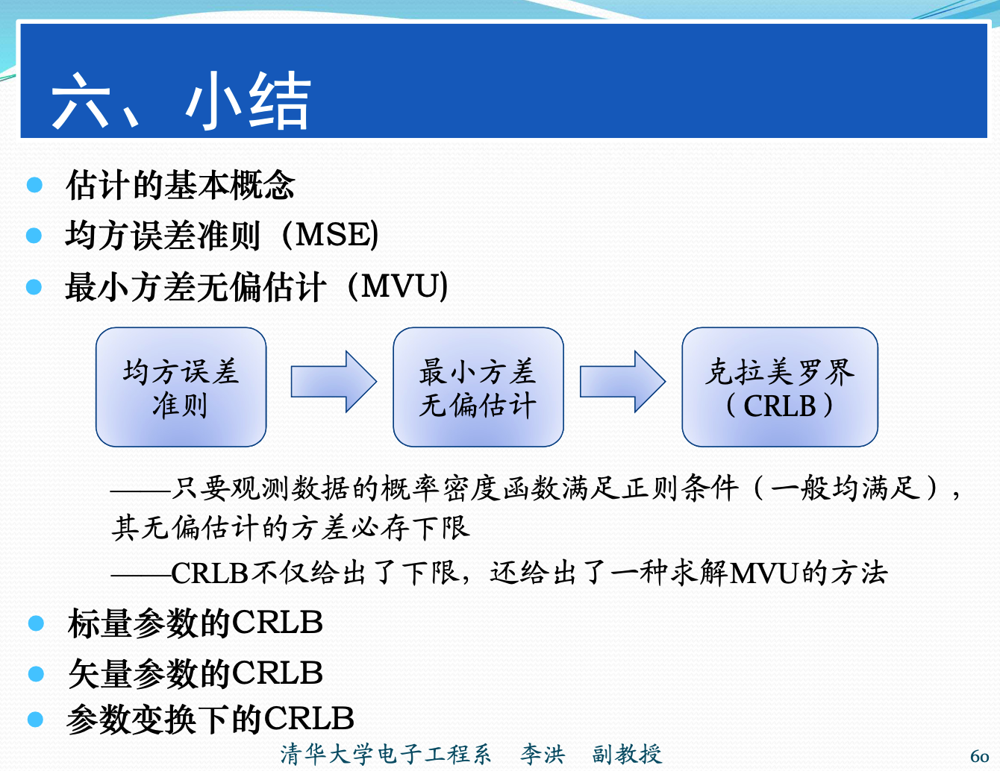

