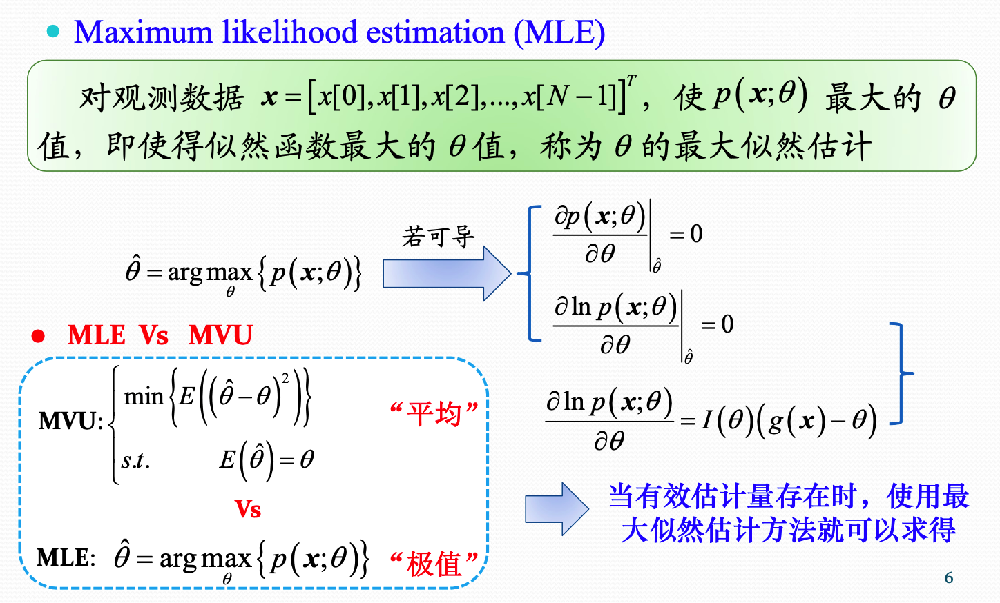
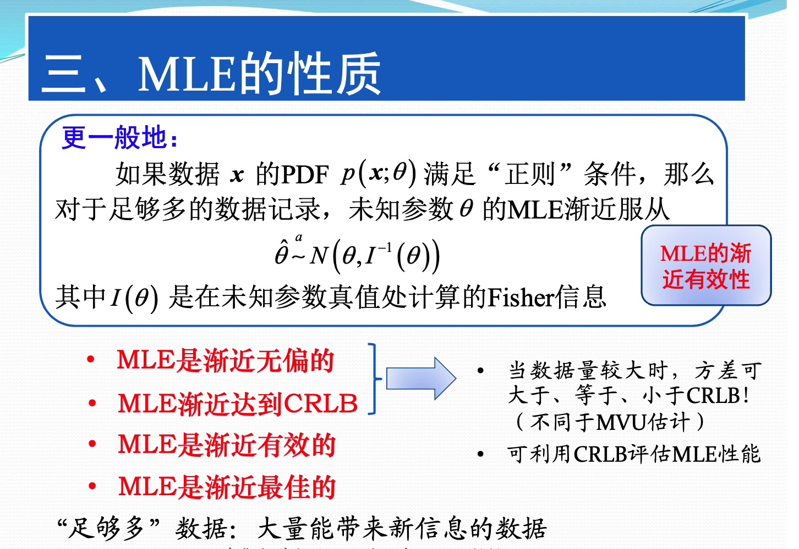
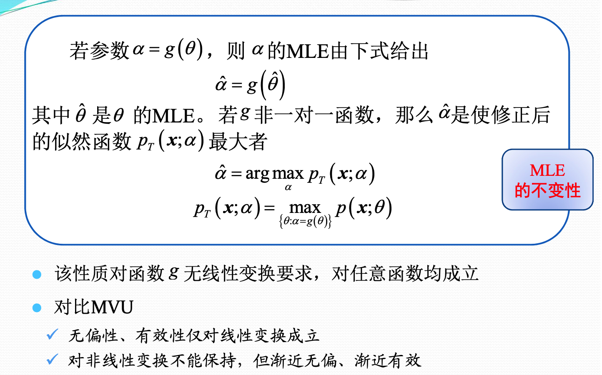
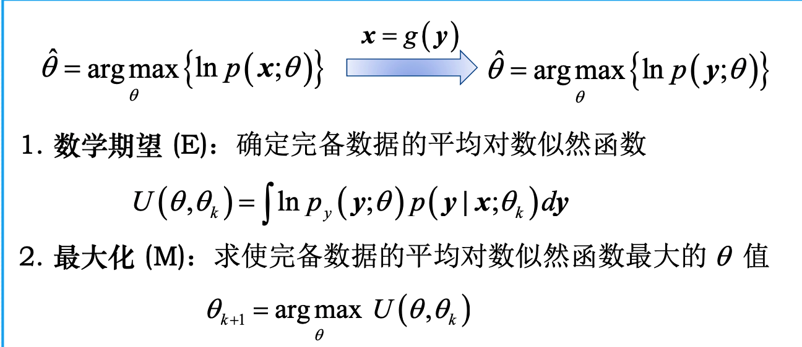
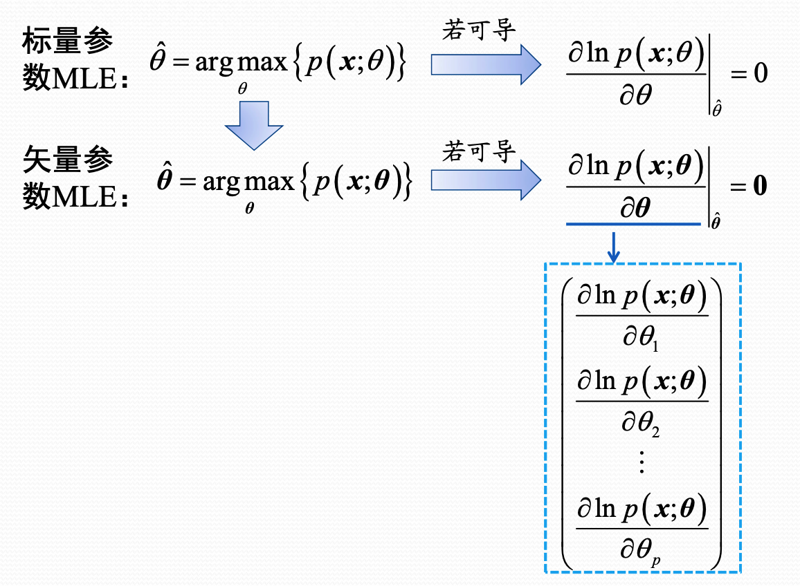
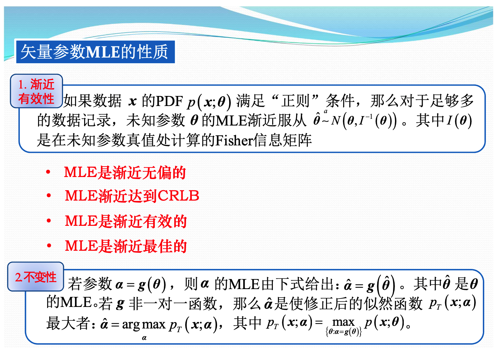
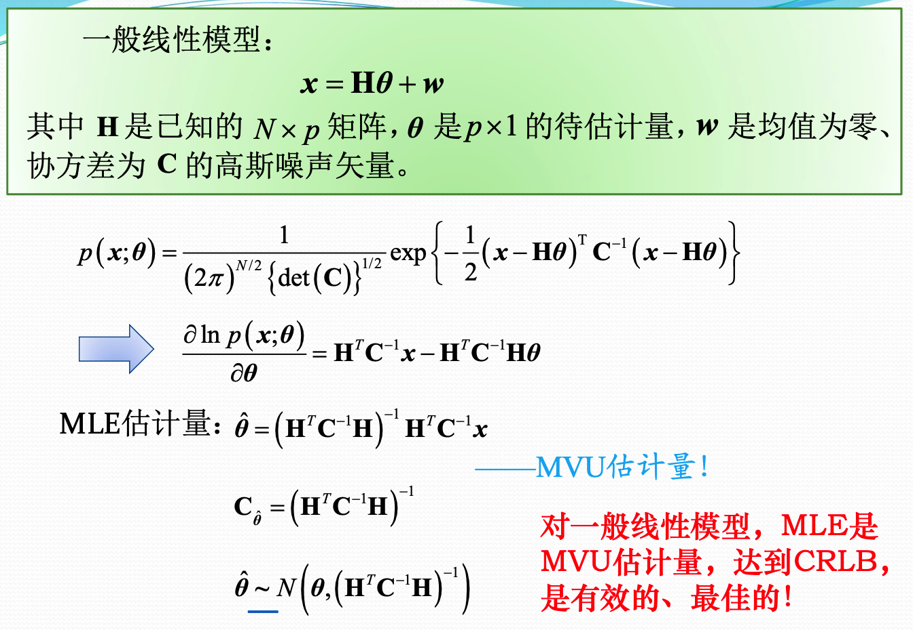
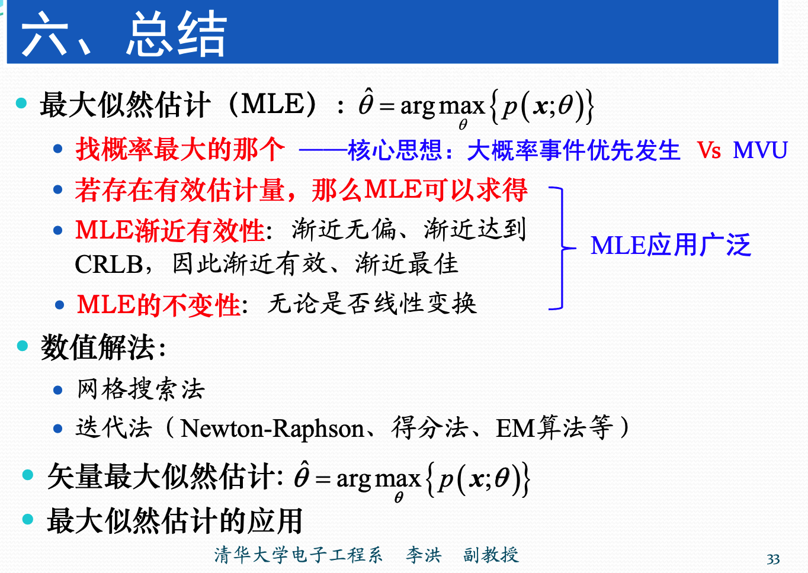

### 最大似然估计

有些时候直接通过CRLB和充分统计量求解MVU估计量是非常困难的。最大似然估计是一种比较方便的方法。

最大似然估计是选择使观测数据以最大概率出现的带估计的参数值。

MVU估计量的思想是，使得估计量和真值之间的误差平方的均值最小。两者是不同的思路。

MLE是渐近无偏。在某些情况下，**MLE是有偏的估计量，数据量较大时，方差和CRLB界的关系可是任意的。**

### 数值解法

有些时候直接对数似然函数的偏导，然后求令其为零的参数值，无法得到解析解。所以需要通过数值的方法来进行求解。

- 网格搜索法。直接将对各个参数进行暴力搜搜。
- Newton-Raphson迭代法
- 得分法
- EM算法

### 矢量参数的MLE

### 一般线性模型

### 总结

