## 最小二乘估计

在前面的估计方法，如CRLB、一般线性模型、充分统计量、最大似然估计，都需要知道观测数据的似然函数。如果没有似然函数的话，最小二乘是一种方法。最佳线性无偏估计需要知道一阶矩和二阶矩。

最小二乘的思想是，通过选择参数，使得在这个参数下，信号和观测数据的均方误差最小。

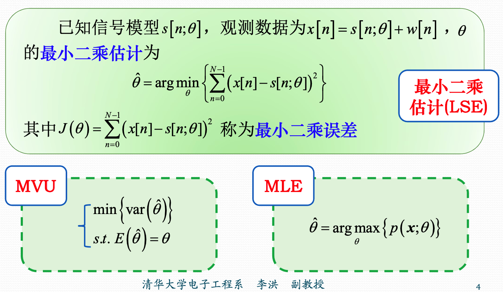

### 线性最小二乘

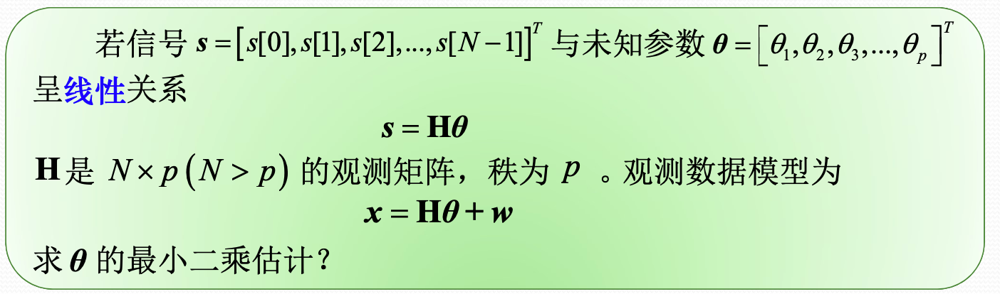

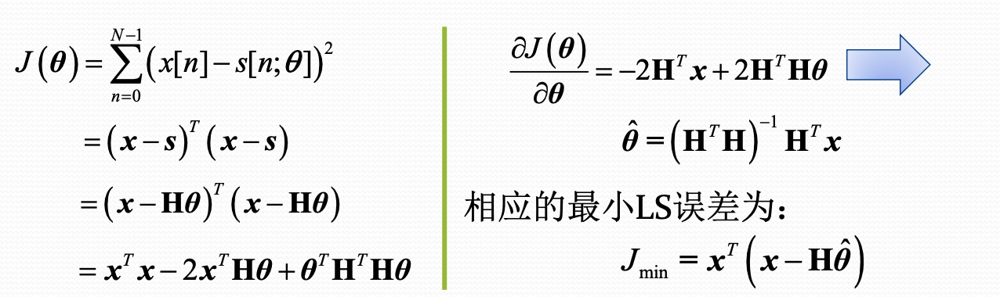

### 加权最小二乘

不同时刻的数据提供的信息权重不同。比如某些时刻的数据非常重要，某些时刻不是很重要。所以对损失函数进行了加权。

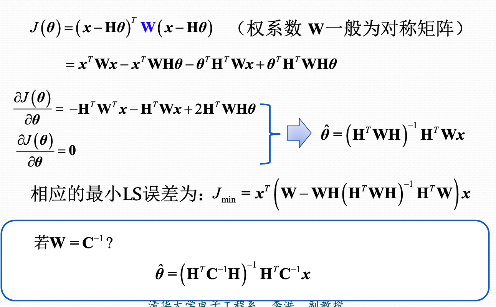

### 序贯最小二乘

本质上，是将`N`时刻的估计量，写成`N-1`时刻的估计量和`N`时刻的观测数据的函数形式。

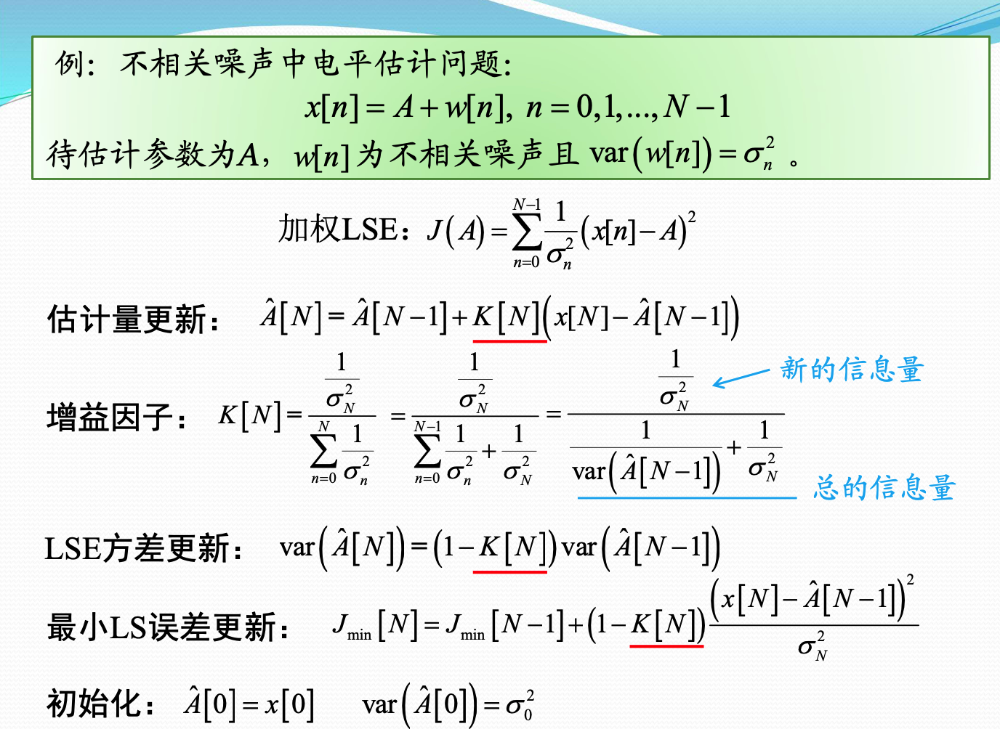

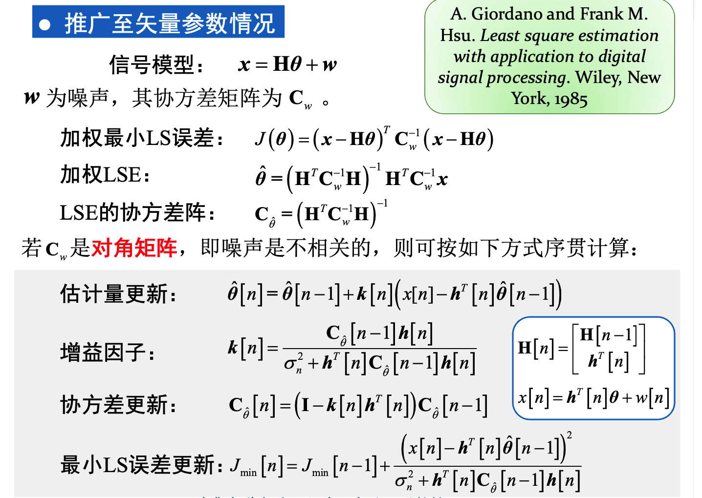

### 约束最小二乘

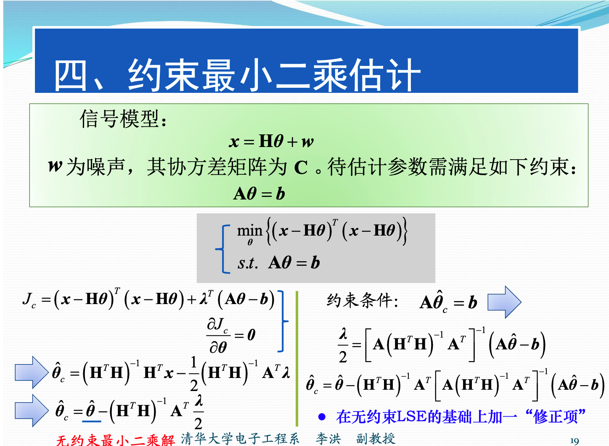

### 非线性最小二乘

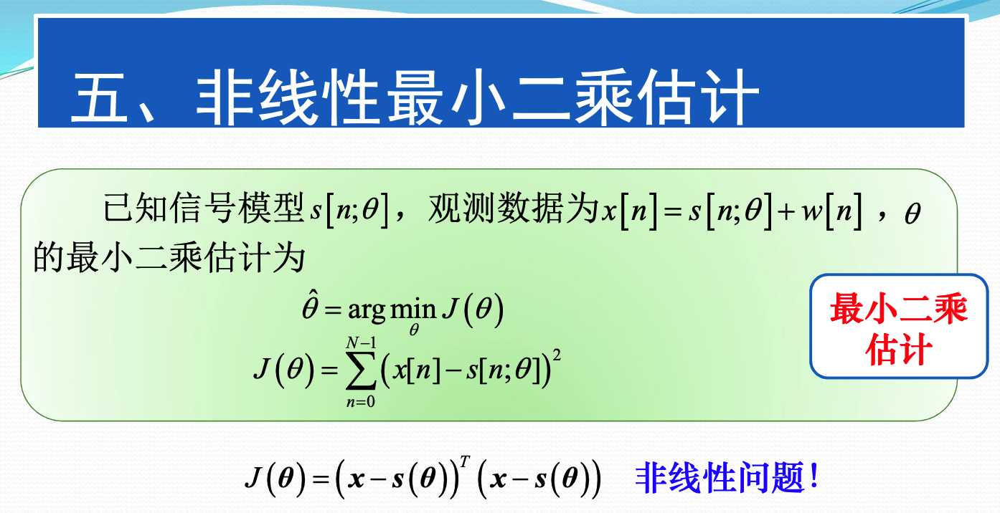

1. 网格搜索法，对待估计参数直接蛮力搜索

2. 参数变换法，将非线性参数转换为线性参数来求解。

   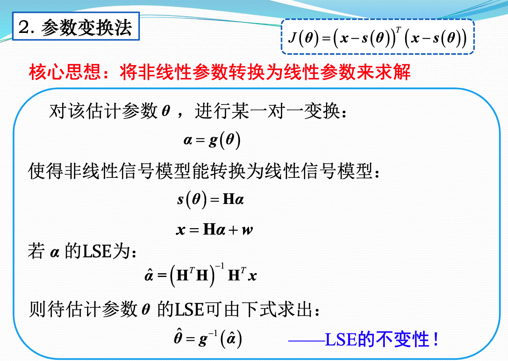

   3. 参数分离法

      将非线性参数尽量转换为线性参数，以减小复杂度。

      固定一维，求另一位的最小。然后将所有参数用固定的那一维表示，最后求解即可。

      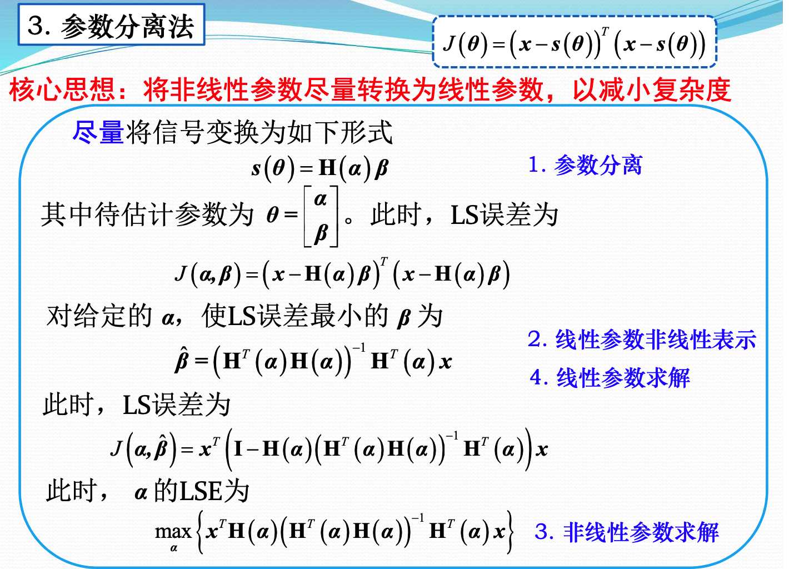

      4. Gauss-Newton迭代法

         将信号的非线性模型线性化之后迭代求解。

         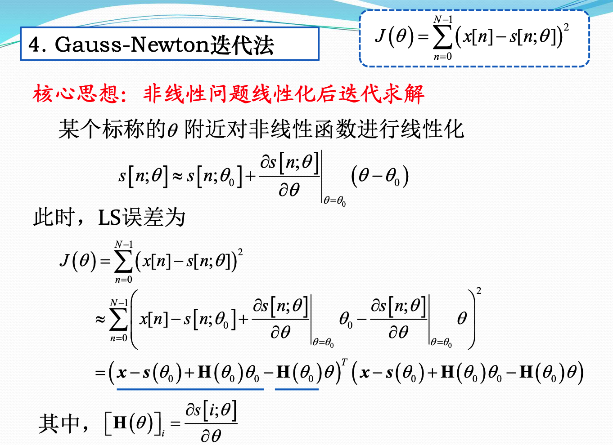

         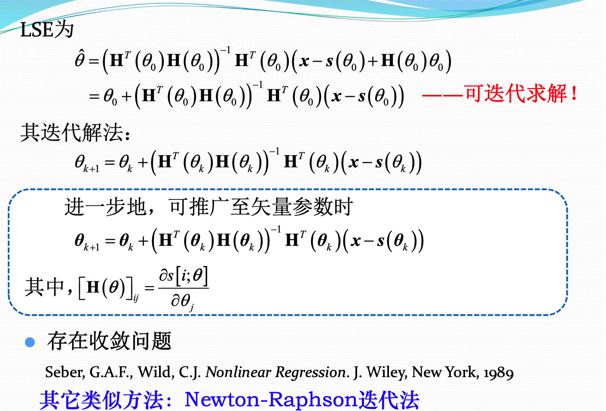

         5. 循环最小化方法

            多个参数迭代进行优化

            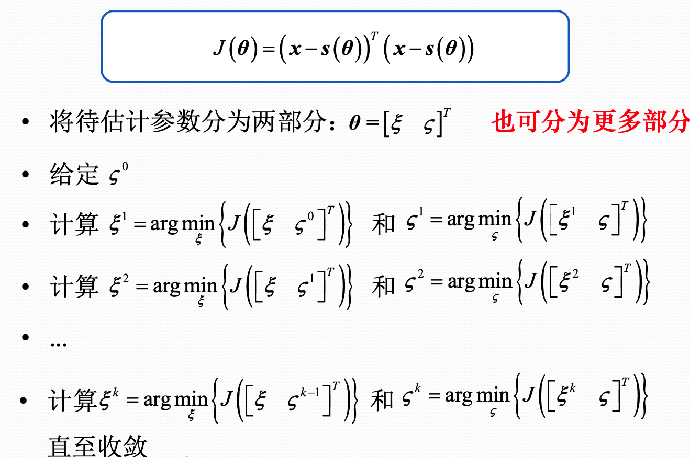

            6. 放松估计法

            

            ### 总结

            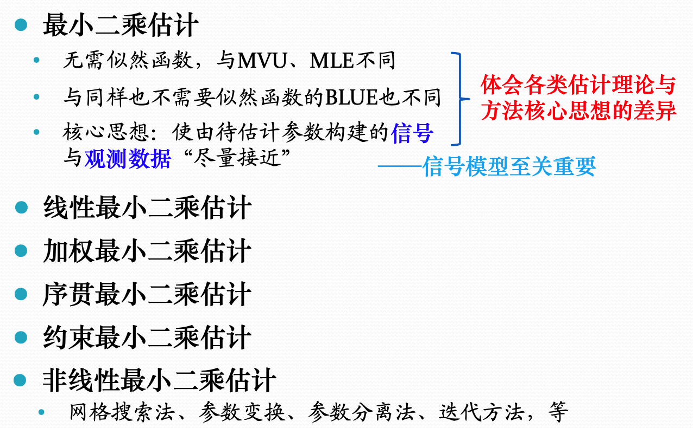

            

            最小二乘的方法不需要知道观测数据的PDF，也就是噪声的模型。只需要知道信号的模型，然后通过最小化信号和接收数据的方法，来求解信号中的带估计参数。主要的方法是各种优化的方法。

   

