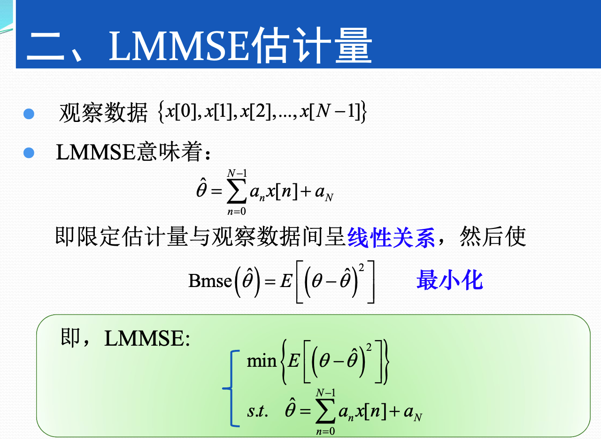
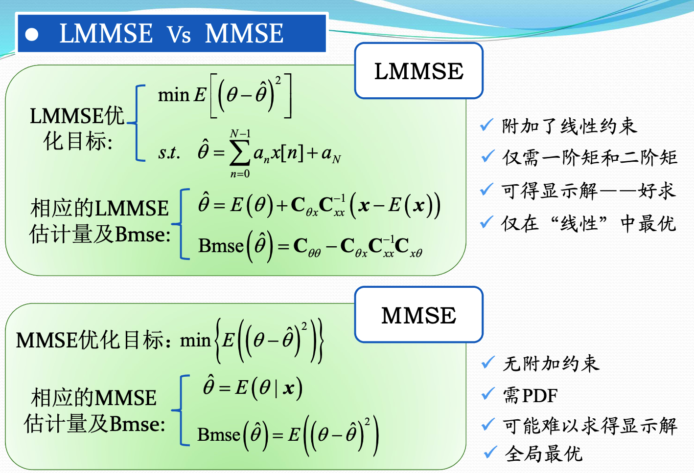
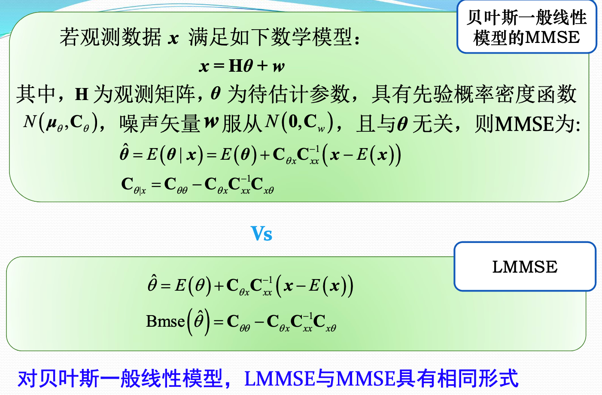
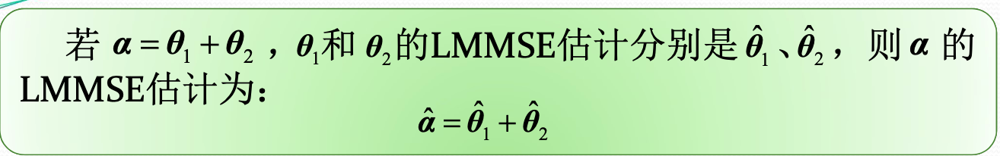
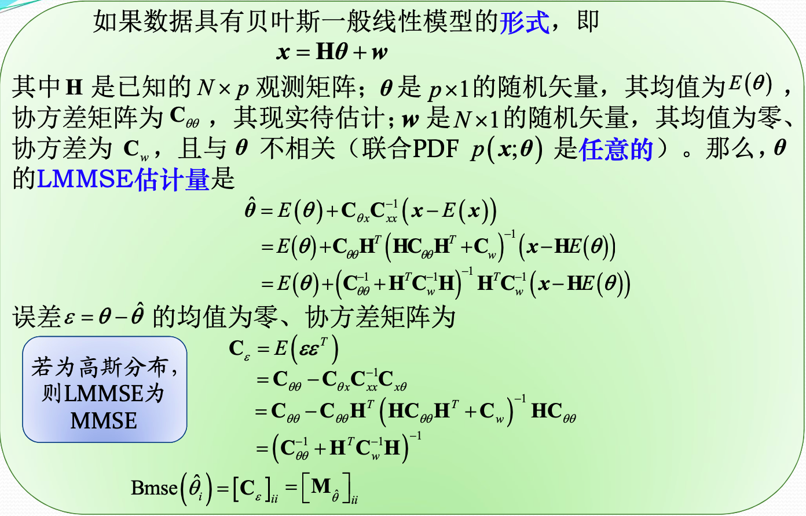
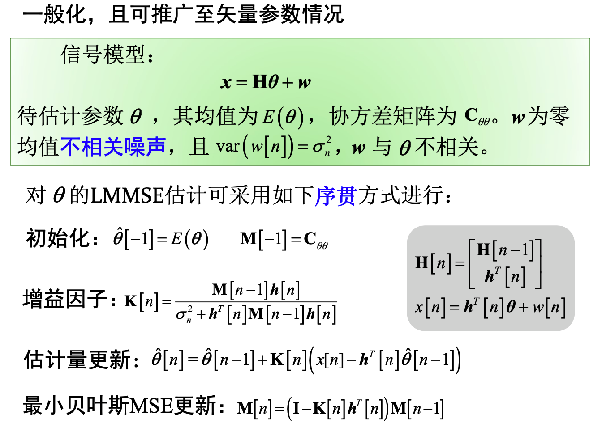
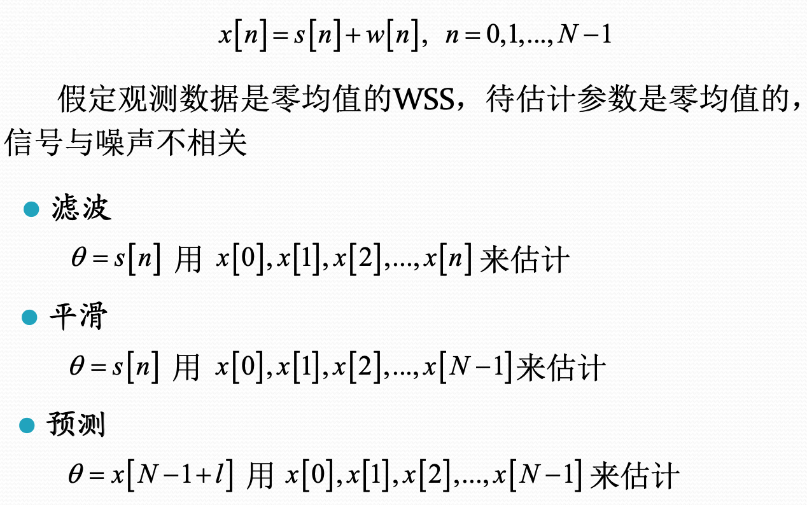
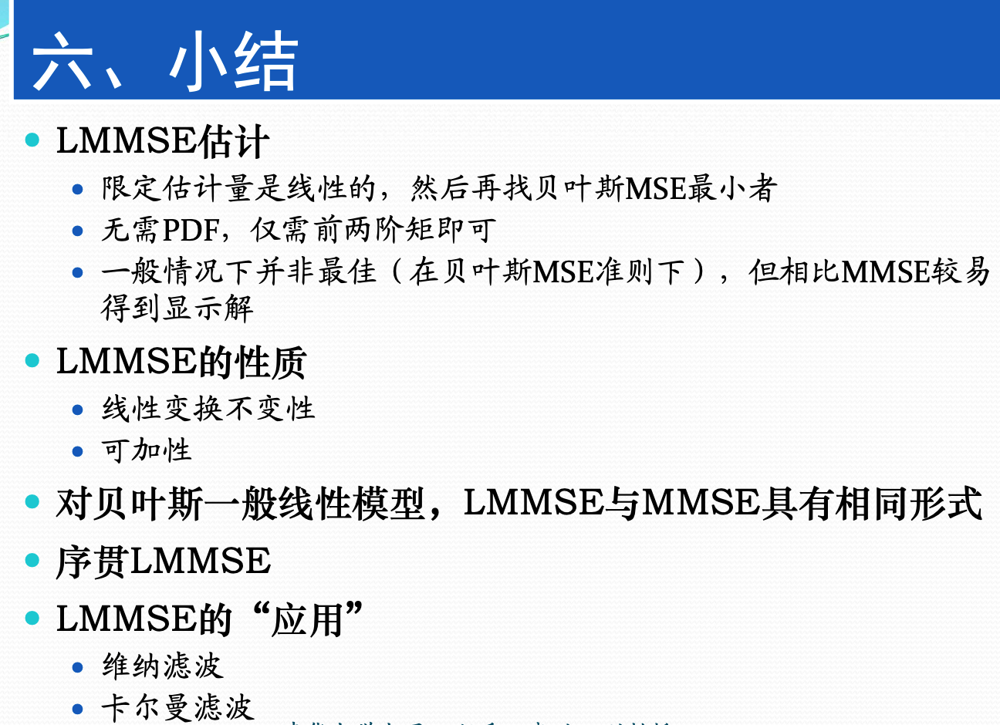

## 线性贝叶斯估计

在使用一般贝叶斯估计的时候，给定观测数据，估计量为观测数据条件下的待估计参数的均值。当有多余参数的时候需要将联合概率分布通过积分求得感兴趣参数的边缘分布。

在使用最大后验概率准则的时候，需要求出观测数据条件下的待估计参数的条件分布取最大时的参数的最大值。

这有两个问题：

1. 不一定好求，涉及到多重积分，多元函数求最大值
2. 有些情况下，联合分布的形式并不知道。

这个时候通过加入约束条件，就得到了线性MMSE估计量。

和BLUE类似，限定估计量是观测数据的线性函数，然后使得贝叶斯均方误差最小化。

### LMMS性能评估与性质

估计量误差为

$$\varepsilon=\theta-\hat{\theta} = \theta-E(\theta)-\mathbf{C}_{\theta x} \mathbf{C}_{x x}^{-1}(\boldsymbol{x}-E(\boldsymbol{x}))$$

估计量的误差是零均值的。

误差的协方差矩阵为：

$$E_{x,\theta}(\varepsilon \varepsilon^T) = \mathbf{C}_{\theta \theta}-\mathbf{C}_{\theta x} \mathbf{C}_{x x}^{-1} \mathbf{C}_{x \theta}$$

- 其对角线元素为待估计参数的最小贝叶斯均方误差
- 也称为贝叶斯均方误差矩阵，记为$M_{\hat{\theta}}$

性质：

1. 线性变换不变性

2. 可加性

   

3. 贝叶斯高斯-马尔科夫定理

   

### 序贯LMMSE估计

本质上就是更具估计量的公式，将N时刻的估计量写成N-1时刻的估计量和N时刻接受到的数据的表达式的形式。

### LMMSE的应用

直接将LMMSE的公式代入即可。

### 总结

- LMMSE不需要知道具体的PDF，只需要知道前两阶矩即可。