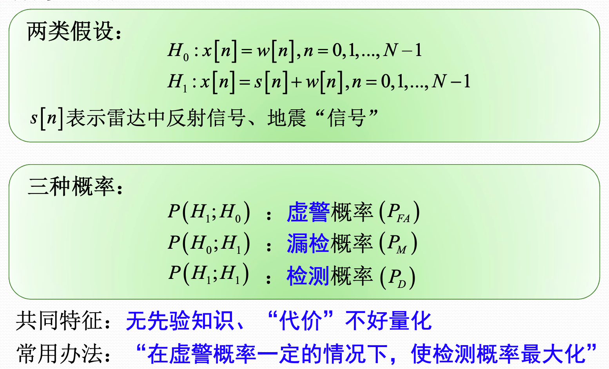
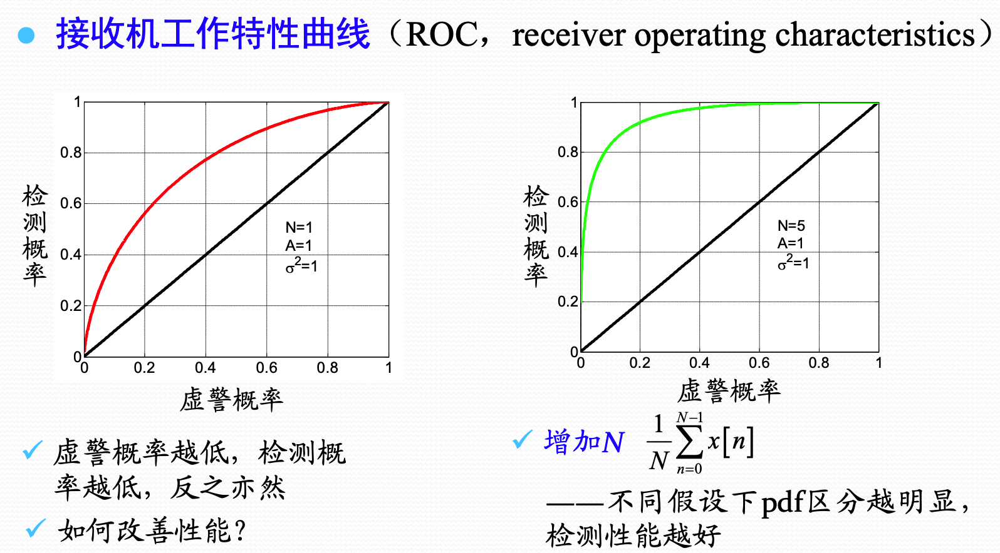
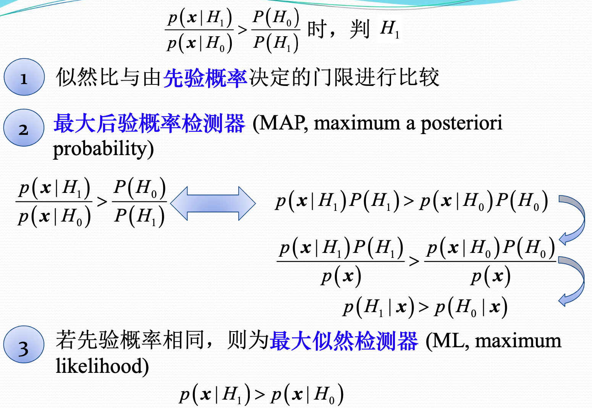
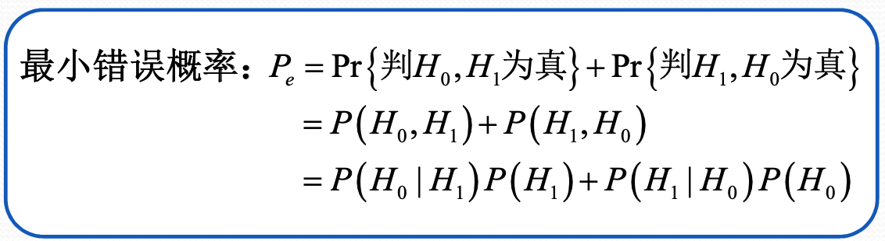
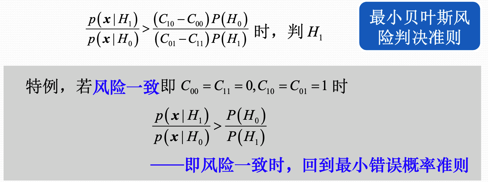
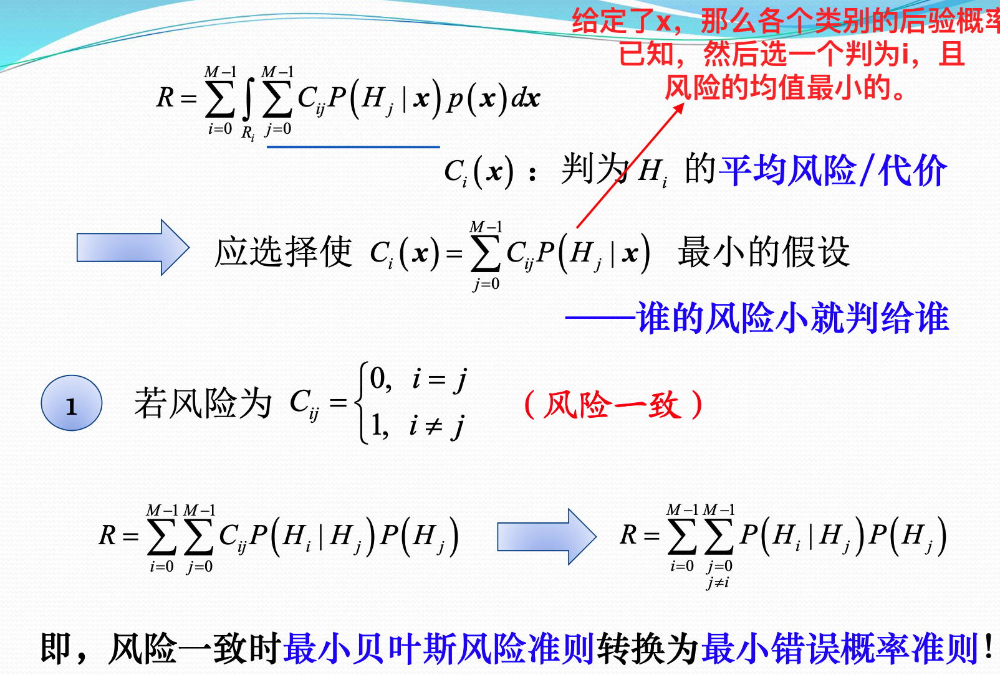
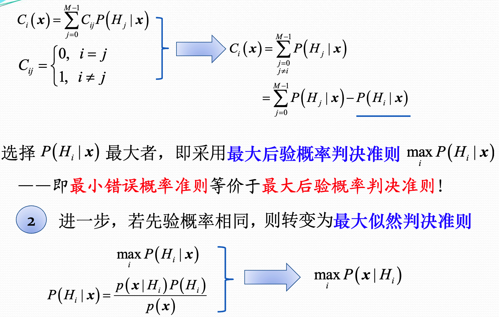
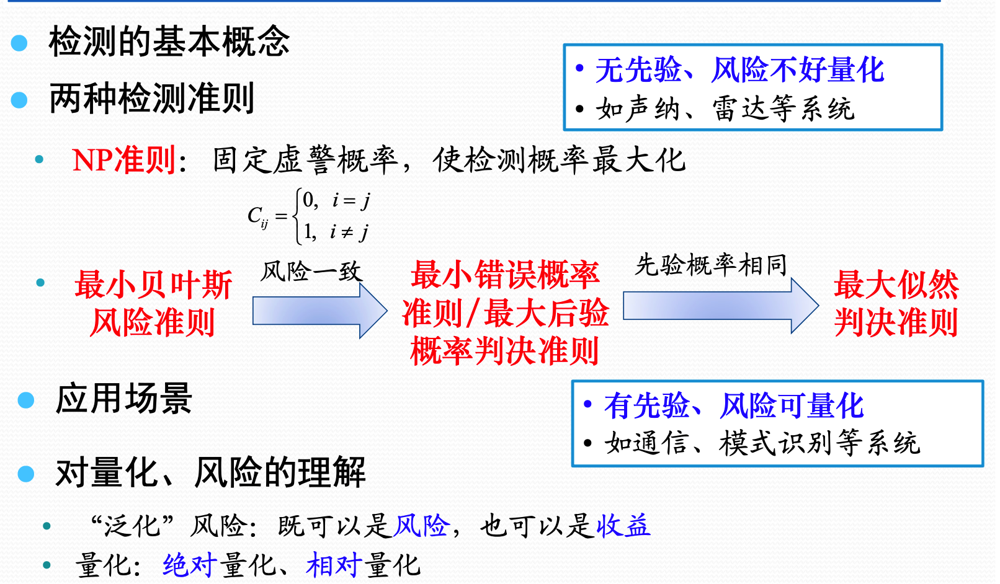

## 信号检测

> 检测的核心问题是：根据数据进行判决，究竟属于哪一个/类。
>
> - 采用什么样的准则
> - 如何才能达到最优

检测的基本准则：

- Neyman-Pearson准则
- 最小贝叶斯风险准则
  - 最小错误概率准则/最大后验概率准则
  - 最大似然准则

简单假设检验：

- 每种假设检验的PDF完全已知
- 确定信号检测
- 随机信号检测

符合假设检验

- 假设检验的PDF含有未知参数
- 贝叶斯方法
- 广义似然比（GLRT)方法及其等效方法（Wald、Rao）等

### Neyman-Pearson准则

给定虚警概率，希望检测概率能够最大化。

最终的形式如下：

使用NP准则进行处理的时候：

1. 后面的门限没有任何用处，和观测数据无关的都可以向里面仍。最核心的是最后要得到检测统计量。
2. 得到检测统计量了之后，需要得到在$H_0$假设下的检测统计量的分布。然后根据这个分布，求虚警概率一定的情况下的判决门限
3. 然后通过这个门限，和$H_1$假设下的检测统计量，得到检测概率。从而通过门限得到了检测概率和虚警概率的关系。

检测概率和虚警概率之间的关系成为`ROC`曲线。对于一个判别器而言，虚警率越低，检测率也就越低。虚警率越高，检测率也越高。(两个极端。虚警为0，所有都判定为没有，那么检测也为0.虚警为1，所有都判定为有，则检测也为1)。通过调整不同的门限值，可以得到检测率和虚警率之间的关系。`ROC`曲线下的面积为`AUC`，`AUC`越大，说明判别器性能越好。

### 做小错误概率准则

NP准则适用于先验概率未知、风险不好量化的情况。那如果先验概率已知、风险好量化的情况下，可以使用最小错误概率准则。

最小错误概率准则，一般是接收到数据之后，选择后验概率最大的那种假设。将两种假设先验相同的话，那么就转为了最大似然检测。

在通过判决准则，得到了检测统计量以及判决门限之后，可以计算检测统计量的分布，然后利用两种假设下的检测统计量的分布，和判决门限，得到整体的错误率。

### 二元贝叶斯风险准则

对于某些情况，不同类型的错误的代价是不同的。也就是将$H_0$判为$H_1$和将$H_1$判为$H_0$的代价是不同的。因此可以引入代价函数比较合理。

### 多元贝叶斯风险

### 小结

