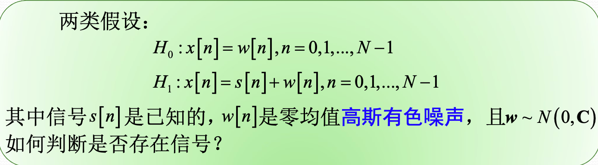
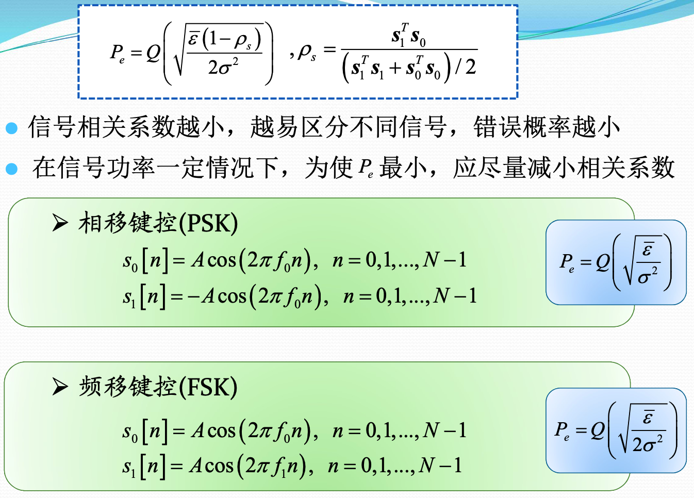
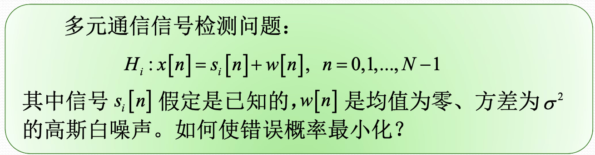
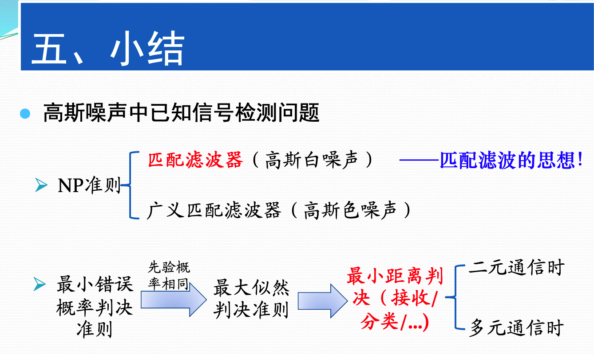
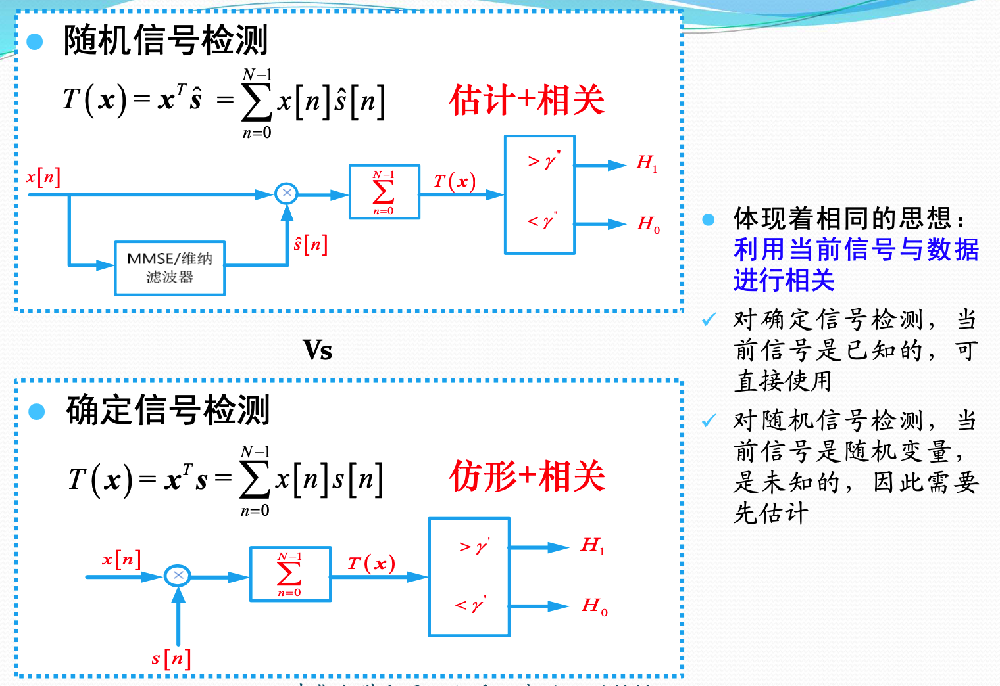

## 简单假设检验

所有的PDF参数都是已知的。

使用的方法概览：

### 确定信号的检测

**匹配滤波器**

确定信号的检测直接拿$H_1$假设的信号和接受到的信号做相关。

- 检测性能只与信号能量有关，与信号的波形无关
- 增大信号发射功率可以改善性能，增大本地信号功率无法改善性能
- 增加N，增加信号预检测积分的时间，是实际系统改善性能常用的方式

**广义匹配滤波器**

可以对信号进行修正，将有色噪声白化，然后进行处理。还是匹配滤波的思想

$$T(\boldsymbol{x})=\boldsymbol{x}^{T} \mathbf{C}^{-1} \boldsymbol{s}>\gamma$$

- 检测性能不仅与信号能量有关，而且与信号的波形有关。
- 不同于高斯白噪声的情况

在信号能量一定的情况下，选择信号为$C^{-1}$最大特征值所对应的特征向量

### 二元通信问题

### 多元通信

在各种信号的能量相同的情况下，将接受到的信号分别和各种假设下的信号做相关，去相关值最大的那个作为最终的判定类型。

### 随机信号的检测

随机信号中，信号的模型不再是确定的信号了，而是一个随机过程。只知道其分布。

不过总体的方法还是不变，求出两种假设下，观测数据的概率分布，然后采用NP准则，得到检测统计量。

最后更具两种不同假设下的检测统计量的分布，求其性能，同时也可以根据给定的虚警概率求门限。

