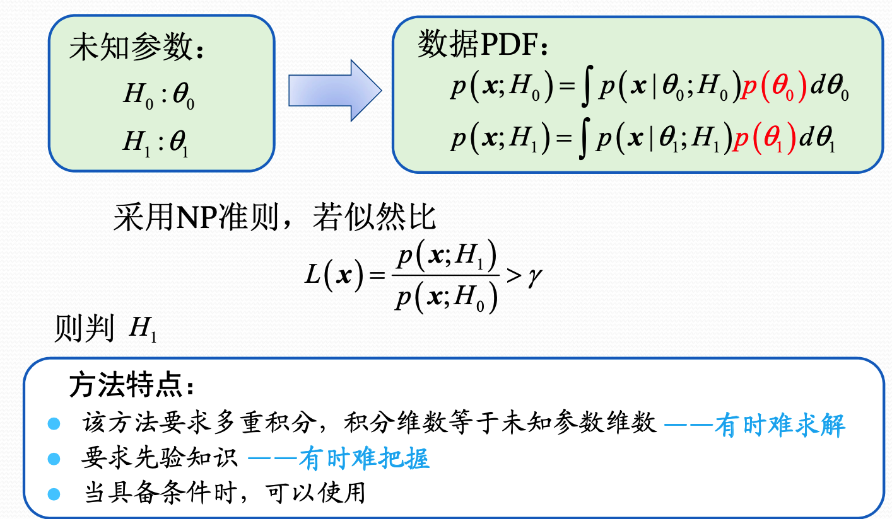
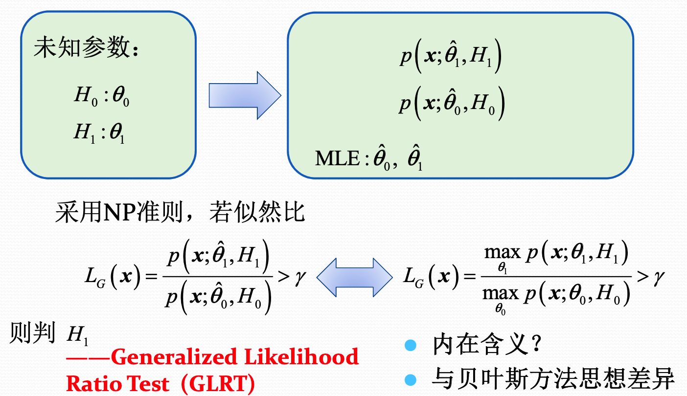
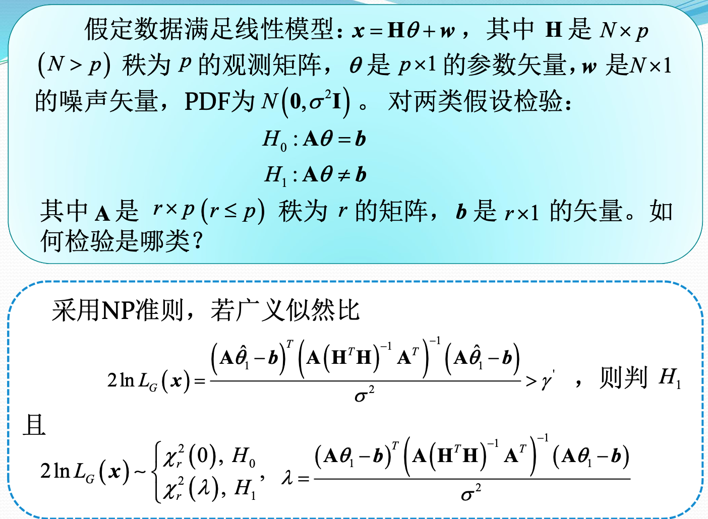
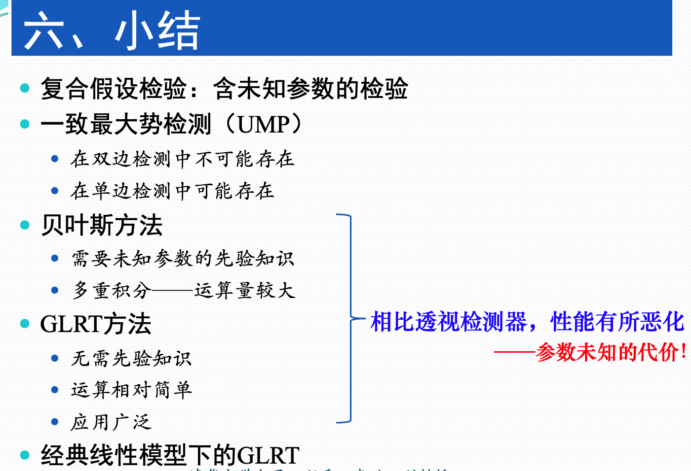

## 复合假设检验

简单假设检验，不管信号是确定的还是随机的，我们知道信号的PDF所有的参数。当时如果PDF中有未知的参数的时候，

就需要复合假设检验。

检测的三个要素：

1. 检测统计量
2. 判决方法
3. 门限

首先假设A已知，然后进行推导。如果最后A的取值和上面三个要素没有关系，那么就可以直接检测。

一致最大势检验：检测统计量和A无关、判决方法、门限和A无关。但是性能可以和A有关。

### 复合假设检验的基本方法

1. 贝叶斯方法
2. GLRT

##### 贝叶斯方法

将未知的参数看做随机变量。然后利用其在不同假设下的分布，求出数据出现的概率。再使用NP准则。

这种情况虽然参数未知，但是需要知道未知的参数在各种假设下的PDF。

##### 广义似然比检验

广义似然比检验，先根据观测数据，分别极大似然估计求出在两种不同的假设下，参数的取值。然后再假设参数的取值就是利用极大似然估计出来的取值。再利用NP准则，求检测统计量等。

