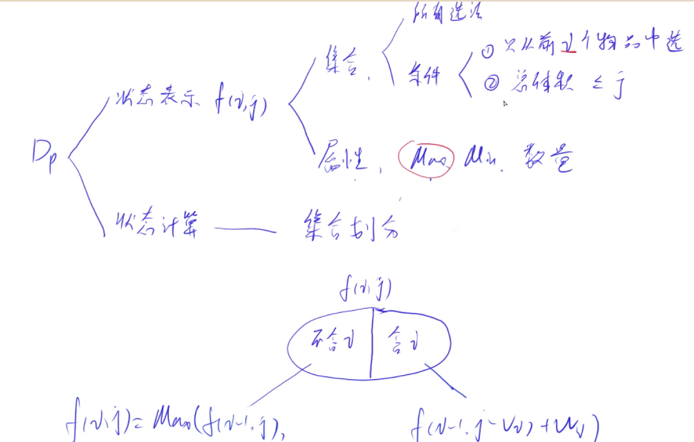

## 1. DP问题分析

1. 状态表示
   - 整个问题需要几维来表示问题
   - 每个状态的含义是什么
     - 一个状态表示一个集合
     - 这个状态表示这个集合的属性是什么，一般是三种：max， min， 数量。背包问题是表示集合里面的最大值。

2. 状态计算

- 如何将每个状态算出来
- 状态计算对应集合划分。如何将当前集合划分为若干个集合的子集，每个子集可以用前面更小的集合算出来。子集之间一般是不重不漏。不漏是要满足的，但是不重不一定(比如求最大值)，但是求个数的时候是不能重的。

**DP优化是对DP代码或方程做等价变形。**

## 2. 背包问题

`f(i, j)`表示的集合是从前`i`个物品中选取总体积不大于`j`的所有的选法集合。属性是最大值。

状态计算就是就集合划分为两类，一类是包含第`i`个物品的情况，一类是不包含第`i`个物品的情况。

### 1. 01背包

每个物品只能用一次。




状态转移方程

$$f(i, j) = max(f(i - 1, j), f(i-1, j-w_i) + v_i$$

```c++
// 二维dp数组的情况
#include <iostream>

using namespace std;

const int N = 1010;

int n, V;
int v[N], w[N];
int dp[N][N];

int main(){
    
    cin >> n >> V;
    for(int i = 1; i <= n; i ++){
        cin >> w[i] >> v[i];
    }
    
    for(int i = 1; i <= n; i ++){
        for (int j = 0; j <= V; j ++){
            dp[i][j] = dp[i-1][j];   // 直接将上面的数搬下来
            if(j >= w[i]) dp[i][j] = max(dp[i][j], dp[i-1][j-w[i]]  + v[i]); // 如果背包容量大于当前物品的重量，再使用状态转移方程
        }
    }
    cout << dp[n][V];
    return 0;
}

// 对空间进行优化
#include<iostream>

using namespace std;

const int N = 1010;

int n, V;
int w[N], v[N];
int dp[N];

int main(){
    cin >> n >> V;
    for(int i = 1; i <= n; i ++){
        cin >> w[i] >> v[i];
    }
    for(int i = 1; i <= n; i ++){
        for(int j = V; j >= 0; j --)  // 需要从后向前计算，避免前面的计算结果将后面计算需要的数据覆盖掉
            if(j >= w[i]) dp[j] = max(dp[j], dp[j - w[i]] + v[i]);
    } 
    cout << dp[V];
    return 0;
}
```

### 2. 完全背包

每个物品可以用无穷多次。

和01背包问题相类似，只不过是在考虑选择第`i`个物品的时候，由于其可以无穷多个候选，需要需要将集合按照选择的第i个

物品的个数来进行遍历，求出所有可能情况中最大的那个。这个部分可以进行优化。选择`k`个`i`物品的最大的情况是选择`k-1`个`i`物品的最大价值加上`v[i]`。

```c++
#include<iostream>

using namespace std;

const int N = 1010;

int n, V;
int w[N], v[N];
int dp[N];

int main(){
    
    cin >> n >> V;
    for(int i = 1; i <= n; i ++)
        cin >> w[i] >> v[i];
    for(int i = 1; i <= n; i ++){
        for(int j = w[i]; j <= V; j ++){ // 从w[i]开始，因为前面都不会变
            dp[j] = max(dp[j], dp[j - w[i]] + v[i]);  // 和01背包问题的区别就是，一个必须从前到后，一个必须从后向前
        }
    }
    cout << dp[V];
    return 0;
}
```

### 3. 多重背包问题

每个物品的个数是一个确定的量`s[i]`

```c++
// 最朴素的做法和前面的相同，对于每个位置，直接枚举当前物品所有可能的个数的情况，然后取最大的即可。
// 但是这种方法的复杂度是n * V * s ，当数据比较大的时候，这种方法过不了
#include <iostream>

using namespace std;

const int N = 110;

int n, V;
int w[N], v[N], s[N];
int dp[N][N];

int main(){

    cin >> n >> V;
    for(int i = 1; i <= n; i ++)
        cin >> w[i] >> v[i] >> s[i];
    for(int i = 1; i <= n; i ++)
        for(int j = 0; j <= V; j ++)
            for(int k = 0; k <= s[i] && k * w[i] <= j; k ++)
                dp[i][j] = max(dp[i][j], dp[i-1][j - k * w[i]] + k * v[i]);

    cout << dp[n][V];
    return 0;
}

// 优化的方法是利用二进制表示的方法，将每个物品拆分成二进制基底对应的重量和价值，然后转化为01背包问题。
// 10 可以拆分为1, 2, 4, 3 .
// 利用上面4个物品可以凑成1-10任意一个物品，所以算法是正确的

#include<iostream>

using namespace std;

const int N = 12000, V_max = 2100;

int n, V;
int w[N], v[N];
int dp[V_max];


int main(){
    
    int cnt = 0;
    cin >> n >> V;
    while(n --){   // 在输入的时候对每个物品进行拆分为二进制权重
        int a, b, c;
        cin >> a >> b >> c;
        int k = 1;
        while( c >= k){
            cnt ++;
            w[cnt] = k * a;
            v[cnt] = k * b;
            c -= k;
            k *= 2;
        }
        if(c > 0){
            cnt ++;
            w[cnt] = c * a;
            v[cnt] = c * b;
        }
    }
    for(int i = 1; i <= cnt; i ++){  // 使用01背包问题的解法处理
        for(int j = V; j >= 0; j --){
            if(j >= w[i]) dp[j] = max(dp[j], dp[j - w[i]] + v[i]);
        }
    }
    cout << dp[V];
    return 0;
}
```

### 4. 分组背包问题

物品分为若干组，每一组的物品只能选一个。

和01背包的思路一样，遍历每一组里面的每一个物品，然后去最大值。目前没有优化方案。

```c++
#include<iostream>

using namespace std;

const int N = 120;

int n, V;
int w[N][N], v[N][N], s[N];
int dp[N];

int main(){
    
    cin >> n >> V;
    for(int i = 1; i <= n; i ++){
        int t;
        cin >> t;
        s[i] = t;
        for(int j = 0; j < t; j ++){
            cin >> w[i][j] >> v[i][j]; 
        }
    }
    for(int i = 1; i <= n; i ++){
        for(int j = V; j >= 0; j --){
            for(int k = 0; k < s[i]; k ++){   // 对第i分组的所有物品遍历
                if(j >= w[i][k]) dp[j] = max(dp[j], dp[j - w[i][k]] + v[i][k]);
            }
        }
    }
    cout << dp[V];
    return 0;
}
```

### 5. 混合背包问题

问题中同时存在01背包，完全背包，多重背包物品，只需要按照类型调用对应的方法即可。

```c++

#include<iostream>

using namespace std;

const int V_max = 1010;
int n, V;
int dp[V_max];

int main(){
    
    cin >> n >> V;
    while(n--){   // 读入一个数据就计算一个数据
        int a, b, c;
        cin >> a >> b >> c;
        if(c < 0){   // 01背包问题，逆序扫描
            for(int j = V; j >= a; j --)
                dp[j] = max(dp[j], dp[j - a] + b);
        }else if(c == 0){  // 完全背包问题，顺序扫描
            for(int j = a; j <= V; j ++){
                dp[j] = max(dp[j], dp[j - a] + b);
            }
        }else{  // 多重背包问题，拆分为二进制权重物品，01背包
            int k = 1;
            while(c >= k){
                for(int j = V; j >= k * a; j --)
                    dp[j] = max(dp[j], dp[j  -k * a] + k * b);
                    c -= k;
                    k *= 2;
            }
            if(c){
                for(int j = V; j >= c * a; j --)
                    dp[j] = max(dp[j], dp[j - c * a] + c * b);
            }
        }
    }
    cout << dp[V];
    return 0;
}
```

###6. 二维费用的背包问题

[原题链接](https://www.acwing.com/problem/content/description/8/)

#### 解题思路

将状态扩展到两维，然后还是买次考虑一个物品加还是不加的问题。其实可以扩展到任意多维都可以。

#### C++代码

```c++
#include<iostream>
using namespace std;

const int N = 1010, M = 110, V = 110;
int dp[V][M];
int n, v, m;

int main(){
    
    cin >> n >> v >> m;
    while(n--){
        int a, b, c;
        cin >> a >> b >> c;
        for(int i = v; i >= a; i --){
            for(int j = m; j >= b; j --){
                dp[i][j] = max(dp[i][j], dp[i - a][j - b] + c);
            }
        }
    }
    cout << dp[v][m];
    return 0;
    
}
```

### 7. 背包问题求方案数

[原题链接](https://www.acwing.com/problem/content/11/)

#### 解题思路

维护一个新的数组，然后记录每个状态的方案数。如果两个方向都可以转移过来，则相加，如果只能从一个方向转移过来，则取那一个方向的方案数。初始状态全部是`1`.

#### C++代码

```c++
#include<iostream>
using namespace std;

const int N = 1010, V = 1010;
int dp[N], rec[N];
const int mod = 1e9+7;

int main(){
    
    int n, v;
    cin >> n >> v;
    for(int i = 0; i < v; i ++) rec[i] = 1;
    while(n--){
        int vi, wi;
        cin >> vi >> wi;
        for(int i = v; i >= vi; i --){
            if(dp[i] == dp[i - vi] + wi) {
                rec[i] += rec[i - vi];
                rec[i] %= mod;
            }
            else if(dp[i] < dp[i - vi] + wi) {
                dp[i] = dp[i - vi] + wi;
                rec[i] = rec[i - vi];
            }
        }
    }
    cout << rec[v] ;
    return 0;
}
```

### 8. 背包问题求具体方案

[原题链接](https://www.acwing.com/problem/content/12/)

#### 解题思路

如果没有要求字典序最小的话，那么直接从前向后扫描，然后从n到1回溯即可。

如果要求字典序最小的话，那么可以从n到1扫描，然后从1到n贪心回溯！

**补充：**

如果要求求出所有的方案，那么可以从最后一个位置回溯，如果回溯的时候发现两个方向都可以，那么就两条路都继续走。最终相当于得到了一个二叉树。输出这课二叉树从根节点到叶子节点的全部路径，就是所有的方案集合。

#### C++代码

```c++
#include<iostream>
using namespace std;

const int N = 1010, V = 1010;
int dp[N][V];
int vv[N], ww[N];

int main(){
    
    int n, v;
    cin >> n >> v;
    for(int i = 1; i <= n; i ++) cin >> vv[i] >> ww[i];
    for(int i = n; i >= 1; i --){
        for(int j = 0; j <= v; j ++){
            dp[i][j]  = dp[i+1][j];
            if(j >= vv[i]) dp[i][j]  = max(dp[i][j], dp[i+1][j - vv[i]] + ww[i]);
        }
    }
    int j = v;
    for(int i = 1; i <= n; i ++){
        if(j >= vv[i] && dp[i][j] == dp[i + 1][j - vv[i]] + ww[i]){
            cout << i << " ";
            j -= vv[i];
        }
    }
    return 0;
}
```

