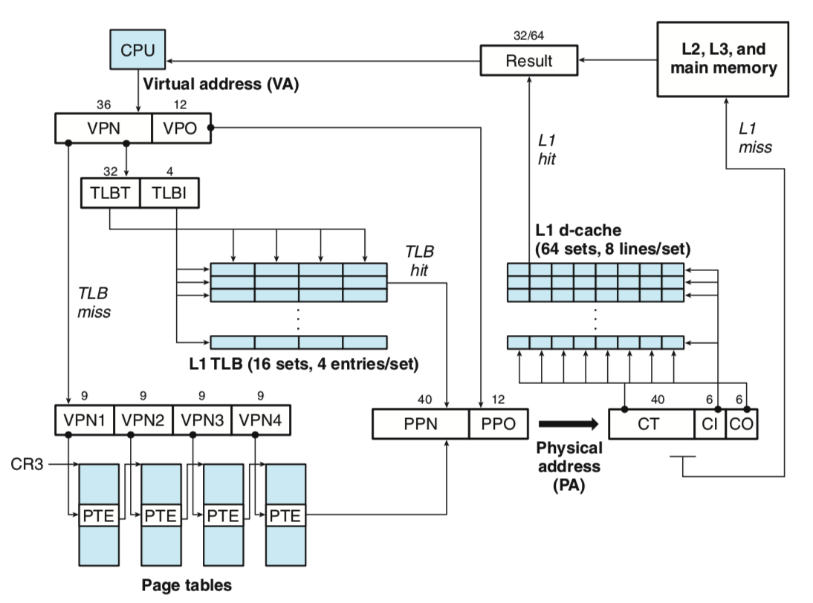
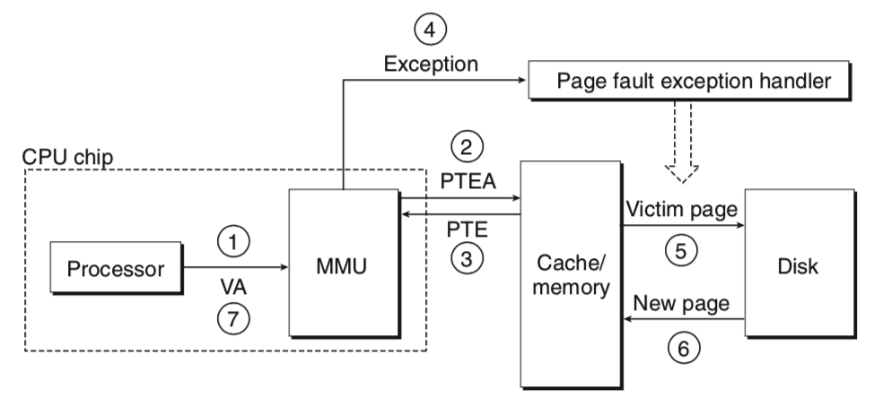
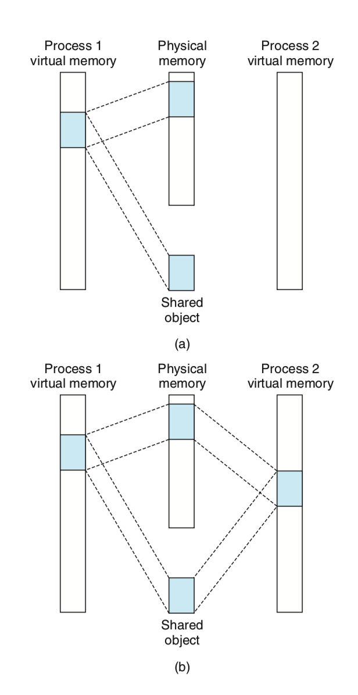
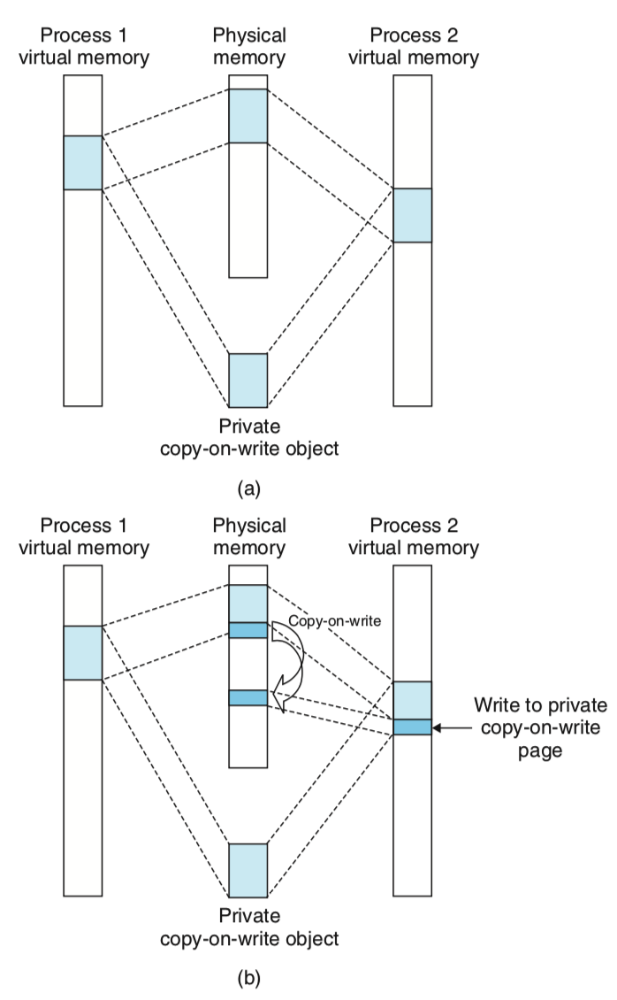
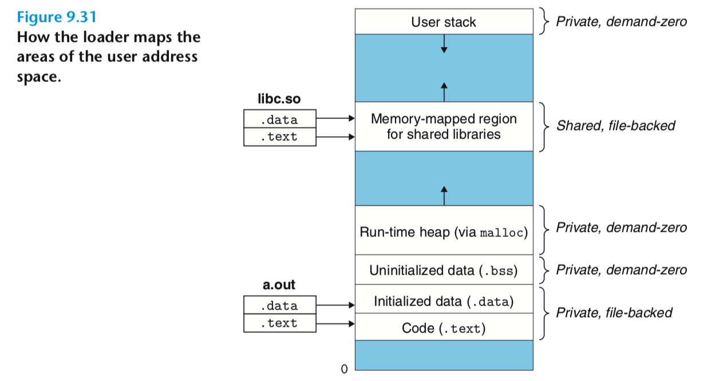
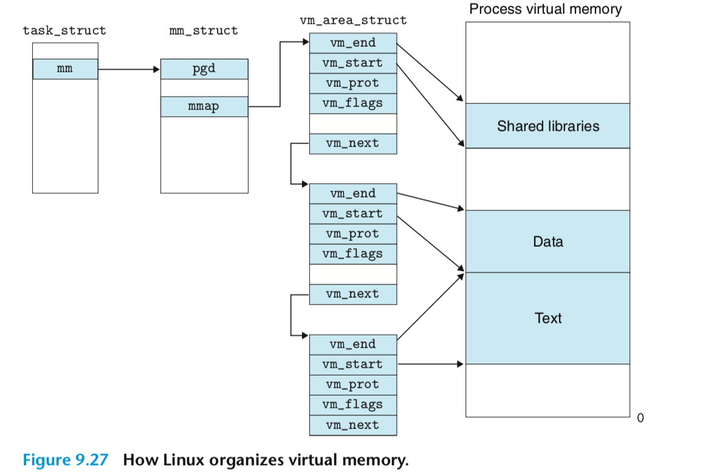
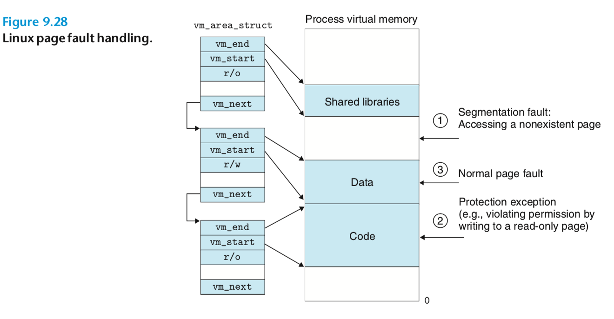

## 虚拟内存

### 1. 虚拟内存到物理内存的映射过程

每个进程有自己相互独立的内存空间。可执行文件中的内存地址都是虚拟地址。CPU在运行的时候，发出的地址也是虚拟地址，这个虚拟地址需要经过硬件和OS的合作来转换成真实的物理地址。

操作系统在管理物理内存的时候是将物理内存分成固定大小的页(4KB)，然后将进程的虚拟地址也分成对应大小的快。所以需要做的就是将不同的块做一个映射。

系统为每个进程维护了一个页表，页表的每一项记录着其对应的物理内存的页框号。下面是一个简单的转换过程。

假设虚拟内存地址空间为48个bit(256TB)，物理内存的地址空间为52个bit(4PB)，页大小为12bit(4K)。

这样的话，对于每个进程而言，其有一个大小为36bit的虚拟页号以及40bit的物理页框号。

当CPU拿到一个虚拟地址希望访存的时候，将其分为虚拟页框号和便宜两个部分，先拿着虚拟页框号查TLB，TLB命中就直接将物理页框号和偏移拼接起来得到物理地址。在拿着物理地址进行访存。访存的时候也是先看缓存汇总是否有，没有的话再访问下一级存储器。如果TLB没有命中的话，就利用`CR3`寄存器(存储当前进程的一级页表基址)逐级地查页表。

### 2. 缺页中断

下面是一个更加抽象的流程图。

当发现要访问的虚拟地址所在的虚拟页还没有被映射的时候，操作系统首先检查`mmap`看这个虚拟地址是否合法。如果不合法，则直接终止进程，抛出`Segment Fault`错误。如果合法，说明还没有加载进来，那么就会触发缺页中断，中断函数会将缺少的页从磁盘加载到主存中，并维护好页表，做好对应的映射关系。准备好之后，将重新执行触发缺页终端的那一条指令。

### 3. 内存映射

当初始化一个进程的时候，Linux系统通过将虚拟地址空间和一个磁盘上的对象相关联来初始化这个进程的虚拟地址空间，这个过程称之为**内存映射**。

可执行文件存储在磁盘中，其中有虚拟内存中的各个段的数据，比如代码段，数据段等。比如代码段，它在程序执行的过程中应该是不变的，而且在内存中的样子和在磁盘中是一样的，所以是如何加载到内存中的呢。

Linux将内存的不同区域映射成下面两种磁盘文件中的一种：

1. Linux文件系统的常规文件。比如可执行文件。文件的某一部分被划分为页大小的快，每一块包含一个虚拟地址页的初始内容。当某一块不足一页的时候，用零进行填充。但是操作系统并不会在一开始就将所有的内容真的放到内存中，而是CPU第一次访问发生了缺页的时候，才由缺页中断将这一页调入物理内存。
2. 匿名文件。虚拟内存的一片区域也可以映射到由内核创建的一个匿名文件，如堆栈部分和未初始化的全局变量，在可实行文件中并没有实体，这些会映射到匿名文件。当CPU访问这些区域的时候，内核找到一个物理页，将它清空，然后更新进程的页表。这个过程没有发生磁盘到主存中间的数据交互。但是需要注意，在`C++`堆申请的内存不一定都是0，因为`C++`内部实现了堆内存管理，可能申请的内存并不是操作系统新分配的，而是之前分配了返回了，但是被`C++`内存管理部分保留了，这次申请又直接返回给了用户。

在上面两种情况下，虚拟页被初始化之后，它会在**交换空间和主存中进行换入换出**。交换空间的大小限制了当前正在运行的进程的虚拟页的最大数量。交换空间的大小可以在按照操作系统的时候进行设置。

#### 3.1 内存映射与进程间共享对象

不同的进程可以共享对象。比如代码段是只读的，运行同一个可执行文件的进程可以共享虚拟内存的代码段，这样可以节省物理内存。还有进程间通信的共享内存机制。这些都可以在虚拟内存映射这个层次来实现。可以将不同进程的虚拟页映射到同一个物理页框，从而实现不同进程之间的内存共享。

同时为了节省物理内存，可以使用`copy-on-write`技术，来实现进程私有的地址空间共享。初始时刻让多个进程共享一个物理内存页，然后当有某一个进程对这个页进行写的时候，出发`copy-on-write`机制，将这个物理页进行复制，这样就实现了私有化。

#### 3.2 再看`fork`函数

在`fork`函数中，内核会为子进程创建一系列数据结构分配一个独一无二的`PID`。子进程的`mm_struct`、`area structs`和`page tables`和父进程完全一样，然后将两个进程的所有页都标记为`read-only`，然后`area structs`都是私有的`copy-on-write`。所以子进程和父进程具有完全一致的虚拟内存。当任意一个进程对虚拟内存进行修改的时候，会触发`copy-on-write`机制，从而使得每个进程有自己独立的虚拟地址空间，同时又实现了物理内存复用。

#### 3.3 再看`execve`函数

调用`execve`函数使得进程加载并执行新的可执行程序。其分为如下几个步骤：

1. 删除存在的用户区。将当前进程的虚拟地址中的用户部分对应的`area struct`删除。
2. 映射私有区域。为新的可执行文件的code, data, bss, stack区域创建新的`area struct`。这些都是`private copy-on-write`的。code和data被映射到可执行文件的`.text`段和`.data`段。`bss`段被映射到匿名文件，在可执行文件中有这一部分的大小。栈和堆也是`demand-zero`，初始时刻长度为零。
3. 映射共享区域。如果可执行文件链接到了共享链接库，比如C标准库`libc.so`，会动态链接进程序，这些被映射到了虚拟地址空间。
4. 设置PC指针，作为当前进程的执行入口。

### 4. Linux虚拟内存区域

Linux将虚拟内存划分为不同的区域，用一个`mmap`指向的链表指向的数据结构来表示。

每个区域代表不同的段，比如代码段，数据段等。而且`vm_area_struct`还记录了当前虚拟内存的这些段的起始地址和终止地址。

当用户程序动态申请扩展栈空间时，操作系统只是将对应的区域的`vm_erea_struct`的起始终止位置扩张了，记录了一下，并没有真的为其分配物理内存。当真的访问的时候，先查这个结构看是否合法，合法之后再调用缺页中断来加载。

常见的`Segment Fault`是这样发生的。应用程序访问了一个虚拟地址，但是这个地址操作系统并没有在虚拟内存给他分配。也就是当CPU访问一个虚拟地址的时候，OS查这些段，发现都不在这些段中，这个时候就直接报段错误，然后终止进程。

这也解释了为什么我们在程序中开比内存大的全局数组，但是并不会报错。因为操作系统真正并不会一开始就分配那么多内存，只有当你用到了才会真的分配。只要没用到，就没问题！

