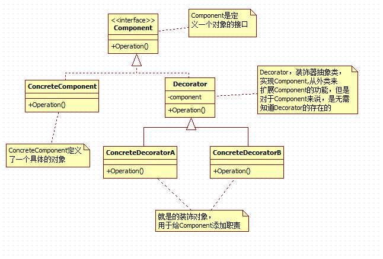

## 1. 装饰器(Decorator)模式

动态地给一个对象添加一些额外的职责，就增加功能来说，装饰器模式比生成子类更为灵活；它允许向一个现有的对象添加新的功能，同时又不改变其结构。

装饰器模式的UML图如下所示：




- Component：接口，定义一个抽象接口，真实对象和装饰对象具有相同的接口，以便动态的添加职责。

- ConcreteComponent：具体的对象。

- Decorator：装饰类，实现了Component,从外类来扩展Component类的功能，并且持有一个构建引用(具体的对象)，进行请求转发。

- ConcreteDecorator：具体装饰类，用于给实际对象添加职责。

### 代码实例

现在考虑这样一个场景，现在有一个煎饼摊，人们去买煎饼（Pancake）,有些人要加火腿（Ham）的，有些人要加鸡蛋（Egg）的，有些人要加生菜（Lettuce。

#### 1. 定义接口(IPancake)

```java
/**
 * 定义一个煎饼接口
 */
public interface IPancake {
    /**
     * 定义烹饪操作
     */
    void cook();

}
```

#### 2. 定义具体实现类(Pancake)

```java
/**
 * 具体的煎饼对象，可以用装饰器扩展功能
 */
public class Pancake implements IPancake {
    /**
     * 实现了接口的cook方法
     */
    public void cook() {
        System.out.println("正在做煎饼");
    }

}
```

#### 3. 定义抽象装饰类

```java
public abstract class PancakeDecorator implements IPancake{

    /**
     * 维护具体实现类的引用
     */
    private IPancake pancake;

    public PancakeDecorator(IPancake pancake) {
        this.pancake = pancake;
    }

    @Override
    public void cook() {
        if(this.pancake != null){
            this.pancake.cook();
        }
    }
}
```

#### 4. 定义各种具体装饰类

```java
public class EggDecorator extends PancakeDecorator {

    public EggDecorator(IPancake pancake) {
        super(pancake);
    }

    /**
     * 覆盖cook方法，添加新功能。
     */
    @Override
    public void cook() {
        System.out.println("加了一个鸡蛋");
        super.cook();
    }
}

public class HamDecorator extends PancakeDecorator {

    public HamDecorator(IPancake pancake) {
        super(pancake);
    }

    @Override
    public void cook() {
        System.out.println("加了一个火腿");
        super.cook();

    }
}

public class LettuceDecorator extends PancakeDecorator {

    public LettuceDecorator(IPancake pancake) {
        super(pancake);
    }

    @Override
    public void cook() {
        System.out.println("加了一个生菜");
        super.cook();
    }
}
```

#### 5. 客户端测试

```java
public class Test {

    @org.junit.Test
    public void test1() {
        IPancake pancake = new Pancake();
        IPancake pancake1 = new EggDecorator(pancake);
        IPancake pancake2 = new HamDecorator(pancake1);
        IPancake pancake3  = new LettuceDecorator(pancake2);
        pancake3.cook();
    }
}

/**
输出结果
加了一个生菜
加了一个火腿
加了一个鸡蛋
正在做煎饼
*/
```

### 总结

装饰器和代理：

对装饰器模式来说，装饰者（decorator）和被装饰者（decoratee）都实现同一个 接口。对代理模式来说，代理类（proxy class）和真实处理的类（real class）都实现同一个接口。

装饰器模式关注于在一个对象上动态的添加方法，然而代理模式关注于控制对对象的访问。换句话 说，用代理模式，代理类（proxy class）可以对它的客户隐藏一个对象的具体信息。因此，当使用代理模式的时候，我们常常在一个代理类中创建一个对象的实例。并且，当我们使用装饰器模 式的时候，我们通常的做法是将原始对象作为一个参数传给装饰者的构造器。

使用代理模式，代理和真实对象之间的的关系通常在编译时就已经确定了，而装饰者能够在运行时递归地被构造。

代理模式被代理的类对于用户来说是透明的；装饰器模式中的被装饰的类用户是知道的。

#### 代理模式

```java
//代理模式
public class Proxy implements Subject{

       private Subject subject;
       public Proxy(){
             //关系在编译时确定
            subject = new RealSubject();
       }
       public void doAction(){
             ….
             subject.doAction();
             ….
       }
}

//代理的客户
public class Client{
        public static void main(String[] args){
             //客户不知道代理委托了另一个对象
             Subject subject = new Proxy();
             …
        }
}
```

#### 装饰器模式

```java
//装饰器模式
public class Decorator implements Component{
        private Component component;
        public Decorator(Component component){
            this.component = component
        }
       public void operation(){
            ….
            component.operation();
            ….
       }
}

//装饰器的客户
public class Client{
        public static void main(String[] args){
            //客户指定了装饰者需要装饰的是哪一个类
            Component component = new Decorator(new ConcreteComponent());
            …
        }
}
```

## 2. 适配器模式

> 适配器模式把一个类的接口变换成客户端所期待的另一种接口，从而使原本因接口不匹配而无法在一起工作的两个类能够在一起工作

用电器做例子，笔记本电脑的插头一般都是三相的，即除了阳极、阴极外，还有一个地极。而有些地方的电源插座却只有两极，没有地极。电源插座与笔记本电脑的电源插头不匹配使得笔记本电脑无法使用。这时候一个三相到两相的转换器（适配器）就能解决此问题，而这正像是本模式所做的事情。

### 2.1 适配器模式的结构

- 类的适配器
- 对象的适配器

#### 2.1.1 类的适配器

类的适配器模式把适配的类的API转换成为目标类的API。下面是UML图：

可以看到，适配器是继承自源类，实现目标接口。

- **目标(Target)角色：**这就是所期待得到的接口。注意：由于这里讨论的是类适配器模式，因此目标不可以是类。
- **源(Adapee)角色：**现在需要适配的接口。
- **适配器(Adaper)角色：**适配器类是本模式的核心。适配器把源接口转换成目标接口。显然，这一角色不可以是接口，而必须是具体类。


##### 实现代码：

```java
public interface Target {
    /**
     * 这是源类Adaptee也有的方法
     */
    public void sampleOperation1(); 
    /**
     * 这是源类Adapteee没有的方法
     */
    public void sampleOperation2(); 
}

public class Adaptee {
    
    public void sampleOperation1(){}

}

public class Adapter extends Adaptee implements Target {
    /**
     * 由于源类Adaptee没有方法sampleOperation2()
     * 因此适配器补充上这个方法
     */
    @Override
    public void sampleOperation2() {
        //写相关的代码
    }
}
```

#### 2.1.2  对象的适配器

与类的适配器模式一样，对象的适配器模式把被适配的类的API转换成为目标类的API，与类的适配器模式不同的是，对象的适配器模式不是使用继承关系连接到Adaptee类，而是使用委派关系连接到Adaptee类。


从上图可以看出，Adaptee类并没有sampleOperation2()方法，而客户端则期待这个方法。为使客户端能够使用Adaptee类，需要提供一个包装(Wrapper)类Adapter。这个包装类包装了一个Adaptee的实例，从而此包装类能够把Adaptee的API与Target类的API衔接起来。Adapter与Adaptee是委派关系，这决定了适配器模式是对象的。

##### 实现代码：

```java
public interface Target {
    /**
     * 这是源类Adaptee也有的方法
     */
    public void sampleOperation1(); 
    /**
     * 这是源类Adapteee没有的方法
     */
    public void sampleOperation2(); 
}

public class Adaptee {

    public void sampleOperation1(){}
    
}

public class Adapter {
    private Adaptee adaptee;
    
    public Adapter(Adaptee adaptee){
        this.adaptee = adaptee;
    }
    /**
     * 源类Adaptee有方法sampleOperation1
     * 因此适配器类直接委派即可
     */
    public void sampleOperation1(){
        this.adaptee.sampleOperation1();
    }
    /**
     * 源类Adaptee没有方法sampleOperation2
     * 因此由适配器类需要补充此方法
     */
    public void sampleOperation2(){
        //写相关的代码
    }
}
```

### 2.2 两种模式对比

- **类适配器**使用对象继承的方式，是静态的定义方式；而**对象适配器**使用对象组合的方式，是动态组合的方式。
- **对于类适配器**，由于适配器直接继承了Adaptee，使得适配器不能和Adaptee的子类一起工作，因为继承是静态的关系，当适配器继承了Adaptee后，就不可能再去处理  Adaptee的子类了。
- **对于对象适配器**，一个适配器可以把多种不同的源适配到同一个目标。换言之，同一个适配器可以把源类和它的子类都适配到目标接口。因为对象适配器采用的是对象组合的关系，只要对象类型正确，是不是子类都无所谓。
- **对于类适配器**，适配器可以重定义Adaptee的部分行为，相当于子类覆盖父类的部分实现方法。
- **对于对象适配器**，要重定义Adaptee的行为比较困难，这种情况下，需要定义Adaptee的子类来实现重定义，然后让适配器组合子类。虽然重定义Adaptee的行为比较困难，但是想要增加一些新的行为则方便的很，而且新增加的行为可同时适用于所有的源。
- **对于类适配器**，仅仅引入了一个对象，并不需要额外的引用来间接得到Adaptee。
- **对于对象适配器**，需要额外的引用来间接得到Adaptee。
- 建议尽量使用对象适配器的实现方式，**多用合成/聚合、少用继承**。当然，具体问题具体分析，根据需要来选用实现方式，最适合的才是最好的。

### 2.3 适配器模式优缺点

- 更好地复用性：系统需要使用现有的类，而此类的接口不符合系统的需要。那么通过适配器模式就可以让这些功能得到更好的复用。
- 更好地扩展性：在实现适配器功能的时候，可以调用自己开发的功能，从而自然地扩展系统的功能。

**缺点：**过多的使用适配器，会让系统非常零乱，不易整体进行把握。比如，明明看到调用的是A接口，其实内部被适配成了B接口的实现，一个系统如果太多出现这种情况，无异于一场灾难。因此如果不是很有必要，可以不使用适配器，而是直接对系统进行重构。

### 2.4 缺省适配器模式

缺省适配(Default Adapter)模式为一个接口提供缺省实现，这样子类型可以从这个缺省实现进行扩展，而不必从原有接口进行扩展。作为适配器模式的一个特例，缺省是适配模式在JAVA语言中有着特殊的应用。

在很多情况下，必须让一个具体类实现某一个接口，但是这个类又用不到接口所规定的所有的方法。通常的处理方法是，这个具体类要实现所有的方法，那些有用的方法要有实现，那些没有用的方法也要有空的、平庸的实现。

这些空的方法是一种浪费，有时也是一种混乱。除非看过这些空方法的代码，程序员可能会以为这些方法不是空的。即便他知道其中有一些方法是空的，也不一定知道哪些方法是空的，哪些方法不是空的，除非看过这些方法的源代码或是文档。

缺省适配模式可以很好的处理这一情况。可以设计一个抽象的适配器类实现接口，此抽象类要给接口所要求的每一种方法都提供一个空的方法。


**代码实例如下：**

```java
/**
定义接口
*/
public interface AbstractService {
    public void serviceOperation1();
    public int serviceOperation2();
    public String serviceOperation3();
}

/**
定义抽象类，对接口中的每种方法进行默认的实现，后续类继承这个抽象的类，对需要
实现的方法进行实现即可。
*/
public abstract class ServiceAdapter implements AbstractService{

    @Override
    public void serviceOperation1() {
    }

    @Override
    public int serviceOperation2() {
        return 0;
    }

    @Override
    public String serviceOperation3() {
        return null;
    }

}
```

可以看到，接口AbstractService要求定义三个方法，分别是serviceOperation1()、serviceOperation2()、serviceOperation3()；而抽象适配器类ServiceAdapter则为这三种方法都提供了平庸的实现。因此，任何继承自抽象类ServiceAdapter的具体类都可以选择它所需要的方法实现，而不必理会其他的不需要的方法。

**适配器模式的用意**是要改变源的接口，以便于目标接口相容。**缺省适配的用意稍有不同**，它是为了方便建立一个不平庸的适配器类而提供的一种平庸实现。

> 在任何时候，如果不准备实现一个接口的所有方法时，就可以使用“缺省适配模式”制造一个抽象类，给出所有方法的平庸的具体实现。这样，从这个抽象类再继承下去的子类就不必实现所有的方法了。