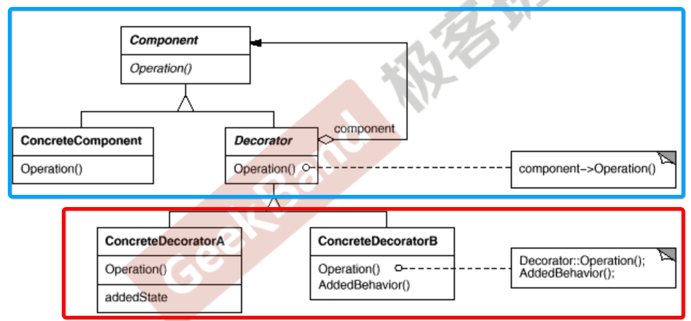

## 装饰模式

在某些情况下，为了扩展对象的功能，我们可以使用继承的方式，然后对对象原有的方法进行重写。但是继承为类型引入的**静态特质**(写死了，无法扩展)，使得这种扩展方式缺乏灵活性，而且随着子类的增多(扩展功能的增多)，各种子类的组合(扩展功能的组合)会导致子类的膨胀。

如何使得对象功能的扩展能够根据需求动态地实现。也就是我们需要哪些功能，可以在编译之后不需要修改它们的源码，可以在运行时进行动态的组合，从而实现各种功能的扩展。

> 动态(组合)地给一个对象增加一些额外的职责。就增加功能而言，Decorator模式比生成子类(继承)更为灵活(消除重复代码，减少子类个数)。

这里动态地给一个对象增加一些额外的职责的意思是，这个对象的代码已经被编译好了，且我们不希望再对其进行更改，但是在开发的时候，我们希望能够对这些类的功能进行扩充。

### 代码实例

下面是一个具体的例子。

输入输出流有很多形式，从文件，从网络，从内存等，他们有统一的对外接口。

于是我们可以定义一个基类，然后各种流继承这个基类。

```c++
//业务操作，基类
class Stream{
public：
    virtual char Read(int number)=0;
    virtual void Seek(int position)=0;
    virtual void Write(char data)=0;
    
    virtual ~Stream(){}
};

//主体类
class FileStream: public Stream{
public:
    virtual char Read(int number){
        //读文件流
    }
    virtual void Seek(int position){
        //定位文件流
    }
    virtual void Write(char data){
        //写文件流
    }

};

class NetworkStream :public Stream{
public:
    virtual char Read(int number){
        //读网络流
    }
    virtual void Seek(int position){
        //定位网络流
    }
    virtual void Write(char data){
        //写网络流
    }
    
};

class MemoryStream :public Stream{
public:
    virtual char Read(int number){
        //读内存流
    }
    virtual void Seek(int position){
        //定位内存流
    }
    virtual void Write(char data){
        //写内存流
    }
};
```

现在我们希望对这些类的功能进行扩充，比如，我希望能够对流进行加密，那么一种实现方式是，对每个类继承一个子类，来实现加密的功能。虽然有加密的扩展功能，但是对外暴露的接口确实不变的。

```c++
//扩展操作
class CryptoFileStream :public FileStream{
public:
    virtual char Read(int number){
       
        //额外的加密操作...
        FileStream::Read(number);//读文件流
        
    }
    virtual void Seek(int position){
        //额外的加密操作...
        FileStream::Seek(position);//定位文件流
        //额外的加密操作...
    }
    virtual void Write(byte data){
        //额外的加密操作...
        FileStream::Write(data);//写文件流
        //额外的加密操作...
    }
};

class CryptoNetworkStream : :public NetworkStream{
public:
    virtual char Read(int number){
        
        //额外的加密操作...
        NetworkStream::Read(number);//读网络流
    }
    virtual void Seek(int position){
        //额外的加密操作...
        NetworkStream::Seek(position);//定位网络流
        //额外的加密操作...
    }
    virtual void Write(byte data){
        //额外的加密操作...
        NetworkStream::Write(data);//写网络流
        //额外的加密操作...
    }
};

class CryptoMemoryStream : public MemoryStream{
public:
    virtual char Read(int number){
        
        //额外的加密操作...
        MemoryStream::Read(number);//读内存流
    }
    virtual void Seek(int position){
        //额外的加密操作...
        MemoryStream::Seek(position);//定位内存流
        //额外的加密操作...
    }
    virtual void Write(byte data){
        //额外的加密操作...
        MemoryStream::Write(data);//写内存流
        //额外的加密操作...
    }
};
```

然后我们还希望扩展缓存的功能，缓存加加密的功能。

那么一路继承下去，类的数量会非常的庞大。

```c++
class BufferedFileStream : public FileStream{
    //...
};

class BufferedNetworkStream : public NetworkStream{
    //...
};

class BufferedMemoryStream : public MemoryStream{
    //...
}


class CryptoBufferedFileStream :public FileStream{
public:
    virtual char Read(int number){
        
        //额外的加密操作...
        //额外的缓冲操作...
        FileStream::Read(number);//读文件流
    }
    virtual void Seek(int position){
        //额外的加密操作...
        //额外的缓冲操作...
        FileStream::Seek(position);//定位文件流
        //额外的加密操作...
        //额外的缓冲操作...
    }
    virtual void Write(byte data){
        //额外的加密操作...
        //额外的缓冲操作...
        FileStream::Write(data);//写文件流
        //额外的加密操作...
        //额外的缓冲操作...
    }
};
```

假设一共有`n`个类，以及`m`中功能，这些功能是可以嵌套同时存在的。

那么按照这种继承，每种排列组合的形式都整一个类的话，一共需要的类的个数是$n2^m$

而且有可能很多种组合应用程序开发根本用不到，但是我们将其写死了，编译到了二进制文件中，也增加了冗余。同时每种扩展的功能其实做的事情都差不多，所以在源代码也形成了冗余。

一种比较知觉的思路是，能够将这些基本的类，和这些扩展的功能放到不同的地方，在编译的时候分开编译，在运行的时候再动态地将他们组合起来，让调用者自己进行组合，从而实现自己想要的功能？

如果这样的话，我们一共提供的类的个数就是$n + m$，个数少了很多。

在运行时为类扩充功能可以使用继承和组合的形式，使用继承显然不行的，使用组合的话，也是让用户使用我们编译好的各种组件来进行组合。那么这些组件该如何设计呢。

首先将各个扩充的功能，比如加密、缓冲等抽象出来，他们的动作都是类似的，而且他们用到的文件流、网络流、内存流的接口都是相同的，所以可以先进行如下的抽象。

```c++
#include <iostream>

class Stream{
public:

    virtual char Read(int number)=0;
    virtual void Seek(int position)=0;
    virtual void Write(char data)=0;
    virtual ~Stream(){}

};


class FileStram : public Stream {
public:
    virtual char Read(int number) {
        std::cout << "调用文件read" << std::endl;
        return 'a';
    }
    virtual void Seek(int position) {
        std::cout << "调用文件seek" << std::endl;
    }
    virtual void Write(char data) {
        std::cout << "写字符:" << data << std::endl;
    }
};

class NetworkStream : public Stream {
public:
    virtual char Read(int number) {
        std::cout << "调用网络read" << std::endl;
        return 'a';
    }
    virtual void Seek(int position) {
        std::cout << "调用网络seek" << std::endl;
    }
    virtual void Write(char data) {
        std::cout << "写字符:" << data << std::endl;
    }
};

class MemoryStream : public Stream {
public:
    virtual char Read(int number) {
        std::cout << "调用内存read" << std::endl;
        return 'a';
    }
    virtual void Seek(int position) {
        std::cout << "调用内存seek" << std::endl;
    }
    virtual void Write(char data) {
        std::cout << "写字符:" << data << std::endl;
    }
};


class JM : public Stream {  // 自己也继承Stream基类，使得可以进行链式传递，自己装饰完了还可以让别的继续装饰
public:

    JM(Stream *stm) : stream(stm) {}
    virtual char Read(int number) {

        std::cout << "加密操作" << std::endl;
        return stream->Read(number);
    }
    virtual void Seek(int position) {
        stream->Seek(position);
    }
    virtual void Write(char data) {
        std::cout << "解密操作" << std::endl;
        stream->Write(data);
    }
private:
    Stream* stream;  // 组合一个抽象的文件流类 
};

class Buffer : public Stream {
public:

    Buffer(Stream *stm) : stream(stm){}

    virtual char Read(int number) {

        std::cout << "缓冲操作" << std::endl;
        return stream->Read(number);
    }
    virtual void Seek(int position) {
        stream->Seek(position);
    }
    virtual void Write(char data) {
        std::cout << "缓冲操作" << std::endl;
        stream->Write(data);
    }
private:
    Stream* stream;
};

int main() {
    Stream* fileStream = new FileStram();
    Stream* jmFileStream = new JM(new FileStram());
    jmFileStream->Read(1);
    Stream* bufferJmFileStream = new Buffer(new JM(new FileStram)); // 在运行时随意对类进行组合都可以动态的进行功能地扩展
    bufferJmFileStream->Read(1);
    return 0;
}
```

在上面的处理中，我们将扩展的各个功能单独抽象出来作为一个子类，这个类组合了一个要被扩展功能的流基类。这样相对啥类的功能进行扩展的话，就可以在运行时将谁传给装饰器类。

同时为了能够对功能进行多种扩展，我们将装饰器也继承Stream，也就是被装饰器装饰过的对象也是一个Stream，这样就可以多层地扩展功能。

有了上面的设计，在写好各种功能，编译完成之后，用户就可以根据自己的需要，动态的组合各种功能！！

仔细观察上面的代码，还有一些地方可以进一步抽象。比如所有的装饰器类都有共同的属性等，我们可以将其进一步抽象出装饰器基类。

下面是代码

```c++
// 将所有的装饰器不变的，同种的东西抽象出来
class Decorator : public Stream {
public:
    Decorator(Stream* stm) : stream(stm) {}

protected:
    Stream* stream;
};

// 每种扩展的功能继承Decorator
class JM : public Decorator {
public:

    JM(Stream *stm) : Decorator(stm) {}
    virtual char Read(int number) {

        std::cout << "加密操作" << std::endl;
        return stream->Read(number);
    }
    virtual void Seek(int position) {
        stream->Seek(position);
    }
    virtual void Write(char data) {
        std::cout << "解密操作" << std::endl;
        stream->Write(data);
    }
};

class Buffer : public Decorator {
public:

    Buffer(Stream *stm) : Decorator(stm){}

    virtual char Read(int number) {

        std::cout << "缓冲操作" << std::endl;
        return stream->Read(number);
    }
    virtual void Seek(int position) {
        stream->Seek(position);
    }
    virtual void Write(char data) {
        std::cout << "缓冲操作" << std::endl;
        stream->Write(data);
    }
};
```

通过对上面代码的不断重构，最终达到了运行时由用户自由组合来实现功能扩展的目的。

想要实现新的功能扩展的话，只需要继承`Decorator`，实现方法即可！

### UML图



### 总结

1. 通过组合而非继承的方法，Decorator模式实现了在运行时动态扩展对象的功能，而且可以根据需求扩展多个功能，避免了使用继承带来的问题。
2. Decorator在接口上表现为is - a component的继承关系，也就是其继承了Component的所有接口，同时在实现上又表现为has a component的组合关系，它使用了另一个Component类。
3. Decorator模式的目的不是解决多子类衍生的多继承问题，而是用于解决”主体“类在多个方向上的扩展功能，就是”装饰“的含义。