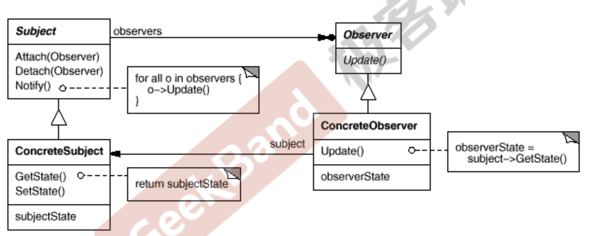

### 观察者模式

观察者模式提供了一套通知的设计框架。有时需要为某些对象建立一种”通知依赖关系“，也就是一个对象(目标对象)的状态发生改变，所有的依赖对象(观察者对象)都将得到通知。观察者模式可以比较好地解决这个问题。

> 观察者模式：定义对象间的一种一对多(变化)的依赖关系，以便当一个对象的状态发生改变时，所有依赖于它的对象都得到通知并更新。

具体的UML图如下所示：



#### 代码示例

考虑如下的场景，我们需要设计一个文件分割器。

上来我们可以写出如下的代码。

```c++
class NaiveImplement {

public:
    NaiveImplement() = default;
    ~NaiveImplement() = default;

    // 文件分割操作
    void do_split(std::string fileName, int splitNum) {  // 传入要分割的文件路径，以及文件个数
        std::cout << "split begin" << std::endl;
        std::cout << "split finish" << std::endl;
    }
};

// 主函数
#include "NaiveImplement.h"
int main() {
    NaiveImplement naiveImplement;
    naiveImplement.do_split("file1", 10);
    return 0;
}
```

现在文件较大，我们希望在分割文件的时候，实时地反馈现在分割的进度，以进度条的形式呈现出来。

那么我们可以直接在代码中加入一个进度条，写出如下的代码。

```c++
#include <iostream>
#include <string>
#include <unistd.h>


// 一个进度条类
class ProcessBar{

public:
    void set_value(float value) {
        std::cout << "complete:" << value << "/1" << '\n';
    }
};


class Version1 {

public:
    Version1(ProcessBar* processBar = nullptr) : m_processBar(processBar) {};
    ~Version1() {delete m_processBar;}

    // 文件分割操作
    void do_split(std::string fileName, int splitNum) {
        std::cout << "split begin" << std::endl;
        for (int i = 0; i <= splitNum; i ++) {
            sleep(1);
            // 调用进度条方法，通知进度
            m_processBar->set_value(static_cast<float>(i) / static_cast<float>(splitNum)); 
        } 
        std::cout << "split finish" << std::endl;
    }

private:
    ProcessBar* m_processBar;  // 在文件分割器中添加一个进度条成员，强耦合。
};

int main() {
    ProcessBar *processBar = new ProcessBar();
    Version1 version1(processBar);
    version1.do_split("file1", 5);
    return 0;
}
```

上面的代码虽然实现了功能，但是增加一个时间的维度来看，如果我们需要变化进度条的样式，该怎么办。比如以一个饼状图的形式展现，或者以一个点的形式展现。

我们可以根据设计第一原则，顶层依赖抽象，将所有的这种进度条之类的东西提取一个抽象类，然后再文件分割器中增加一个抽象类的成员，其它的所有类似的接受状态改变的类继承这个子类即可。

下面是改良的代码

```c++
// 抽象出基类，作为顶层和底层的粘合剂
class IProcessBar{
public:
    virtual void  set_value(float value) = 0;
    virtual ~IProcessBar() = default;  // 基类要定义虚析构函数，在多态的时候可以正确调用子类的析构函数
};

// 实现多种不同的观察者
class ProcessBar2 : public IProcessBar {
public:
    void set_value(float value) {
        std::cout << "complete:" << value << "/1" << '\n';
    }
};

class ProcessBar3 : public IProcessBar {
public:

    void set_value(float value) {
        std::cout  << '.';
    }
};


class Version2 {

public:
    Version2(std::unique_ptr<IProcessBar> processBar) : m_processBar(std::move(processBar)){};
    ~Version2() = default;

    // 文件分割操作
    void do_split(std::string fileName, int splitNum) {
        std::cout << "split begin" << std::endl;
        for (int i = 0; i <= splitNum; i ++) {
            sleep(1);
            m_processBar->set_value(static_cast<float>(i) / static_cast<float>(splitNum));
        }
        std::cout << "split finish" << std::endl;
    }

private:
    std::unique_ptr<IProcessBar> m_processBar;  // 存储的是基类指针
};

void test_version_2() {
    Version2 version2(std::make_unique<ProcessBar2>());  // 传入第一种观察者
    version2.do_split("file", 5);
    Version2 version21(std::make_unique<ProcessBar3>()); // 传入第二种观察者
    version21.do_split("file", 5);
}

int main() {
    test_version_2();
    return 0;
}
```

在上面的代码中，我们就通过引入基类，来将顶层和底层解耦合了。如果希望添加新的类型的观察者的话，那么顶层的文件分割器就可以不同修改代码，也就不用重新编译。只需要增加不同的观察者子类即可。

现在的代码还可以进一步改进。当一个对象的状态发生改变的时候，它可能有多个依赖着，我们希望这些依赖着都得到通知，而且一个对象能够动态支持增加观察者，删除观察者的操作呢？

我们可以通过在被观察的对象中增加一个容器来存储所有的观察者，同时暴露出接口供观察者将自己添加和删除。

因为订阅这个动作是观察者来决定的。所以就有了如下的代码。

```c++
// 所有观察的抽象基类
class IObserver {
public:
    virtual ~IObserver() = default;
    // 所有观察者接受消息的统一接口
    virtual void update(float value) = 0;
};

// 被观察者的抽象基类
class ISubject{
public:
    ISubject() = default;
    virtual ~ISubject() = default;
    // 订阅方法
    void attach(IObserver* observer) {
        observers.push_back(observer);
    }
    // 取消订阅方法
    void detach(IObserver* observer) {
        observers.remove(observer);
    }
    // 通知所有的订阅者
    void notify(float value) {
        for (auto x : observers) {
            x->update(value);
        }
    }
private:
    std::list<IObserver*> observers;  // 存储所有订阅者的指针
};

// 自定义观察者
class Observe1 : public IObserver {
public:
    void update(float value) {
        std::cout << "complete: " << value << "/1" << std::endl;
    }
};

class Observe2 : public IObserver {
public:
    void update(float value) {
        std::cout << '.';
        std::flush(std::cout);
    }
};

// 自定义被观察对象
class Version3 : public ISubject {
public:
    void do_slit(std::string file, int splitNum) {
        std::cout << "split begin" << std::endl;
        for (int i = 0; i <= splitNum; i ++) {
            sleep(1);
            notify(static_cast<float>(i) / static_cast<float>(splitNum));
        }
        std::cout << "split finish" << std::endl;
    }
};

void test_version_3() {
    Version3 version3;
    Observe1 *observe1 = new Observe1();
    Observe2 *observe2 = new Observe2();
    version3.attach(observe1);
    version3.do_slit("file", 5);
    version3.attach(observe2);
    version3.do_slit("file", 5);
    version3.detach(observe1);
    version3.do_slit("file", 5);
}
```

这样就可以实现一个被观察对象可以将自己的状态改变通知所有的观察者，

一个观察者可以自由地将自己注册到任何一个被观察对象上。

### 总结

1. 使用面向对象的抽象，观察者模式使我们可以独立地改变目标与观察者(解耦)
2. 目标发送通知时，无需指定观察者，通知会自动传播
3. 观察者自己决定是否需要订阅通知，目标对象对此一无所知。
4. 观察者模式是基于事件的UI框架中非常常用的设计模式，也是MVC模式的一个重要组成部分。
5. 这种订阅，通知的感觉，非常像社交网络中的用户模型设计。


从可变点来考虑这个模式。最开始的时候，我们直接将接受状态变化的对象硬编码到代码中，

然后我们发现这个对象是易变的，然后将其抽象为一个基类。

然后发现可能需要通知多个对象，所以存储一个观察者的容器。

然后发现是否接受我状态的改变是由观察者自己决定的，就暴露两个添加和删除接口。

然后发现这种模式是固定的，就再一层的抽象，抽象出所有的目标的基类和观察者的基类。

学习设计模式要加上一个时间维度，动态地看我们的代码。


