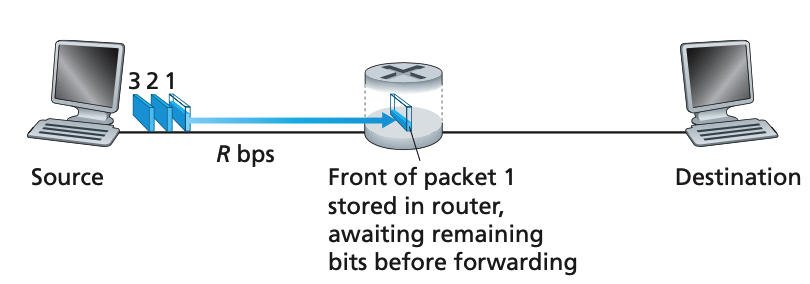
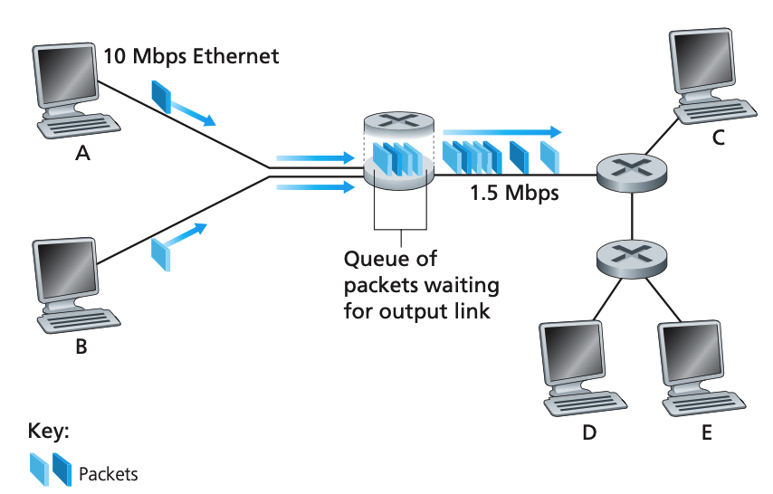
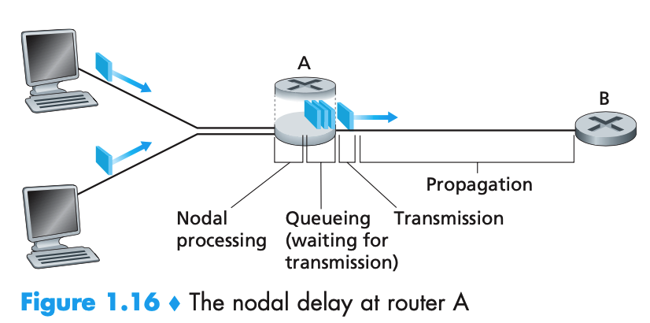
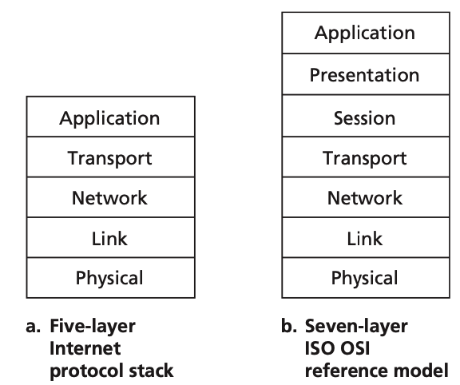
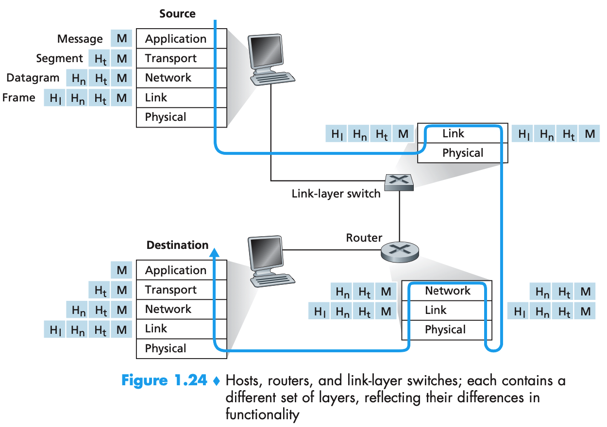

### 1. 分组交换

> 从源端系统向目的端系统发送一个报文，源将长报文划分为较小的数据块，称之为分组。在源和目的地之间，每个分组都通过通信链路和分组交换机传送(交换机主要有两类：路由器和链路层交换机。一个工作在网络层，一个工作在数据链路层)。分组以等于该链路的最大传输速率的速度传输通过该通信链路。

1. 存储转发传输。路由器在转发前需要接收、存储和处理整个分组。如下图所示。

2. 排队时延与分组丢失。每台分组交换机有多条链路和与之相连。对于每条相连的链路，该分组交换机有一个**输出缓存**，也称为输出队列，用于存储路由器准备发往那条链路的分组。分组需要承受输出缓存的**排队时延**，其取决于网络的拥塞程度。一个到达的分组可能发现该缓存已经满了，这种情况下将出现**分组丢失(丢包)**。丢失的分组可能基于端到端的原则重传。

   

   3. 转发表和路由选择协议。源在发送分组时，分组的首部包含了一目的地的IP地址。每台路由器具有一个**转发表(forwarding table)**，用于将目的地址映射称为输出链路。当一个分组到达一台路由器时，路由器检查该地址，用这个目的地址搜索其转发表，发现适当的出链路，路由器将分组导向该出链路。路由选择协议用于自动设置转发表。可以理解为问路的过程。司机到了一个收费站，为收费员某某地怎么走，收费员查表之后不直接告诉它怎么走，而是说你从这条路走，然后司机沿着这条路走到了下一个收费站，然后又问收费站某某地怎么走，然后继续沿着给的方向走，最终达到目的地。

   4. 时延概述。分组在每个节点经受了几种不同类型的时延。最重要的为如下几类。不同类型的网络各个部分占得比重不同。

      $$d_{nodal} = d_{proc} + d_{queue} + d_{trans} + d_{prop}$$

      - 节点处理时延：检查分组首部和决定将分组导向何处所需要的时间是吃处理时延的一部分，
      - 排队时延：在队列中，分组在链路上等待传输时经受的时延
      - 传输时延(transmission delay)：将所有分组的比特推向链路所需要的时间。
      - 传播时延(propagation delay)：从链路起点到路由器传播所需要的时间。
      - 传输时延和传播时延的比较：
        + 传输时延是有路由器推出分组所需要的时间，是分组长度和链路传输速率的函数，与两台路由器之间的距离无关。(电磁波调制解调，带宽越大，码率越高)
        + 传播时延是一个比特从一台路由器传播到另一台路由器所需要的时间，是两台路由器之间距离的函数，而与分组长度或链路传输速率无关。(距离和光速之间的关系)
        + 可以类比收费站，传输时延是每个收费站收费的时间，传播时延是车子在两个收费站之间的路上的时间。
      - 端到端的时延是每个节点的试验累加起来得到的。

      

   5. 吞吐量。吞吐量一般与瓶颈链路的传播速率以及干扰流量有关。

   

### 2. 协议层次与服务模型

现在的计算机网络一般分为如下的五层：

- 应用层：网络应用程序和他们的应用层协议存留的地方。一个端系统中的应用程序使用协议与另一个端系统中的应用程序交换信息分组。
- 传输层：一般有TCP和UDP两种，TCP是面向连接的服务，有确保传递和流量控制，拥塞控制的功能。UDP面向无连接的服务。
- 网络层：所有的网络层设备必须运行IP。网络层负责将分组从一台主机移动到另一台主机。
- 数据链路层：网络层必须依赖链路层的服务，在每个节点，网络层将数据报下传给链路层，链路层沿着路径将数据报传递给下一个节点。在该下一个节点，链路层将数据报上传给网络层。
- 物理层：将帧中的一个个比特从一个节点移动到下一个节点。

ISO OIS七层参考模型中，现有的缺少了表示层和会话层。如果程序开发者觉得这两层服务是否重要，如果重要，则开发者自己在应用程序中构建该功能。

#### 2.1 封装

下图是一个报文通过各个设备从源到目标的过程。

1. 在每一层，一个分组具有两种类型的字段：首部字段和有效载荷字段。有效载荷字段通常是来自上一层的分组。
2. 路由器和链路层交换机并不实现协议中的所有层次。链路层交换机实现了第一层和第二层；路由器实现了第一层到第三层。
3. 主机实现了所有五个层次，**因特网体系结构将它的复杂性放在网络边缘。**

