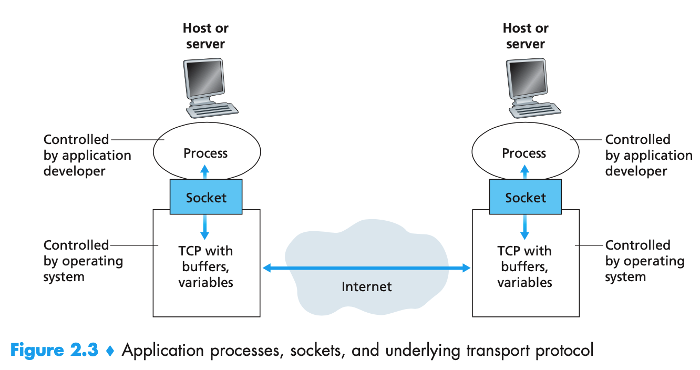
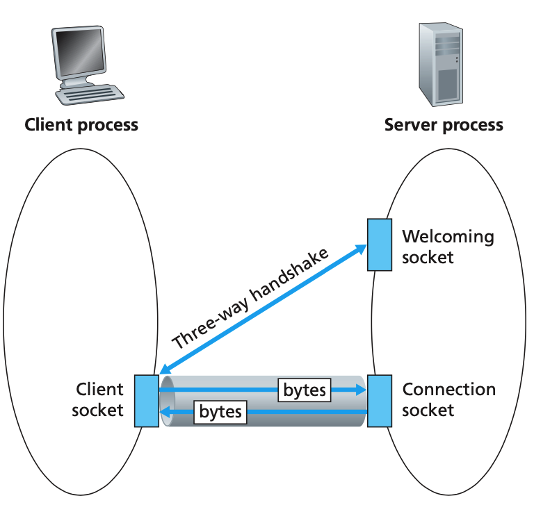

### 1. 网络应用程序

在两个不同端系统上的进程，通过跨越计算机网络交换报文。网络应用程序由成对的进程组成，这些进程通过网络相互发送报文。通常将这两个进程之一表示为**客户端**，而另一个进程标识为**服务器**。在一对进程之间的通信会话场景中，发起通信的进程被标识为客户，在会话开始时等待联系的进程是服务器。

进程通过一个称为**套接字(socket)**的软件接口向网络发送报文和接收报文。如下图所示，套接字是一台主机内应用层与传输层之间的接口。套接字也被称为**应用程序编程接口**。



### 2. 进程寻址

在一台主机上运行的进程为了向在另一台主机上运行的进程发送分组，接收进程需要有一个地址。为了标识该进程，需要定义两个信息：

1. 主机的地址，由IP地址标识。
2. 在目的主机中指定接收进程的标识符，目的地端口号。一些流行的应用分配了固定的端口号，如Web应用的80号端口。

传输层一般提供如下两类服务：

1. TCP服务。
   - 面向连接。3次握手阶段后，一个TCP连接在两个进程的套接字之间建立。连接是全双工的，可以同时进行报文的收发。应用程序结束报文发送时，需要拆除该连接。
   - 可靠的数据传输服务。

2. UDP服务。轻量级、无连接、不可靠的服务。当进程将一个报文发送进UDP套接字时，UDP协议并不保证该报文将到达接收进程，而且接收进程的报文也可能是乱序到达的。

### 3. UDP套接字编程

下面是使用UDP套接字实现的一个小型的应用程序：

```python
  ## UDPServer.py
  1 from socket import *
  2 serverPort = 12000
  	# AF_INET 指示地址族，这里表示底层网络使用IPv4
    # SOCK_DGRAM表示套接字的类型，意味着是一个UDP套接字
  3 serverSocket = socket(AF_INET, SOCK_DGRAM)
  4 serverSocket.bind(('', serverPort))  # 绑定监听端口
  5 print("The Server is ready to receive")
  6 while True:
  7     message, clientAddress = serverSocket.recvfrom(2048)  # 获取接受到的字节流和发送方的地址
  8     print("receive message: " + message.decode())
  9     modifiedMessage = message.decode().upper()
 10     serverSocket.sendto(modifiedMessage.encode(), clientAddress)  # 回复给发送方
 11
  
 ## UDPClient.py
  1 from socket import *
  2 serverName = '127.0.0.1'
  3 serverPort = 12000
  4
  5 clientSocket = socket(AF_INET, SOCK_DGRAM)
  6
  7 while True:
  8     message = input('Input lowercase sentence:')
  9     if message == "end":
 10         break
 11     clientSocket.sendto(message.encode(), (serverName, serverPort))  # 发送消息
 12     modifiedMessage, serverAdderss = clientSocket.recvfrom(2048)  # 等待接受
 13     print(modifiedMessage.decode())
 14 clientSocket.close()
```

### 4. TCP套接字编程

与UDP不同，TCP在开始互相发送数据之前，需要先握手然后建立一个TCP连接。建立之后客户套接字地址和服务器套接字地址关联起来。

下图是TCP套接字的连接过程。

1. 客户端生成一个套接字，指定服务器中的欢迎套接字的地址。
2. 客户端发起一个三次握手，服务器接收到之后，生成一个新套接字，专门用于特定的客户，称为连接套接字。
   - 欢迎套接字：所有要与服务器通信的客户的起始接触点。
   - 连接套接字：随后为每个客户通信而生成的套接字。
3. 然后双发就可以通过套接字进行相互收发字节。



```python
## TCPServer.py
  1 from socket import *
  2 serverPort = 12000
  3 serverSocket = socket(AF_INET, SOCK_STREAM)
  4 serverSocket.bind(('', serverPort))
  5 serverSocket.listen(1)  # 监听
  6 print("The server is ready to receive")
  7 while True:
  8     connectionSocket, addr = serverSocket.accept()  # 创建了一个新的套接字，connectionSocket,为特定的客户专用
  9     sentence = connectionSocket.recv(1024).decode()
 10     capitalizedSentence = sentence.upper()
 11     print("Receive Message: " + capitalizedSentence)
 12     connectionSocket.send(capitalizedSentence.encode())
 13     connectionSocket.close()

## TCPClient.py
 1 from socket import *
  2 serverName = '127.0.0.1'
  3 serverPort = 12000
  4 clientSocket = socket(AF_INET, SOCK_STREAM)
  5 clientSocket.connect((serverName, serverPort))  # 建立链接
  6 sentence = input("Input lowercase sentence:")
  7 clientSocket.send(sentence.encode())
  8 modifiedMessage = clientSocket.recv(1024)
  9 print("From Server: ", modifiedMessage.decode())
 10 clientSocket.close()
```

