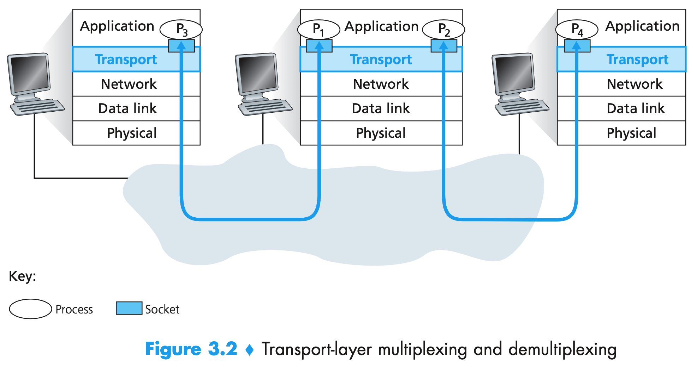
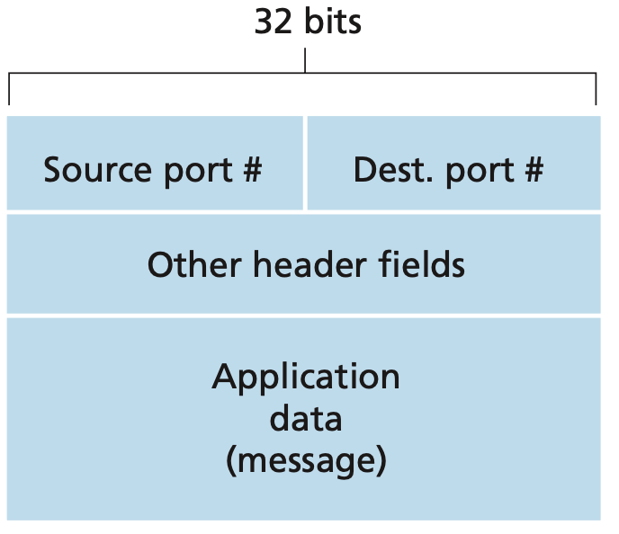
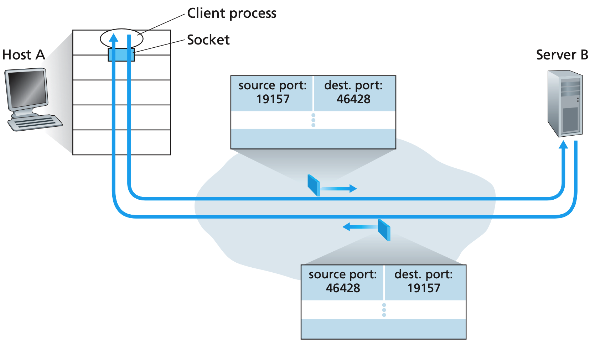
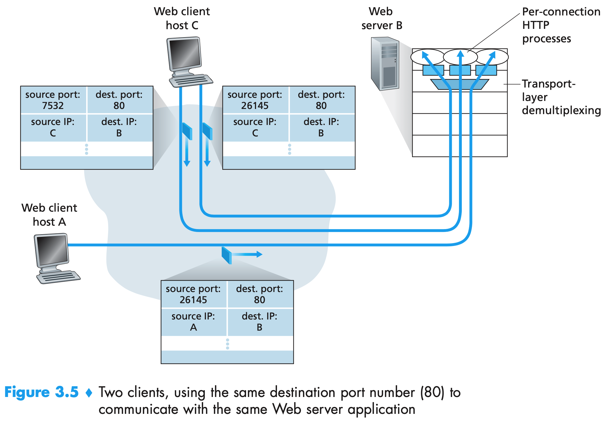
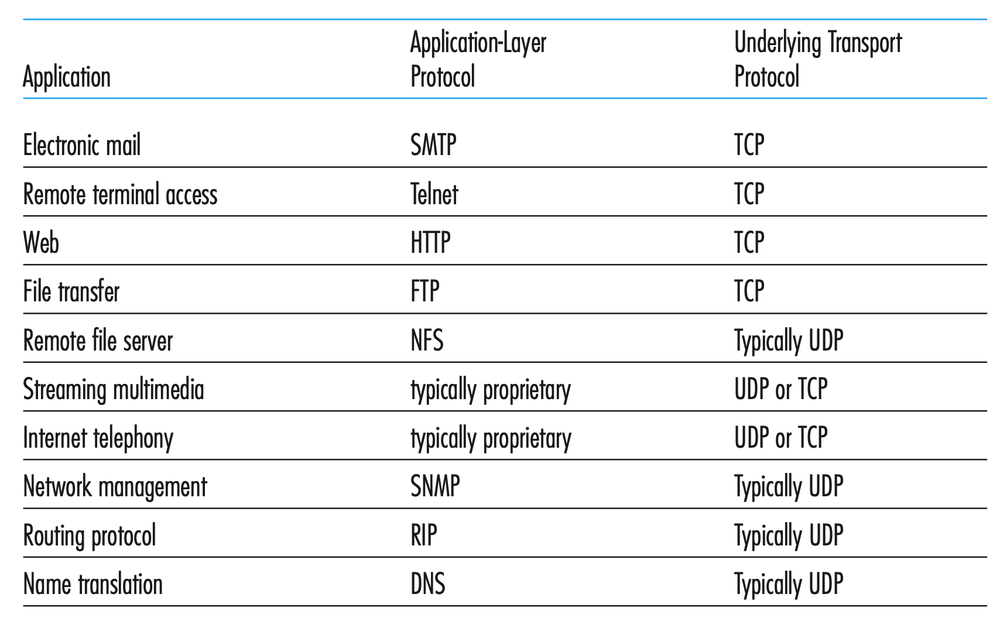
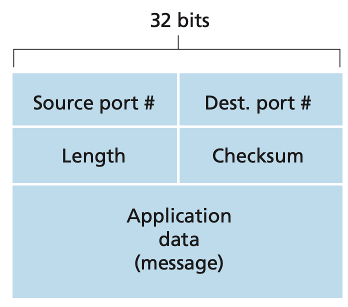

### 1. 概述

在协议栈中，传输层刚好位于网络层之上，网络层提供了**主机**之间的逻辑通信，而传输层为运行在不同主机上的**进程**之间提供了逻辑通信。可以这样类比，在小区中一般有快递点，寄快递只需要到那个地方告诉他即可，收快递也只需要从那里拿即可。整个小区的人都只需要和快递点打交道即可，不需要真的和快递员打交道。快递公司提供的服务可以看做是网络层，提供小区和小区之间的通信，快递点相当于传输层，提供的服务就是具体到每户的通信。

运输协议能够提供的服务尝尝受制于底层网络层协议的服务模型，然而即使底层网络协议不能在网络层提供相应的服务，运输层协议也能提供某些服务：

1. 网络协议是不可靠的，会是分组丢失、篡改和冗余，运输协议也能为应用程序提供可靠的数据传输服务。
2. 网络层不能保证传输层报文的机密性，传输层协议可以使用加密来确保应用程序报文不被入侵者读取。

IP的服务模型是尽力而为交付服务，但是不做任何确保，不保证报文的交付，也不保证报文的按序交付，不保证报文中数据的完整性。称为**不可靠服务**。

UDP和TCP最基本的责任是，将两个端系统间IP的交付服务扩展为运行在端系统上的两个进程之间的交付服务，被称为传输层的**多路复用**和**多路分解**。

### 2. 多路复用与多路分解

如下图，考虑主机如何将一个到达传输层的报文段定向到适当的套接字。

每个传输层报文段中具有几个字段，在接收端，传输层检查这些字段，标识出接受套接字，进而将报文段定向到该套接字。将传输层报文段中的数据交付到正确的套接字的工作称为**多路分解**。

在源主机从不同套接字中收集数据块，并为每个数据块封装上首部信息(在以后用于分解)，从而生成报文段，然后将报文段传递到网络层，这些工作称为**多路复用**。

传输层多路复用要求：

1. 套接字有唯一标识符
2. 每个报文段有特殊字段来指示报文段要交付到的套接字

如下图所示，这些特殊的字段是**源端口号字段**和**目标端口号字段**。端口号是一个16比特的数，大小0~65535。

其中0~1023范围内的端口号称为周知端口号，保留给特定的应用层协议来使用，比如80是HTTP。在开发一个新的应用程序是，必须为其分配一个端口号。

下面是传输层实现分解服务的方式：在主机上的每个套接字能够分配一个端口号，当报文段到达主机时，传输层检查报文段中的目的端口号，并将其定向到相应的套接字，然后报文段中的数据通过套接字进入其所连接的进程。

#### 2.1 无连接的多路复用与多路分解

一个UDP套接字是由一个二元组全面标识的，该二元组包含一个目的IP地址和一个目的端口号。

源端口号用作返回地址的一部分，如下图所示，A在发送报文的时候需要将源端口号附上，以便B可以回发一个报文给A。

#### 2.2 面向连接的多路复用与多路分解

TCP套接字是由一个四元组(源IP地址、源端口号、目标IP地址、目标端口号)来标识，由于TCP是面向连接的服务。与UDP不同的是，两个具有不同源IP地址或源端口号的到达TCP报文段将被定向到两个不同的套接字，除非TCP报文段携带了初始创建连接的请求。

从下图可以看到，每个客户端都访问Web服务器的80端口，但是在建立链接阶段，服务器为每个链接创建了一个新的套接字，所以在服务器端三个数据会分发到不同的套接字(进程)。服务器能够根据源IP地址和源端口号来识别来自不同用户的报文。

连接套接字和进程之间并非总是有着一一对应的关系，如今的高性能Web服务器通常只使用一个进程，为每个新的客户创建一个具有新连接套接字的新线程。

### 3. 无连接传输UDP

在使用UDP时，发送数据报之前，发送方和接收方的传输层实体之间没有握手，UDP是无连接的。

为何很多应用更适合UDP:

1. 关于发送什么数据以及何时发送的应用层控制更为精细。采用UDP时，应用进程将数据传递给UDP，UDP会将此数据打包进UDP报文段并立即将其传递给网络层。TCP有一个拥塞控制，可能会有延迟。所以实时应用通常需要较小的发送速率，不希望过分地延迟报文段的传送，且能容忍一些数据丢失，TCP并不是很适合这些应用的需要。
2. 无须建立连接。UDP不会引入建立连接的时延，这也是DNS运行在UDP之上而不是TCP之上的原因。
3. 无连接状态。TCP需要在端系统中维护连接状态，UDP不维护连接状态，也不用跟踪这些参数。应用程序运行在UDP上一般可以支持更多的活跃客户。
4. 分组首部开销小。每个TCP报文有20字节的首部开销，UDP只有八字节的开销。

不过使用UDP是可能实现可靠传输的。可以通过在应用程序自身中建立可靠性机制来完成。(如TCP的实现)所以应用程序可以进行可靠通信，而无需受制于由TCP拥塞控制强加的船速速率限制(自己实现阉割版的TCP的某些功能)

### UDP报文结构

UDP的报文结构如下图所示。

1. 长度字段指示了在UDP报文段中的字节数(首部加数据)
2. 计算校验和时，除了UDP报文段以外还包括了IP首部的一些字段。
3. 校验和提供了差错检测功能，在端到端系统基础上进行，称为端到端原则。

