### 1. 可靠数据传输原理

可靠数据传输为上层提供的服务抽象是：数据可以通过一条可靠的信道进行传输。借助可靠信道，传输数据比特就不会受到损坏或丢失，而且所有数据都是按照其发送顺序进行交付。这就是TCP向调用它的因特网应用所提供的服务模型。

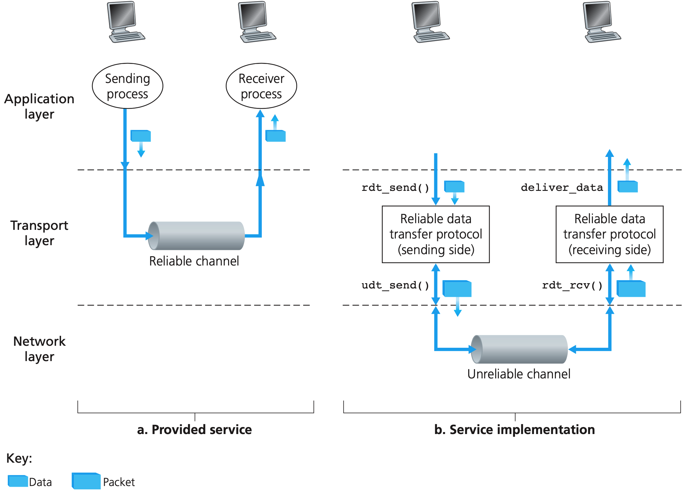

可靠数据传输的下层协议也许是不可靠的，TCP就是在不可靠的端到端网络层之上实现的可靠数据传输协议。如下一步步构造真实的可靠数据传输协议。

#### 1.1 可靠信道的可靠数据传输

首先考察底层信道完全可靠的情况。发送发和接收方都是一个优先状态机，引起状态跳转的事件显示在横线上方，事件发生时采取的动作在横线下方。$\Lambda$表示对应的位置为空。初始状态由虚线指示。

1. `rdt`的发送端只通过`rdt_send(data)`事件接受来自较高层的数据，产生一个包含该数据的分组`(make_pkt(data))`,并将其发送到信道中。`rdt_sent(data)`事件是由较高层应用的过程调用产生的。

2. 在接收端，`rdt`通过`rdt_rvc(packet)`事件从底层信道接收一个分组，从分组中取出数据`(extract(packet, data))`，并将数据上传给叫高层`(deliver_data(data))`。`rdt_rcv(packet)`事件是由较低层协议的过程调用产生的。

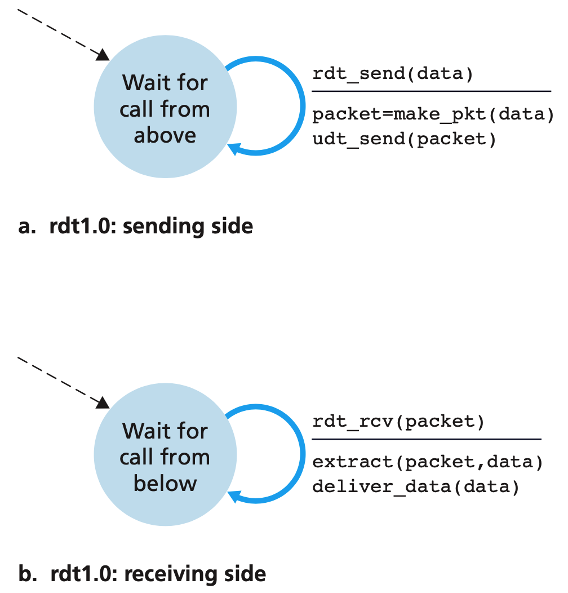

上述接收方和发送方只有一个状态。因为是可靠的信道，所以接收方不需要给发送方任何反馈的信息。

#### 1.2 有比特差错信息的可靠信道

首先考虑人会如何处理这总事情。如果接收方接受成功，则会给发送方发送一个OK，如果接受发现有错误，会给发送方发送“再发一份过来吧”。同样，在通信协议中，对应着“肯定确认(ACK)”和“否定确认(NAK)”。这些控制报文使得接收方可以让发送方知道哪些内容被正确接收，哪些内容接收有误并因此需要重复。基于这样的 重传机制的可靠数据传输协议称为**自动重传请求协议**。需要如下三种功能来处理比特差错：

1. 差错检测
2. 接收方反馈
3. 重传

下图是一个简单的状态机。

- 发送方在发送数据之后，进入等待状态，如果收到的恢复是`NAK`，就进行重传，直到接收到`ACK`，然后回到初始状态等待上层调用
- 接收方只有一个状态，如果接收到数据且检测通过，则发送`ACK`并将数据交付给上层，否则的话发送`NAK`。

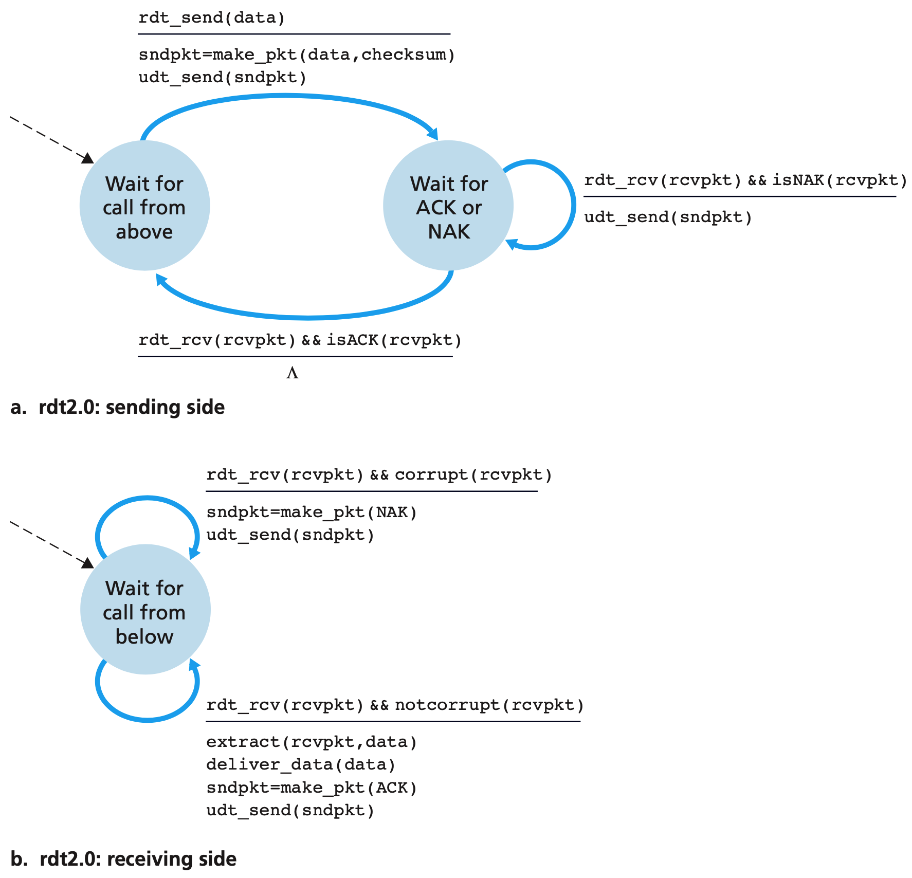

上述模型看似可行，可是没有考虑到`ACK`和`NAK`受损的情况。解决问题的一个简答的方法是，发送方对数据分组进行编号，将发送数据分组的**序号**放在该字段。所以接收方只需要检查序号即可确定让收到的分组是否一次重传。下面是改进后的状态机模型：

1. 在发送单个数据的情况下，只需要使用两个序号即可，用于表示是当前的数据还是上一个数据。

2. 发送方发送完一个数据0之后，进入等到确认0的状态。

   如果收到的是`NAK`或者收到的受损了，则重发0，并保持在确认0状态，直到收到`ACK`

3. 接收方在等待0状态的情况下，如果接收到了正确的0数据，则发送`ACK`，并跳转到等待1状态。

   如果收到了错误的1，则继续保持在等待0状态，并发送`NAK`。

   如果接收到了序号为1的数据，说明可能是自己之前发送的数据1的`ACK`发送方没有正确接收到从而进行了重传，则此时发  送1的`ACK`即可，并保持在等待`0`状态。

这里为什么要将所有状态都复制两份呢？原因如下：

如果只有一个状态，那么在上述的第三点的最后一种情况下，接收方无法知道发来的是下一个数据还是之前重传的数据。

上一个状态机之所以是一份状态是默认`ACK`，`NAK`这种信息是不会发生错误的，也就是不会发生接收方接收到了一个数据之后，

发送方还会重传的情况。所以这里必须将所有的状态复制一份。

同样道理，发送方如果只有一个状态而不加序号的话，在接收到`ACK`的时候可能是对上一个数据的`ACK`。

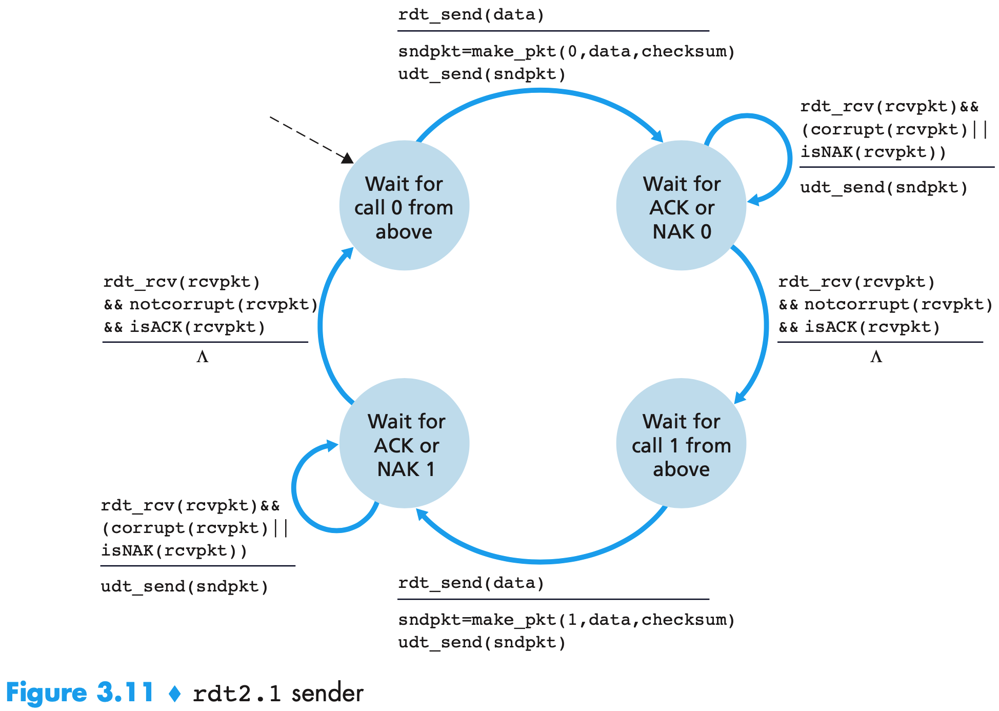

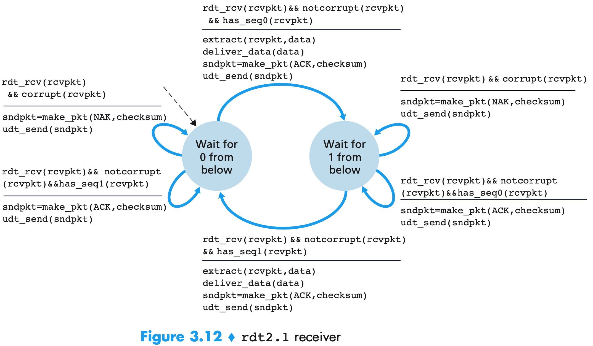

上述模型是基于接收方发送`ACK`和`NAK`两种控制信息的。还可以只基于`ACK`一种信息来进行处理。也就是在接收方想发送`NAK`的时候，还需要发送另一个数据的`ACK`即可。发送方在判断的时候也是同样的操作。

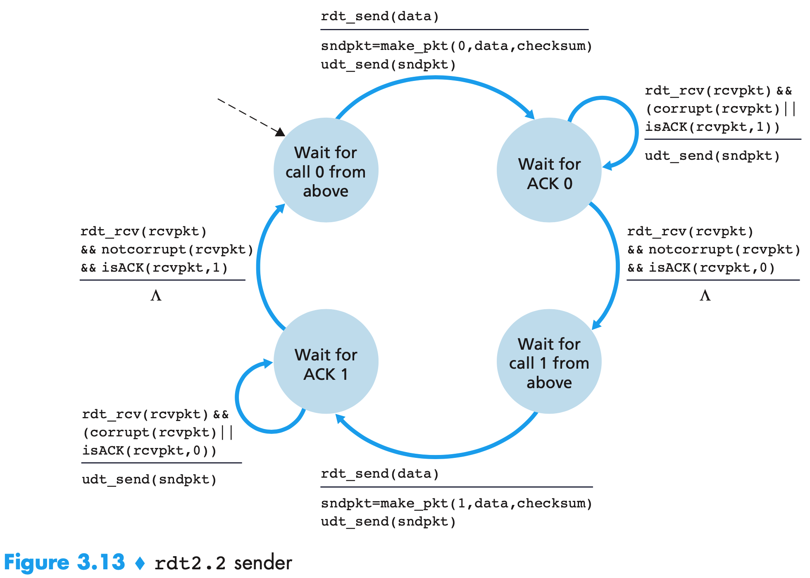

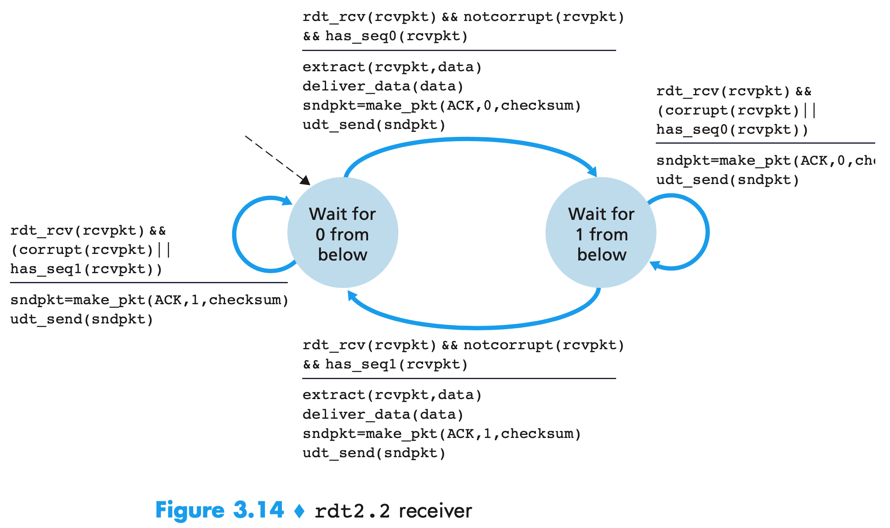

#### 1.3 具有比特差错的丢包信道的可靠数据传输

这一次在上一节的基础上加入了丢包的特性。此时需要处理的两个问题：

1. 如何检测丢包
2. 发生丢包后该做些什么

这里让发送方负责检测和恢复丢包的工作。假设发送一个数据分组，有可能该分组发生了丢失，也有可能接收方对该分组的`ACK`发生了丢失。这两种情况下，发送方都收不动应当到来的接收方响应，发送方在等待足够长的时间以便确认分组已经丢失，然后再重传该数据分组即可。

为了实现基于时间的重传机制，需要一个**倒计时定数器**，在一个给定的时间量过期后，给发送方产生中断。所以需要：

1. 每次发送一个分组时，便启动一个定时器。
2. 响应定时器中断。
3. 终止定时器。

时间的选择是无法确定的。如果时延特别大，接收方可能会收到**冗余数据分组**。不过上面的接收方的状态机已经能够处理冗余的分组了。

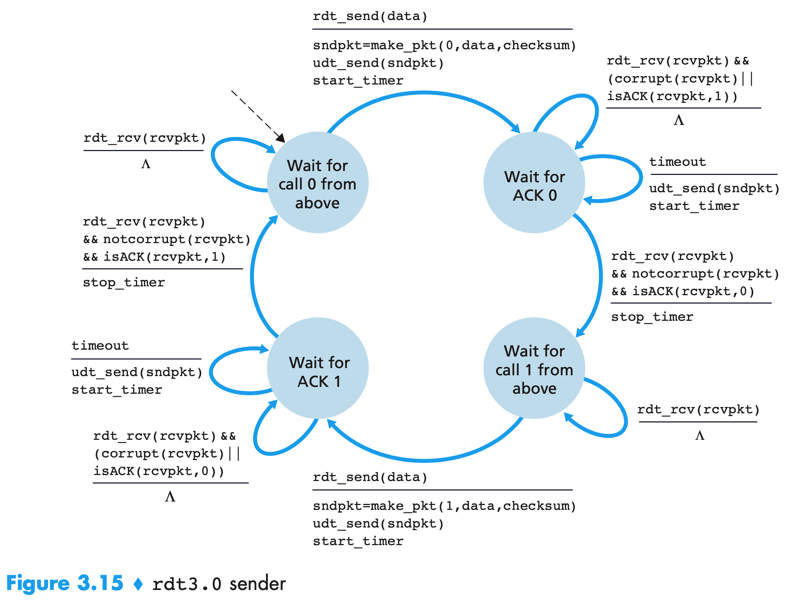

发送方的状态机：

1. 在等待数据发送阶段收到任何`ACK`信息都忽略。
2. 在等待数据0的`ACK`信息时，如果1的`ACK`信息或者收到的信息除了差错，则不错处理(等到定时器到了重发)
3. 如果定时器到了还没有收到确认信息，则重发0，并重置定时器
4. 如果收到了正确的`ACK`信息，则停止定时器，跳转到等待发送1的状态。

由于相比于之前的情况，接收方没有增加任何多余的操作。

1. 发来的时候丢包了，则发送方自己会重传
2. 恢复的时候丢包了，则和恢复的时候`ACK`发生错误一样，后续会受到冗余分组，直接返回上一个数据的`ACK`信息即可。

所以之前的接收方的状态机和现在的状态机是一样的。

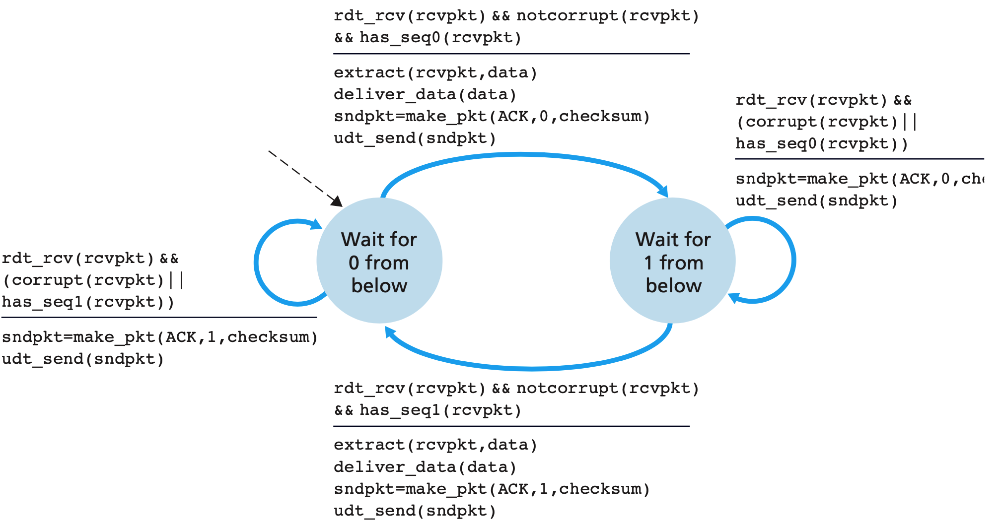

**总结：**

到现在为止，基于校验和、序号、定时器、肯定和否定分组这些技术，实现了一个可靠的数据传输协议，每种机制在协议的运行中都起到了必不可少的作用。

1. 为了能够进行差错检测引入校验和和`ACK/NAK`
2. 为了能够应对`ACK`信息发生错误引入序号
3. 为了能够应对丢包，引入了定时器

### 2. 流水线可靠数据传输协议

上述的协议每次只能发送一个报文，发送方在这个报文得到正确的确认之后才会发送下一个报文。这种协议是一种**停等协议**。

这种协议的效率很低，信道的利用率为：发送方实际忙于将发送比特送进信道的那部分时间与发送时间之比。每次发送一个报文，

在得到确认信息之前，整个信道都处理浪费阶段。网络协议限制了底层网络硬件所提供的能力。

一个简单的解决方法是：不以停等的方式运行，允许发送方发送多个分组而无需等待确认。同时发送3个分组利用率基本上提升了三倍。

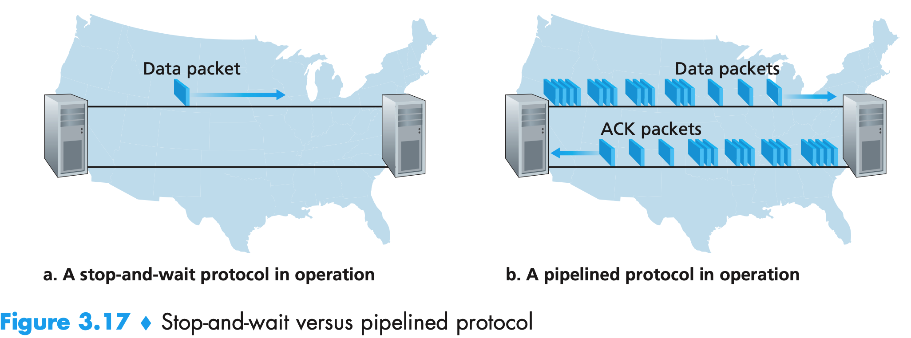

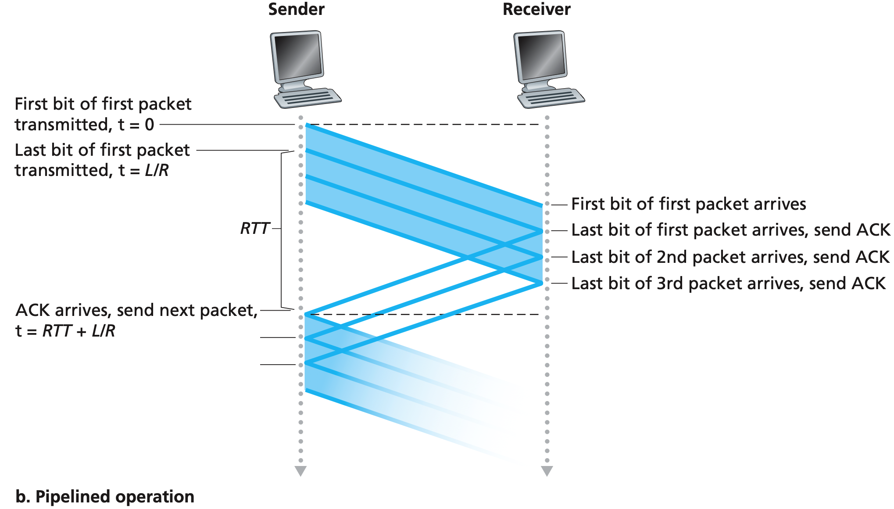

为了实现流水线技术，需要如下的支撑：

1. 增加序号范围，因为每个输送中的分组必须有一个唯一的序号，所以有多个在输送中的未确认报文。
2. 协议的发送方和接收方两端不得不缓存多个分组。发送方最低限度应能缓存那些已经发送但没有确认的分组。接受方可能需要缓存已经正确接收但是次序不对的分组。
3. 所需序号范围和对缓冲的要求取决于数据传输协议如何处理丢失、损坏和延时过大的分组。解决流水线的差错恢复有两种基本的方法：
   1. 回退N步
   2. 选择重传

