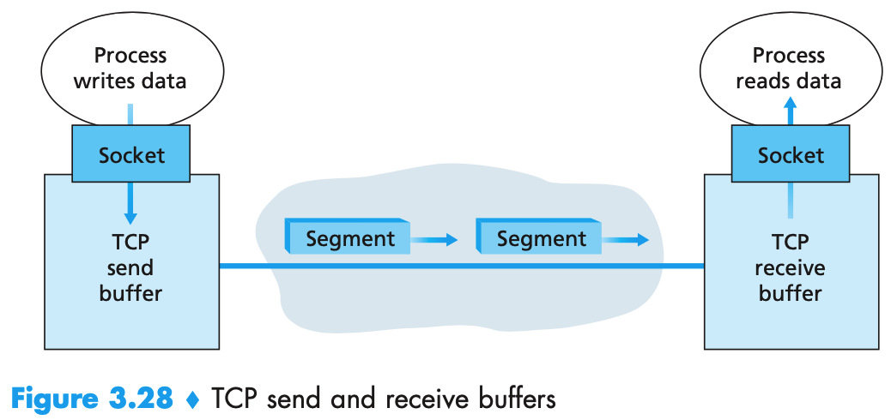
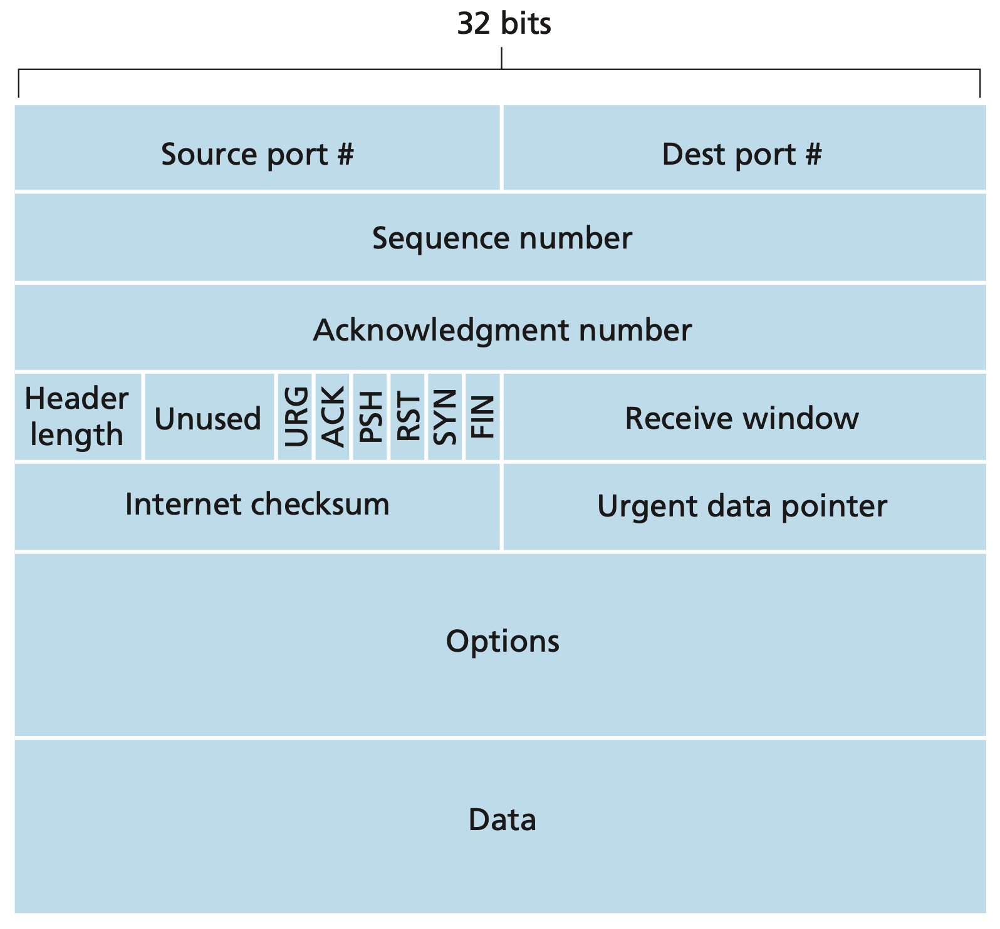
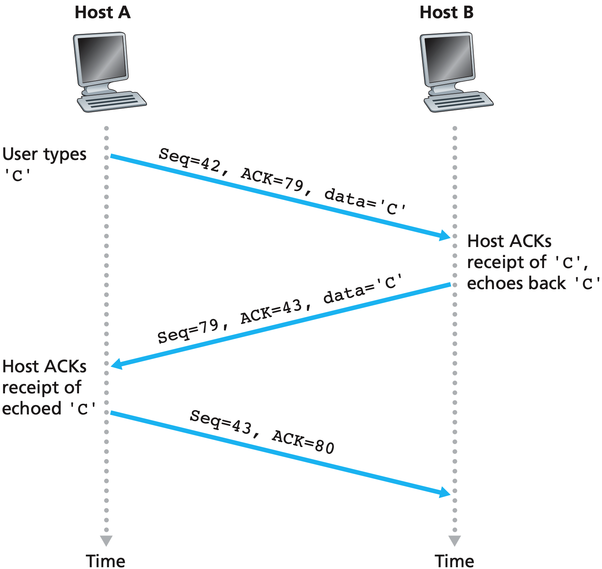
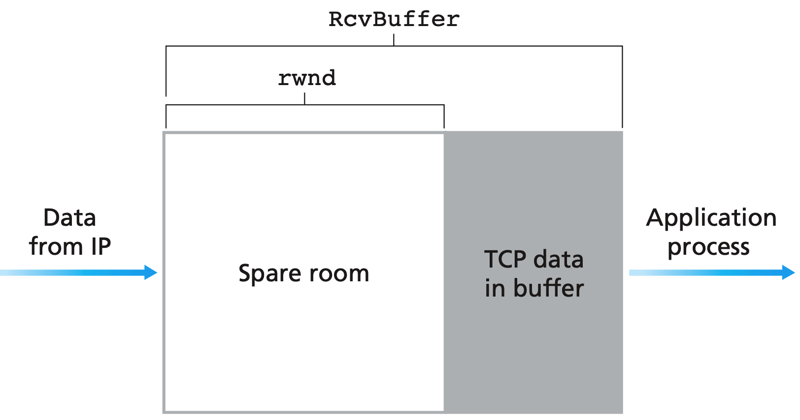
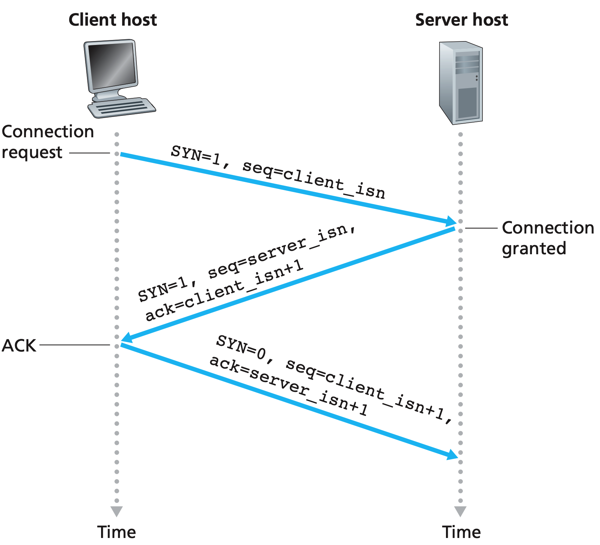
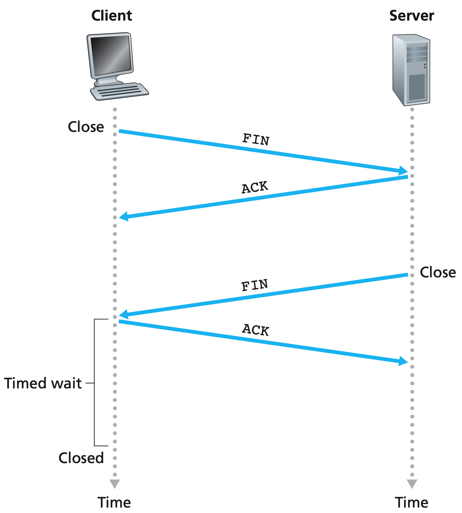
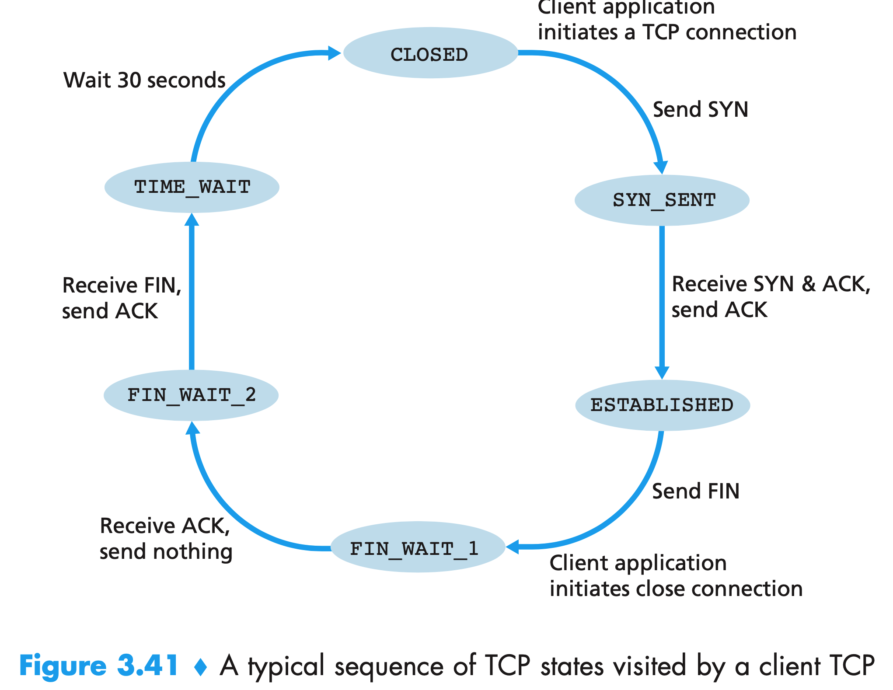
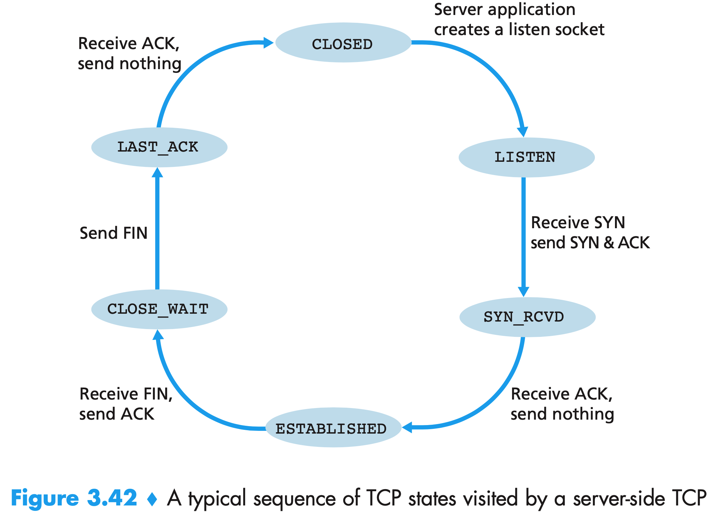

### 1. TCP

TCP连接提供的是全双工、点对点的服务。

TCP建立连接是**三次握手**的过程，建立连接之后，客户进程通过套接字传递数据流，然后由TCP控制。TCP将数据引导到该连接的发送缓存(三次握手期间设置的缓存之一)中，然后TCP从缓存中取出一块数据，将其传递到网络层。TCP可以从缓存中取出并放入报文段中的数据数量受限于**最大报文长度(MSS)**，其通常有本地发送主机发送的最大链路层帧长度(**最大传输单元MTU**)来设置。一般来说一个TCP报文段加上TCP/IP首部长度(通常40)要适合单个链路层帧，以太网和PPP链路层协议都有1500字节的MTU，所以MSS的典型值为1460。下面是一个经典的模型。

### 2. TCP报文结构

下图是TCP报文段结构

1. 源端口号与目标端口号，用于多路复用/分解来自上层应用的数据。
2. 32比特序号子段和32比特确认号字段，用于发送方和接收方实现可靠数据传输服务。
3. 16比特的接受窗口字段，用于进行流量控制，表示接收方愿意接收的字节数量。
4. 4比特首部长度字段，指示了以32比特的字为单位的TCP首部长度，TCP长度可变，典型长度为20字节(选项字段为空)
5. 可选与变长的选项字段。
6. 6比特的标志字段。
   - `ACK`指示确认字段的值是有效的
   - `SYN`用于建立链接
   - `FIN`用于拆除链接
   - 其余不常用
7. 检验和字段。

TCP中的序列号和确认号是实现可靠传输服务的关键。

序号表示当前报文携带的应用层数据的第一个字节的编号。可以通过对数据进行划分，然后给每段的第一个字节编号。

确认号表示这个报文发送方希望收到的来自对方的下一字节的序号。假设`A`收到了来自`B`的编号为`0~112`的所有字节的数据，那么`A`给`B`发送的下一个报文中的确认号就是`113`。TCP只确认数据流中至第一个丢失字节为止的字节，即其是**累计确认的**。一般来说，对于接收方如果收到了失序的报文，会保留失序的字节，并等待缺少的字节来填充间隔。在报文中如果没有数据的话，任然需要有序号。一条TCP链接的双方均是随记地选择初始序号(在三次握手阶段相互交换自己选择的初始序号)。下面是一个交换的例子。

### 3. 往返时延的估计与超时

如果希望实现超时重传机制，就需要设置超时间隔长度。显然超时时间间隔必须大于该连接的往返时间(RTT)。但是这个时间并不是固定的，需要发送方根据当前网络状况进行估计。

报文段的样本RTT是从某报文被发出到该报文段的确认被收到之间的时间量。由于路由器的拥塞和端系统复杂的变化，SampleRTT的值会随之波动。为了估计一个典型的RTT，要采取某种对SampleRTT取平均的办法。TCP维持一个SampleRTT的均值(EstimatedRTT)，获得一个新的SampleRTT，利用如下的公式来更新EstimatedRTT。$\alpha$推荐值为0.125。

$$EstimatedRTT = (1 - \alpha) EstimatedRTT + \alpha SampleRTT$$

上述是进行**指数加权滑动平均**，最终EstimatedRTT趋于平缓。

除了估算RTT之外，RTT的变化可以用RTT偏差`DevRTT`来估算SampleRTT一般会偏离EstimatedRTT的程度。$\beta$推荐值为0.25。

$$DevRTT = (1 - \beta)  DevRTT + \beta |SampleRTT - EstimatedRTT|$$

有了EstimatedRTT和DevRTT，TCP的超时间隔可以进行如下设置：

1. 超时间隔应该大于等于EstimatedRTT
2. 超时间隔不能大太多，否则当报文丢失时，不能很快重传该报文
3. 当SampleRTT波动大时，余量应该较大，波动较小时余量应该较小。

所以使用下面的公式：

$$TimeoutInterval = EstimatedRTT + 4 \cdot DevRTT$$

初始的TimeoutInterval为1秒，出现超时后加倍，以免即将被确认的后继报文段过早出现超时。然而只要收到报文段就更新EstimatedRTT, 并用上述公式再次计算TimeoutInterval。

### 4. 可靠数据传输

#### 4.1 超时间隔加倍

在每次发生超时的时候，将定时器的时间设置为之前的两倍，收到一个确认之后再使用上面的公式设定。这是一种简单的拥塞控制。在拥塞的时候如果持续重传分组，会使拥塞更加严重，相反，每个发送方的重传搜经过越来越长的时间间隔后进行。

#### 4.2 快速重传

超时重传的带来的周期可能较长，如果一个分组丢失的话，会带来较长的端到端延时。发送方可以在超时事件发生之前通过注意**冗余ACK**来检测到丢包的出现。

当发送了一个序列，然后中间的一个包丢了，接收方接收到失序的包时就会想发送方发送第一个确实的包ACK。当接收方接收到3个冗余的ACK时，TCP就执行快速重传，而不是等到超时事件发生。

#### 4.3 选择确认

如果发生中间一个包丢失，后面的包被正确接收，那么发送方会将缺失的包后面的都进行重传。这样会带来不必要的重传。可以用一种所谓的选择确认的方式。允许TCP接收方有选择地确认失序报文段，而不是累积确认最后一个正确接收的有序报文段。

#### 4.4  流量控制

TCP为应用程序提供了**流量控制服务**，来消除发送方使接收方缓存溢出的可能。流量控制是一个速度匹配服务，**发送方的发送速率和接收方应用程序的读取速率**相匹配。还有一种发送方的控制称为**拥塞控制**，这个是为了遏制发送方可能因为IP网络的拥塞。两者采取的动作相似但是是针对完全不同的原因而采取的措施。

TCP通过让发送方维护一个称为**接收窗口**的变量来提供流量控制，其给发送方一个提示——该接收方还有多少可用的缓存空间。定义如下的变量：

1. LastByteRead：应用进程从缓存读出的数据流的最后一个字节编号
2. LastByteRcvd：从网络中到达的且已放入主机B接收缓存中的数据流的最后一个字节编号

为了避免缓存溢出，所以有：

$$LastByteRcvd - LastByteRead \leq RcvBuffer$$

可用空间为

$$rwnd = RcvBuff - [LastByteRcvd - LastByteRead]$$

主机轮流维护两个变量LastByteSent和LastByteAcked，通过将未确认的数据量控制在值`rwnd`中，从而保证发送方不会是接收方接收缓存溢出。所以发送方需要保证如下的表达式：

$$LastByteSent - LastByteAcked \leq rwnd$$

当接收方接收缓存已满，且B没有数据要发送给A，则当B的缓存有空闲的时候，A任然不知道。所以当B的窗口为零的时候，主机A继续发送只有一个字节数据的报文段。这些报文段会被接收方确认。最终缓存开始清空，且确认报文里包含一个非零的rwnd值。

### 5. TCP连接管理

如何建立和拆除一条TCP连接。

建立链接、三次握手：

1. 客户端TCP向服务器端的TCP发送一个特殊的TCP报文段。不包含应用层数据，报文段首部中的`SYN`标志位置为1，被称为**SYN报文段**。客户端随机选择一个初始序号`client_isn`，将其置于SYN报文段的序号字段中。
2. SYN报文段到达服务器之后，服务器识别出这是个SYN，则为该TCP链接分配TCP缓存和变量，性客户端发送允许链接的报文段，也不包含应用层数据。然后将这个报文段首部的确认号字段置为`client_isn + 1`。然后服务器选择自己的初始序号`server_isn`，将其置在首部的序号字段中。这个称为**`SYNACK`把报文段。**
3. 收到SYNACK报文段后，客户也要为该连接分配缓存和变量。然后客户想服务器发送一个波啊文孤单，对服务器允许链接的报文段进行确认(将`server_isn + 1`放置到TCP报文段首部的确认字段中)。SYN被置为零，这个报文段可以携带客户到服务器的数据。

拆除链接，四次挥手：

当连接结束之后，主机中的资源会被释放。由于TCP是全双工的，所以当某一方打算关闭连接，则其发送一个首部中的`FIN`标志位为1的字段，表示自己要发送的数据发送完毕了。不过之后另一个方向还可以继续放松和接受数据。直到最后双方都结束。

下面是客户端和服务器段TCP状态机。

