### 1. 网路程概述

网络中的每台主机和路由器都有一个网络层部分。网络层能够分解为两个相互作用的部分，**数据平面和控制平面**。

- 数据平面功能决定到达路由器输入链路之一的数据报如何转发到该路由器的输出链路之一。

- 控制平面功能控制数据报沿着从源主机到目的主机的端到端路径中路由器之间的路由方式。

网络层的作用是将分组从一台发送主机移动一台接收主机。需要使用如下的两个重要功能：

1. 转发。一个分组到达某路由器的一条输入链路时，该路由器必须将该分组移动到适当的输出链路。
2. 路由选择。当分组从发送方流向接收方时，网络必须决定这些分组所采用的路由或路径。计算这些路径的算法称为**路由选择算法**。

转发通常利用硬件来实现，路由选择通常用软件来实现。每台网路路由器中有一个关键元素是**转发表(forwarding table)**。路由器检查到达的分组首部的一个或多个字段值，进而使用这些首部值在其转发表中索引，通过这种方式来转发分组，这些值对应存储在转发表项中的值，指出了该分组将被转发的路由器的输出链路接口。

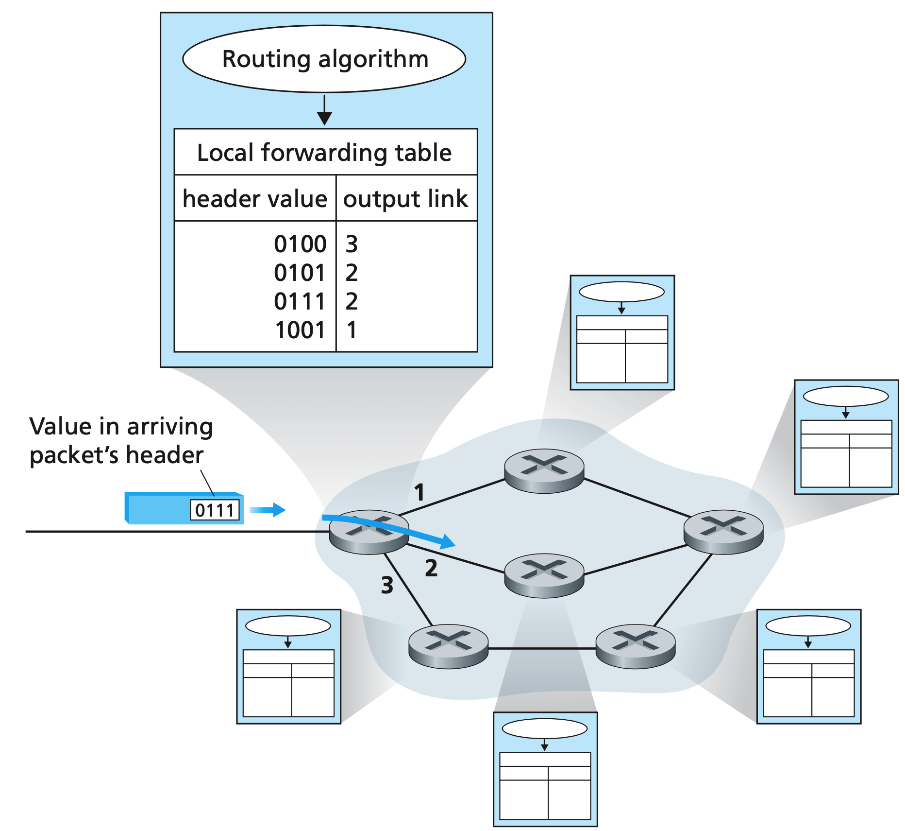

上图中路由选择算法处于控制平面，下面的本地转发表处于数据平面。路由选择算法决定了插入该路由器转发表的内容。控制平面有如下的方法：

1. 传统的方法，路由选择算法运行在每台路由器中，并且在每台路由器中都包含转发和路由选择两种功能，如上图所示。
2. SDN方法，远程控制器计算和分发转发表以供每个路由器使用。控制平面路由选择功能与物理的路由器是分离的，路由选择设备仅执行转发，远程控制器计算并分发转发表。

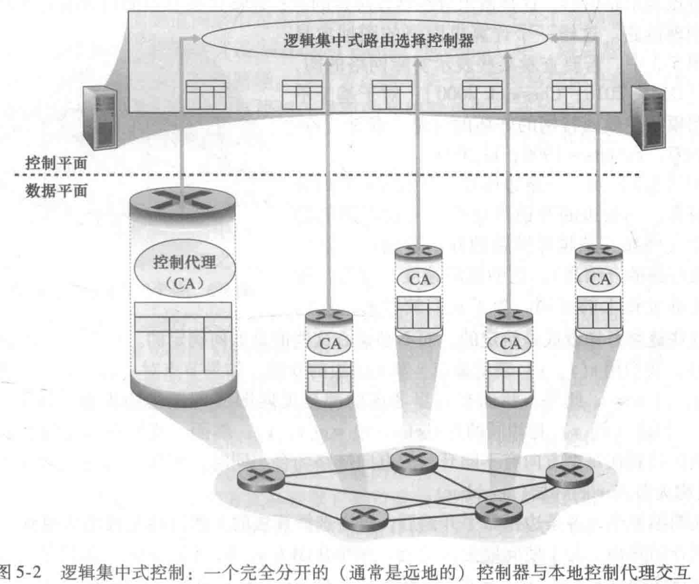

网络层提供的服务是**尽力而为服务**，传送的分组既不能保证以他们发送的顺序被接收，也不能保证他们最终交付，也不能保证端到端时延，也不能保证有最小的带宽。

### 2. 路由器工作原理

下面是一个通用路由器总体视图。

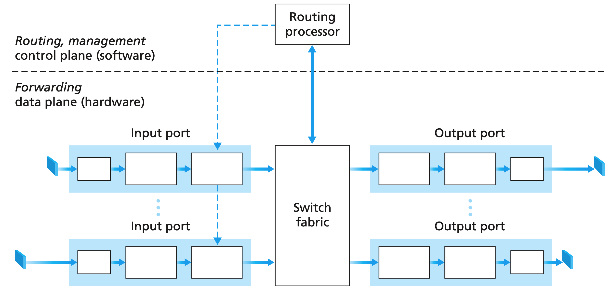

1. 输入端口。包含物理层、链路层和网络层。在最右侧的框中，通过查询转发表决定路由器的输出端口，到达的分组通过路由器的交换结构转发到输出端口。
2. 交换结构。将路由器的输入端口连接到它的输出端口
3. 输出端口。存储从交换结构接收的分组，并在出书链路上传输这些分组。
4. 路由选择处理器。

### 3. IPV4、寻址

IPV4的数据报格式如下：

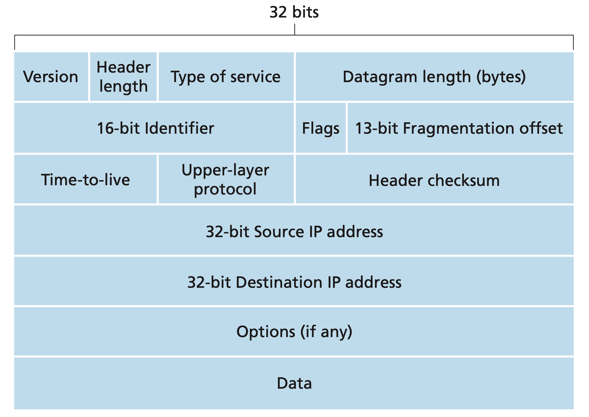

1. 版本号。通过查看版本号，路由器才能确定如何解释IP数据报的剩余部分。
2. 首部长度。IPv4可包含一些可变数量的选项。大多数IP数据包不包含选项，所以一般的IP数据报具有20字节的首部。
3. 服务类型。
4. 数据报长度。IP数据报的总长度(首部加数据)。16字节，所以理论最大长度为65535字节。但是一般很少超过1500，受链路层的限制。
5. 标识、标志、片偏移。与IP分片有关。
6. 寿命（Time To Live TTL）。确保数据报不会永远在网络中循环，每当一台路由器处理数据报时，字段 的值减1，减为零时，数据报必须丢弃。
7. 协议。知识IP数据报的数据部分应该交给哪个特定的传输层协议。
8. 首部校验和。每台路由器上必须重新计算校验和并再次放到原处。这是因为TTL字段还有其他字段可能会改变。
9. 源和目的IP地址。源主机通过DNS查找来决定目的地址。
10. 选项。允许IP首部被扩展，但是很少被用
11. 数据，有效载荷。

#### 3.1  数据报分片

一个链路层帧能够承载的最大数据量叫做**最大传输单元(MTU)**。由于不同链路的MTU可能不同，当路由器的出链路的MTU比IP数据包长度小，则需要进行分片。将IP数据报中的数据分片成多个更小的IP数据报，称为片。片在其到达目的地传输层之前需要重新组装。组装工作放到端系统中，而不是网络路由器中。

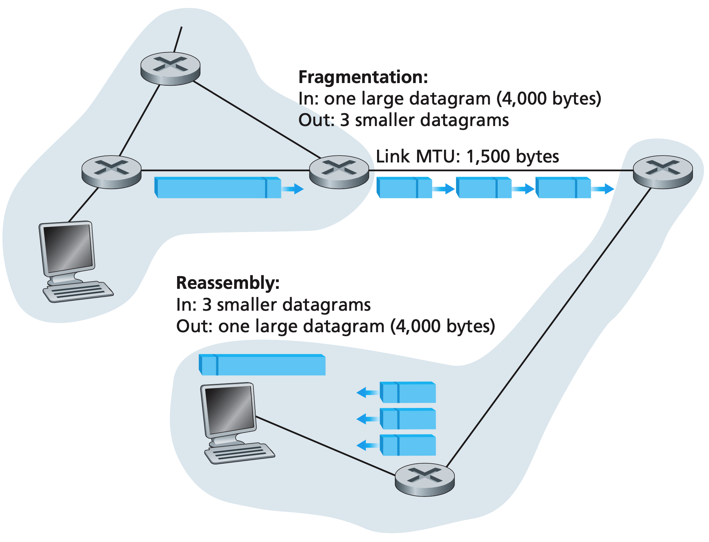

### 3.2 IPv4编址

一个IP地址与一个接口相关联，而不是与包括该接口的主机或路由器相关联。

每个IP地址为32比特，八个比特对应一个十进制数。如`192.168.0.1`。一个接口的IP地址的一部分需要由其链接的子网来决定。

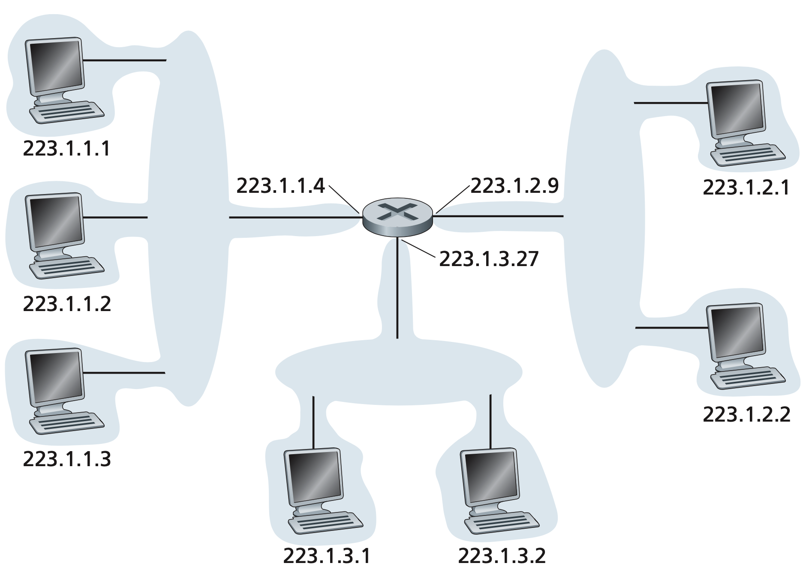

如上图所示，左侧三个主机和路由器的左侧接口形成了一个子网。IP地址为这个子网分配了一个地址`223.1.1.0/24`。其中`/24`称为子网掩码，表示左侧24比特定义了子网地址，后面的8比特定义了主机的地址。任何其他要链接到`223.1.1.0/24`网络的主机都要求其地址具有`233.1.1.xxx`的形式。

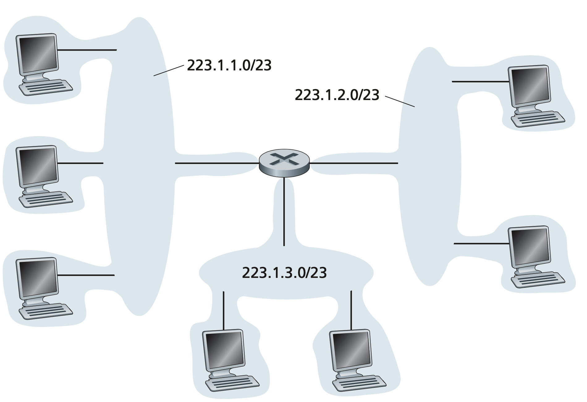

形式为`a.b.c.d/x`的地址的`x`最高比特构成了IP地址的网络部分，称为该地址的前缀。在这种情况下，子网内部的设备的IP地址将共享共同的前缀。该子网外部的路由器仅考虑前面的前缀比特`x`。外部的一台路由器转发一个数据报，且该数据报的目的地址在子网内部时，仅需要考虑前`x`比特。这大大减少了路由器中转发表的长度。同时使用**最长前缀匹配**，因为通告了与目的地址相匹配的最长(最具体)的地址前缀。

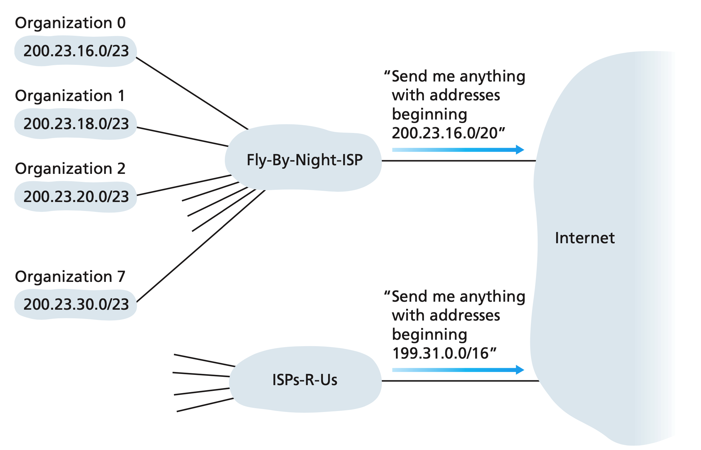

`255.255.255.255`为IP广播地址，当一台主机发出一个目的地址为`255.255.255.255`的数据报时，其会交付给同一个网络中的所有主机。

主机动态获取IP地址的协议为**DHCP协议**。一台主机到达一个网络后，通过和DHCP服务其进行交互，从而得到临时IP地址和其他信息，如子网掩码、第一条路由器地址(默认网关)、本地DNS服务器地址等。

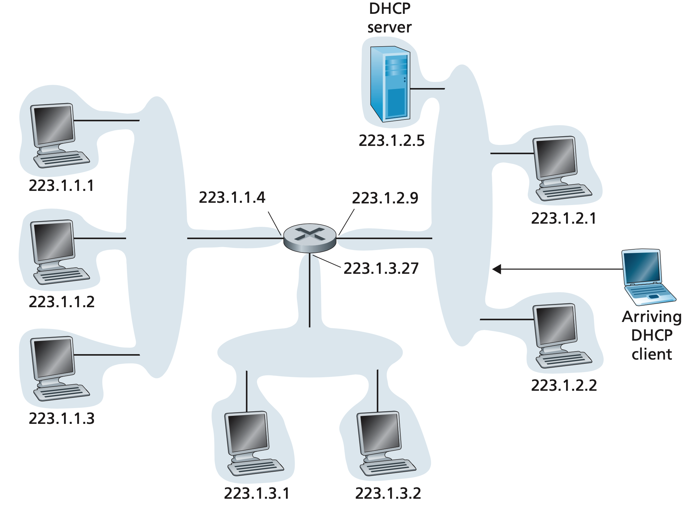

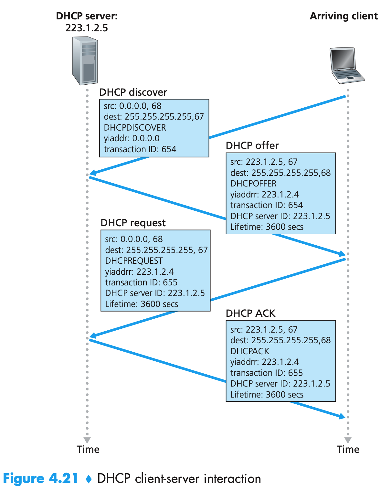

### 3.3 网络地址转换(NAT)

NAT路由器对外界的行为就如同一个具有单一IP地址的单一设备，NAT使能路由器对外界隐藏了家庭网络的细节。路由器的IP地址是从ISP的HDCP服务器获得，且路由器运行一个DHCP服务器，为位于空庭网络地址空间中的计算机提供地址。如下图，所有离开家庭路由器流向更大的英特网都拥有一个源IP地址`138.76.29.7`，且所有进入家庭的报文都拥有同一个目的IP`138.76.29.7`。

路由器该如何决定将其收到的某个分组转发给哪个内部主机呢？在NAT路由器上有一张`NAT转换表`，在表项中包含了端口号及其IP地址。相当于在表中记录了**路由器的IP、端口号和内部设备的IP、端口号**之间的映射关系。在发送和接受的时候，按照这个映射关系将数据报中的源IP和源端口进行修改，然后再发送给对应的部分。

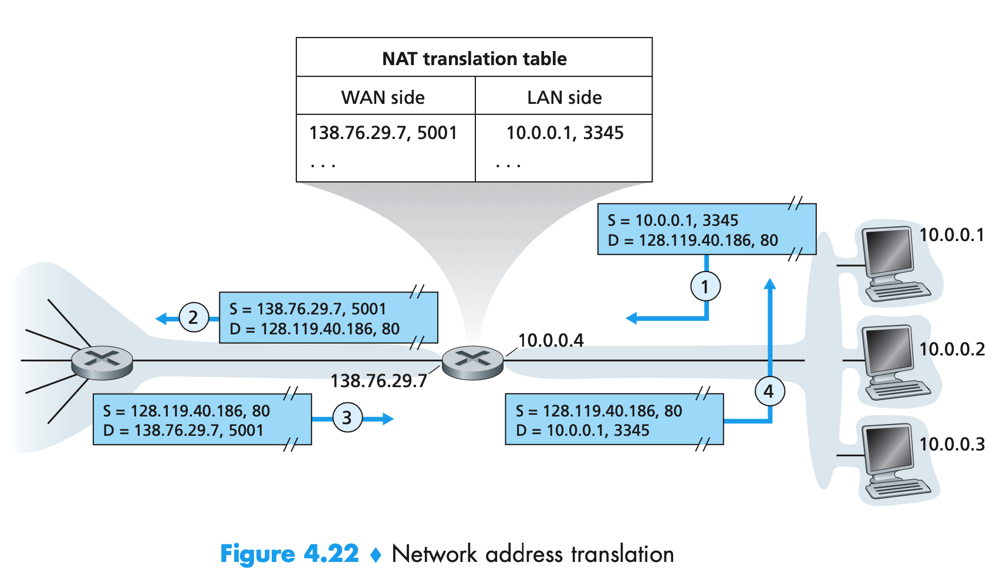

### 4. 通用转发

考虑一种更加通用的“匹配加动作”的范式。能够对协议栈的多个首部字段进行“匹配”，动作包括：

1. 将分组转发到一个或多个输出端口
2. 重写首部值
3. 有意识阻挡/丢弃某个分组(防火墙)
4. 等等

NAT、防火墙、负载均衡器都是将请求某种给定服务的分组转发到提供该服务的服务器集合中的一个。

