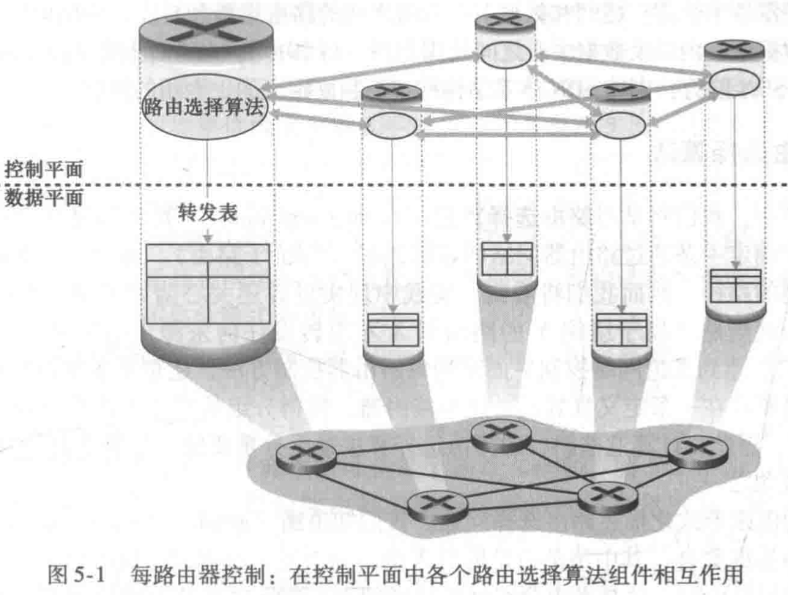
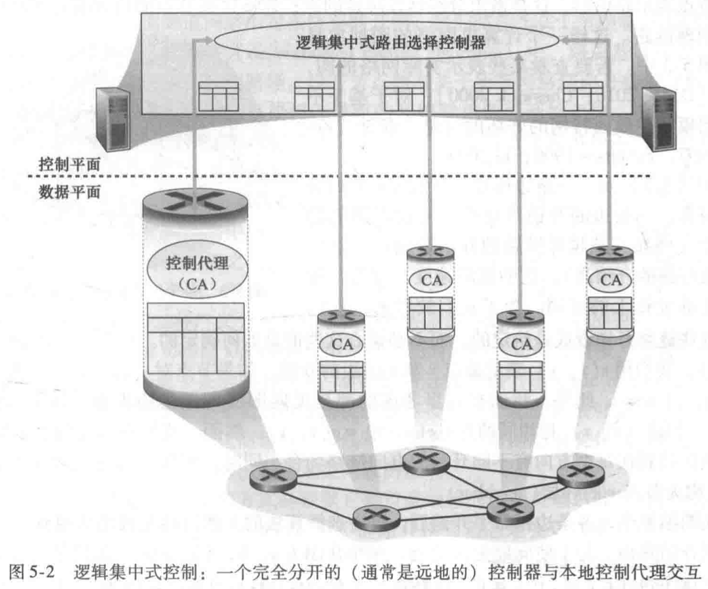
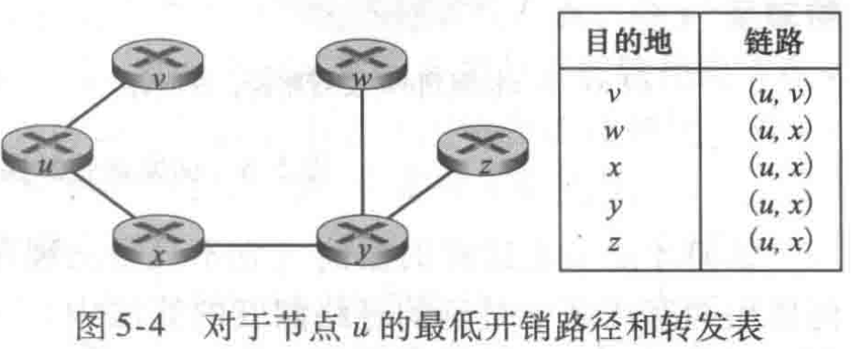
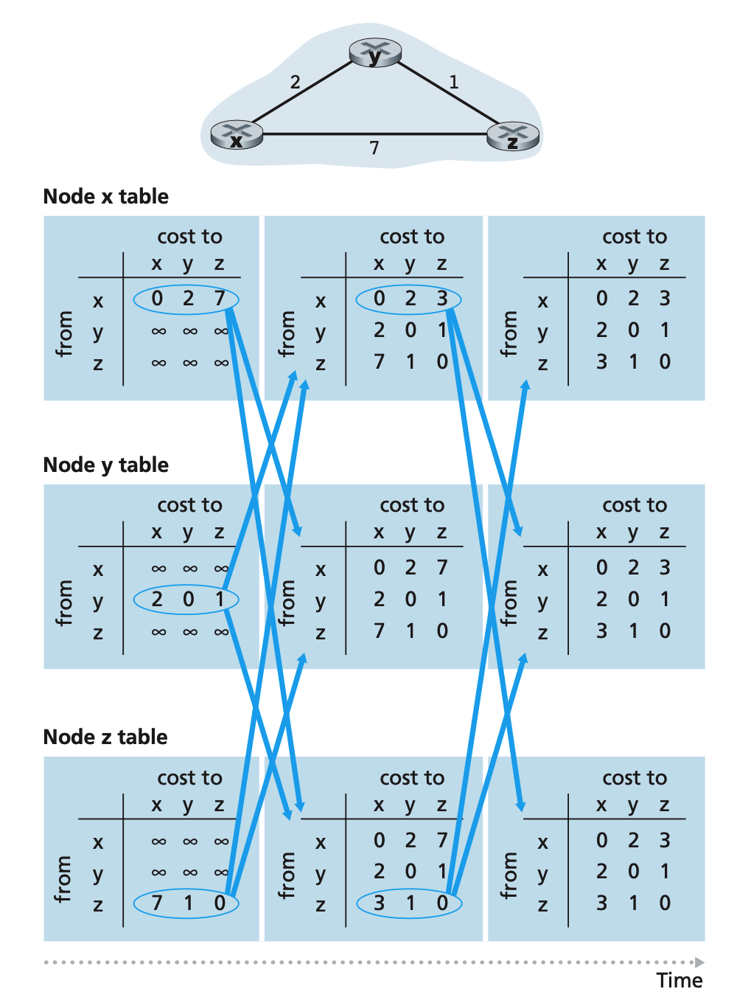
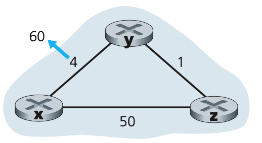

### 1. 路由算法

路由器中的转发表是由网络控制平面来进行计算、维护和安装的。这可以有两种方法：

1. 每个路由器控制
2. 逻辑集中式控制

如下图所示。

路由选择算法目的是从发送方到接收方的过程中确定一条通过路由器网络的好的路径。可以将网络看成一个图$G = (N, E)$，每条链路的开销看做边的权重。路由选择算法希望找到两个点之间的最低开销路径。

路由算法可以根据该算法是集中式还是分散式来进行划分：

1. 集中式路由选择算法。用完整的、全局性的网络知识计算出从源到目的地之间的最低开销路径，常被称作**链路状态算法(Link State)**
2. 分散式路由选择算法。路由器以迭代、分布式的方式计算出最低开销路径。没有节点拥有关于所有网络链路开销的完整信息。每个节点仅有与其直接相连链路的开销知识，通过迭代计算以及与相邻节点的信息交换，一个节点就可以逐步计算出到达某目的节点或一组目的节点的最低开销路径。**距离矢量(Distance-Vector, DV)算法。**

### 2. 链路状态路由选择算法

拥有了全局信息，那么直接在图上的每个节点跑一遍`Dijkstra`算法，就可以求出当前节点到其他节点的单元最短路径。然后将当前节点的路由表设置为到其他节点的路径的下一跳即可。使用堆优化版本的算法，时间复杂度为`O(N log(E))`，`N`为节点数，`E`为边数。

### 3. 距离向量路由选择算法

最低开销路径的开销之间的一个重要关系，$d_x(y)$是从节点$x$到$y$的最低开销路径的开销。下面是`Bellman-Ford`方程。

$$d_x(y) = min_{v}\{ c(x, v) + d_v(y)\}$$

从$x$到$y$的最低开销是对所有邻居节点$v$的$C(x, v) + d_v(y)$的最小值。

上述方程的解不经为节点$x$的转发表提供了表项，而且提出了在DV算法中发生的邻居到邻居通信的形式。

每个节点$x$维护下列信息：

- 每个邻居$v$,从$x$到直接相连邻居$v$的开销为$c(x, v)$
- 节点$x$的距离向量，$D_x = [D_x(y) : y \in N]$包含了$x$到$N$中所有目的地$y$的开销估计值
- 它的每个邻居的距离向量，即对$x$的每个邻居$v$,有$D_v = [D_v(y) : y \in N]$

在该分布式、异步算法中，每个节点不时地向它的邻居发送它的距离向量副本。当节点$x$从它的任何一个邻居$v$接收到一个新的距离向量，保存$v$的距离向量，然后使用Bellman-Ford方程更新它自己的距离向量如下：

$D_x(y) = min_v\{c(x, v) + D_v(y)\}$ 对N中的每个节点

如果节点$x$的距离向量因为这个更新步骤而改变，则节点$x$将向它的每个邻居发送其更新后的距离向量，进而让所有邻居更新它们自己的距离向量。只要所有的节点继续以异步方式交换它们的距离向量，最终会收敛到节点$x$到$y$的实际最低开销路径的开销。

可以看到每个节点只需要知道其邻居节点的距离向量，不需要知道整个网络的情况，如果可以用邻居的信息更新自己的信息，则就将自己的信息再发送给自己所有的邻居。

#### 3.1 毒性逆转

当一个运行DV算法的节点检测到它自己到邻居的链路开销发生变化时，它就更新其距离向量，如果最低开销路径的开销发生了变化，向邻居通知其新的距离向量。

考虑如下的情况。

一开始的网络状况如下图所示，在某一时刻，x到y链路的开销由4便成为60,那么y会更新自己的路由表，由于之前z发送给y的距离矢量告诉y，z到x的最短距离为5，所以y会更新自己到x的最短距离为`5 + 1 = 6`,然后再将自己的信息发送给在z，z发现之前从y来的链路由4变成了6，就会更新自己到x的距离为`6 + 1 = 7`。然后继续向y发送。这样一直震荡下去！直到z计算出它经由y的路径开销大于50为止。

上述的场景可以使用一种称为**毒性逆转**的技术加以避免。思想如下：

如果z通过y路由选择到目的地x，则z告知y它到x的距离是无穷大，这样就可以避免y再通过z到x，也就避免了上面的震荡的情况。但是毒性逆转并没有解决一般的无穷计数问题。

**总结：**

上述两种方法都取得了广泛的应用，并没有绝对的孰好孰坏。