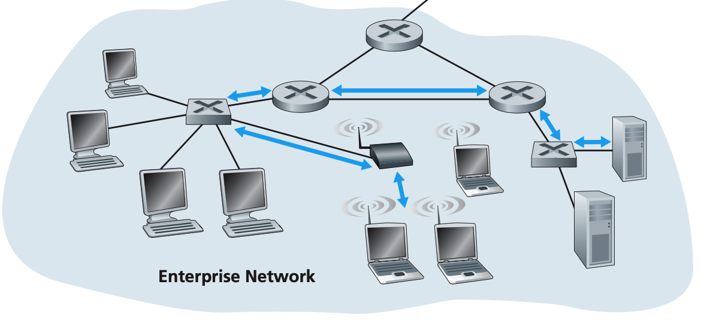
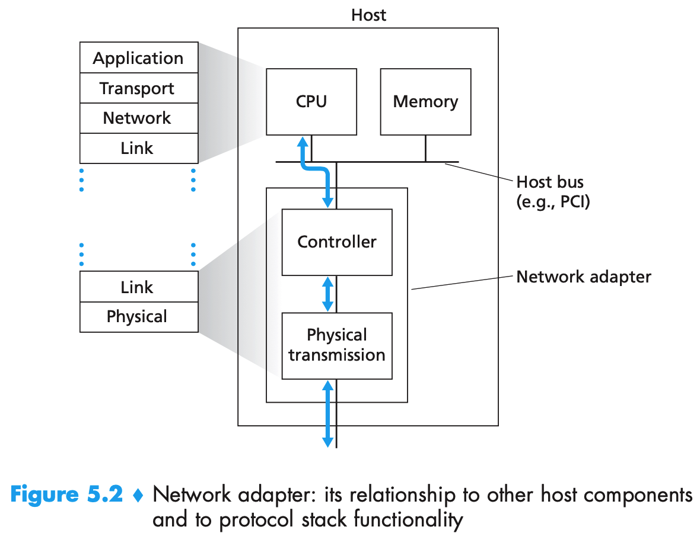
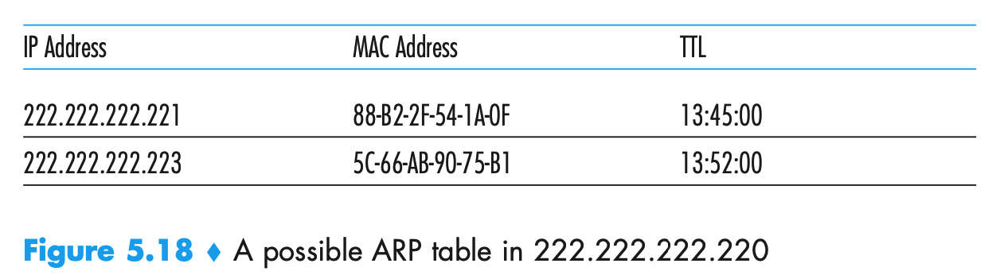
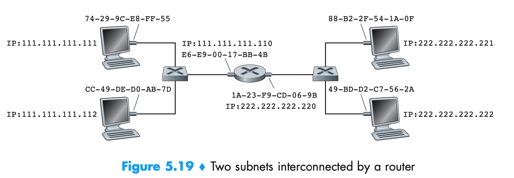
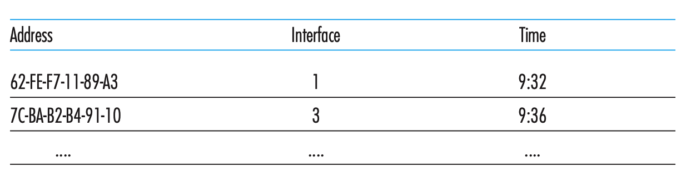

### 链路层

链路层主要解决的问题是分组如何通过构成端到端的通信路径的各段链路。前面讨论的传输层和网络层都只是逻辑上发送过去，但是真正发送数据还是需要靠底层的链路层和物理层。物理层对于程序员来说没有太大理解的必要（电子本科的我已经学够了。。。）只考虑链路层是如何进行传输的。如下图中的蓝色的部分。

链路层提供的服务：

1. 成帧。在每个网络层数据报经链路层传送之前，所有的链路层协议都要将其用链路层帧封装起来。
2. 链路接入。媒体访问控制协议规定了帧在链路上传输的规则。当多个节点共享单个广播链路时，其用于协调多个节点的帧传输。
3. 可靠交付。链路层可靠交付服务通常用于易于产生高差错率的链路，如无线链路。对于低比特差错的链路，链路层的可靠交付可能被认为一种不必要的开销。所以很多有线的链路层协议不提供可靠交付服务。
4. 差错检测和纠正。

链路层实现的地方见下图。

链路层的主体部分在网络适配器中实现，也被称为网络接口卡。位于网络适配器的核心是链路层控制器。控制器一般是一个专用芯片。链路层许多功能是用硬件实现的。但部分链路层是在运行于主机CPU上的软件中实现的。链路层的软件组件实现了高层链路层功能，如组装链路层寻址信息和激活控制器硬件。**链路层是软件和硬件的结合体，是协议栈中软件与硬件交接的地方。**

### 交换局域网

交换机运行在链路层，他们交换链路层帧，不识别网络层地址，使用链路层地址而不是IP地址来转发链路层帧通过交换机网络。

#### MAC地址

每台主机或路由器的每个网络接口所有一个与之相关联的链路层地址，就像他们有多个IP地址一样。但是链路层交换机并不具有与他们接口相关联的链路层地址。因为链路层交换机的任务是在主机和路由器之间承载数据报，交换机透明地执行该任务，主机或路由器不会明确地将帧寻址到其间的交换机。

MAC地址的长度为6字节，没有两块适配器具有相同的MAC地址，MAC地址被设计为永久的，但是用软件改变一块适配器的MAC地址是可行的。注意IP地址是动态分配的。

当适配器要想某些目的适配器发送有一个帧时，发送适配器将目的适配器的MAC地址插入到该帧中，并将该帧发送到局域网上。所以一块适配器可以接受一个并非向它寻址的帧。当适配器接收到一个帧时，检查该帧中的目的MAC地址是否与它自己的MAC地址匹配。如果匹配则提取封装的数据并沿着协议栈向上传递。否则的话，丢弃该帧。

有时某些发送适配器要让局域网上所有的其他适配器来接受并处理它打算发送的帧，则需要在帧的目的地址中插入一个特殊的**MAC广播地址**,48个1组成的字符串。

#### 地址解析协议

地址解析协议（ARP）是用于在网络层地址（IP地址）和链路层地址（MAC地址）中进行转换。每台主机或路由器在内存中有一个**ARP表**，其中包含了IP地址到MAC地址的映射关系。如下图所示。主机不知道自己目的地的MAC地址的时候，会在局域网发送一个报文，广播的方式询问其MAC地址。接收方收到之后如果发现是自己的话，则将自己的MAC地址告诉对方。

#### 发送数据到子网外

当一台主机要向相同子网的另一台主机发送一个数据报时，首先更具目的的IP地址以及自己的IP和子网掩码，发现其和自己处于同一个子网，则看看ARP表中有没有其MAC地址，弄到MAC地址之后，就像子网内发送数据报即可。

当需要发送一个数据到子网外时，如下图所示。

假设左上方的主机要向右下方的主机发送一个数据报。则MAC地址不能直接填右下方主机的MAC地址。因为在链路层上，不会有任何和他位于同一个子网的主机会接受这个帧，所以就发不出去。那要发给谁呢？需要发给链接两个子网的路由器，也就是**网关**。

所以根据目的地的IP，发现不再同一个子网，就看自己的网关是谁，然后就先通过链路层发给自己的网关，在目的MAC地址上填写`E6-E9-00-17-BB-4B`。路由器接收到这个数据报之后，上传给网络层，路由器发现需要路由到右边的口，就发到了右边的口。

右边的口再匹配目的IP地址和自己的IP、子网掩码。发现在自己的子网中，就将目的MAC地址替换成右下方的主机的MAC地址，然后就可以直接发到右侧的子网中了。

#### 链路层交换机

交换机的任务是接受入链路层帧并将它们转发到出链路。交换机自身对子网中主机和路由器是**透明的**。

交换机具有转发和过滤的功能。过滤是决定一个帧应该转发到某个接口还是应当将其丢弃。转发是决定一个帧应该导向哪个接口，并把该帧移动到那些接口。这两个功能都是借助于**交换机表**。

假定目的MAC为`x`的帧到了`1`口，则：

1. 如果没有`x`对应的表项，则直接向除1外的所有口转发。没有对于目的地址的表项，交换机广播该帧。
2. 有一个表项和`x`与1关联了，则直接丢弃。
3. 如果有一个表项将`x`与非1的接口关联了，则直接转发到这个接口即可。

交换机是**自学习**自己的交换机表的。

1. 交换机表初始为空

2. 每个接口接受到的每个帧，交换机在其表中存储以下信息：

   - 该帧的源MAC地址
   - 该帧到达的接口
   - 当前时间

   这样就记录了一个MAC地址和接口的信息。

3. 在一段时间后，交换机没有收到以该地址为源地址的帧，则在表中删除这个地址。

