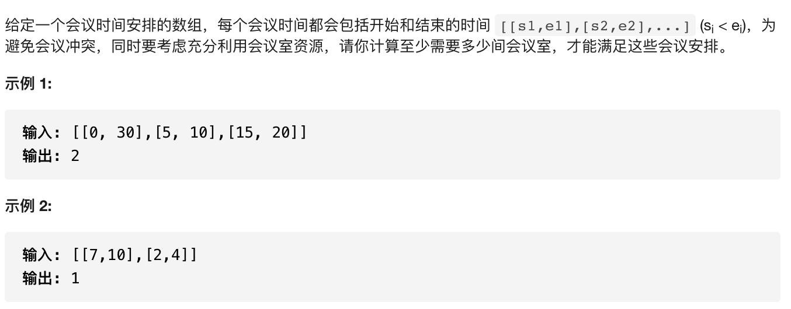

贪心法非常难，而且难以证明是正确的。下面是几种常见的模型。

## 区间问题

设计到多个区间的问题，一般的方法是按照左端点或者右端点对区间进行排序，然后找到一种贪心的策略。

### 区间合并

[原题链接](https://www.acwing.com/problem/content/805/)

#### 解题思路

将所有的区间按照左端点进行排序，然后从前到后扫描。维护当前合并之后的区间的左端点和右端点。

- 如果新的区间的左端点比维护的右端点大，则区间数+1， 取新的区间的左右端点为维护的左右端点
- 如果新的区间的左端点比维护的又端点小，则更新维护的区间的右端点为二者右端点的最大值

时间复杂度$O(n)$

```c++
#include<iostream>
#include<algorithm>
using namespace std;

typedef pair<int, int> PII;

const int N = 100010;

PII q[N];

int main(){
    
    int n;
    cin >> n;
    for(int i = 0; i < n; i ++){
        int x, y;
        cin >> x >> y;
        q[i] = {x, y};
    }
    sort(q, q + n);
    int res = 1;
    int l = q[0].first, r = q[0].second;
    for(int i = 1; i < n; i ++){
        if(q[i].first > r){
            res ++;
            l = q[i].first;
            r = q[i].second;
        }else{
            r = max(r, q[i].second);
        }
    }
    cout <<res;
    return 0;
}
```

### 区间选点

[原题链接](https://www.acwing.com/problem/content/907/)

#### 解题思路

将所有的区间的右端点按照从小到大排序。维护当前区间的右端点为取的点。遍历区间，如果发现这个点不能再这个区间内部了，那么就取这个区间的右端点。

```c++
#include<iostream>
#include<algorithm>
using namespace std;
typedef pair<int, int> PII;
const int N = 100010;

PII q[N];
int n;

int main(){
    
    cin >> n;
    for(int i = 0; i < n; i ++){
        int l ,r;
        cin >> l >> r;
        q[i] = {r, l};
    }
    sort(q, q + n);
    int res = 1;
    int cur = q[0].first;
    for(int i = 1; i < n; i ++){
        if(q[i].second > cur){
            cur = q[i].first;
            res ++;
        }
    }
    cout << res;
    return 0;
}
```

### 最大不相交区间数量

[题目链接](https://www.acwing.com/problem/content/910/)

和上一题的思路完全一致，将区间按照右端点按照从左到右的顺序排序，然后每个位置取右端点最小的即可。

```c++
#include<iostream>
#include<algorithm>
using namespace std;


typedef pair<int,int> PII;
const int N = 100010;

PII q[N];

int main(){
    
    int n;cin >> n;
    for(int  i = 0; i < n; i ++){
        int l, r;
        cin >> l >> r;
        q[i] = {r, l};
    }
    sort(q, q + n);
    int res = 1;
    int cur = q[0].first;
    for(int i = 1; i < n;  i++){
        if(q[i].second > cur){
            res ++;
            cur = q[i].first;
        }
    }
    cout <<res;
    return 0;
}
```

### 区间分组

[原题链接](https://www.acwing.com/problem/content/908/)

#### 解题思路

将所有的区间按照左端点排序，然后维护每一组的区间的右端点的最大值。当来了一个新的区间，如果当前区间比所有组的右端点都小，则必须新开一个分组。否则可以将其加入到右端点最小的那一组，并更新那一组的右端点。

取所有分组右区间的最小值可以使用优先级队列。

```c++
#include<iostream>
#include<algorithm>
#include<queue>
using namespace std;

typedef pair<int,int> PII;
const int N = 100010;

PII q[N];

int main(){
    
    int n;
    cin >> n;
    for(int i = 0; i < n; i ++){
        int l,r;
        cin >> l >> r;
        q[i] = {l ,r};
    }
    sort(q, q + n);
    
    int res = 1;
    priority_queue<int, vector<int>, greater<int>> h;
    h.push(q[0].second);
    for(int i = 1; i < n;  i++){
        if(q[i].first <= h.top()){
            res ++;
            h.push(q[i].second);
        }else{
            h.pop();
            h.push(q[i].second);
        }
    }
    cout << res;
    return 0;
    
}
```

### 区间覆盖

[原题链接](https://www.acwing.com/problem/content/909/)

#### 解题思路

将所有的区间按照左端点从左到右排序，然后找到能够覆盖目标区间左边界的区间中的右边界最大的那个区间作为第一个。

然后找能够覆盖第一个区间右边界的且右边界最大的区间作为下一个，如此下去即可。

```c++
#include<iostream>
#include<algorithm>
using namespace std;

typedef pair<int,int> PII;
const int N  = 100010;
PII q[N];

int main(){
    
    int a, b;
    cin >> a >> b;
    int n;
    cin >> n;
    for(int i = 0;  i< n ; i ++){
        int l,r;
        cin >> l >> r;
        q[i] = {l, r};
    }
    sort(q, q + n);
    int cur = a;  // 维护当前需要覆盖的点
    int res = 0;
    int i = 0;
    int t = -2e9;
    bool flag = false;
    while(i < n){
        while(i < n && q[i].first <= cur){
            t  = max(t, q[i].second);  // 找到所有能够覆盖的区间的右边界的最大值
            i++;
        }
        res ++;
        if( t >= b){  // 提前终止
            flag = true;
            break;
        }
        cur = t;
        if(q[i].first > t){  // 如果中间有缝隙，则不能拼成
            break;
        }
    }
    if(flag) cout << res;
    else cout << -1;
    return 0;
}
```

## 哈夫曼树

贪心思想的典型应用。每次都一堆数据中选择最小的两堆进行合并。

[原题链接](https://www.acwing.com/problem/content/150/)

#### 解题思路

将整个过程画出来，可以发现是一颗树的形式，且每堆被计算的次数是这个叶子节点到根的路径的长度。然后就可以使用哈夫曼树进行求解。

在每次找到当前数据中最小的两堆的时候，可以使用优先级队列进行处理。

```c++
#include<iostream>
#include<queue>
using namespace std;

int main(){
    
    priority_queue<int, vector<int>, greater<int>> h;
    int n;cin >> n;
    int res = 0;
    while(n--){
        int x;cin >> x;h.push(x);
    }
    while(h.size() > 1){
        int x = h.top();h.pop();
        int y = h.top(); h.pop();
        res += x + y;
        h.push(x + y);
    }
    
    cout <<res;
    return 0;
}
```

## 排序不等式

该算法也是操作系统任务调度中的最小等待时间的算法。将所有的任务按照执行时间从小到大排序，然后执行即可。

证明：

如果执行的顺序中存在着相邻两项是逆序，那么将这两项交换次序之后，整体的等待时间会变短。所以序列有序时，等待时间最短。

[原题链接](https://www.acwing.com/problem/content/description/915/)

```c++
#include<iostream>
#include<algorithm>
using namespace std;

const int N = 100010;
int q[N];

int main(){
    
    int n;
    cin >> n;
    for(int i = 0; i < n; i ++){
        cin >> q[i];
    }
    sort(q, q + n);
    long long res = 0, s = 0;
    for(int i = 0; i < n; i ++){
        res += s;
        s += q[i];
    }
    cout << res;
    return 0;
}
```

## 绝对值不等式

[原题链接](https://www.acwing.com/problem/content/106/)

典型的数学问题，取所有数的中位数即可。

```c++
#include<iostream>
#include<algorithm>
using namespace std;
const int N  = 100010;
int q[N];
int main(){
    int n;cin >> n;
    for(int i = 0; i < n; i ++) cin >> q[i];
    sort(q, q + n);
    
    int t = q[n >> 1];
    int res = 0;
    for(int i =  0; i < n; i ++) res += abs(q[i] - t);
    cout << res;
    return 0;
    
}
```

## 其他

### 刷杂耍的牛

[原题链接](https://www.acwing.com/problem/content/127/)

#### 解题思路

将所有牛按照重量加强壮程度求和进行排序的情况下，最大值是最小的。可以通过反正法。考虑相邻两个牛如果是逆序的

话，那么交换之后，最大值是不增的。

```c++
#include<iostream>
#include<algorithm>

using namespace std;

typedef pair<int,int> PII;

const int N = 50010;
PII q[N];

int main(){
    
    int n;
    cin >> n;
    for(int i  = 0; i < n; i ++){
        int w, s;
        cin >> w >> s;
        q[i] = {w + s, w};
    }
    sort(q, q + n);
    int ans = -2e9;
    int sw = 0;
    for(int i = 0; i < n; i ++){
        ans = max(ans, sw - (q[i].first - q[i].second));
        sw += q[i].second;
    }
    cout << ans;
    return 0;
    
}
```

### 最多可以参加的会议数目

[原题链接](https://leetcode-cn.com/problems/maximum-number-of-events-that-can-be-attended/)

#### 解题思路

贪心的思想。在每一天，从这一天可以去的会议中，选择结束时间最早的那一场去。

先对所有的会议按照开始时间排序，结束时间可选可不选。

#### C++代码

```c++
typedef pair<int, int> PII;
bool cmp(const vector<int>& a, const vector<int>& b) {

    if (a[0] != b[0]) return a[0] < b[0];
    else return a[1] < b[1];

}

class Solution {
public:
    
    int maxEvents(vector<vector<int>>& events) {
        sort(events.begin(), events.end(), cmp);
        int ans = 0;
        priority_queue<PII, vector<PII>, greater<PII>> heap;
        int j = 0;
        for (int i = 1; i <= 1e5; i ++) {  // 枚举每一天是否可以参加会议
            while (j < events.size() && events[j][0] <= i) {  // 将会议起始日期小于等于当期日期的会议加入到优先级队列中
                heap.push({events[j][1], events[j][0]});
                j ++;
            }
            while (heap.size() && heap.top().first < i) heap.pop();  // 从队列中弹出结束时间在当前日期之前的会议
            if (heap.size() && heap.top().second <= i) {  // 选在结束时间最早的会议，并参加
                ans ++;
                heap.pop();
            }
        }
        return ans;
    }
};
```

### 避免洪水泛滥

[原题链接](https://leetcode-cn.com/problems/avoid-flood-in-the-city/)

#### 解题思路

还是贪心的思想，但是需要预处理好每个湖可以被抽干的时间段，然后如果有空闲的日子的话，则将这一天可以抽干的湖中选择下一次下雨最早的即可。和上一题差不多，多了一步预处理所有区间的操作。

#### C++代码

```c++
typedef pair<int, int> PII;
class Solution {
public:
    
    vector<int> avoidFlood(vector<int>& rains) {
        priority_queue<pair<int, pair<int,int>>, vector<pair<int, pair<int,int>>>, greater<pair<int, pair<int,int>>>> heap;
        unordered_map<int, int> mp;
        vector<pair<int, PII>> rec;
        int n = rains.size();
        for (int i = 0; i < n; i ++) {
            int x = rains[i];
            if (!x) continue;
            if (mp.count(x)) {
                if (mp[x] == i - 1) return vector<int>();
                rec.push_back({mp[x] + 1, {i - 1, x}});
            }
            mp[x] = i;
        }
        sort(rec.begin(), rec.end());
        // for (auto x : rec) cout << x.second.second << " " << x.second.first << " " << x.first << endl;
        vector<int> ans;
        int j = 0;
        int m = rec.size();
        for (int i = 0; i < n; i ++) {
            int x = rains[i];
            while (j < m) {
                // cout << j << endl;
                if (rec[j].first <= i) {
                    heap.push({rec[j].second.first, {rec[j].first, rec[j].second.second}});
                    j ++;
                }else {
                    break;
                }
            }
            if (x != 0) ans.push_back(-1);
            else {
                if (heap.size()) {
                    auto elem = heap.top();
                    heap.pop();
                    if (elem.first < i) return vector<int>();
                    else {
                        ans.push_back(elem.second.second);
                    }
                }else {
                    ans.push_back(1);
                }
            }
        }
        if (heap.size()) return vector<int>();
        else return ans;
        
    }
};
```

### 排布二进制网格的最少交换次数

[原题链接](https://leetcode-cn.com/problems/minimum-swaps-to-arrange-a-binary-grid/)

#### 解题思路

统计每一行从后向前数的0的个数**`cnt`**(不包括第一列)。用**`n - 1 - cnt`**当前位置前面的非0占的个数，并用数组**`rec`**记录下来。

然后需要调整这个数组，使得满足**`rec[i] <= i`** 都成立。

然后使用贪心的策略来进行调整。从前向后扫描

- 如果当前位置满足条件，则直接跳过

- 如果当前位置不满足条件，则向后找到第一个满足**`rec[j] <= i`**的位置，通过**`j - i`** 次交换将其换到当期那位置。

如果当前位置的后面存在多个可以放在当前位置的元素，那么选择第一个肯定没问题。因为后面既然可以放到当前位置，那么也一定可以放到后面的任意位置，没有任何影响。

如果在后面找不到满足条件的元素，则说明不可能。因为这说明当前位置和之后的元素都必须放到之后的位置上，元素的个数大于位置的个数，所以不可能得到满足条件的排列。

#### C++代码

```c++
class Solution {
public:
    int minSwaps(vector<vector<int>>& grid) {
        int n = grid.size();
        vector<int> rec(n);
        for (int i = 0; i < n; i ++) {
            int cnt = 0;
            for (int j = n - 1; j > 0; j --) {
                if (grid[i][j] == 0) cnt ++;
                else break;
            }
            rec[i] = n - 1 - cnt;
        }
        int ans = 0;
        for (int i = 0; i < n; i ++) {
            if (rec[i] <= i) continue;
            int j = i + 1;
            while (j < n && rec[j] > i) j ++;
            if (j >= n) return -1;
            ans += j - i;
            int t = rec[j];
            for (int k = j; k > i; k --) {
                rec[k] = rec[k - 1];
            }
            rec[i] = t;
        }
        return ans;
    }
};
```

### 会议室II

[原题链接](https://leetcode-cn.com/problems/meeting-rooms-ii/)



#### 解题思路

上下车法，统计所有出现的时间点，然后按照时间点的先后顺序排序，再从前向后扫描。遇到区间起点就`cur++`，遇到区间终点就`cur--`,统计过程中`cur`的最大值。在处理的时候，如果同一个数即是起点也是终点，则将终点先处理。

####  C++代码

```c++
typedef pair<int, int> PII;
class Solution {
public:
    int minMeetingRooms(vector<vector<int>>& intervals) {
        vector<PII> p;
        for (auto x : intervals) {
            p.push_back({x[0], 1}); // 起点第二个数为1
            p.push_back({x[1], -1}); // 重点第二个数为2
        }
        sort(p.begin(), p.end());
        int cur = 0, ans = 0;
        for (auto x : p) {
            if (x.second == -1) cur --;
            else cur ++;
            ans = max(ans, cur);
        }
        return ans;
    }
};
```


