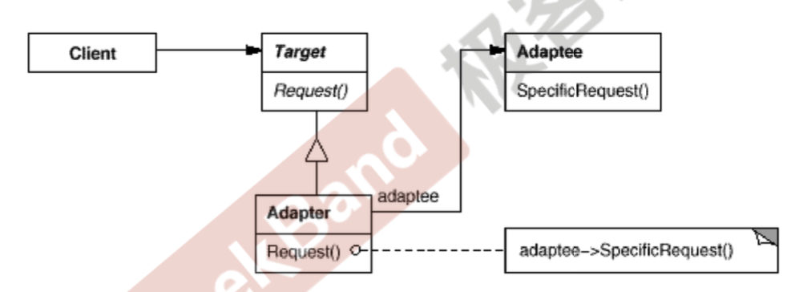

## 适配器模式

### 问题

在软件系统中，由于应用环境的变化，尝尝需要将一些现存的对象放在心的环境中应用，但是新环境要求的接口是这些现存对象所不满足的。比如各种转换头等。


> 将一个类的接口转换成客户希望的另一个接口，Adapter模式使得原本由于接口不兼容而不能再一起工作的哪些类可以一起工作。

### 代码示例

```c++
#include <iostream>

// 新接口
class ITarget {
public:
    virtual void funNeed()=0;
};

// 遗留接口，老街口
class IAdaptee {
public:
    virtual void fun1() = 0;
    virtual void fun2() = 0;
};

// 老对象
class OldClass : public IAdaptee {
public:
    void fun1() {std::cout << "OldClass Fun1" << std::endl;}
    void fun2() {std::cout << "OldClassFun2" << std::endl;}
};

// 适配器
class Adapter : public ITarget {
private:
    IAdaptee* adaptee;

public:
    Adapter(IAdaptee* _adaptee) : adaptee(_adaptee) {}

    void funNeed() {
        adaptee->fun1();
        std::cout << "other function" << std::endl;
        adaptee->fun2();
    }
};

int main() {

    IAdaptee* adaptee = new OldClass();
    Adapter adapter(adaptee);
    adapter.funNeed();
    return 0;
}
```

### UML图



### 总结

1. 适配器模式主要应用于希望复用一些现存的类，但是接口又与复用环境要求不一致的情况。在遗留代码复用，类库迁移等方面很有用。
2. 有两种适配器模式，一种是对象适配器，一种是类适配器。但是一般推荐对象适配器的这种对象组合的方式。
3. 在STL中，`stack`和`queue`都是`deque`的适配器，底层的容器都是使用deque，然后对接口进行分装得到的。