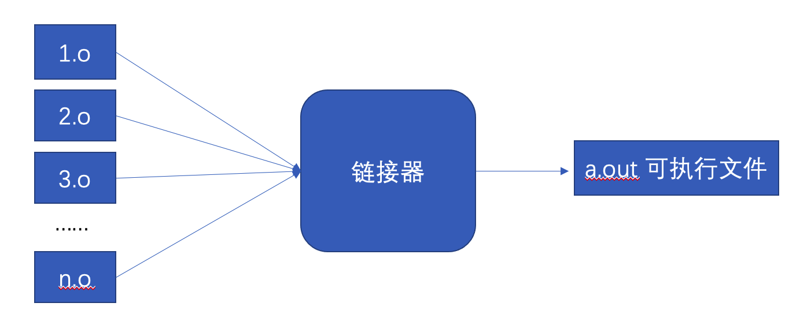
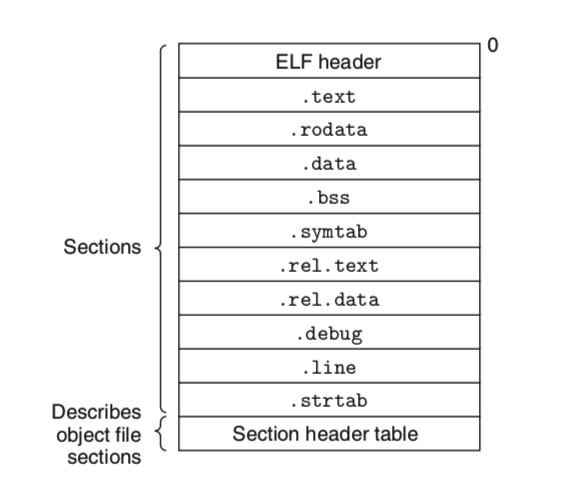
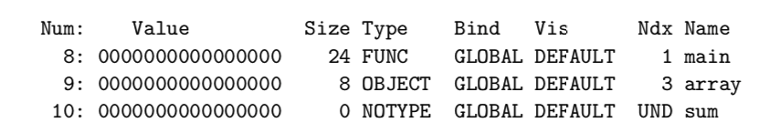
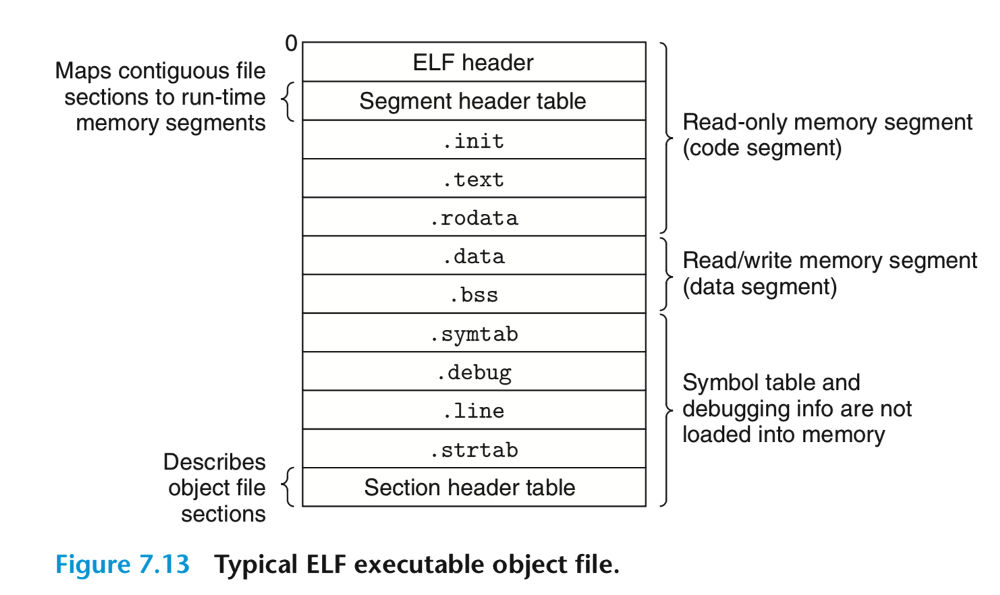
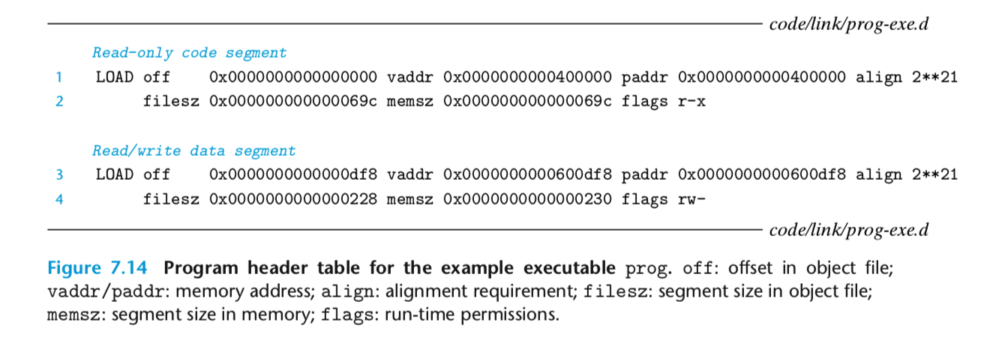
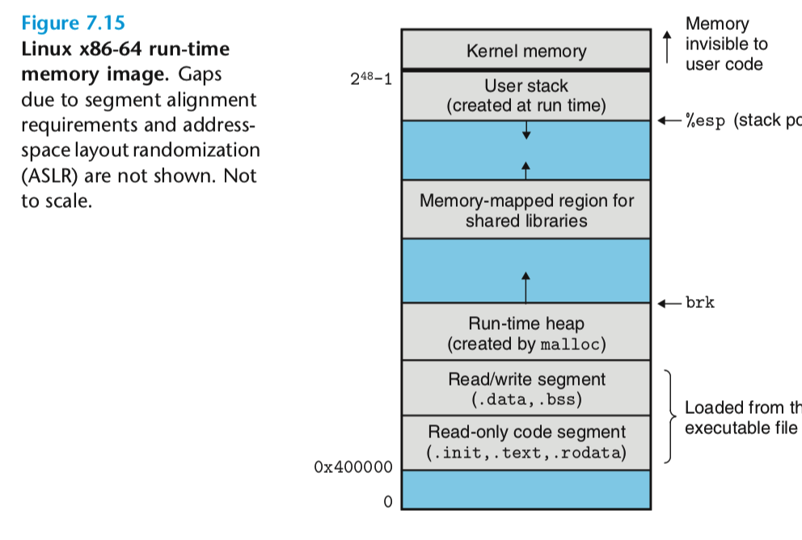
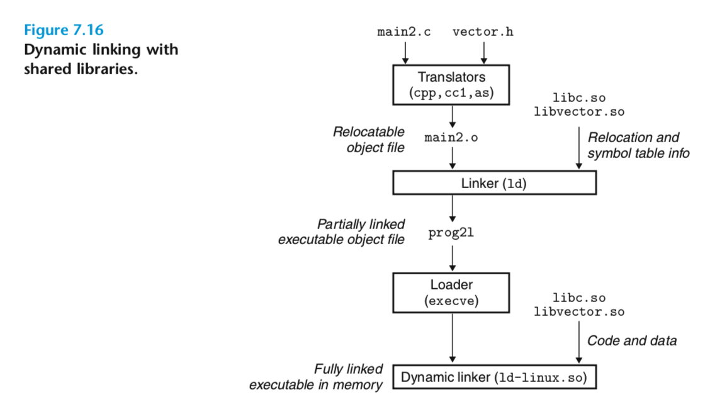
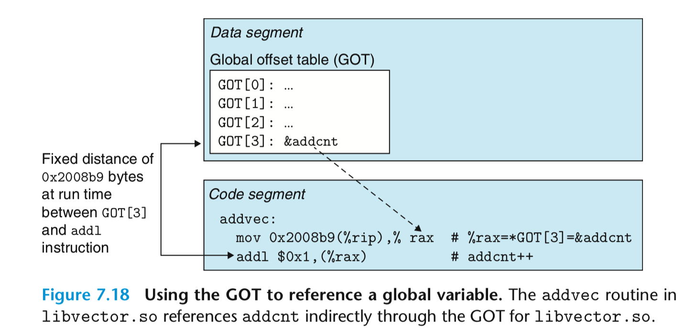
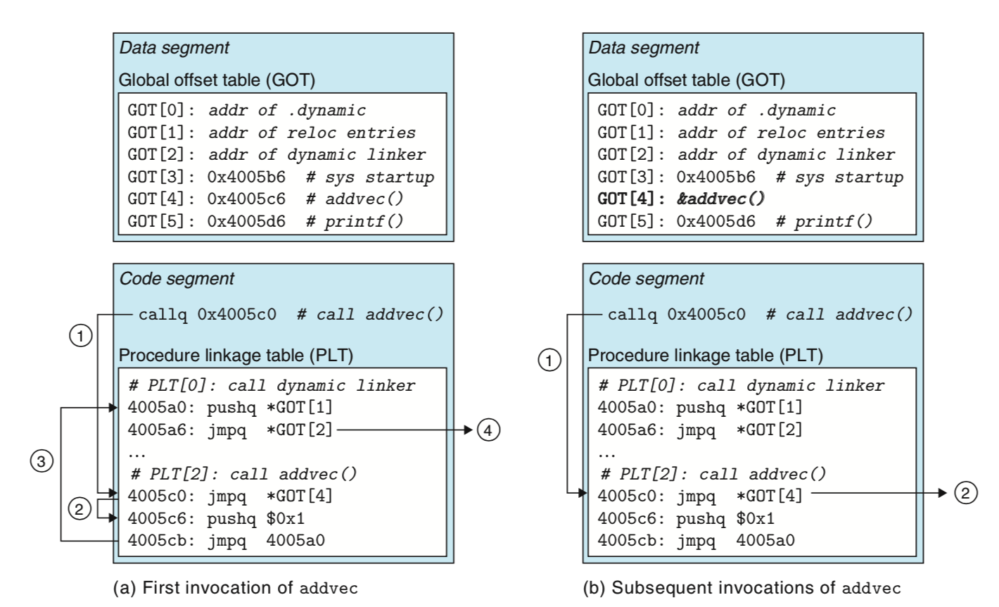

## 链接总结

### 1. 概览

一般的工具链的处理流程如下：


1. 预处理器读取每个`.c`文件，将其`include`的头文件放入，同时进行宏替换等工作，得到`.i`文件
2. 编译器将源文件编译为汇编代码
3. 汇编器将汇编代码汇编为ELF格式的目标文件

在每个源文件得到目标文件之后，还需要将多个目标文件链接起来，得到ELF格式的可执行文件。



链接分为静态链接和动态链接。静态链接的时候，是将多个目标文件的各个对应的段拼接起来。比如代码段拼接在一起，数据段拼接在一起，同时在拼接之后，函数的地址以及全局变脸的地址会发生变化。链接器需要解析每个目标文件中的符号引用，并将这些引用的地方进行重定位。同时链接器还会决定可执行文件中的每个段在运行时会加载到虚拟地址的那个地方。

### 2. 目标文件格式

目标文件分为三类：

1. 可重定位文件。一般的`.o`，可以通过链接生成第二种文件。
2. 可执行目标文件。可以直接执行
3. 共享目标文件。一种特殊的可重定位文件，可以被加载到内存中，并进行动态链接。

`ELF`文件的个数大概如下:



1. `.text`段存储静态代码

2. `rodata`存储只读数据

3. `.data`存储可读可写数据

4. `.bss`存储未初始化的全局变量，局部静态变量或者为0的这些量。(在ELF中不占大小。)

5. `.sybtab`符号表

6. `rel.text`记录代码段中需要重定位的地方

7. `.rel.data`记录数据段中需要重定位的地方。比如下面中的p

   ```c++
   extern int a;
   int *p = &a;
   ```

8. `strtab`字符串表，ELF文件中需要使用字符串的地方都将字符串存到这个段中，然后再对应的放存一个句柄。

#### 符号表

每个ELF文件的符号表中存储三种类型的符号：

1. 在当前文件定义的全局符号

2. 在当前文件引用的，但是在其他文件中定义的全局符号

3. `Local Symbols`：在本地定义，也只能在本地访问的符号。比如静态的C函数以及`static`修饰的全局变量。这些符号只在本文件可见。

   在函数内部声明的局部静态变量只有在那个函数中可见。

   在函数内部声明的局部变量存放在栈上，外部不可见。

下面是一个符号表的内容：



其中Ndx表示所在的段，`sum`对应的是UND，说明它引用的是其它模块的内容。

### 3. 符号解析

在链接器读取多个目标文件之后，可能会遇到相同的符号。选择哪一个遵循下面三个原则：

1. 多个强符号直接报错
2. 一个强符号，多个弱符号，则选择强符号
3. 多个弱符号，则随便选一个。

强符号：函数和初始化了的全局变量

弱符号：未初始化的全局变量

相当于是，链接器读了一些目标文件，如果对于目标文件`a`，它引用了一个外部符号`sa`，然后连接器就在这些目标文件中查找，看是否有一个目标文件提供了`sa`，如果有的话，就把他们映射起来。

### 4. 重定位

重定位主要是将多个目标文件和起来，然后为每个符号分配运行时地址。包含两个步骤：

1. 重定位段和符号定义

   链接器将目标文件的相同类型的段合并在一起，比如`.text`， `.data`等。然后为每个段分配一个运行时的虚拟地址。完成之后这个程序中的每个函数和全局变量有一个唯一的虚拟内存地址。

2. 重定位每个段内的符号引用

   上面结束之后，有些地方的地址还需要修改。比如函数调用的函数地址和存储了其它模块全局变量地址的变量内容。所以这一步就是将这些地址修改为正确的虚拟内存地址。

#### 重定位表项

汇编器在遇到一个对象的引用，但是它最终的地址还不知道的话，就会生成一个重定位表项，来告诉链接器当生成目标代码的时候如何修改这些引用。代码中需要重定位的地方存储在`.rel.text`段，数据部分需要重定位的被放在`.rel.data`段。(每个目标文件中存储了它里面需要修改的地方，以及该如何修改)。

链接器在重定位的时候，扫描目标文件的这些地方，然后按照给的规则进行修改。寻址方式有很多，下面是两种用的较多的：

1. PC相对寻址，用当前指令下一条指令的地址加偏移，存的可能就是这个偏移量。
2. 绝对地址，存储的是变量的绝对地址。

重定位的时候，就是按照它要访问的对象的虚拟地址，计算出一些位置的值，然后放上去即可。

### 5. 可执行文件及加载过程

下面是一个可执行文件的结构。



其中`header table`部分存储了每个段的信息，下面是一个例子：



其中比较关键的是，每个段在被加载的时候映射到的虚拟地址`vaddr`。

在加载的过程中，操作系统首先将文件对应的段放到虚拟内存的地址上，然后将执行权交给`_start`函数。这个函数对于所有的`c`程序都是一样的，它调用`libc.so`中定义的`_libc_start_main`函数。这个函数的功能是初始化执行环境(环境变量，main函数的参数，堆等)，然后调用`main`函数，然后处理`main`返回值，需要的话将控制权返回给`kernal`。



### 6. 动态链接

静态链接有很多缺点：

1. 如果某个模块更新，则都需要重新链接。
2. 不同的可执行文件中存在着大量重复代码。比如C库提供的标准输入输出函数等。运行的时候，这些代码如果在每个进程中都保留一份的话，会极大的浪费物理内存。

共享链接库解决了上面的问题。动态链接库可以在加载时或者运行时，被加载到虚拟内存的任意位置，然后和程序链接起来。这个操作由动态链接器来实现。Linux的`.so`和Windows的`.dll`就是这类文件。

这里的共享有两个方面：

1. 在静态的文件方面，只保存了一份拷贝，就算某个可执行文件和它链接了，但是并不会存在多份代码。
2. 在运行的时候，多个进程可以共享一个动态链接库中的代码。这一部分可以参考虚拟内存是如何实现的。(将每个进程对应这部分代码的虚拟页都映射到一个物理页框)。



上面是动态链接的过程。与静态链接不同的是，动态链接在执行链接的时候只会部分链接，存储一些动态链接需要的信息等，然后再加载或者运行的时候会进行全链接。

### 7. 地址无关代码(PC)

地址无关代码就是在进行链接的时候，共享库中的代码段不会被修改，被修改的全部在数据段。

为什么要实现地址无关代码？这样可以实现运行中的多个进程共享内存中的相同的代码，来节省内存资源。假如像静态链接一样，在链接的时候把代码中的一部分也修改了。但是对于不同的进程而言，要修改的地方可能改的不一样，那么不同进程就不能共享这个代码了，而是会调用`copy on write`机制，复制一份。

所以我们需要将各个进程不同的部分都放在一个地方`.data`数据段，然后每个进程有自己私有的共享库的数据段，代码段就可以共享了！(想想虚函数表，抽象！)

解决方法是引入抽象层。将变化的放到一个地方，不变的抽象到代码段。

#### 访问其它模块全局数据



由于在加载的过程中，代码段和数据段之间的相对位置是固定的，所以可以将这个相对位置写死在代码段，然后再数据段的对应位置写上真正的内容。就比如上面的代码中访问`addcnt`这个变量。

#### 访问其它模块函数

这个部分使用了`GOT`和`PLT`结合的方式。其中`PLT`处于代码段。

当共享库要访问其它的函数，动态链接器可以在加载的时候就把这些符号都解析好。

但是可能有很多函数地址在运行的过程中不会被访问到，比如程序的分支流有很多可能并不会走到。把这些都给修改好，对性能影响较大。

所以可以使用**懒加载**的方式，当第一次调用函数的时候，才会把这个函数的地址给填好，之后再调用的时候就可以直接跳转。



上面是一个整体的流程:

1. 想要调用`addvec`这个函数，第一次直接跳转到`4005c6`这个地址。
2. 这个地址的指令是，跳转到`GOT[4]`存储的地址的地方，一开始存储的是`jmpq`的下一个地址，所以就会继续执行下，将一个当前编号压入栈，然后调用动态链接器。
3. 动态链接器部分将当前模块的重定位项的地址入栈，然后开始执行动态链接器代码。
4. 动态链接器使用栈顶的两个元素来决定`addvec`的运行时地址，写入`GOT[4]`这个地方，然后将控制传递给`addvec`.
5. 之后再进行访问的时候，由于`GOT[4]`存储了正确的`addvec`的地址，所以就可以直接执行了。


#### 参考文献

1. 《深入理解计算机系统》
2. 《程序员的自我修养》