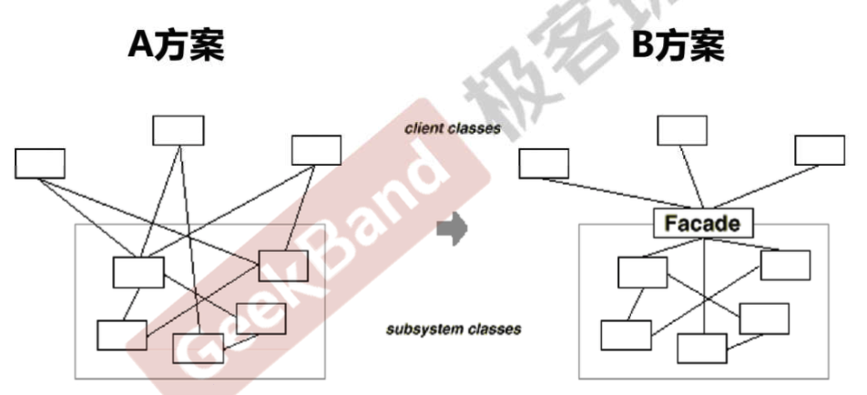
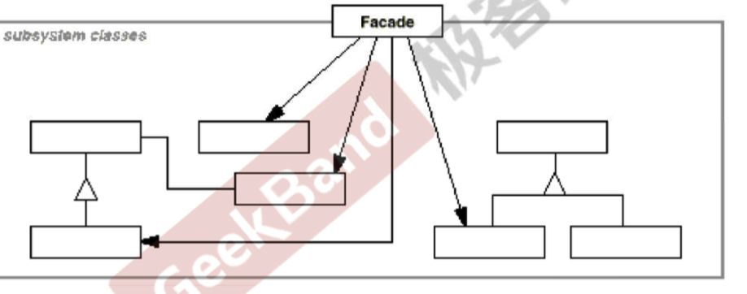

## 门面模式

下面是系统中各个类之间的依赖关系。

A方案中组件的客户和组件中各种复杂的子系统有了过多的耦合，随着外部客户端和各子系统的演化，这种过多的耦合面临很多变化的挑战。比如上述A图中的框中的类是易变的，变化一下，外部的类就都要边。

需要简化外部客户程序和系统间的交互接口，使得外部客户程序的演化和内部子系统的变化之间的依赖相互解耦。

> 为子系统中的一组接口提供一个一致(稳定)的界面，门面模式定义了一个高层接口，这个接口使得这一子系统更加容易使用(复用)

总的而言，就是将易变的部分隔离开来，向外提供一个稳定的接口。”将变化关起来“。

### 总结

1. 门面模更加注重从架构的层次看整个系统，而不是单个类的层次。很多时候更是一种架构设计模式。
2. 门面模式并不是一个集装箱，是可以任意地放进去任何多个对象。组件的内部应该是相互耦合关系比较大的一系列组件，而不是一个简单的功能集合。

