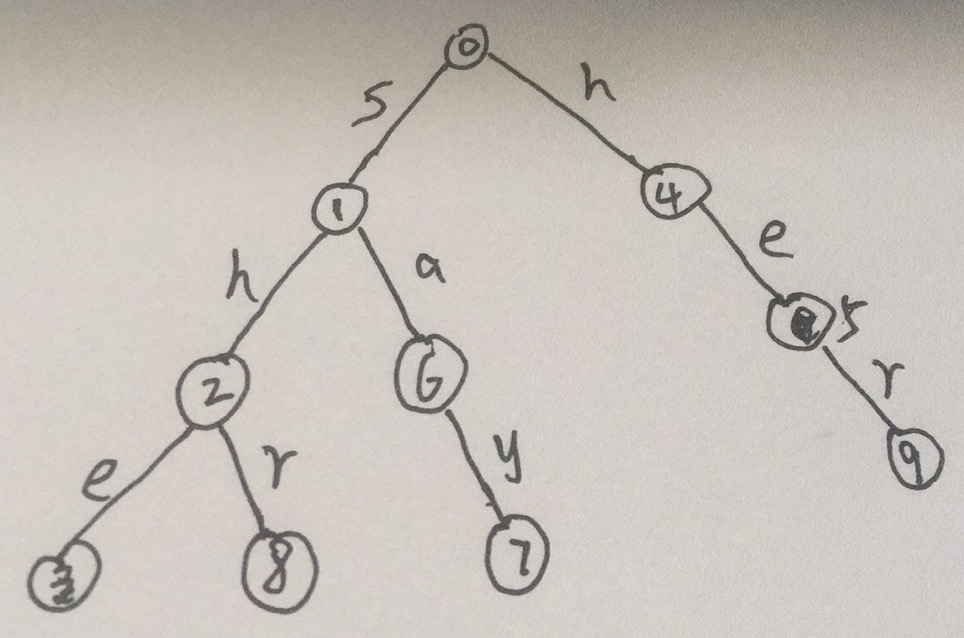
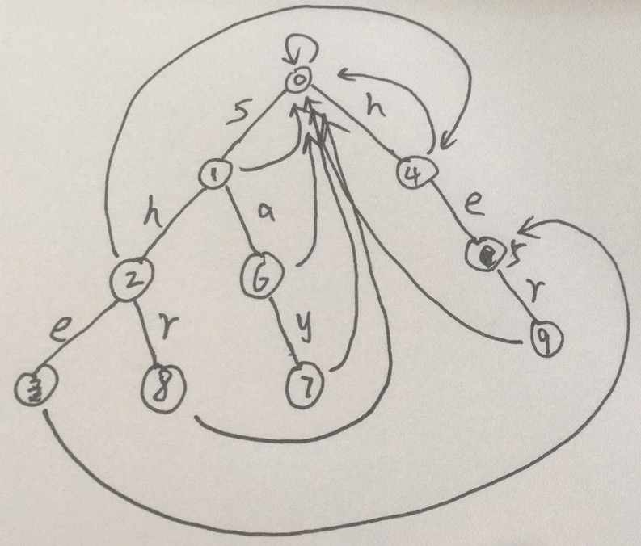

## KMP算法

KMP算法可以看做AC自动机在模式串为1的特例。由于算法非常巧妙，所以一开始理解有些难度。

简单来讲，KMP算法是希望在发生失配的时候，不只是单单将模式串向后移动一位，而是希望利用前面已经匹配的信息，将模式串移动尽可能多位。比如对于模式串`ababa`来说，如果在尝试匹配第四位`b`失败之后，那么我们已经知道了主串在失配前面的字符串就是`aba`，这个时候将模式串向后移动一位肯定还是失配。移动的位数由前面已经匹配成功的字符串的最大相同后缀前缀所决定。

在预处理模式串的`next`数组的时候，其实可以看做模式串自己和自己做匹配，不过一开始我们将模式串的第1为尝试和第二位开始匹配(下标从1开始)，避免平凡的情况。这种感觉有种像是`bootstrap`的过程。先用算法预处理好需要的`next`数组，然后再利用`next`数组来对主串进行匹配。

下面是自己绘制的一张图(从自动机的角度)。每个位置的`next`数组的值可以理解为当下一个字母发生失配的时候，需要跳转到哪一个状态。


- 在最开始预处理next数组的时候，`i`指针指向模式串第二个位置，`j`指针表示在`i`的字符串处于哪一个状态。一开始位于零状态。`p[j + 1]`表示`j`状态转向下一个状态路径上的字符，尝试对`p[i]`进行匹配，如果失配，则`j`需要跳转到`next[j]`指向的状态，当处于`0`状态的时候，为了避免死循环，需要直接判断下一个能不能匹配。如果不能匹配，则将`j`置为`0`状态，从`i + 1`开始尝试匹配。

- 在对主串进行匹配的时候是同样的操作，不过是从主串的第一个字符开始匹配。

#### KMP字符串匹配

[原题链接](https://www.acwing.com/problem/content/833/)

#### C++代码

```c++
#include <iostream>
using namespace std;

const int N = 1e5 + 10;

int ne[N];

int main() {
    
    int n, m;
    string p, s;
    cin >> n >> p >> m >> s;
    p = " " + p;
    s = " " + s;
    for (int i = 2, j = 0; i <= n; i ++) {  // j表示当前自动机处于哪个状态，i表示要匹配的字符下标
      	// 每次进入循环，表示 匹配到 i- 1 位置时，自动机j处于什么位置，然后尝试不断地进行扩展,下一条边就是p[j + 1]
        while (j && p[i] != p[j + 1]) j = ne[j];
        if (p[i] == p[j + 1]) j ++;
        ne[i] = j;
    }
    
    for (int i = 1, j = 0; i <= m; i ++) {  // i表示主串要匹配的字符的下标，j表示当前处于自动机的那个状态
      	// 每次进入循环，表示 匹配到 i- 1 位置时，自动机j处于什么位置，然后尝试不断地进行扩展,下一条边就是p[j + 1]
        while (j && s[i] != p[j + 1]) j = ne[j];
        if (s[i] == p[j + 1]) j ++;
        if (j == n) {
            cout << i - j << " ";
            j = ne[j];
        }
    }
    return 0;
}
```

## AC自动机

AC自动机是KMP算法和Trie的结合版。在KMP算法中，状态只在一条链上进行调转，但是在AC自动机中，首先将多个模式串构成一个Trie，然后状态在Trie上进行跳转，因为在多个模式串的情况下，一个模式串发生失配，可能其最大后缀出现在另一个模式串中。具体来说，在Trie的基础上，每个节点增加了一个**失配指针域**，相当于KMP中的`next`数组。当尝试从当前节点扩展到下一个节点时，如果发生失配，则跳转到当前节点的失配指针位置，然后继续尝试匹配，直到跳转到根节点。

下面以一道例题为例，理解AC自动机的工作原理。

### 搜索关键词

[原题链接](https://www.acwing.com/problem/content/description/1284/)

#### 解题思路

首先将所有的模式串绘制成Trie，如下图所示：



预处理流程如下：

- 1 号节点和4号节点的失配指针指向根0号节点
- 深度优先遍历，取出4号节点，并从4号节点的失配指针尝试计算4号节点所有孩子节点的失配指针。4号节点的失配指针为0，但是从0出发不能够扩展e这条边，所以5号节点的失配指针为0
- 同样取出1号节点，尝试计算1号节点所有孩子的失配指针。从根有一条扩展到h的路，所以2号节点的失配指针为4，根没有一条扩展到a的路，所以6号节点的失配指针为0
- 继续上面的操作，每次从队列中取出一个节点`t`，并计算当前节点所有孩子节点的失配指针。计算方式为从`t`节点的失配指针所指节点`j`出发，查看有没有一条可以拓展的路径，如果没有的话，不断调转`j`，直到找到一条路径或者到了根节点。

最终的每个节点的失配指针如下图所示：



匹配过程：

一开始状态机处于`j = 0`状态。然后不断输入主串的字符，如果当前状态有一条路径匹配上了这个字符，则状态`j`向前移动到对应位置，否则的话，`j`不断跳转到支配指针的位置，不断再次尝试匹配，直到匹配上或者跳转到了根节点的位置。

如果在根节点的位置还不能找到一条路径匹配，则说明当前字符串不能够跳转到任何一个有效状态，直接尝试从0状态开始输入下一个字符，并继续在上面的状态机上进行跳转。

在计数的时候，由于是多个模式串，所以每次输入完一个主串的字符之后，都需要查看当前所处状态是不是某个模式串所处的位置。**同时还要不断的跳转到失配指针的位置进行查看！**因为可能当前状态不止和一个模式串能够匹配。比如上图如果处于3状态，然后发现了一个模式串，如果模式串中还有一个是`he`，所以需要跳转到3的失配指针5处，查看这个节点是否有模式串。如此直到跳转到根节点为止。

**核心思想其实是一个有限状态机（摩尔机）（学过数字电路的应该都不陌生吧。。。。）**

处理和匹配的过程类似，处理的时候在求某个状态的失配指针时，是从其父节点的失配指针出发开始尝试扩展的。（想想KMP算法）匹配的过程中，就不断地在自动机上跳转即可。

#### C++代码

```c++
#include <iostream>
#include <queue>
#include <cstring>
using namespace std;

const int N = 1e4 + 10, L = 55, M = 1e6 + 10;
int tr[N * L][26], cnt[N * L], idx;
int ne[N * L];

void insert(string &a) {
    
    int p = 0;
    for(auto x : a) {
        int t = x - 'a';
        if (!tr[p][t]) tr[p][t] = ++idx;
        p = tr[p][t];
    }
    cnt[p] ++;
}

void build() {
    
    // 根节点和深度为1的节点失配之后的长度都是0
    queue<int> qe;
    for (int i = 0; i < 26; i ++) {
        if (tr[0][i]) qe.push(tr[0][i]);  // 将深度为1的节点加入到队列中
    }
    
    while (qe.size()) {
        // 从队列中取出已经计算好ne的节点
        int t = qe.front();
        qe.pop();
        for (int i = 0; i < 26; i ++) {
            // 遍历该节点后面所有存在的节点
            int c = tr[t][i];
            if (!c) continue;
            int j = ne[t];  // 取出该节点的ne值，表示以t结尾的字符串失配时跳转的状态(每次都要重新取出)
            while (j && !tr[j][i]) j = ne[j];  // 不断尝试当前状态是否存在下一个字符和i能够匹配上
            if (tr[j][i]) j = tr[j][i];  // 如果能够匹配上，则j跳转到匹配的状态
            ne[c] = j; // 将t下一个节点的失配指针指向j
            qe.push(c);  // 加入队列中
        }
    }
}

int main() {
    
    ios::sync_with_stdio(false);
    cin.tie(nullptr);
    int t;
    cin >> t;
    while (t --) {
        memset(ne, 0, sizeof ne);
        memset(cnt, 0, sizeof cnt);
        memset(tr, 0, sizeof tr);
        int n;
        cin >> n;
        while (n --) {
            string a;
            cin >> a;
            insert(a);
        }
        build();
        string a;
        cin >> a;
        int ans = 0, j = 0; // 开始匹配过程， 一开始状态机j位于0号节点
        for (auto c : a) {
            int t = c - 'a';
            while (j && !tr[j][t]) j = ne[j];  // 尝试进行扩展
            if (tr[j][t]) j = tr[j][t];  // 扩展成功，则走到对应的状态
            int p = j;
            while (p) {  // 统计以当前状态结束的所有模式串的个数
                ans += cnt[p];
                cnt[p] = 0;
                p = ne[p];  // 因为有可能有些模式串是当前位置的后缀，所以需要不断调转，直到将所有后缀遍历。
            }
        }
        cout << ans << endl;
    }
    return 0;
}
```

## Trie图

在上述AC自动机的处理过程中，我们发现每次发生失配的时候，都是跳转到已经匹配的字符串的最大后缀所在的状态，然后再尝试匹配。仔细一想，其实我们可以直接根据当前输入的字符和当前所处的状态一步跳转到对应的状态。

但是AC自动机只记录了输入能够和某个模式串匹配的情况下，跳转到的状态，或者失配的情况下跳转的状态，没有记录输入是任何一个字符的时候，跳转到的状态。所以可以对AC自动机的`tr`记录的信息进行一个扩展：

> `tr[i][j]`记录的的信息是，当前处于状态`i`，且输入为`j`的情况下，跳转到的状态是哪一个！

当能够匹配时，记录的信息没有发生变化，当失配时，记录的不再是失配指针，然后再通过失配指针尝试匹配，记录的是在当前状态当前输入的情况下直接跳转到的状态！

如何预处理这个状态。在预处理的过程中，如果当前输入可以找到一个路径匹配，则直接走过去即可，否则的话，直接跳转到当前路径失配指针所知的状态在当前输入会跳转到的状态即可！**(想想并查集中的路径压缩的思想！)**

这样就相当于构建了一个完整的状态转移图！每个状态对应与26种输入都有其直接跳转到的状态，而不是像AC自动机那样，需要先跳转到失配指针，然后再不断地进行尝试匹配！！

#### C++代码

```c++
#include <iostream>
#include <queue>
#include <cstring>
using namespace std;

const int N = 1e4 + 10, L = 55, M = 1e6 + 10;
int tr[N * L][26], cnt[N * L], idx;
int ne[N * L];

void insert(string &a) {
    
    int p = 0;
    for(auto x : a) {
        int t = x - 'a';
        if (!tr[p][t]) tr[p][t] = ++idx;
        p = tr[p][t];
    }
    cnt[p] ++;
}

void build() {
    
    // 根节点和深度为1的节点失配之后的长度都是0
    queue<int> qe;
    for (int i = 0; i < 26; i ++) {
        if (tr[0][i]) qe.push(tr[0][i]);  // 将深度为1的节点加入到队列中
    }
    
    while (qe.size()) {
        // 从队列中取出已经计算好ne的节点
        int t = qe.front();
        qe.pop();
        for (int i = 0; i < 26; i ++) {
            // 遍历该节点后面所有存在的节点
            int c = tr[t][i];
            if (!c) tr[t][i] = tr[ne[t]][i];   // 如果不存在路径，则直接跳转到失配指针指向节点对应输入的状态
            else {
                ne[c] = tr[ne[t]][i];  // 如果存在路径，那么当前节点下一步发生失配的话，就跳转到t失配指针对
                                       // 当前输入的状态！
                qe.push(c);  // 只需要将路径上的点加入到队列即可，因为其他发生失配的状态不会出现在状态集中
            }
            
        }
    }
}

int main() {
    
    ios::sync_with_stdio(false);
    cin.tie(nullptr);
    int t;
    cin >> t;
    while (t --) {
        memset(ne, 0, sizeof ne);
        memset(cnt, 0, sizeof cnt);
        memset(tr, 0, sizeof tr);
        int n;
        cin >> n;
        while (n --) {
            string a;
            cin >> a;
            insert(a);
        }
        build();
        string a;
        cin >> a;
        int ans = 0, j = 0; // 开始匹配过程， 一开始状态机j位于0号节点
        for (auto c : a) {
            int t = c - 'a';
            j = tr[j][t];  // 直接在状态机上进行跳转即可
            int p = j;
            while (p) {  // 统计以当前状态结束的所有模式串的个数
                ans += cnt[p];
                cnt[p] = 0;
                p = ne[p];  // 因为有可能有些模式串是当前位置的后缀，所以需要不断调转，直到将所有后缀遍历。
            }
        }
        cout << ans << endl;
    }
    return 0;
}
```

### 恢复空格

[原题链接](https://leetcode-cn.com/problems/re-space-lcci/)

#### 解题思路

定义状态`dp[i]`为第`0-i`个字符的最小未识别的字符数。则在求的时候，可以判断是否存在一个后缀使得其是字典中的某个单词。这个一种方法是可以将字典中的单词倒序添加到Trie中，然后每次都尝试逆序遍历。

第二种方法是正序建立AC自动机，然后直接在自动机上进行跳转。同时需要记录每个节点的深度，可以前一个状态是哪一个。

#### C++代码

```c++
class Solution {
public:
    
    int tr[150010][26];
    bool is_end[150010];
    int dep[150010], idx = 0;
    int ne[150010];
    
    // Trie的插入操作
    void insert(string &a) {
        
        int p = 0, dd = 0;
        for (auto x : a) {
            dd ++;
            int t = x - 'a';
            if (!tr[p][t]) {
                tr[p][t] = ++idx;
                dep[idx] = dd;
            }
            p = tr[p][t];
        }
        is_end[p] = true;
    }
    
    // 构建AC自动机
    void build() {
        queue<int> qe;
        for (int i = 0; i < 26; i ++) {
            if (tr[0][i]) qe.push(tr[0][i]);
        }
        while (qe.size()) {
            
            int ele = qe.front();
            qe.pop();
            for (int i = 0; i < 26; i ++) {
                int t = tr[ele][i];
                if (!t) continue;
                int j = ne[ele];
                while (j && !tr[j][i]) j = ne[j];
                if (tr[j][i]) j = tr[j][i];
                ne[t] = j;
                qe.push(t);
            }
        }
    }
    
    int respace(vector<string>& dit, string sent) {
        for (auto x : dit) insert(x);
        build();
        int n = sent.size();
        vector<int> dp(n + 1);
        dp[0] = 0;
        int j = 0;
        for (int i = 0; i < n; i ++) {
            dp[i + 1] = dp[i] + 1;
            int c = sent[i] - 'a';
            while (j && !tr[j][c]) j = ne[j];
            if (tr[j][c]) j = tr[j][c];
            int p = j;

            // 开始在AC自动机上回溯
            while (p) {
                if (is_end[p]) {  // 当前状态是某个字符串结尾，也就是存在某个后缀为字典中的单词
                    dp[i + 1] = min(dp[i + 1], dp[i + 1 - dep[p]]);  
                }
                p = ne[p]; 
            }
        }
        return dp[n];
    }
};
```

