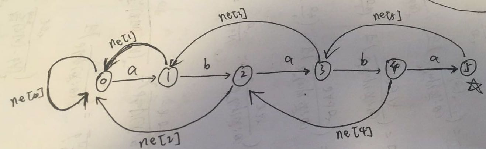

## KMP算法

KMP算法可以看做AC自动机在模式串为1的特例。由于算法非常巧妙，所以一开始理解有些难度。

简单来讲，KMP算法是希望在发生失配的时候，不只是单单将模式串向后移动一位，而是希望利用前面已经匹配的信息，将模式串移动尽可能多位。比如对于模式串`ababa`来说，如果在尝试匹配第四位`b`失败之后，那么我们已经知道了主串在失配前面的字符串就是`aba`，这个时候将模式串向后移动一位肯定还是失配。移动的位数由前面已经匹配成功的字符串的最大相同后缀前缀所决定。

在预处理模式串的`next`数组的时候，其实可以看做模式串自己和自己做匹配，不过一开始我们将模式串的第1为尝试和第二位开始匹配(下标从1开始)，避免平凡的情况。这种感觉有种像是`bootstrap`的过程。先用算法预处理好需要的`next`数组，然后再利用`next`数组来对主串进行匹配。

下面是自己绘制的一张图(从自动机的角度)。每个位置的`next`数组的值可以理解为当下一个字母发生失配的时候，需要跳转到哪一个状态。



- 在最开始预处理next数组的时候，`i`指针指向模式串第二个位置，`j`指针表示在`i`的字符串处于哪一个状态。一开始位于零状态。`p[j + 1]`表示`j`状态转向下一个状态路径上的字符，尝试对`p[i]`进行匹配，如果失配，则`j`需要跳转到`next[j]`指向的状态，当处于`0`状态的时候，为了避免死循环，需要直接判断下一个能不能匹配。如果不能匹配，则将`j`置为`0`状态，从`i + 1`开始尝试匹配。

- 在对主串进行匹配的时候是同样的操作，不过是从主串的第一个字符开始匹配。

#### KMP字符串匹配

[原题链接](https://www.acwing.com/problem/content/833/)

#### C++代码

```c++
#include <iostream>
using namespace std;

const int N = 1e5 + 10;

int ne[N];

int main() {
    
    int n, m;
    string p, s;
    cin >> n >> p >> m >> s;
    p = " " + p;
    s = " " + s;
    for (int i = 2, j = 0; i <= n; i ++) {  // j表示当前自动机处于哪个状态，i表示要匹配的字符下标
      	// 每次进入循环，表示 匹配到 i- 1 位置时，自动机j处于什么位置，然后尝试不断地进行扩展,下一条边就是p[j + 1]
        while (j && p[i] != p[j + 1]) j = ne[j];
        if (p[i] == p[j + 1]) j ++;
        ne[i] = j;
    }
    
    for (int i = 1, j = 0; i <= m; i ++) {  // i表示主串要匹配的字符的下标，j表示当前处于自动机的那个状态
      	// 每次进入循环，表示 匹配到 i- 1 位置时，自动机j处于什么位置，然后尝试不断地进行扩展,下一条边就是p[j + 1]
        while (j && s[i] != p[j + 1]) j = ne[j];
        if (s[i] == p[j + 1]) j ++;
        if (j == n) {
            cout << i - j << " ";
            j = ne[j];
        }
    }
    return 0;
}
```

## AC自动机

